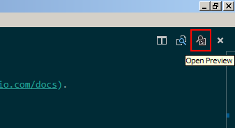

# Visual Studio Code Documentation

You've found the GitHub repository which contains the content for the [Visual Studio Code documentation](https://code.visualstudio.com/docs).

Topics submitted here will be published to the [Visual Studio Code](https://code.visualstudio.com) portal.

## Visual Studio Code

[VS Code](https://code.visualstudio.com/) is a lightweight but powerful development environment for building and debugging modern web and cloud applications.  It is free and available on your favorite platform - Linux, Mac OSX and Windows.

If you landed here looking for other information about VS Code, head over to [our website](https://code.visualstudio.com) for additional information.

## Contributing documentation

To contribute with new topics/information or make changes to existing documentation, see [contributing](https://github.com/Microsoft/vscode-docs/blob/master/CONTRIBUTING.md) for instructions and guidelines.

If you want to give documentation feedback, please use the feedback control located at the bottom of each documentation page. To enter doc bugs, please create a [new GitHub issue](https://github.com/Microsoft/vscode-docs/issues) (try to check if there isn't a topic about your issue already).

## Editing

In order to edit the VS Code documentation, ensure that you have [Git](http://git-scm.com/downloads) installed.

Clone a copy of the repo:

```
git clone https://github.com/Microsoft/vscode-docs.git
```

VS Code itself is great for reviewing and editing [Markdown](https://code.visualstudio.com/docs/languages/markdown) with nice preview support.

If you want to use VS Code, simply navigate to the `vscode-docs` directory and launch VS Code from there:

```
cd vscode-docs
code .
```
You can now open any of the Markdown files and easily toggle between preview with the `Open Preview` button in the upper right of the editor. 

