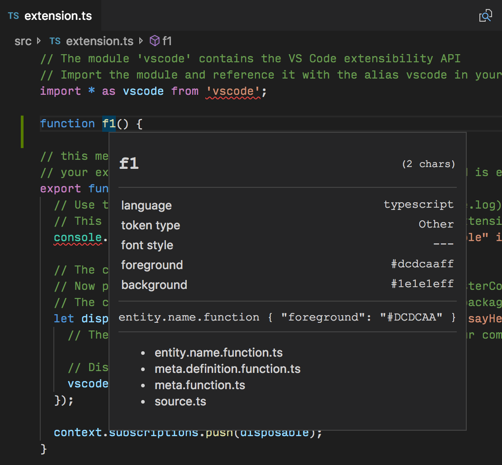

---
---

# Theming VS Code extension

In VS Code, there are two types of themes:

- **Color Theme**: A mapping from both UI Component Identifier and Text Token Identifier to colors. Color theme allows you to apply your favorite colors to both VS Code UI Components and the text in the editor.
- **Icon Theme**: A mapping from file type / file name to images. The file icon is displayed across the VS Code UI in places such as File Explorer, Quick Open List and Editor Tab.

## Color Theme


As you can see in the illustration, Color Theme defines two mappings, `colors` for UI Component colors and `tokenColors` for Text Token colors.

[Theme Color Reference](/api/references/theme-color) is a good starting point for customizing UI Component colors.

If you want to change the color of text in your editor, you need to know how the text is tokenized. VS Code provides a handy command `Developer: Inspect TM Scopes` that shows you the TextMate scopes of each syntax token in the editor.



There are also two settings, `workbench.colorCustomizations` and `editor.tokenColorCustomizations` that correspond to the `color` and `tokenColors` color theme config. They provide a quick way for you to play with colors. For example, try adding this to your user settings:

```json
{
  "workbench.colorCustomizations": {
    "titleBar.activeBackground": "#ff0000"
  },
  "editor.tokenColorCustomizations": {
    "comments": "#FF0000"
  }
}
```


## Icon Theme

Icon themes allow you to:

- Create a mapping from unique icon identifiers to images or font icons;
- Associate files to these unique icon identifiers by filenames or file language types.

