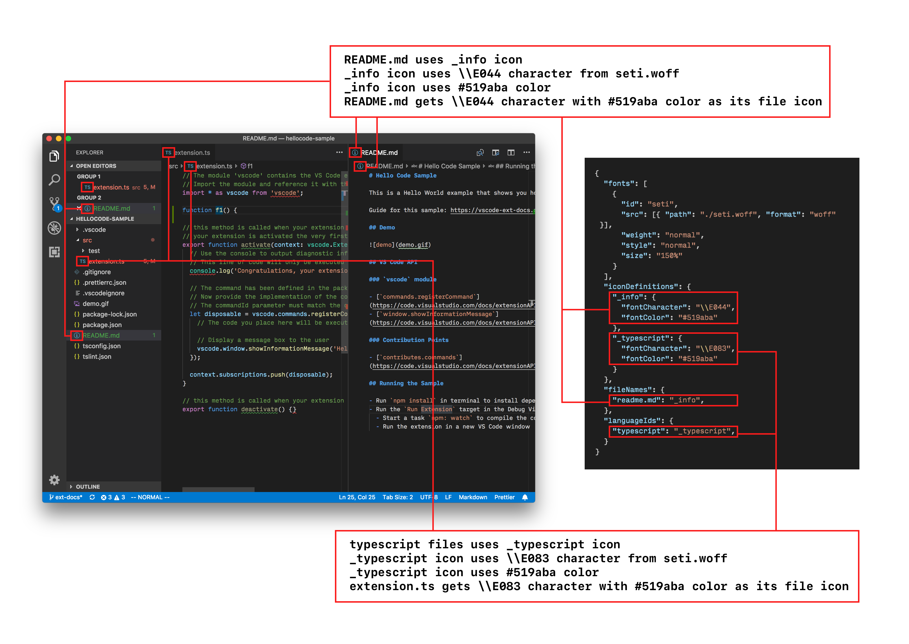

---
# DO NOT TOUCH — Managed by doc writer
ContentId: 37b6ae0a-d1b5-48b6-9bd4-9b50ef11d573
DateApproved: 7/3/2019

# Summarize the whole topic in less than 300 characters for SEO purpose
MetaDescription: Learn how to add custom themes for colors and icons in Visual Studio Code.
---

# Theming

In Visual Studio Code, there are two types of themes:

- **Color Theme**: A mapping from both UI Component Identifier and Text Token Identifier to colors. Color theme allows you to apply your favorite colors to both VS Code UI Components and the text in the editor.
- **Icon Theme**: A mapping from file type / file name to images. The file icon is displayed across the VS Code UI in places such as File Explorer, Quick Open List, and Editor Tab.

## Color Theme

As you can see in the illustration, Color Theme defines two mappings:

- The `colors` mapping that controls colors for UI Components.
- The `tokenColors` mapping that controls colors for each source code token (your source code is broken into tokens by a [grammar](/api/language-extensions/syntax-highlight-guide)).

We have a [Color Theme Guide](/api/extension-guides/color-theme) and a [Color Theme Sample](https://github.com/Microsoft/vscode-extension-samples/tree/master/theme-sample) that illustrates how to create a theme.

## Icon Theme

Icon themes allow you to:

- Create a mapping from unique icon identifiers to images or font icons.
- Associate files to these unique icon identifiers by filenames or file language types.

The [Icon Theme Guide](/api/extension-guides/icon-theme) discusses how to create an Icon Theme.

