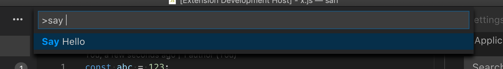

---
# DO NOT TOUCH — Managed by doc writer
ContentId: 995c7085-5fc0-44e0-a171-30a759c0b7da
DateApproved: 3/30/2023

# Summarize the whole topic in less than 300 characters for SEO purpose
MetaDescription: A guide to using commands programmatically in Visual Studio Code extensions (plug-ins)
---

# Commands

Commands trigger actions in Visual Studio Code. If you have ever [configured a keybinding](/docs/getstarted/keybindings), then you've worked with commands. Commands are also used by extensions to expose functionality to users, bind to actions in VS Code's UI, and implement internal logic.

## Using Commands

VS Code includes a large set of [built-in commands](/api/references/commands) that you can use to interact with the editor, control the user interface, or perform background operations. Many extensions also expose their core functionality as commands that users and other extensions can leverage.

### Programmatically executing a command

The [`vscode.commands.executeCommand`](/api/references/vscode-api#commands.executeCommand) API programmatically executes a command. This lets you use VS Code's built-in functionality, and build on extensions such as VS Code's built-in Git and Markdown extensions.

The `editor.action.addCommentLine` command, for example, comments the currently selected lines in the active text editor:

```ts
import * as vscode from 'vscode';

function commentLine() {
  vscode.commands.executeCommand('editor.action.addCommentLine');
}
```

Some commands take arguments that control their behavior. Commands may also return a result. The API-like `vscode.executeDefinitionProvider` command, for example, queries a document for definitions at a given position. It takes a document URI and a position as arguments, and returns a promise with a list of definitions:

```ts
import * as vscode from 'vscode';

async function printDefinitionsForActiveEditor() {
  const activeEditor = vscode.window.activeTextEditor;
  if (!activeEditor) {
    return;
  }

  const definitions = await vscode.commands.executeCommand<vscode.Location[]>(
    'vscode.executeDefinitionProvider',
    activeEditor.document.uri,
    activeEditor.selection.active
  );

  for (const definition of definitions) {
    console.log(definition);
  }
}
```

To find available commands:

- [Browse the keyboard shortcuts](/docs/getstarted/keybindings)
- [Look through VS Code's built-in advanced commands api](/api/references/commands)

### Command URIs

Commands URIs are links that execute a given command. They can be used as clickable links in hover text, completion item details, or inside of webviews.

A command URI uses the `command` scheme followed by the command name. The command URI for the `editor.action.addCommentLine` command, for example, is `command:editor.action.addCommentLine`. Here's a hover provider that shows a link in the comments of the current line in the active text editor:

```ts
import * as vscode from 'vscode';

export function activate(context: vscode.ExtensionContext) {
  vscode.languages.registerHoverProvider(
    'javascript',
    new class implements vscode.HoverProvider {
      provideHover(
        _document: vscode.TextDocument,
        _position: vscode.Position,
        _token: vscode.CancellationToken
      ): vscode.ProviderResult<vscode.Hover> {
        const commentCommandUri = vscode.Uri.parse(`command:editor.action.addCommentLine`);
        const contents = new vscode.MarkdownString(`[Add comment](${commentCommandUri})`);

        // To enable command URIs in Markdown content, you must set the `isTrusted` flag.
        // When creating trusted Markdown string, make sure to properly sanitize all the
        // input content so that only expected command URIs can be executed
        contents.isTrusted = true;

        return new vscode.Hover(contents);
      }
    }()
  );
}
```

The list of arguments to the command is passed as a JSON array that has been properly URI encoded: The example below uses the `git.stage` command to create a hover link that stages the current file:

```ts
import * as vscode from 'vscode';

export function activate(context: vscode.ExtensionContext) {
  vscode.languages.registerHoverProvider(
    'javascript',
    new class implements vscode.HoverProvider {
      provideHover(
        document: vscode.TextDocument,
        _position: vscode.Position,
        _token: vscode.CancellationToken
      ): vscode.ProviderResult<vscode.Hover> {
        const args = [{ resourceUri: document.uri }];
        const stageCommandUri = vscode.Uri.parse(
          `command:git.stage?${encodeURIComponent(JSON.stringify(args))}`
        );
        const contents = new vscode.MarkdownString(`[Stage file](${stageCommandUri})`);
        contents.isTrusted = true;
        return new vscode.Hover(contents);
      }
    }()
  );
}
```

You can enable command URIs in [webviews](/api/extension-guides/webview) by setting `enableCommandUris` in the `WebviewOptions` when the webview is created.

## Creating new commands

### Registering a command

[`vscode.commands.registerCommand`](/api/references/vscode-api#commands.registerCommand) binds a command ID to a handler function in your extension:

```ts
import * as vscode from 'vscode';

export function activate(context: vscode.ExtensionContext) {
  const command = 'myExtension.sayHello';

  const commandHandler = (name: string = 'world') => {
    console.log(`Hello ${name}!!!`);
  };

  context.subscriptions.push(vscode.commands.registerCommand(command, commandHandler));
}
```

The handler function will be invoked whenever the `myExtension.sayHello` command is executed, be it programmatically with `executeCommand`, from the VS Code UI, or through a keybinding.

### Creating a user facing command

`vscode.commands.registerCommand` only binds a command ID to a handler function. To expose this command in the Command Palette so it is discoverable by users, you also need a corresponding command `contribution` in your extension's `package.json`:

```json
{
  "contributes": {
    "commands": [
      {
        "command": "myExtension.sayHello",
        "title": "Say Hello"
      }
    ]
  }
}
```

The `commands` contribution tells VS Code that your extension provides a given command and should be activated when that command is invoked, and also lets you control how the command is displayed in the UI. Now our command will show up in the Command Palette:



Now when a user first invokes the `myExtension.sayHello` command from the Command Palette or through a keybinding, the extension will be activated and `registerCommand` will bind `myExtension.sayHello` to the proper handler.

> **Note**: Extensions targeting VS Code versions prior to 1.74.0 must explicitly register an `onCommand` `activationEvent` for all user facing commands so that the extension activates and `registerCommand` executes:
> ```json
> {
>   "activationEvents": ["onCommand:myExtension.sayHello"]
> }
> ```


You do not need an `onCommand` activation event for internal commands but you must define them for any commands that:

- Can be invoked using the Command Palette.
- Can be invoked using a keybinding.
- Can be invoked through the VS Code UI, such as through the editor title bar.
- Is intended as an API for other extensions to consume.

### Controlling when a command shows up in the Command Palette

By default, all user facing commands contributed through the `commands` section of the `package.json` show up in the Command Palette. However, many commands are only relevant in certain circumstances, such as when there is an active text editor of a given language or when the user has a certain configuration option set.

The [`menus.commandPalette`](/api/references/contribution-points#contributes.menus) contribution point lets you restrict when a command should show in the Command Palette. It takes the ID of the target command and a [when clause](/api/references/when-clause-contexts) that controls when the command is shown:

```json
{
  "contributes": {
    "menus": {
      "commandPalette": [
        {
          "command": "myExtension.sayHello",
          "when": "editorLangId == markdown"
        }
      ]
    }
  }
}
```

Now the `myExtension.sayHello` command will only show up in the Command Palette when the user is in a Markdown file.

### Enablement of commands

Commands support enablement via an `enablement` property - its value is a [when-clause](/api/references/when-clause-contexts). Enablement applies to all menus and to registered keybindings.

> **Note**: There is semantic overlap between `enablement` and the `when` condition of menu items. The latter is used to prevent menus full of disabled items. For example, a command that analyzes a JavaScript regular expression should show **when** the file is JavaScript and be **enabled** only when the cursor is over a regular expression. The `when` clause prevents clutter, by not showing the command for all other language files. Preventing cluttered menus is highly recommended.

Last, menus showing commands, like the Command Palette or context menus, implement different ways of dealing with enablement. Editor and explorer context menus render enablement/disablement items while the Command Palette filters them.

### Using a custom when clause context

If you are authoring your own VS Code extension and need to enable/disable commands, menus, or views by using a `when` clause context and none of the existing keys suit your needs, then you can add your own context.

The first example below sets the key `myExtension.showMyCommand` to true, which you can use in enablement of commands or with the `when` property. The second example stores a value that you could use with a `when` clause to check if the number of cool open things is greater than 2.

```js
vscode.commands.executeCommand('setContext', 'myExtension.showMyCommand', true);

vscode.commands.executeCommand('setContext', 'myExtension.numberOfCoolOpenThings', 4);
```
