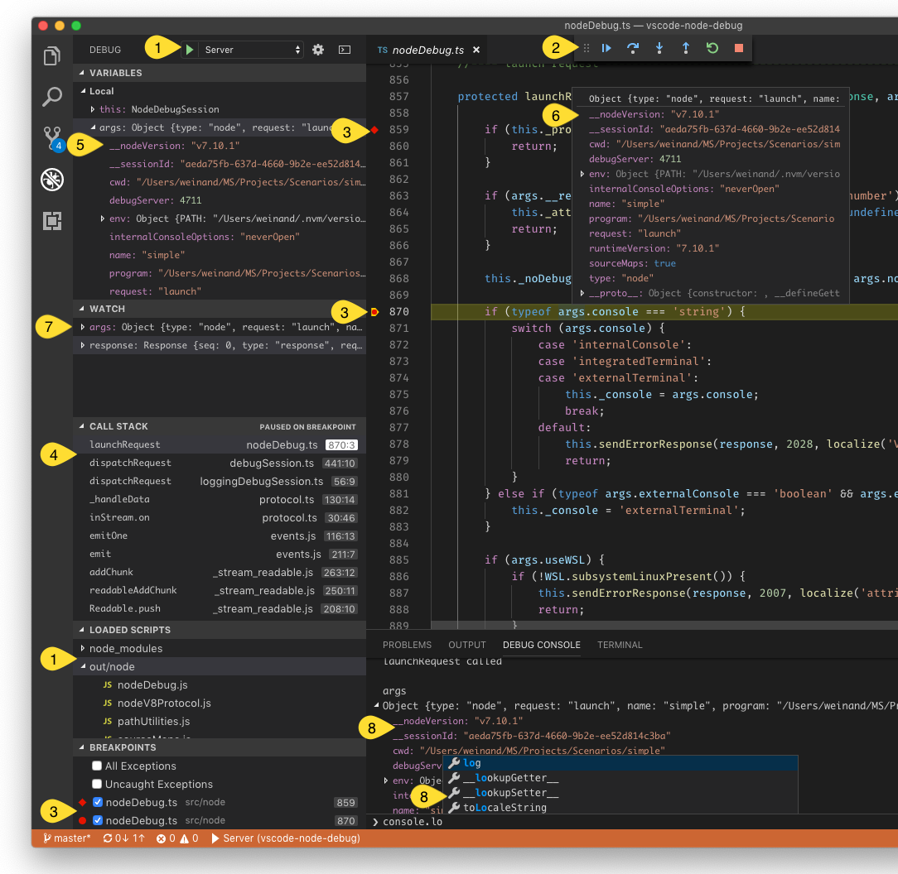
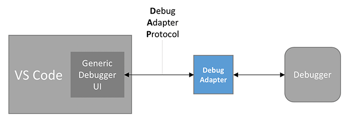

---
# DO NOT TOUCH — Managed by doc writer
ContentId: 49EF49AD-8BE6-4D46-ADC8-D678BDC04E85
DateApproved: 7/3/2019

# Summarize the whole topic in less than 300 characters for SEO purpose
MetaDescription: Learn how to provide debugger extensions (plug-ins) for Visual Studio Code through a Debug Adapter.
---

# Debugger Extension

Visual Studio Code's debugging architecture allows extension authors to easily integrate existing debuggers into VS Code, while having a common user interface with all of them.

VS Code ships with one built-in debugger extension, the [Node.js](https://nodejs.org) debugger extension, which is an excellent showcase for the many debugger features supported by VS Code:



This screenshot shows the following debugging features:

1. Debug configuration management.
2. Debug actions for starting/stopping and stepping.
3. Source-, function-, conditional-, inline breakpoints, and log points.
4. Stack traces, including multi-thread and multi-process support.
5. Navigating through complex data structures in views and hovers.
6. Variable values shown in hovers or inlined in the source.
7. Managing watch expressions.
8. Debug console for interactive evaluation with autocomplete.

This documentation will help you create a debugger extension which can make any debugger work with VS Code.

## Debugging Architecture of VS Code

VS Code implements a generic (language-agnostic) debugger UI based on an abstract protocol that we've introduced to communicate with debugger backends.
Because debuggers typically do not implement this protocol, some intermediary is needed to "adapt" the debugger to the protocol.
This intermediary is typically a standalone process that communicates with the debugger.



We call this intermediary the **Debug Adapter** (or **DA** for short) and the abstract protocol that is used between the DA and VS Code is the **Debug Adapter Protocol** (**DAP** for short).
Since the Debug Adapter Protocol is independent from VS Code, it has its own [web site](https://microsoft.github.io/debug-adapter-protocol/) where you can find an [introduction and overview](https://microsoft.github.io/debug-adapter-protocol/overview), the detailed [specification](https://microsoft.github.io/debug-adapter-protocol/specification), and some lists with [known implementations and supporting tools](https://microsoft.github.io/debug-adapter-protocol/implementors/adapters/).
The history of and motivation behind DAP is explained in this [blog post](https://code.visualstudio.com/blogs/2018/08/07/debug-adapter-protocol-website#_why-the-need-for-decoupling-with-protocols).

Since debug adapters are independent from VS Code and can be used in [other developments tools](https://microsoft.github.io/debug-adapter-protocol/implementors/tools/), they do not match VS Code's extensibility architecture which is based on extensions and contribution points.

For this reason VS Code provides a contribution point, `debuggers`, where a debug adapter can be contributed under a specific debug type (e.g. `node` for the Node.js debugger). VS Code launches the registered DA whenever the user starts a debug session of that type.

So in its most minimal form, a debugger extension is just a declarative contribution of a debug adapter implementation and the extension is basically a packaging container for the debug adapter without any additional code.


A more realistic debugger extension contributes many or all of the following declarative items to VS Code:

- List of languages supported by the debugger. VS Code enables the UI to set breakpoints for those languages.
- JSON schema for the debug configuration attributes introduced by the debugger. VS Code uses this schema to verify the configuration in the launch.json editor and provides IntelliSense.
- Default debug configurations for the initial launch.json created by VS Code.
- Debug configuration snippets that a user can add to a launch.json file.
- Declaration of variables that can be used in debug configurations.

You can find more information in [`contributes.breakpoints`](/api/references/contribution-points#contributes.breakpoints) and [`contributes.debuggers`](/api/references/contribution-points#contributes.debuggers) references.

In addition to the purely declarative contributions from above, the Debug Extension API enables this code-based functionality:

- Dynamically generated default debug configurations for the initial launch.json created by VS Code.
- Determine the debug adapter to use dynamically.
- Verify or modify debug configurations before they are passed to the debug adapter.
- Communicate with the debug adapter.
- Send messages to the debug console.

In the rest of this document we show how to develop a debugger extension.

## The Mock Debug Extension

Since creating a debug adapter from scratch is a bit heavy for this tutorial, we will start with a simple DA which we have created as an educational "debug adapter starter kit". It is called _Mock Debug_ because it does not talk to a real debugger, but mocks one. Mock Debug simulates a debugger and supports step, continue, breakpoints, exceptions, and variable access, but it is not connected to any real debugger.

Before delving into the development setup for mock-debug, let's first install a [pre-built version](https://marketplace.visualstudio.com/items/andreweinand.mock-debug)
from the VS Code Marketplace and play with it:

- Switch to the Extensions viewlet and type "mock" to search for the Mock Debug extension,
- "Install" and "Reload" the extension.

To try Mock Debug:

- Create a new empty folder `mock test` and open it in VS Code.
- Create a file `readme.md` and enter several lines of arbitrary text.
- Switch to the Debug view and press the gear icon.
- VS Code will let you select an "environment" in order to create a default launch configuration. Pick "Mock Debug".
- Press the green Start button and then Enter to confirm the suggested file `readme.md`.

A debug session starts and you can "step" through the readme file, set and hit breakpoints, and run into exceptions (if the word `exception` appears in a line).


Before using Mock Debug as a starting point for your own development, we recommend to uninstall the pre-built version first:

- Switch to the Extensions viewlet and click on the gear icon of the Mock Debug extension.
- Run the "Uninstall" action and then "Reload" the window.

## Development Setup for Mock Debug

Now let's get the source for Mock Debug and start development on it within VS Code:

```bash
git clone https://github.com/Microsoft/vscode-mock-debug.git
cd vscode-mock-debug
npm install
```

Open the project folder `vscode-mock-debug` in VS Code.

What's in the package?

- `package.json` is the manifest for the mock-debug extension:
  - It lists the contributions of the mock-debug extension.
  - The `compile` and `watch` scripts are used to transpile the TypeScript source into the `out` folder and watch for subsequent source modifications.
  - The dependencies `vscode-debugprotocol`, `vscode-debugadapter`, and `vscode-debugadapter-testsupport` are NPM modules that simplify the development of node-based debug adapters.
- `src/mockRuntime.ts` is a _mock_ runtime with a simple debug API.
- The code that _adapts_ the runtime to the Debug Adapter Protocol lives in `src/mockDebug.ts`. Here you find the handlers for the various requests of the DAP.
- Since the implementation of debugger extension lives in the debug adapter, there is no need to have extension code at all (i.e. code that runs in the extension host process). However, Mock Debug has a small `src/extension.ts` because it illustrates what can be done in the extension code of a debugger extension.

Now build and launch the Mock Debug extension by selecting the **Extension** launch configuration and hitting `F5`.
Initially, this will do a full transpile of the TypeScript sources into the `out` folder.
After the full build, a _watcher task_ is started that transpiles any changes you make.

After transpiling the source, a new VS Code window labelled "[Extension Development Host]" appears with the Mock Debug extension now running in debug mode. From that window open your `mock test` project with the `readme.md` file, start a debug session with 'F5', and then step through it:


Since you are running the extension in debug mode, you could now set and hit breakpoints in `src/extension.ts` but as I've mentioned above, there is not much interesting code executing in the extension. The interesting code runs in the debug adapter which is a separate process.

In order to debug the debug adapter itself, we have to run it in debug mode. This is most easily achieved by running the debug adapter in _server mode_ and configure VS Code to connect to it. In your VS Code vscode-mock-debug project select the launch configuration **Server** from the drop down menu and press the green start button.

Since we already had an active debug session for the extension the VS Code debugger UI now enters _multi session_ mode which is indicated by seeing the names of the two debug sessions **Extension** and **Server** showing up in the CALL STACK view:


Now we are able to debug both the extension and the DA simultaneously.
A faster way to arrive here is by using the **Extension + Server** launch configuration which launches both sessions automatically.

An alternative, even simpler approach for debugging the extension and the DA can be found [below](#alternative-approach-to-develop-a-debugger-extension).

Set a breakpoint at the beginning of method `launchRequest(...)` in file `src/mockDebug.ts` and as a last step configure the mock debugger to connect to the DA server by adding a `debugServer` attribute for port `4711` to your mock test launch config:

```json
{
  "version": "0.2.0",
  "configurations": [
    {
      "type": "mock",
      "request": "launch",
      "name": "mock test",
      "program": "${workspaceFolder}/readme.md",
      "stopOnEntry": true,
      "debugServer": 4711
    }
  ]
}
```

If you now launch this debug configuration, VS Code does not start the mock debug adapter as a separate process, but directly connects to local port 4711 of the already running server, and you should hit the breakpoint in `launchRequest`.

With this setup, you can now easily edit, transpile, and debug Mock Debug.

But now the real work begins: you will have to replace the mock implementation of the debug adapter in `src/mockDebug.ts` and `src/mockRuntime.ts` by some code that talks to a "real" debugger or runtime. This involves understanding and implementing the Debug Adapter Protocol. More details
about this can be found [here](https://microsoft.github.io/debug-adapter-protocol/overview#How_it_works).

## Anatomy of the package.json of a Debugger Extension

Besides providing a debugger-specific implementation of the debug adapter a debugger extension needs a `package.json` that contributes to the various debug-related contributions points.

So let's have a closer look at the `package.json` of Mock Debug.

Like every VS Code extension, the `package.json` declares the fundamental properties **name**, **publisher**, and **version** of the extension. Use the **categories** field to make the extension easier to find in the VS Code Extension Marketplace.

```json
{
  "name": "mock-debug",
  "displayName": "Mock Debug",
  "version": "0.24.0",
  "publisher": "...",
  "description": "Starter extension for developing debug adapters for VS Code.",
  "author": {
    "name": "...",
    "email": "..."
  },
  "engines": {
    "vscode": "^1.17.0",
    "node": "^7.9.0"
  },
  "icon": "images/mock-debug-icon.png",
  "categories": ["Debuggers"],

  "contributes": {
    "breakpoints": [{ "language": "markdown" }],
    "debuggers": [
      {
        "type": "mock",
        "label": "Mock Debug",

        "program": "./out/mockDebug.js",
        "runtime": "node",

        "configurationAttributes": {
          "launch": {
            "required": ["program"],
            "properties": {
              "program": {
                "type": "string",
                "description": "Absolute path to a text file.",
                "default": "${workspaceFolder}/${command:AskForProgramName}"
              },
              "stopOnEntry": {
                "type": "boolean",
                "description": "Automatically stop after launch.",
                "default": true
              }
            }
          }
        },

        "initialConfigurations": [
          {
            "type": "mock",
            "request": "launch",
            "name": "Ask for file name",
            "program": "${workspaceFolder}/${command:AskForProgramName}",
            "stopOnEntry": true
          }
        ],

        "configurationSnippets": [
          {
            "label": "Mock Debug: Launch",
            "description": "A new configuration for launching a mock debug program",
            "body": {
              "type": "mock",
              "request": "launch",
              "name": "${2:Launch Program}",
              "program": "^\"\\${workspaceFolder}/${1:Program}\""
            }
          }
        ],

        "variables": {
          "AskForProgramName": "extension.mock-debug.getProgramName"
        }
      }
    ]
  },

  "activationEvents": ["onDebug", "onCommand:extension.mock-debug.getProgramName"]
}
```

Now take a look at the **contributes** section which contains the contributions specific to debug extensions.

First, we use the **breakpoints** contribution point to list the languages for which setting breakpoints will be enabled. Without this, it would not be possible to set breakpoints in Markdown files.

Next is the **debuggers** section. Here, one debugger is introduced under a debug **type** `mock`. The user can reference this type in launch configurations. The optional attribute **label** can be used to give the debug type a nice name when showing it in the UI.

Since the debug extension uses a debug adapter, a relative path to its code is given as the **program** attribute.
In order to make the extension self-contained the application must live inside the extension folder. By convention, we keep this applications inside a folder named `out` or `bin`, but you are free to use a different name.

Since VS Code runs on different platforms, we have to make sure that the DA program supports the different platforms as well. For this we have the following options:

1. If the program is implemented in a platform independent way, e.g. as program that runs on a runtime that is available on all supported platforms, you can specify this runtime via the **runtime** attribute. As of today, VS Code supports `node` and `mono` runtimes. Our Mock debug adapter from above uses this approach.

1. If your DA implementation needs different executables on different platforms, the **program** attribute can be qualified for specific platforms like this:

   ```json
   "debuggers": [{
       "type": "gdb",
       "windows": {
           "program": "./bin/gdbDebug.exe",
       },
       "osx": {
           "program": "./bin/gdbDebug.sh",
       },
       "linux": {
           "program": "./bin/gdbDebug.sh",
       }
   }]
   ```

1. A combination of both approaches is possible too. The following example is from the Mono DA which is implemented as a mono application that needs a runtime on macOS and Linux but not on Windows:

   ```json
   "debuggers": [{
       "type": "mono",
       "program": "./bin/monoDebug.exe",
       "osx": {
           "runtime": "mono"
       },
       "linux": {
           "runtime": "mono"
       }
   }]
   ```

**configurationAttributes** declares the schema for the `launch.json` attributes that are available for this debugger. This schema is used for validating the `launch.json` and supporting IntelliSense and hover help when editing the launch configuration.

The **initialConfigurations** define the initial content of the default `launch.json` for this debugger. This information is used when a project does not have a `launch.json` and a user starts a debug session or clicks on the gear icon in the debug viewlet. In this case VS Code lets the user pick a debug environment and then creates the corresponding `launch.json`:


Instead of defining the initial content of the `launch.json` statically in the `package.json`, it is possible to compute the initial configurations dynamically by implementing a `DebugConfigurationProvider` (for details see the section [Using a DebugConfigurationProvider below](#using-a-debugconfigurationprovider)).

**configurationSnippets** define launch configuration snippets that get surfaced in IntelliSense when editing the `launch.json`. As a convention, prefix the `label` attribute of a snippet by the debug environment name so that it can be clearly identified when presented in a list of many snippet proposals.

The **variables** contribution binds "variables" to "commands". These variables can be used in the launch configuration using the **\${command:xyz}** syntax and the variables are substituted by the value returned from the bound command when a debug session is started.

The implementation of a command lives in the extension and it can range from a simple expression with no UI, to sophisticated functionality based on the UI features available in the extension API.
Mock Debug binds a variable `AskForProgramName` to the command `extension.mock-debug.getProgramName`. The [implementation](https://github.com/Microsoft/vscode-mock-debug/blob/606454ff3bd669867a38d9b2dc7b348d324a3f6b/src/extension.ts#L21-L26) of this command in `src/extension.ts` uses the `showInputBox` to let the user enter a program name:

```ts
vscode.commands.registerCommand('extension.mock-debug.getProgramName', config => {
  return vscode.window.showInputBox({
    placeHolder: 'Please enter the name of a markdown file in the workspace folder',
    value: 'readme.md'
  });
});
```

The variable can now be used in any string typed value of a launch configuration as **\${command:AskForProgramName}**.

## Using a DebugConfigurationProvider

If the static nature of debug contributions in the `package.json` is not sufficient, a `DebugConfigurationProvider` can be used to dynamically control the following aspects of a debug extension:

- The initial debug configurations for a newly created launch.json can be generated dynamically, e.g. based on some contextual information available in the workspace.
- A launch configuration can be _resolved_ (or modified) before it is used to start a new debug session. This allows for filling in default values based on information available in the workspace.

The `MockConfigurationProvider` in `src/extension.ts` implements `resolveDebugConfiguration` to detect the case where a debug session is started when no launch.json exists, but a Markdown file is open in the active editor. This is a typical scenario where the user has a file open in the editor and just wants to debug it without creating a launch.json.

A debug configuration provider is registered for a specific debug type via `vscode.debug.registerDebugConfigurationProvider`, typically in the extension's `activate` function.
To ensure that the `DebugConfigurationProvider` is registered early enough, the extension must be activated as soon as the debug functionality is used. This can be easily achieved by configuring extension activation for the `onDebug` event in the `package.json`:

```json
"activationEvents": [
    "onDebug",
    // ...
],
```

This catch-all `onDebug` is triggered as soon as any debug functionality is used. This works fine as long as the extension has cheap startup costs (i.e. does not spend a lot of time in its startup sequence). If a debug extension has an expensive startup (for instance because of starting a language server), the `onDebug` activation event could negatively affect other debug extensions, because it is triggered rather early and does not take a specific debug type into account.

A better approach for expensive debug extensions is to use more fine-grained activation events:

- `onDebugInitialConfigurations` is fired just before the `provideDebugConfigurations` method of the `DebugConfigurationProvider` is called.
- `onDebugResolve:type` is fired just before the `resolveDebugConfiguration` method of the `DebugConfigurationProvider` for the specified type is called.

**Rule of thumb:** If activation of a debug extensions is cheap, use `onDebug`. If it is expensive, use `onDebugInitialConfigurations` and/or `onDebugResolve` depending on whether the `DebugConfigurationProvider` implements the corresponding methods `provideDebugConfigurations` and/or `resolveDebugConfiguration`.

## Publishing your debugger extension

Once you have created your debugger extension you can publish it to the Marketplace:

- Update the attributes in the `package.json` to reflect the naming and purpose of your debugger extension.
- Upload to the Marketplace as described in [Publishing Extension](/api/working-with-extensions/publishing-extension).

## Alternative approach to develop a debugger extension

As we have seen, developing a debugger extension typically involves debugging both the extension and the debug adapter in two parallel sessions. As explained above VS Code supports this nicely but development could be easier if both the extension and the debug adapter would be one program that could be debugged in one debug session.

This approach is in fact easily doable as long as your debug adapter is implemented in TypeScript/JavaScript. The basic idea is to run the debug adapter as a server inside the extension host and to make VS Code to connect to it instead of launching a new debug adapter per session.

Mock Debug shows how a [DebugAdapterDescriptorFactory](https://github.com/Microsoft/vscode-mock-debug/blob/6a2ef01b95bb22cdf55683f4d616cad501051510/src/extension.ts#L74-L98) can be used to create and [register](https://github.com/Microsoft/vscode-mock-debug/blob/6a2ef01b95bb22cdf55683f4d616cad501051510/src/extension.ts#L32-L36) a server-based debug adapter.
The feature is enabled by setting the compile time flag [`EMBED_DEBUG_ADAPTER`](https://github.com/Microsoft/vscode-mock-debug/blob/6a2ef01b95bb22cdf55683f4d616cad501051510/src/extension.ts#L17) to true. If you now start debugging the extension with **F5** you will hit breakpoints not only in the extension host but in the debug adapter as well.
