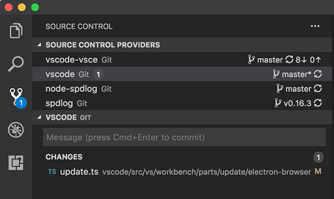
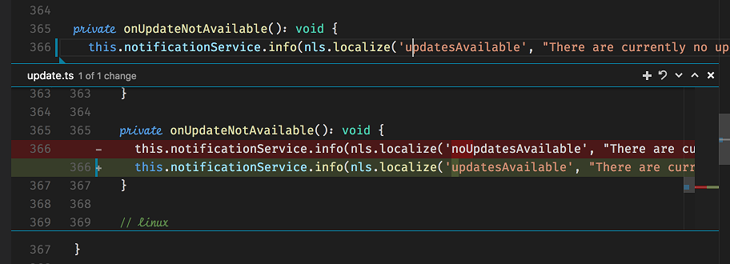

---
# DO NOT TOUCH — Managed by doc writer
ContentId: 79996489-8D16-4C0A-8BE8-FF4B1E9C223A
DateApproved: 7/3/2019

# Summarize the whole topic in less than 300 characters for SEO purpose
MetaDescription: A guide illustrating how to use Source Control API.
---

# Source Control API

The Source Control API allows extension authors to define Source Control Management (SCM) features. There is a slim, yet powerful API surface which allows many different SCM systems to be integrated in Visual Studio Code, while having a common user interface with all of them.


VS Code itself ships with one Source Control provider, the Git extension, which is the best reference for this API and is [a great starting point](https://github.com/Microsoft/vscode/blob/master/extensions/git/src/repository.ts) if you'd like to contribute your very own SCM provider. There are other great examples in the Marketplace such as the [SVN extension](https://marketplace.visualstudio.com/items?itemName=johnstoncode.svn-scm).

This documentation will help you build an extension which can make any SCM system work with VS Code.

> **Note:** that you can always refer to the [`vscode` namespace API reference](/api/references/vscode-api#scm) in our documentation.

## Source Control Model

A `SourceControl` is the entity responsible for populating the Source Control model with **resource states**, instances of `SourceControlResourceState`. Resource states are themselves organized in **groups**, instances of `SourceControlResourceGroup`.

You can create a new SourceControl with `vscode.scm.createSourceControl`.

In order to better understand how these three entities correlate with each other, let's take [Git](https://github.com/Microsoft/vscode/tree/master/extensions/git) as an example. Consider the following output of `git status`:

```bash
vsce master* → git status
On branch master
Your branch is up-to-date with 'origin/master'.
Changes to be committed:
  (use "git reset HEAD <file>..." to unstage)

        modified:   README.md
        renamed:    src/api.ts -> src/test/api.ts

Changes not staged for commit:
  (use "git add/rm <file>..." to update what will be committed)
  (use "git checkout -- <file>..." to discard changes in working directory)

        deleted:    .travis.yml
        modified:   README.md
```

There are many things going on in this workspace. First, the `README.md` file has been modified, staged and then modified once again. Second, the `src/api.ts` file has been moved to `src/test/api.ts` and that move was staged. Finally, the `.travis.yml` file has been deleted.

For this workspace, Git defines two resource groups: the **working tree** and the **index**. Each **file change** within that group is **resource state**:

- **Index** - resource group
  - `README.md`, modified - resource state
  - `src/test/api.ts`, renamed from `src/api.ts` - resource state
- **Working Tree** - resource group
  - `.travis.yml`, deleted - resource state
  - `README.md`, modified - resource state

Note how the same file, `README.md`, is part of two distinct resource states.

Here's how Git creates this model:

```ts
function createResourceUri(relativePath: string): vscode.Uri {
  const absolutePath = path.join(vscode.workspace.rootPath, relativePath);
  return vscode.Uri.file(absolutePath);
}

const gitSCM = vscode.scm.createSourceControl('git', 'Git');

const index = gitSCM.createResourceGroup('index', 'Index');
index.resourceStates = [
  { resourceUri: createResourceUri('README.md') },
  { resourceUri: createResourceUri('src/test/api.ts') }
];

const workingTree = gitSCM.createResourceGroup('workingTree', 'Changes');
workingTree.resourceStates = [
  { resourceUri: createResourceUri('.travis.yml') },
  { resourceUri: createResourceUri('README.md') }
];
```

Changes made to the source control and resource groups will be propagated to the Source Control view.

## Source Control View

VS Code is able to populate the Source Control view, as the Source Control model changes. Resource states are customizable using `SourceControlResourceDecorations`:

```ts
export interface SourceControlResourceState {
  readonly decorations?: SourceControlResourceDecorations;
}
```

The previous example would be sufficient to populate a simple list in the Source Control view, but there are many user interactions that the user might want to perform with each resource. For instance, what happens when the user clicks a resource state? The resource state can optionally provide a command to handle this action:

```ts
export interface SourceControlResourceState {
  readonly command?: Command;
}
```

### Menus

There are five Source Control menu ids where you can place menu items, in order to provide the user with a much richer user interface.

The `scm/title` menu is located to the right of the SCM view title. The menu items in the `navigation` group will be inline, while all the others will be within the `…` drop-down menu.

The `scm/resourceGroup/context` and `scm/resourceState/context` are similar. The former will let you customize resource groups, while the later refers to resource states. Place menu items in the `inline` group to have them inline. All other menu item groups will be represented in a context menu usually accessible using the mouse right-click. Commands called from within these menus will have the respective resource states on passed as arguments. Note that the SCM view supports multiple selection thus a command might receive more than one resource at a time in its arguments.

For example, Git supports staging multiple files by adding the `git.stage` command to the `scm/resourceState/context` menu and using such a method declaration:

```ts
stage(...resourceStates: SourceControlResourceState[]): Promise<void>;
```

When creating them, `SourceControl` and `SourceControlResourceGroup` instances require you to provide an `id` string. These values will be populated in the `scmProvider` and `scmResourceGroup` context keys, respectively. You can rely on these [context keys](/docs/getstarted/keybindings#_when-clause-contexts) in the `when` clauses of your menu items. Here's how Git is able to show a menu item for its `git.stage` command:

```json
{
  "command": "git.stage",
  "when": "scmProvider == git && scmResourceGroup == merge",
  "group": "inline"
}
```

The `scm/change/title` allows you to contribute commands to the title bar of an inline change. The command will be passed as arguments the URI of the document, the array of changes within it, and the index of the change which the inline change affordance is currently focused on. For example, here's the declaration of the `stageChange` Git command, which is contributed to this menu:

```ts
async stageChange(uri: Uri, changes: LineChange[], index: number): Promise<void>;
```

The `scm/sourceControl` menu is located contextually near SourceControl instances:



Finally, the `scm/change/title` menu is related to the Quick Diff experience, showcased further ahead. It lets you contribute commands which are specific to code changes.

### SCM Input Box

The Source Control Input Box, located atop of each Source Control view, allows the user to input a message. You can get (and set) this message in order to perform operations. In Git, for example, this is used as the commit box, in which users type in commit messages and `git commit` commands pick them up.

```ts
export interface SourceControlInputBox {
  value: string;
}

export interface SourceControl {
  readonly inputBox: SourceControlInputBox;
}
```

The user can type <kbd>Ctrl+Enter</kbd> (or <kbd>Cmd+Enter</kbd> on macOS) to accept any message. You can handle this event by providing a `acceptInputCommand` to your `SourceControl` instance.

```ts
export interface SourceControl {
  readonly acceptInputCommand?: Command;
}
```

## Quick Diff

VS Code also supports displaying **quick diff** editor gutter decorations. Clicking those decorations will reveal an inline diff experience, to which you can contribute contextual commands:



These decorations are computed by VS Code itself. All you need to do is provide VS Code with the original contents of any given file.

```ts
export interface SourceControl {
  quickDiffProvider?: QuickDiffProvider;
}
```

Using a `QuickDiffProvider`, your implementation is able to tell VS Code what's the `Uri` of the original resource that matches the resource which `Uri` is provided as an argument.

You can combine this API with the [`registerTextDocumentContentProvider` method in the `workspace` namespace](/api/references/vscode-api#workspace), which lets you provide contents for arbitrary resources, given a `Uri`.

## Next steps

To learn more about VS Code extensibility model, try these topics:

- [SCM API Reference](/api/references/vscode-api#scm) - Read the full SCM API documentation
- [Git Extension](https://github.com/Microsoft/vscode/tree/master/extensions/git) - Learn by reading the Git extension implementation
- [Extension API Overview](/api) - Learn about the full VS Code extensibility model.
- [Extension Manifest File](/api/references/extension-manifest) - VS Code package.json extension manifest file reference
- [Contribution Points](/api/references/contribution-points) - VS Code contribution points reference
