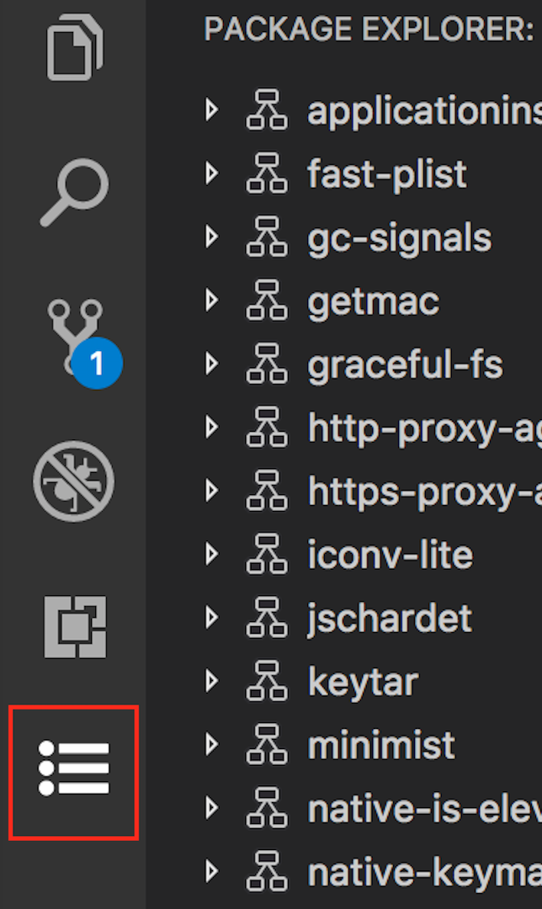
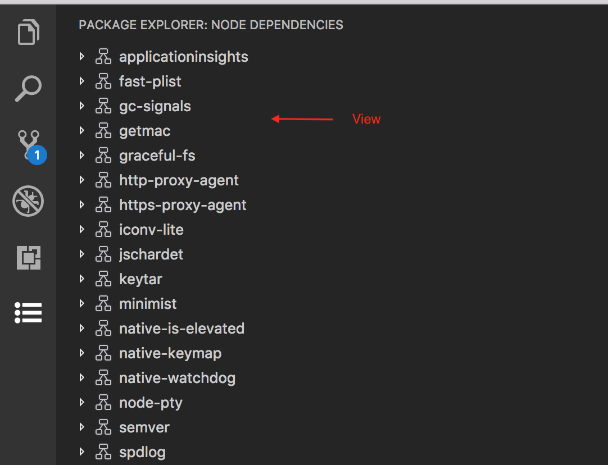
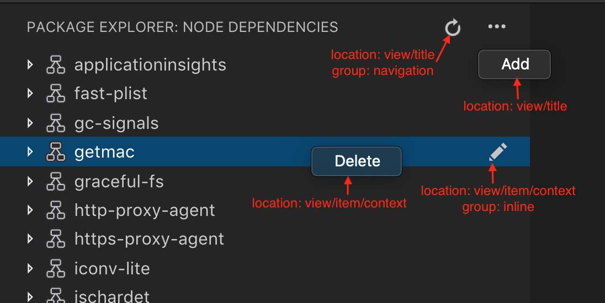

---
# DO NOT TOUCH — Managed by doc writer
ContentId: 9b10cda2-4eb0-4989-8f82-23a46b96c1bb
DateApproved: 7/3/2019

# Summarize the whole topic in less than 300 characters for SEO purpose
MetaDescription: A guide to using Tree View in Visual Studio Code extension (plug-in).
---

# Tree View Guide

This guide teaches you how to write an extension that contributes view containers and tree views to Visual Studio Code. You can find a sample extension with source code at: https://github.com/Microsoft/vscode-extension-samples/tree/master/tree-view-sample.

## View Container

A View Container contains a list of views that is displayed next to the built-in View Containers.



To contribute a View Container, you should first register it using [`contributes.viewsContainers`](/api/references/contribution-points#contributes.viewsContainers) Contribution Point in `package.json`. You have to specify following required fields:

- `id`: The name of the new view container you're creating
- `title`: The name which will show up at the top of the view container
- `icon`: an image which will be displayed for the view container in the activity bar

```json
"contributes": {
  "viewsContainers": {
    "activitybar": [
      {
        "id": "package-explorer",
        "title": "Package Explorer",
        "icon": "media/dep.svg"
      }
    ]
  }
}
```

## Tree View

A view is an UI section that is shown inside the View Container. With the [`contributes.views`](/api/references/contribution-points#contributes.views) Contribution Point, you can add new views to the built-in or contributed View Containers.



To contribute a view, you should first register it using [`contributes.views`](/api/references/vscode-api) Contribution Point in `package.json`. You must specify an identifier and name for the view, and you can contribute to following locations:

- `explorer`: Explorer view in the Side Bar
- `debug`: Debug view in the Side Bar
- `scm`: Source Control view in the Side Bar
- `test`: Test explorer view in the Side Bar
- Contributed View Containers

Example:

```json
"contributes": {
  "views": {
    "package-explorer": [
      {
        "id": "nodeDependencies",
        "name": "Node Dependencies",
        "when": "explorer"
      }
    ]
  }
}
```

When the user opens the view, VS Code will then emit an activationEvent [`onView:${viewId}`](/api/references/activation-events#onView) (e.g. `onView:nodeDependencies` for the example above). You can also control the visibility of the view by providing the `when` context value.

## View Actions

You can contribute actions at the following locations in the view

- `view/title`: Location to show actions in the view title. Primary or inline actions use `"group": "navigation"` and rest are secondary actions which are in `...` menu.
- `view/item/context`: Location to show actions for the tree item. Inline actions use `"group": "inline"` and rest are secondary actions which are in `...` menu.

You can control the visibility of these actions using the `when` property.



Examples:

```json
"contributes": {
  "commands": [
    {
      "command": "nodeDependencies.refreshEntry",
      "title": "Refresh",
      "icon": {
        "light": "resources/light/refresh.svg",
        "dark": "resources/dark/refresh.svg"
      }
    },
    {
      "command": "nodeDependencies.addEntry",
      "title": "Add"
    },
    {
      "command": "nodeDependencies.editEntry",
      "title": "Edit",
      "icon": {
        "light": "resources/light/edit.svg",
        "dark": "resources/dark/edit.svg"
      }
    },
    {
      "command": "nodeDependencies.deleteEntry",
      "title": "Delete"
    }
  ],
  "menus": {
    "view/title": [
      {
        "command": "nodeDependencies.refreshEntry",
        "when": "view == nodeDependencies",
        "group": "navigation"
      },
      {
        "command": "nodeDependencies.addEntry",
        "when": "view == nodeDependencies"
      }
    ],
    "view/item/context": [
      {
        "command": "nodeDependencies.editEntry",
        "when": "view == nodeDependencies && viewItem == dependency",
        "group": "inline"
      },
      {
        "command": "nodeDependencies.deleteEntry",
        "when": "view == nodeDependencies && viewItem == dependency"
      }
    ]
  }
}
```

**Note:** If you want to show an action for specific items, you can do it by defining context of a tree item using `TreeItem.contextValue` and you can specify the context value for key `viewItem` in `when` expression.

Examples:

```json
"contributes": {
  "menus": {
    "view/item/context": [
      {
        "command": "nodeDependencies.deleteEntry",
        "when": "view == nodeDependencies && viewItem == dependency"
      }
    ]
  }
}
```

## TreeDataProvider

Extension writers should register a [`TreeDataProvider`](/api/references/vscode-api#TreeDataProvider) programmatically to populate data in the view.

```typescript
vscode.window.registerTreeDataProvider('nodeDependencies', new DepNodeProvider());
```

See [nodeDependencies.ts](https://github.com/Microsoft/vscode-extension-samples/tree/master/tree-view-sample/src/nodeDependencies.ts) for the implementation.

## TreeView

If you would like to perform some UI operations on the view programatically, you can use `window.createTreeView` instead of `window.registerTreeDataProvider`. This will give access to the view which you can use for performing view operations.

```typescript
vscode.window.createTreeView('ftpExplorer', {
  treeDataProvider: new FtpTreeDataProvider()
});
```

See [ftpExplorer.ts](https://github.com/Microsoft/vscode-extension-samples/tree/master/tree-view-sample/src/ftpExplorer.ts) for the implementation.
