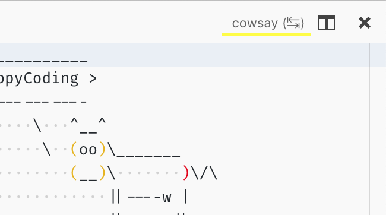

---
# DO NOT TOUCH — Managed by doc writer
ContentId: 54fdcc33-7ad1-40cc-bc87-ded1841d01ad
DateApproved: 3/30/2023

# Summarize the whole topic in less than 300 characters for SEO purpose
MetaDescription: A guide to using Virtual Documents in Visual Studio Code extensions (plug-ins)
---

# Virtual Documents

The text document content provider API allows you to create readonly documents in Visual Studio Code from arbitrary sources. You can find a sample extension with source code at: [https://github.com/microsoft/vscode-extension-samples/blob/main/virtual-document-sample/README.md](https://github.com/microsoft/vscode-extension-samples/blob/main/virtual-document-sample/README.md).

## TextDocumentContentProvider

The API works by claiming an uri-scheme for which your provider then returns text contents. The scheme must be provided when registering a provider and cannot change afterwards. The same provider can be used for multiple schemes and multiple providers can be registered for a single scheme.

```ts
vscode.workspace.registerTextDocumentContentProvider(myScheme, myProvider);
```

Calling `registerTextDocumentContentProvider` returns a disposable with which the registration can be undone. A provider must only implement the `provideTextDocumentContent`-function which is called with an uri and cancellation token.

```ts
const myProvider = new class implements vscode.TextDocumentContentProvider {
  provideTextDocumentContent(uri: vscode.Uri): string {
    // invoke cowsay, use uri-path as text
    return cowsay.say({ text: uri.path });
  }
};
```

Note how the provider doesn't create uris for virtual documents - its role is to **provide** contents given such an uri. In return, content providers are wired into the open document logic so that providers are always considered.

This sample uses a 'cowsay'-command that crafts an uri which the editor should then show:

```ts
vscode.commands.registerCommand('cowsay.say', async () => {
  let what = await vscode.window.showInputBox({ placeHolder: 'cow say?' });
  if (what) {
    let uri = vscode.Uri.parse('cowsay:' + what);
    let doc = await vscode.workspace.openTextDocument(uri); // calls back into the provider
    await vscode.window.showTextDocument(doc, { preview: false });
  }
});
```

The command prompts for input, creates an uri of the `cowsay`-scheme, opens a document for the uri, and finally opens an editor for that document. In step 3, opening the document, the provider is being asked to provide contents for that uri.

With this we have a fully functional text document content provider. The next sections describe how virtual documents can be updated and how UI commands can be registered for virtual documents.

### Update Virtual Documents

Depending on the scenario virtual documents might change. To support that, providers can implement a `onDidChange`-event.

The `vscode.Event`-type defines the contract for eventing in VS Code. The easiest way to implement an event is `vscode.EventEmitter`, like so:

```ts
const myProvider = new class implements vscode.TextDocumentContentProvider {
  // emitter and its event
  onDidChangeEmitter = new vscode.EventEmitter<vscode.Uri>();
  onDidChange = this.onDidChangeEmitter.event;

  //...
};
```

The event emitter has a `fire` method which is can be used to notify VS Code when a change has happened in a document. The document which has changed is identified by its uri given as argument to the `fire` method. The provider will then be called again to provide the updated content, assuming the document is still open.

That's all what's needed to make VS Code listen for changes of virtual document. To see a more complex example making use of this feature, look at: [https://github.com/microsoft/vscode-extension-samples/blob/main/contentprovider-sample/README.md](https://github.com/microsoft/vscode-extension-samples/blob/main/contentprovider-sample/README.md).

### Add Editor Commands

Editor actions can be added which only interact with documents provided by an associated content provider. This is a sample command that reverses what the cow just said:

```ts
// register a command that updates the current cowsay
subscriptions.push(
  vscode.commands.registerCommand('cowsay.backwards', async () => {
    if (!vscode.window.activeTextEditor) {
      return; // no editor
    }
    let { document } = vscode.window.activeTextEditor;
    if (document.uri.scheme !== myScheme) {
      return; // not my scheme
    }
    // get path-components, reverse it, and create a new uri
    let say = document.uri.path;
    let newSay = say
      .split('')
      .reverse()
      .join('');
    let newUri = document.uri.with({ path: newSay });
    await vscode.window.showTextDocument(newUri, { preview: false });
  })
);
```

The snippet above checks that we have an active editor and that its document is one of our scheme. These checks are needed because commands are available (and executable) to everyone. Then the path-component of the uri is reversed and a new uri is created from it, last an editor is opened.

To top things with an editor command a declarative part in `package.json` is needed. In the `contributes`-section add this config:

```json
"menus": {
  "editor/title": [
    {
      "command": "cowsay.backwards",
      "group": "navigation",
      "when": "resourceScheme == cowsay"
    }
  ]
}
```

This references the `cowsay.backwards`-command that defined in the `contributes/commands`-section and says it should appear in the editor title menu (the toolbar in the upper right corner). Now, just that would mean the command always shows, for every editor. That's what the `when`-clause is used for - it describes what condition must be true to show the action. In this sample it states that the scheme of the document in the editor must be the `cowsay`-scheme. The configuration is then repeated for the `commandPalette`-menu - it shows all commands by default.



### Events and Visibility

Document providers are first class citizens in VS Code, their contents appears in regular text documents, they use the same infrastructure as files etc. However, that also means that "your" documents cannot hide, they will appear in `onDidOpenTextDocument` and `onDidCloseTextDocument`-events, they are part of `vscode.workspace.textDocuments` and more. The rule for everyone is check the `scheme` of documents and then decide if you want to do something with/for the document.

# File System API

If you need more flexibility and power take a look at the [`FileSystemProvider`](/api/references/vscode-api#FileSystemProvider) API. It allows to implement a full file system, having files, folders, binary data, file-deletion, creation and more.

You can find a sample extension with source code at: [https://github.com/microsoft/vscode-extension-samples/tree/main/fsprovider-sample/README.md](https://github.com/microsoft/vscode-extension-samples/tree/main/fsprovider-sample/README.md).


When VS Code is opened on a folder or workspace of a such a file system we call it a virtual workspace. When a virtual workspace is open in a VS Code window, this is shown by a label in the remote indicator in the lower left corner, similar to remote windows. See the [Virtual Workspace Guide](/api/extension-guides/virtual-workspaces) how extensions can support that setup.


