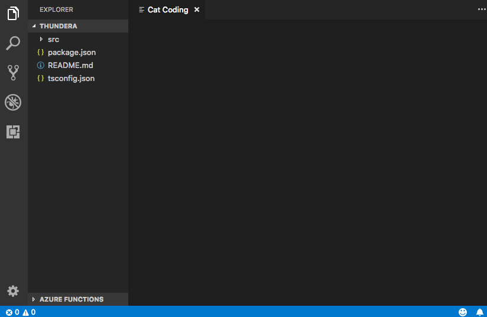
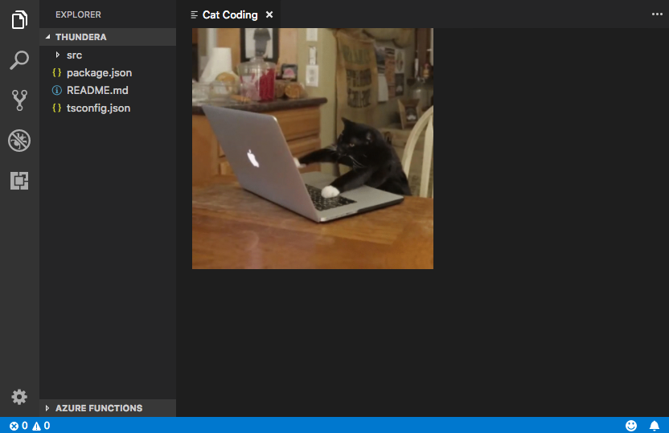
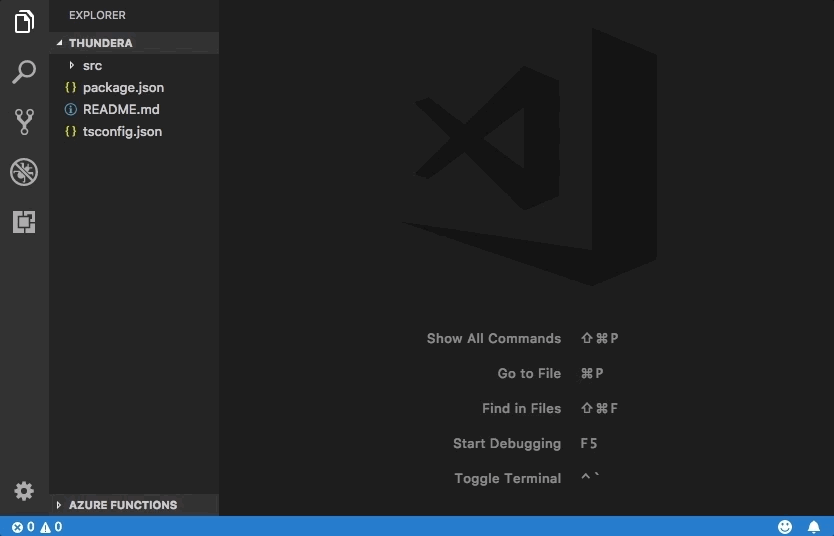
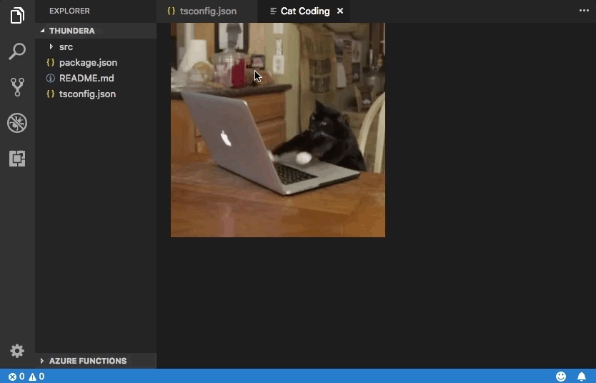
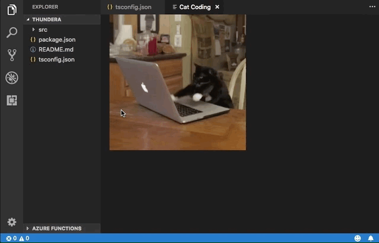
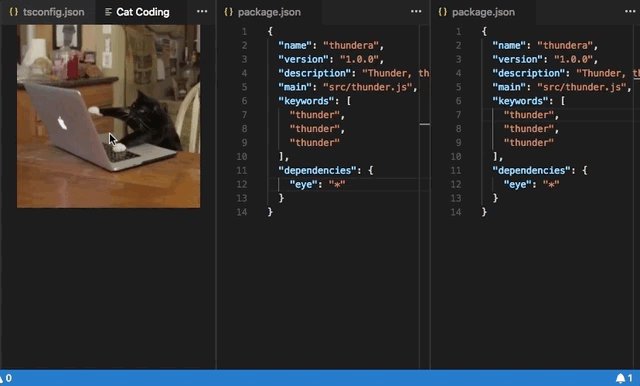
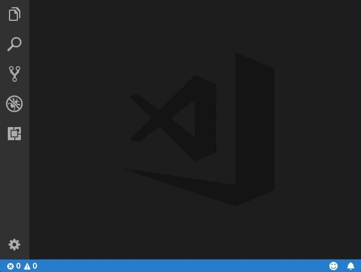
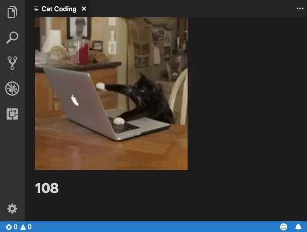
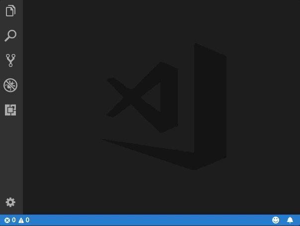

---
# DO NOT TOUCH — Managed by doc writer
ContentId: adddd33e-2de6-4146-853b-34d0d7e6c1f1
DateApproved: 3/30/2023

# Summarize the whole topic in less than 300 characters for SEO purpose
MetaDescription: Use the Webview API to create fully customizable views within Visual Studio Code.
---

# Webview API

The webview API allows extensions to create fully customizable views within Visual Studio Code. For example, the built-in Markdown extension uses webviews to render Markdown previews. Webviews can also be used to build complex user interfaces beyond what VS Code's native APIs support.

Think of a webview as an `iframe` within VS Code that your extension controls. A webview can render almost any HTML content in this frame, and it communicates with extensions using message passing. This freedom makes webviews incredibly powerful, and opens up a whole new range of extension possibilities.

Webviews are used in several VS Code APIs:

- With Webview Panels created using `createWebviewPanel`. In this case, Webview panels are shown in VS Code as distinct editors. This makes them useful for displaying custom UI and custom visualizations.
- As the view for a [custom editor](/api/extension-guides/custom-editors). Custom editors allow extensions to provide a custom UI for editing any file in the workspace. The custom editor API also lets your extension hook into editor events such as undo and redo, as well as file events such as save.
- In [Webview views](/api/references/vscode-api#WebviewView) that are rendered in the sidebar or panel areas. See the [webview view sample extension](https://github.com/microsoft/vscode-extension-samples/tree/main/webview-view-sample) for more details.

This page focuses on the basic webview panel API, although almost everything covered here applies to the webviews used in custom editors and webview views as well. Even if you are more interested in those APIs, we recommend reading through this page first to familiarize yourself with the webview basics.

## Links

- [Webview sample](https://github.com/microsoft/vscode-extension-samples/blob/main/webview-sample/README.md)
- [Custom Editors documentation](/api/extension-guides/custom-editors)
- [Webview View sample](https://github.com/microsoft/vscode-extension-samples/tree/main/webview-view-sample)

### VS Code API Usage

- [`window.createWebviewPanel`](/api/references/vscode-api#window.createWebviewPanel)
- [`window.registerWebviewPanelSerializer`](/api/references/vscode-api#window.registerWebviewPanelSerializer)

## Should I use a webview?

Webviews are pretty amazing, but they should also be used sparingly and only when VS Code's native API is inadequate. Webviews are resource heavy and run in a separate context from normal extensions. A poorly designed webview can also easily feel out of place within VS Code.

Before using a webview, please consider the following:

- Does this functionality really need to live within VS Code? Would it be better as a separate application or website?

- Is a webview the only way to implement your feature? Can you use the regular VS Code APIs instead?

- Will your webview add enough user value to justify its high resource cost?

Remember: Just because you can do something with webviews, doesn't mean you should. However, if you are confident that you need to use webviews, then this document is here to help. Let's get started.

## Webviews API basics

To explain the webview API, we are going to build a simple extension called **Cat Coding**. This extension will use a webview to show a gif of a cat writing some code (presumably in VS Code). As we work through the API, we'll continue adding functionality to the extension, including a counter that keeps track of how many lines of source code our cat has written and notifications that inform the user when the cat introduces a bug.

Here's the `package.json` for the first version of the **Cat Coding** extension. You can find the complete code for the example app [here](https://github.com/microsoft/vscode-extension-samples/blob/main/webview-sample/README.md). The first version of our extension [contributes a command](/api/references/contribution-points#contributes.commands) called `catCoding.start`. When a user invokes this command, we will show a simple webview with our cat in it. Users will be able to invoke this command from the **Command Palette** as **Cat Coding: Start new cat coding session** or even create a keybinding for it if they are so inclined.

```json
{
  "name": "cat-coding",
  "description": "Cat Coding",
  "version": "0.0.1",
  "publisher": "bierner",
  "engines": {
    "vscode": "^1.74.0"
  },
  "activationEvents": [],
  "main": "./out/src/extension",
  "contributes": {
    "commands": [
      {
        "command": "catCoding.start",
        "title": "Start new cat coding session",
        "category": "Cat Coding"
      }
    ]
  },
  "scripts": {
    "vscode:prepublish": "tsc -p ./",
    "compile": "tsc -watch -p ./",
    "postinstall": "node ./node_modules/vscode/bin/install"
  },
  "dependencies": {
    "vscode": "*"
  },
  "devDependencies": {
    "@types/node": "^9.4.6",
    "typescript": "^2.8.3"
  }
}
```

> **Note**: If your extension targets a VS Code version prior to 1.74, you must explicitly list `onCommand:catCoding.start` in `activationEvents`.

Now let's implement the `catCoding.start` command. In our extension's main file, we register the `catCoding.start` command and use it to show a basic webview:

```ts
import * as vscode from 'vscode';

export function activate(context: vscode.ExtensionContext) {
  context.subscriptions.push(
    vscode.commands.registerCommand('catCoding.start', () => {
      // Create and show a new webview
      const panel = vscode.window.createWebviewPanel(
        'catCoding', // Identifies the type of the webview. Used internally
        'Cat Coding', // Title of the panel displayed to the user
        vscode.ViewColumn.One, // Editor column to show the new webview panel in.
        {} // Webview options. More on these later.
      );
    })
  );
}
```

The `vscode.window.createWebviewPanel` function creates and shows a webview in the editor. Here is what you see if you try running the `catCoding.start` command in its current state:



Our command opens a new webview panel with the correct title, but with no content! To add our cat to new panel, we also need to set the HTML content of the webview using `webview.html`:

```ts
import * as vscode from 'vscode';

export function activate(context: vscode.ExtensionContext) {
  context.subscriptions.push(
    vscode.commands.registerCommand('catCoding.start', () => {
      // Create and show panel
      const panel = vscode.window.createWebviewPanel(
        'catCoding',
        'Cat Coding',
        vscode.ViewColumn.One,
        {}
      );

      // And set its HTML content
      panel.webview.html = getWebviewContent();
    })
  );
}

function getWebviewContent() {
  return `<!DOCTYPE html>
<html lang="en">
<head>
    <meta charset="UTF-8">
    <meta name="viewport" content="width=device-width, initial-scale=1.0">
    <title>Cat Coding</title>
</head>
<body>
    
</body>
</html>`;
}
```

If you run the command again, now the webview looks like this:



Progress!

`webview.html` should always be a complete HTML document. HTML fragments or malformed HTML may cause unexpected behavior.

### Updating webview content

`webview.html` can also update a webview's content after it has been created. Let's use this to make **Cat Coding** more dynamic by introducing a rotation of cats:

```ts
import * as vscode from 'vscode';

const cats = {
  'Coding Cat': 'https://media.giphy.com/media/JIX9t2j0ZTN9S/giphy.gif',
  'Compiling Cat': 'https://media.giphy.com/media/mlvseq9yvZhba/giphy.gif'
};

export function activate(context: vscode.ExtensionContext) {
  context.subscriptions.push(
    vscode.commands.registerCommand('catCoding.start', () => {
      const panel = vscode.window.createWebviewPanel(
        'catCoding',
        'Cat Coding',
        vscode.ViewColumn.One,
        {}
      );

      let iteration = 0;
      const updateWebview = () => {
        const cat = iteration++ % 2 ? 'Compiling Cat' : 'Coding Cat';
        panel.title = cat;
        panel.webview.html = getWebviewContent(cat);
      };

      // Set initial content
      updateWebview();

      // And schedule updates to the content every second
      setInterval(updateWebview, 1000);
    })
  );
}

function getWebviewContent(cat: keyof typeof cats) {
  return `<!DOCTYPE html>
<html lang="en">
<head>
    <meta charset="UTF-8">
    <meta name="viewport" content="width=device-width, initial-scale=1.0">
    <title>Cat Coding</title>
</head>
<body>
    
</body>
</html>`;
}
```



Setting `webview.html` replaces the entire webview content, similar to reloading an iframe. This is important to remember once you start using scripts in a webview, since it means that setting `webview.html` also resets the script's state.

The example above also uses `webview.title` to change the title of the document displayed in the editor. Setting the title does not cause the webview to be reloaded.

### Lifecycle

Webview panels are owned by the extension that creates them. The extension must hold onto the webview returned from `createWebviewPanel`. If your extension loses this reference, it cannot regain access to that webview again, even though the webview will continue to show in VS Code.

As with text editors, a user can also close a webview panel at any time. When a webview panel is closed by the user, the webview itself is destroyed. Attempting to use a destroyed webview throws an exception. This means that the example above using `setInterval` actually has an important bug: if the user closes the panel, `setInterval` will continue to fire, which will try to update `panel.webview.html`, which of course will throw an exception. Cats hate exceptions. Let's fix this!

The `onDidDispose` event is fired when a webview is destroyed. We can use this event to cancel further updates and clean up the webview's resources:

```ts
import * as vscode from 'vscode';

const cats = {
  'Coding Cat': 'https://media.giphy.com/media/JIX9t2j0ZTN9S/giphy.gif',
  'Compiling Cat': 'https://media.giphy.com/media/mlvseq9yvZhba/giphy.gif'
};

export function activate(context: vscode.ExtensionContext) {
  context.subscriptions.push(
    vscode.commands.registerCommand('catCoding.start', () => {
      const panel = vscode.window.createWebviewPanel(
        'catCoding',
        'Cat Coding',
        vscode.ViewColumn.One,
        {}
      );

      let iteration = 0;
      const updateWebview = () => {
        const cat = iteration++ % 2 ? 'Compiling Cat' : 'Coding Cat';
        panel.title = cat;
        panel.webview.html = getWebviewContent(cat);
      };

      updateWebview();
      const interval = setInterval(updateWebview, 1000);

      panel.onDidDispose(
        () => {
          // When the panel is closed, cancel any future updates to the webview content
          clearInterval(interval);
        },
        null,
        context.subscriptions
      );
    })
  );
}
```

Extensions can also programmatically close webviews by calling `dispose()` on them. If, for example, we wanted to restrict our cat's workday to five seconds:

```ts
export function activate(context: vscode.ExtensionContext) {
  context.subscriptions.push(
    vscode.commands.registerCommand('catCoding.start', () => {
      const panel = vscode.window.createWebviewPanel(
        'catCoding',
        'Cat Coding',
        vscode.ViewColumn.One,
        {}
      );

      panel.webview.html = getWebviewContent(cats['Coding Cat']);

      // After 5sec, programmatically close the webview panel
      const timeout = setTimeout(() => panel.dispose(), 5000);

      panel.onDidDispose(
        () => {
          // Handle user closing panel before the 5sec have passed
          clearTimeout(timeout);
        },
        null,
        context.subscriptions
      );
    })
  );
}
```

### Visibility and Moving

When a webview panel is moved into a background tab, it becomes hidden. It is not destroyed however. VS Code will automatically restore the webview's content from `webview.html` when the panel is brought to the foreground again:



The `.visible` property tells you if the webview panel is currently visible or not.

Extensions can programmatically bring a webview panel to the foreground by calling `reveal()`. This method takes an optional target view column to show the panel in. A webview panel may only show in a single editor column at a time. Calling `reveal()` or dragging a webview panel to a new editor column moves the webview into that new column.


Let's update our extension to only allow a single webview to exist at a time. If the panel is in the background, then the `catCoding.start` command will bring it to the foreground:

```ts
export function activate(context: vscode.ExtensionContext) {
  // Track currently webview panel
  let currentPanel: vscode.WebviewPanel | undefined = undefined;

  context.subscriptions.push(
    vscode.commands.registerCommand('catCoding.start', () => {
      const columnToShowIn = vscode.window.activeTextEditor
        ? vscode.window.activeTextEditor.viewColumn
        : undefined;

      if (currentPanel) {
        // If we already have a panel, show it in the target column
        currentPanel.reveal(columnToShowIn);
      } else {
        // Otherwise, create a new panel
        currentPanel = vscode.window.createWebviewPanel(
          'catCoding',
          'Cat Coding',
          columnToShowIn,
          {}
        );
        currentPanel.webview.html = getWebviewContent('Coding Cat');

        // Reset when the current panel is closed
        currentPanel.onDidDispose(
          () => {
            currentPanel = undefined;
          },
          null,
          context.subscriptions
        );
      }
    })
  );
}
```

Here's the new extension in action:



Whenever a webview's visibility changes, or when a webview is moved into a new column, the `onDidChangeViewState` event is fired. Our extension can use this event to change cats based on which column the webview is showing in:

```ts
const cats = {
  'Coding Cat': 'https://media.giphy.com/media/JIX9t2j0ZTN9S/giphy.gif',
  'Compiling Cat': 'https://media.giphy.com/media/mlvseq9yvZhba/giphy.gif',
  'Testing Cat': 'https://media.giphy.com/media/3oriO0OEd9QIDdllqo/giphy.gif'
};

export function activate(context: vscode.ExtensionContext) {
  context.subscriptions.push(
    vscode.commands.registerCommand('catCoding.start', () => {
      const panel = vscode.window.createWebviewPanel(
        'catCoding',
        'Cat Coding',
        vscode.ViewColumn.One,
        {}
      );
      panel.webview.html = getWebviewContent('Coding Cat');

      // Update contents based on view state changes
      panel.onDidChangeViewState(
        e => {
          const panel = e.webviewPanel;
          switch (panel.viewColumn) {
            case vscode.ViewColumn.One:
              updateWebviewForCat(panel, 'Coding Cat');
              return;

            case vscode.ViewColumn.Two:
              updateWebviewForCat(panel, 'Compiling Cat');
              return;

            case vscode.ViewColumn.Three:
              updateWebviewForCat(panel, 'Testing Cat');
              return;
          }
        },
        null,
        context.subscriptions
      );
    })
  );
}

function updateWebviewForCat(panel: vscode.WebviewPanel, catName: keyof typeof cats) {
  panel.title = catName;
  panel.webview.html = getWebviewContent(catName);
}
```



### Inspecting and debugging webviews

The **Developer: Toggle Developer Tools** command opens a [Developer Tools](https://developer.chrome.com/docs/devtools/) window that you can use debug and inspect your webviews.


Note that if you are using a version of VS Code older than 1.56, or if you are trying to debug a webview that sets `enableFindWidget`, you must instead use the **Developer: Open Webview Developer Tools** command. This command opens a dedicated Developer Tools page for each webview instead of using a Developer Tools page that is shared by all webviews and the editor itself.

From the Developer Tools, you can start inspecting the contents of your webview using the inspect tool located in the top left corner of the Developer Tools window:


You can also view all of the errors and logs from your webview in the developer tools console:


To evaluate an expression in the context of your webview, make sure to select the **active frame** environment from the dropdown in the top left corner of the Developer tools console panel:


The **active frame** environment is where the webview scripts themselves are executed.

In addition, the **Developer: Reload Webview** command reloads all active webviews. This can be helpful if you need to reset a webview's state, or if some webview content on disk has changed and you want the new content to be loaded.

## Loading local content

Webviews run in isolated contexts that cannot directly access local resources. This is done for security reasons. This means that in order to load images, stylesheets, and other resources from your extension, or to load any content from the user's current workspace, you must use the `Webview.asWebviewUri` function to convert a local `file:` URI into a special URI that VS Code can use to load a subset of local resources.

Imagine that we want to start bundling the cat gifs into our extension rather pulling them from Giphy. To do this, we first create a URI to the file on disk and then pass these URIs through the `asWebviewUri` function:

```ts
import * as vscode from 'vscode';

export function activate(context: vscode.ExtensionContext) {
  context.subscriptions.push(
    vscode.commands.registerCommand('catCoding.start', () => {
      const panel = vscode.window.createWebviewPanel(
        'catCoding',
        'Cat Coding',
        vscode.ViewColumn.One,
        {}
      );

      // Get path to resource on disk
      const onDiskPath = vscode.Uri.joinPath(context.extensionUri, 'media', 'cat.gif');

      // And get the special URI to use with the webview
      const catGifSrc = panel.webview.asWebviewUri(onDiskPath);

      panel.webview.html = getWebviewContent(catGifSrc);
    })
  );
}
```

If we debug this code, we'd see that the actual value for `catGifSrc` is something like:

```
vscode-resource:/Users/toonces/projects/vscode-cat-coding/media/cat.gif
```

VS Code understands this special URI and will use it to load our gif from the disk!

By default, webviews can only access resources in the following locations:

- Within your extension's install directory.
- Within the user's currently active workspace.

Use the `WebviewOptions.localResourceRoots` to allow access to additional local resources.

You can also always use data URIs to embed resources directly within the webview.

### Controlling access to local resources

Webviews can control which resources can be loaded from the user's machine with `localResourceRoots` option. `localResourceRoots` defines a set of root URIs from which local content may be loaded.

We can use `localResourceRoots` to restrict **Cat Coding** webviews to only load resources from a `media` directory in our extension:

```ts
import * as vscode from 'vscode';

export function activate(context: vscode.ExtensionContext) {
  context.subscriptions.push(
    vscode.commands.registerCommand('catCoding.start', () => {
      const panel = vscode.window.createWebviewPanel(
        'catCoding',
        'Cat Coding',
        vscode.ViewColumn.One,
        {
          // Only allow the webview to access resources in our extension's media directory
          localResourceRoots: [
            vscode.Uri.joinPath(context.extensionPath, 'media')
          ]
        }
      );

      const onDiskPath = vscode.Uri.joinPath(context.extensionUri, 'media', 'cat.gif');
      const catGifSrc = panel.webview.asWebviewUri(onDiskPath);

      panel.webview.html = getWebviewContent(catGifSrc);
    })
  );
}
```

To disallow all local resources, just set `localResourceRoots` to `[]`.

In general, webviews should be as restrictive as possible in loading local resources. However, keep in mind that `localResourceRoots` does not offer complete security protection on its own. Make sure your webview also follows [security best practices](#security), and add a [content security policy](#content-security-policy) to further restrict the content that can be loaded.

### Theming webview content

Webview can use CSS to change their appearance based on VS Code's current theme. VS Code groups themes into three categories, and adds a special class to the `body` element to indicate the current theme:

- `vscode-light` - Light themes.
- `vscode-dark` - Dark themes.
- `vscode-high-contrast` - High contrast themes.

The following CSS changes the text color of the webview based on the user's current theme:

```css
body.vscode-light {
  color: black;
}

body.vscode-dark {
  color: white;
}

body.vscode-high-contrast {
  color: red;
}
```

When developing a webview application, make sure that it works for the three types of themes. And always test your webview in high-contrast mode to make sure it will be usable by people with visual disabilities.

Webviews can also access VS Code theme colors using [CSS variables](https://developer.mozilla.org/docs/Web/CSS/Using_CSS_variables). These variable names are prefixed with `vscode` and replace the `.` with `-`. For example `editor.foreground` becomes `var(--vscode-editor-foreground)`:

```css
code {
  color: var(--vscode-editor-foreground);
}
```

Review the [Theme Color Reference](/api/references/theme-color) for the available theme variables. [An extension](https://marketplace.visualstudio.com/items?itemName=connor4312.css-theme-completions) is available which provides IntelliSense suggestions for the variables.

The following font related variables are also defined:

- `--vscode-editor-font-family` - Editor font family (from the `editor.fontFamily` setting).
- `--vscode-editor-font-weight` - Editor font weight (from the `editor.fontWeight` setting).
- `--vscode-editor-font-size` - Editor font size (from the `editor.fontSize` setting).

Finally, for special cases where you need to write CSS that targets a single theme, the body element of webviews has a data attribute called `vscode-theme-id` that stores the ID of the currently active theme. This lets you write theme-specific CSS for webviews:

```css
body[data-vscode-theme-id="One Dark Pro"] {
    background: hotpink;
}
```

### Supported media formats

Webviews support audio and video, however not every media codec or media file container type is supported.

The following audio formats can be used in Webviews:

- Wav
- Mp3
- Ogg
- Flac

The following video formats can be used in webviews:

- H.264
- VP8

For video files, make sure that both the video and audio track's media formats are supported. Many `.mp4` files for example use `H.264` for video and `AAC` audio. VS Code will be able to play the video part of the `mp4`, but since `AAC` audio is not supported there won't be any sound. Instead you need to use `mp3` for the audio track.

## Scripts and message passing

Webviews are just like iframes, which means that they can also run scripts. JavaScript is disabled in webviews by default, but it can easily re-enable by passing in the `enableScripts: true` option.

Let's use a script to add a counter tracking the lines of source code our cat has written. Running a basic script is pretty simple, but note that this example is only for demonstration purposes. In practice, your webview should always disable inline scripts using a [content security policy](#content-security-policy):

```ts
import * as path from 'path';
import * as vscode from 'vscode';

export function activate(context: vscode.ExtensionContext) {
  context.subscriptions.push(
    vscode.commands.registerCommand('catCoding.start', () => {
      const panel = vscode.window.createWebviewPanel(
        'catCoding',
        'Cat Coding',
        vscode.ViewColumn.One,
        {
          // Enable scripts in the webview
          enableScripts: true
        }
      );

      panel.webview.html = getWebviewContent();
    })
  );
}

function getWebviewContent() {
  return `<!DOCTYPE html>
<html lang="en">
<head>
    <meta charset="UTF-8">
    <meta name="viewport" content="width=device-width, initial-scale=1.0">
    <title>Cat Coding</title>
</head>
<body>
    
    <h1 id="lines-of-code-counter">0</h1>

    <script>
        const counter = document.getElementById('lines-of-code-counter');

        let count = 0;
        setInterval(() => {
            counter.textContent = count++;
        }, 100);
    </script>
</body>
</html>`;
}
```



Wow! that's one productive cat.

Webview scripts can do just about anything that a script on a normal webpage can. Keep in mind though that webviews exist in their own context, so scripts in a webview do not have access to the VS Code API. That's where message passing comes in!

### Passing messages from an extension to a webview

An extension can send data to its webviews using `webview.postMessage()`. This method sends any JSON serializable data to the webview. The message is received inside the webview through the standard `message` event.

To demonstrate this, let's add a new command to **Cat Coding** that instructs the currently coding cat to refactor their code (thereby reducing the total number of lines). The new `catCoding.doRefactor` command use `postMessage` to send the instruction to the current webview, and `window.addEventListener('message', event => { ... })` inside the webview itself to handle the message:

```ts
export function activate(context: vscode.ExtensionContext) {
  // Only allow a single Cat Coder
  let currentPanel: vscode.WebviewPanel | undefined = undefined;

  context.subscriptions.push(
    vscode.commands.registerCommand('catCoding.start', () => {
      if (currentPanel) {
        currentPanel.reveal(vscode.ViewColumn.One);
      } else {
        currentPanel = vscode.window.createWebviewPanel(
          'catCoding',
          'Cat Coding',
          vscode.ViewColumn.One,
          {
            enableScripts: true
          }
        );
        currentPanel.webview.html = getWebviewContent();
        currentPanel.onDidDispose(
          () => {
            currentPanel = undefined;
          },
          undefined,
          context.subscriptions
        );
      }
    })
  );

  // Our new command
  context.subscriptions.push(
    vscode.commands.registerCommand('catCoding.doRefactor', () => {
      if (!currentPanel) {
        return;
      }

      // Send a message to our webview.
      // You can send any JSON serializable data.
      currentPanel.webview.postMessage({ command: 'refactor' });
    })
  );
}

function getWebviewContent() {
  return `<!DOCTYPE html>
<html lang="en">
<head>
    <meta charset="UTF-8">
    <meta name="viewport" content="width=device-width, initial-scale=1.0">
    <title>Cat Coding</title>
</head>
<body>
    
    <h1 id="lines-of-code-counter">0</h1>

    <script>
        const counter = document.getElementById('lines-of-code-counter');

        let count = 0;
        setInterval(() => {
            counter.textContent = count++;
        }, 100);

        // Handle the message inside the webview
        window.addEventListener('message', event => {

            const message = event.data; // The JSON data our extension sent

            switch (message.command) {
                case 'refactor':
                    count = Math.ceil(count * 0.5);
                    counter.textContent = count;
                    break;
            }
        });
    </script>
</body>
</html>`;
}
```



### Passing messages from a webview to an extension

Webviews can also pass messages back to their extension. This is accomplished using a `postMessage` function on a special VS Code API object inside the webview. To access the VS Code API object, call `acquireVsCodeApi` inside the webview. This function can only be invoked once per session. You must hang onto the instance of the VS Code API returned by this method, and hand it out to any other functions that need to use it.

We can use the VS Code API and `postMessage` in our **Cat Coding** webview to alert the extension when our cat introduces a bug in their code:

```js
export function activate(context: vscode.ExtensionContext) {
  context.subscriptions.push(
    vscode.commands.registerCommand('catCoding.start', () => {
      const panel = vscode.window.createWebviewPanel(
        'catCoding',
        'Cat Coding',
        vscode.ViewColumn.One,
        {
          enableScripts: true
        }
      );

      panel.webview.html = getWebviewContent();

      // Handle messages from the webview
      panel.webview.onDidReceiveMessage(
        message => {
          switch (message.command) {
            case 'alert':
              vscode.window.showErrorMessage(message.text);
              return;
          }
        },
        undefined,
        context.subscriptions
      );
    })
  );
}

function getWebviewContent() {
  return `<!DOCTYPE html>
<html lang="en">
<head>
    <meta charset="UTF-8">
    <meta name="viewport" content="width=device-width, initial-scale=1.0">
    <title>Cat Coding</title>
</head>
<body>
    
    <h1 id="lines-of-code-counter">0</h1>

    <script>
        (function() {
            const vscode = acquireVsCodeApi();
            const counter = document.getElementById('lines-of-code-counter');

            let count = 0;
            setInterval(() => {
                counter.textContent = count++;

                // Alert the extension when our cat introduces a bug
                if (Math.random() < 0.001 * count) {
                    vscode.postMessage({
                        command: 'alert',
                        text: '🐛  on line ' + count
                    })
                }
            }, 100);
        }())
    </script>
</body>
</html>`;
}
```



For security reasons, you must keep the VS Code API object private and make sure it is never leaked into the global scope.

### Using Web Workers

[Web Workers](https://developer.mozilla.org/docs/Web/API/Web_Workers_API/Using_web_workers) are supported inside of webviews but there are a few important restrictions to be aware of.

First off, workers can only be loaded using either a `data:` or `blob:` URI. You cannot directly load a worker from your extension's folder.

If you do need to load worker code from a JavaScript file in your extension, try using `fetch`:

```js
const workerSource = 'absolute/path/to/worker.js';

fetch(workerSource)
  .then(result => result.blob())
  .then(blob => {
    const blobUrl = URL.createObjectURL(blob)
    new Worker(blobUrl);
  });
```

Worker scripts also do not support importing source code using `importScripts` or `import(...)`. If your worker loads code dynamically, try using a bundler such as [webpack](https://webpack.js.org) to package the worker script into a single file.

With `webpack`, you can use `LimitChunkCountPlugin` to force the compiled worker JavaScript to be a single file:

```js
const path = require('path');
const webpack = require('webpack');

module.exports = {
  target: 'webworker',
  entry: './worker/src/index.js',
  output: {
    filename: 'worker.js',
    path: path.resolve(__dirname, 'media'),
  },
  plugins: [
    new webpack.optimize.LimitChunkCountPlugin({
      maxChunks: 1,
    }),
  ],
};
```

## Security

As with any webpage, when creating a webview, you must follow some basic security best practices.

### Limit capabilities

A webview should have the minimum set of capabilities that it needs. For example, if your webview does not need to run scripts, do not set the `enableScripts: true`. If your webview does not need to load resources from the user's workspace, set `localResourceRoots` to `[vscode.Uri.file(extensionContext.extensionPath)]` or even `[]` to disallow access to all local resources.

### Content security policy

[Content security policies](https://developers.google.com/web/fundamentals/security/csp/) further restrict the content that can be loaded and executed in webviews. For example, a content security policy can make sure that only a list of allowed scripts can be run in the webview, or even tell the webview to only load images over `https`.

To add a content security policy, put a `<meta http-equiv="Content-Security-Policy">` directive at the top of the webview's `<head>`

```ts
function getWebviewContent() {
  return `<!DOCTYPE html>
<html lang="en">
<head>
    <meta charset="UTF-8">

    <meta http-equiv="Content-Security-Policy" content="default-src 'none';">

    <meta name="viewport" content="width=device-width, initial-scale=1.0">

    <title>Cat Coding</title>
</head>
<body>
    ...
</body>
</html>`;
}
```

The policy `default-src 'none';` disallows all content. We can then turn back on the minimal amount of content that our extension needs to function. Here's a content security policy that allows loading local scripts and stylesheets, and loading images over `https`:

```html
<meta
  http-equiv="Content-Security-Policy"
  content="default-src 'none'; img-src ${webview.cspSource} https:; script-src ${webview.cspSource}; style-src ${webview.cspSource};"
/>
```

The `${webview.cspSource}` value is a placeholder for a value that comes from the webview object itself. See the [webview sample](https://github.com/microsoft/vscode-extension-samples/blob/main/webview-sample) for a complete example of how to use this value.

This content security policy also implicitly disables inline scripts and styles. It is a best practice to extract all inline styles and scripts to external files so that they can be properly loaded without relaxing the content security policy.

### Only load content over https

If your webview allows loading external resources, it is strongly recommended that you only allow these resources to be loaded over `https` and not over http. The example content security policy above already does this by only allowing images to be loaded over `https:`.

### Sanitize all user input

Just as you would for a normal webpage, when constructing the HTML for a webview, you must sanitize all user input. Failing to properly sanitize input can allow content injections, which may open your users up to a security risk.

Example values that must be sanitized:

- File contents.
- File and folder paths.
- User and workspace settings.

Consider using a helper library to construct your HTML strings, or at least ensure that all content from the user's workspace is properly sanitized.

Never rely on sanitization alone for security. Make sure to follow the other security best practices, such as having a [content security policy](#content-security-policy) to minimize the impact of any potential content injections.

## Persistence

In the standard webview [lifecycle](#lifecycle), webviews are created by `createWebviewPanel` and destroyed when the user closes them or when `.dispose()` is called. The contents of webviews however are created when the webview becomes visible and destroyed when the webview is moved into the background. Any state inside the webview will be lost when the webview is moved to a background tab.

The best way to solve this is to make your webview stateless. Use [message passing](#passing-messages-from-a-webview-to-an-extension) to save off the webview's state and then restore the state when the webview becomes visible again.

### getState and setState

Scripts running inside a webview can use the `getState` and `setState` methods to save off and restore a JSON serializable state object. This state is persisted even after the webview content itself is destroyed when a webview panel becomes hidden. The state is destroyed when the webview panel is destroyed.

```js
// Inside a webview script
const vscode = acquireVsCodeApi();

const counter = document.getElementById('lines-of-code-counter');

// Check if we have an old state to restore from
const previousState = vscode.getState();
let count = previousState ? previousState.count : 0;
counter.textContent = count;

setInterval(() => {
  counter.textContent = count++;
  // Update the saved state
  vscode.setState({ count });
}, 100);
```

`getState` and `setState` are the preferred way to persist state, as they have much lower performance overhead than `retainContextWhenHidden`.

### Serialization

By implementing a `WebviewPanelSerializer`, your webviews can be automatically restored when VS Code restarts. Serialization builds on `getState` and `setState`, and is only enabled if your extension registers a `WebviewPanelSerializer` for your webviews.

To make our coding cats persist across VS Code restarts, first add a `onWebviewPanel` activation event to the extension's `package.json`:

```json
"activationEvents": [
    ...,
    "onWebviewPanel:catCoding"
]
```

This activation event ensures that our extension will be activated whenever VS Code needs to restore a webview with the viewType: `catCoding`.

Then, in our extension's `activate` method, call `registerWebviewPanelSerializer` to register a new `WebviewPanelSerializer`. The `WebviewPanelSerializer` is responsible for restoring the contents of the webview from its persisted state. This state is the JSON blob that the webview contents set using `setState`.

```ts
export function activate(context: vscode.ExtensionContext) {
  // Normal setup...

  // And make sure we register a serializer for our webview type
  vscode.window.registerWebviewPanelSerializer('catCoding', new CatCodingSerializer());
}

class CatCodingSerializer implements vscode.WebviewPanelSerializer {
  async deserializeWebviewPanel(webviewPanel: vscode.WebviewPanel, state: any) {
    // `state` is the state persisted using `setState` inside the webview
    console.log(`Got state: ${state}`);

    // Restore the content of our webview.
    //
    // Make sure we hold on to the `webviewPanel` passed in here and
    // also restore any event listeners we need on it.
    webviewPanel.webview.html = getWebviewContent();
  }
}
```

Now if you restart VS Code with a cat coding panel open, the panel will be automatically restored in the same editor position.

### retainContextWhenHidden

For webviews with very complex UI or state that cannot be quickly saved and restored, you can instead use the `retainContextWhenHidden` option. This option makes a webview keep its content around but in a hidden state, even when the webview itself is no longer in the foreground.

Although **Cat Coding** can hardly be said to have complex state, let's try enabling `retainContextWhenHidden` to see how the option changes a webview's behavior:

```ts
import * as vscode from 'vscode';

export function activate(context: vscode.ExtensionContext) {
  context.subscriptions.push(
    vscode.commands.registerCommand('catCoding.start', () => {
      const panel = vscode.window.createWebviewPanel(
        'catCoding',
        'Cat Coding',
        vscode.ViewColumn.One,
        {
          enableScripts: true,
          retainContextWhenHidden: true
        }
      );
      panel.webview.html = getWebviewContent();
    })
  );
}

function getWebviewContent() {
  return `<!DOCTYPE html>
<html lang="en">
<head>
    <meta charset="UTF-8">
    <meta name="viewport" content="width=device-width, initial-scale=1.0">
    <title>Cat Coding</title>
</head>
<body>
    
    <h1 id="lines-of-code-counter">0</h1>

    <script>
        const counter = document.getElementById('lines-of-code-counter');

        let count = 0;
        setInterval(() => {
            counter.textContent = count++;
        }, 100);
    </script>
</body>
</html>`;
}
```


Notice how the counter does not reset now when the webview is hidden and then restored. No extra code required! With `retainContextWhenHidden`, the webview acts similarly to a background tab in a web browser. Scripts and other dynamic content are suspended, but immediately resumed once the webview becomes visible again. You cannot send messages to a hidden webview, even when `retainContextWhenHidden` is enabled.

Although `retainContextWhenHidden` may be appealing, keep in mind that this has high memory overhead and should only be used when other persistence techniques will not work.

## Accessibility

The class `vscode-using-screen-reader` will be added to your webview's main body in contexts where the user is operating VS Code with a screen reader. Additionally, the class `vscode-reduce-motion` will be added to the document's main body element in cases where the user has expressed a preference to reduce the amount of motion in the window. By observing these classes and adjusting your rendering accordingly, your webview content can better reflect the user's preferences.

## Next steps

If you'd like to learn more about VS Code extensibility, try these topics:

- [Extension API](/api) - Learn about the full VS Code Extension API.
- [Extension Capabilities](/api/extension-capabilities/overview) - Take a look at other ways to extend VS Code.
