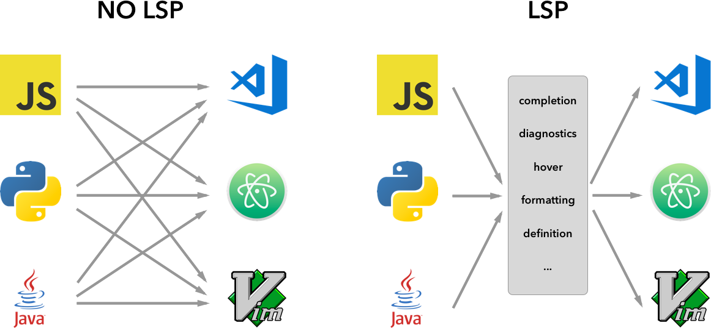
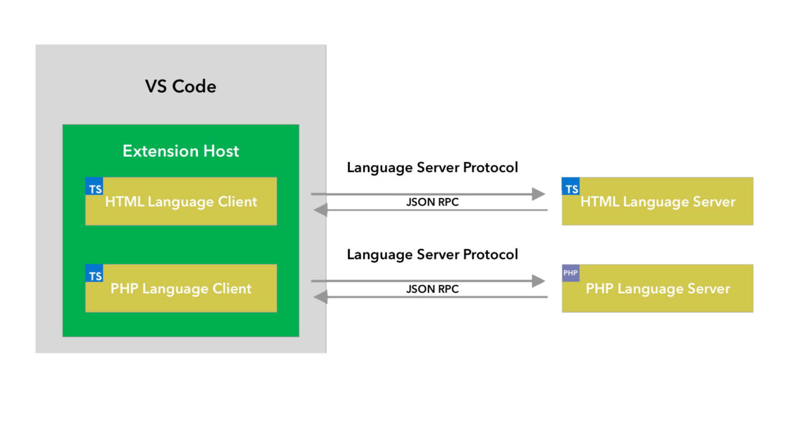
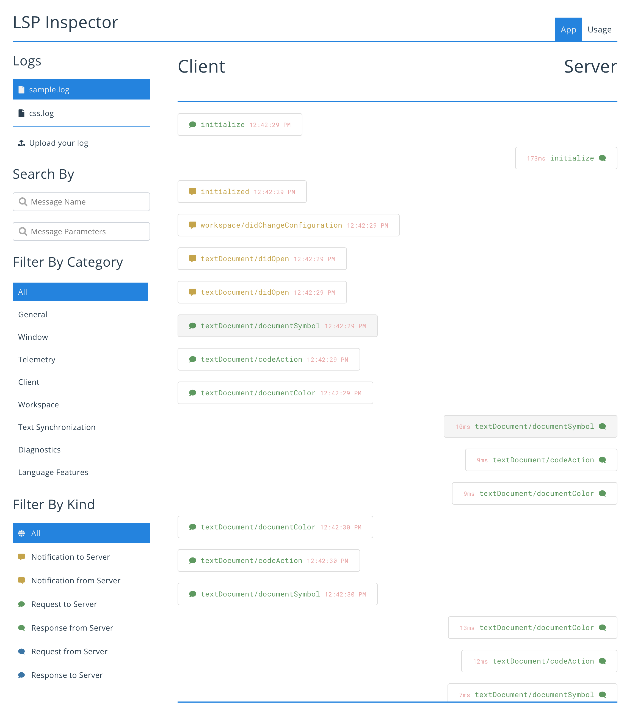
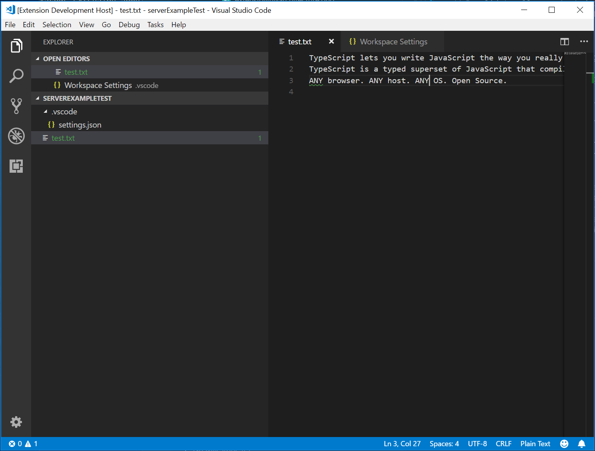

---
# DO NOT TOUCH — Managed by doc writer
ContentId: A8CBE8D6-1FEE-47BF-B81E-D79FA0DB5D03
DateApproved: 7/3/2019

# Summarize the whole topic in less than 300 characters for SEO purpose
MetaDescription: Learn how to create Language Servers to provide rich language features in Visual Studio Code.
---

# Language Server Extension Guide

As you have seen in the [Programmatic Language Features](/api/language-extensions/programmatic-language-features) topic, it's possible to implement Language Features by directly using `languages.*` API. Language Server Extension, however, provides an alternative way of implementing such language support.

This topic:

- Explains the benefits of Language Server Extension.
- Walks you through building a Language Server using the [`Microsoft/vscode-languageserver-node`](https://github.com/Microsoft/vscode-languageserver-node) library. You can also jump directly to the code in [lsp-sample](https://github.com/Microsoft/vscode-extension-samples/tree/master/lsp-sample).

## Why Language Server?

Language Server is a special kind of Visual Studio Code extension that powers the editing experience for many programming languages. With Language Servers, you can implement autocomplete, error-checking (diagnostics), jump-to-definition and many other [language features](/api/language-extensions/programmatic-language-features) supported in VS Code.

However, while implementing support for language features in VS Code, we found three common problems:

First, Language Servers are usually implemented in their native programming languages, and that presents a challenge in integrating them with VS Code which has a Node.js runtime.

Additionally, language features can be resource intensive. For example, to correctly validate a file, Language Server needs to parse a large amount of files, build up Abstract Syntax Trees for them and perform static program analysis. Those operations could incur significant CPU and memory usage and we need to ensure that VS Code's performance remains unaffected.

Finally, integrating multiple language toolings with multiple code editors could involve significant effort. From language toolings' perspective, they need to adapt to code editors with different APIs. From code editors' perspective, they cannot expect any uniform API from language toolings. This makes implementing language support for `M` languages in `N` code editors the work of `M * N`.

To solve those problems, Microsoft specified [Language Server Protocol](https://microsoft.github.io/language-server-protocol) which standardizes the communication between language tooling and code editor. This way, Language Servers can be implemented in any language and run in their own process to avoid performance cost, as they communicate with the code editor through the Language Server Protocol. Furthermore, any LSP-compliant language toolings can integrate with multiple LSP-compliant code editors, and any LSP-compliant code editors can easily pickup multiple LSP-compliant language toolings. LSP is a win for both language tooling providers and code editor vendors!



In this guide, we will:

- Explain how to build a Language Server extension in VS Code using the provided [Node SDK](https://github.com/Microsoft/vscode-languageserver-node).
- Explain how to run, debug, log and test the Language Server extension.
- Point you to some advanced topics on Language Servers.

## Implementing a Language Server

### Overview

In VS Code, a language server has two parts:

- Language Client: A normal VS Code extension written in JavaScript / TypeScript. This extension has access to all [VS Code Namespace API](/api/references/vscode-api).
- Language Server: A language analysis tool running in a separate process.

As briefly stated above there are two benefits of running the Language Server in a separate process:

- The analysis tool can be implemented in any languages, as long as it can communicate with the Language Client following the Language Server Protocol.
- As language analysis tools are often heavy on CPU and Memory usage, running them in separate process avoids performance cost.

Here is an illustration of VS Code running two Language Server extensions. The HTML Language Client and PHP Language Client are normal VS Code extensions written in TypeScript. Each of them instantiates a corresponding Language Server and communicates with them through LSP. Although the PHP Language Server is written in PHP, it can still communicate with the PHP Language Client through LSP.



This guide will teach you how to build a Language Client / Server using our [Node SDK](https://github.com/Microsoft/vscode-languageserver-node). The remaining document assumes that you are familiar with VS Code [Extension API](/api).

### LSP Sample - A simple Language Server for plain text files

Let's build a simple Language Server extension that implements autocomplete and diagnostics for plain text files. We will also cover the syncing of configurations between Client / Server.

If you prefer to jump right into the code:

- **[lsp-sample](https://github.com/Microsoft/vscode-extension-samples/tree/master/lsp-sample)**: Heavily documented source code for this guide.
- **[lsp-multi-server-sample](https://github.com/Microsoft/vscode-extension-samples/tree/master/lsp-multi-server-sample)**: A heavily documented, advanced version of **lsp-sample** that starts a different server instance per workspace folder to support the [multi-root workspace](/docs/editor/multi-root-workspaces) feature in VS Code.

Clone the repository [Microsoft/vscode-extension-samples](https://github.com/Microsoft/vscode-extension-samples) and open the sample:

```bash
> git clone https://github.com/Microsoft/vscode-extension-samples.git
> cd vscode-extension-samples/lsp-sample
> npm install
> npm run compile
> code .
```

The above installs all dependencies and opens the **lsp-sample** workspace containing both the client and server code. Here is a rough overview of the structure of **lsp-sample**:

```
.
├── client // Language Client
│   ├── src
│   │   ├── test // End to End tests for Language Client / Server
│   │   └── extension.ts // Language Client entry point
├── package.json // The extension manifest
└── server // Language Server
    └── src
        └── server.ts // Language Server entry point
```

### Explaining the 'Language Client'

Let's first take a look at `/package.json`, which describes the capabilities of the Language Client. There are three interesting sections:

First look the [`activationEvents`](/api/references/activation-events):

```json
"activationEvents": [
    "onLanguage:plaintext"
]
```

This section tells VS Code to activate the extension as soon as a plain text file is opened (e.g. a file with the extension `.txt`).

Next look at the [`configuration`](/api/references/contribution-points#contributes.configuration) section:

```json
"configuration": {
    "type": "object",
    "title": "Example configuration",
    "properties": {
        "languageServerExample.maxNumberOfProblems": {
            "scope": "resource",
            "type": "number",
            "default": 100,
            "description": "Controls the maximum number of problems produced by the server."
        }
    }
}
```

This section contributes `configuration` settings to VS Code. The example will explain how these settings are sent over to the language server on startup and on every change of the settings.

The actual Language Client code and the corresponding `package.json` is in the `/client` folder. The interesting part in the `/client/package.json` file is that it adds a dependency to the `vscode` extension host API and the `vscode-languageclient` library:

```json
"dependencies": {
    "vscode": "^1.1.18",
    "vscode-languageclient": "^4.1.4"
}
```

As mentioned, the client is implemented as a normal VS Code extension, and it has access to all VS Code namespace API.

Below is the content of the corresponding extension.ts file, which is the entry of the **lsp-sample** extension:

```typescript
import * as path from 'path';
import { workspace, ExtensionContext } from 'vscode';

import {
  LanguageClient,
  LanguageClientOptions,
  ServerOptions,
  TransportKind
} from 'vscode-languageclient';

let client: LanguageClient;

export function activate(context: ExtensionContext) {
  // The server is implemented in node
  let serverModule = context.asAbsolutePath(path.join('server', 'out', 'server.js'));
  // The debug options for the server
  // --inspect=6009: runs the server in Node's Inspector mode so VS Code can attach to the server for debugging
  let debugOptions = { execArgv: ['--nolazy', '--inspect=6009'] };

  // If the extension is launched in debug mode then the debug server options are used
  // Otherwise the run options are used
  let serverOptions: ServerOptions = {
    run: { module: serverModule, transport: TransportKind.ipc },
    debug: {
      module: serverModule,
      transport: TransportKind.ipc,
      options: debugOptions
    }
  };

  // Options to control the language client
  let clientOptions: LanguageClientOptions = {
    // Register the server for plain text documents
    documentSelector: [{ scheme: 'file', language: 'plaintext' }],
    synchronize: {
      // Notify the server about file changes to '.clientrc files contained in the workspace
      fileEvents: workspace.createFileSystemWatcher('**/.clientrc')
    }
  };

  // Create the language client and start the client.
  client = new LanguageClient(
    'languageServerExample',
    'Language Server Example',
    serverOptions,
    clientOptions
  );

  // Start the client. This will also launch the server
  client.start();
}

export function deactivate(): Thenable<void> {
  if (!client) {
    return undefined;
  }
  return client.stop();
}
```

### Explaining the 'Language Server'

> **Note:** The 'Server' implementation cloned from the GitHub repository has the final walkthrough implementation. To follow the walkthrough, you can create a new `server.ts` or modify the contents of the cloned version.

In the example, the server is also implemented in TypeScript and executed using Node.js. Since VS Code already ships with a Node.js runtime, there is no need to provide your own, unless you have very specific requirements for the runtime.

The source code for the Language Server is at `/server`. The interesting section in the server's `package.json` file is:

```json
"dependencies": {
    "vscode-languageserver": "^4.1.3"
}
```

This pulls in the `vscode-languageserver` library.

Below is a server implementation that uses the provided simple text document manager which synchronizes text documents by always sending the file's full content from VS Code to the server.

```typescript
import {
  createConnection,
  TextDocuments,
  TextDocument,
  Diagnostic,
  DiagnosticSeverity,
  ProposedFeatures,
  InitializeParams,
  DidChangeConfigurationNotification,
  CompletionItem,
  CompletionItemKind,
  TextDocumentPositionParams
} from 'vscode-languageserver';

// Create a connection for the server. The connection uses Node's IPC as a transport.
// Also include all preview / proposed LSP features.
let connection = createConnection(ProposedFeatures.all);

// Create a simple text document manager. The text document manager
// supports full document sync only
let documents: TextDocuments = new TextDocuments();

let hasConfigurationCapability: boolean = false;
let hasWorkspaceFolderCapability: boolean = false;
let hasDiagnosticRelatedInformationCapability: boolean = false;

connection.onInitialize((params: InitializeParams) => {
  let capabilities = params.capabilities;

  // Does the client support the `workspace/configuration` request?
  // If not, we will fall back using global settings
  hasConfigurationCapability =
    capabilities.workspace && !!capabilities.workspace.configuration;
  hasWorkspaceFolderCapability =
    capabilities.workspace && !!capabilities.workspace.workspaceFolders;
  hasDiagnosticRelatedInformationCapability =
    capabilities.textDocument &&
    capabilities.textDocument.publishDiagnostics &&
    capabilities.textDocument.publishDiagnostics.relatedInformation;

  return {
    capabilities: {
      textDocumentSync: documents.syncKind,
      // Tell the client that the server supports code completion
      completionProvider: {
        resolveProvider: true
      }
    }
  };
});

connection.onInitialized(() => {
  if (hasConfigurationCapability) {
    // Register for all configuration changes.
    connection.client.register(DidChangeConfigurationNotification.type, undefined);
  }
  if (hasWorkspaceFolderCapability) {
    connection.workspace.onDidChangeWorkspaceFolders(_event => {
      connection.console.log('Workspace folder change event received.');
    });
  }
});

// The example settings
interface ExampleSettings {
  maxNumberOfProblems: number;
}

// The global settings, used when the `workspace/configuration` request is not supported by the client.
// Please note that this is not the case when using this server with the client provided in this example
// but could happen with other clients.
const defaultSettings: ExampleSettings = { maxNumberOfProblems: 1000 };
let globalSettings: ExampleSettings = defaultSettings;

// Cache the settings of all open documents
let documentSettings: Map<string, Thenable<ExampleSettings>> = new Map();

connection.onDidChangeConfiguration(change => {
  if (hasConfigurationCapability) {
    // Reset all cached document settings
    documentSettings.clear();
  } else {
    globalSettings = <ExampleSettings>(
      (change.settings.languageServerExample || defaultSettings)
    );
  }

  // Revalidate all open text documents
  documents.all().forEach(validateTextDocument);
});

function getDocumentSettings(resource: string): Thenable<ExampleSettings> {
  if (!hasConfigurationCapability) {
    return Promise.resolve(globalSettings);
  }
  let result = documentSettings.get(resource);
  if (!result) {
    result = connection.workspace.getConfiguration({
      scopeUri: resource,
      section: 'languageServerExample'
    });
    documentSettings.set(resource, result);
  }
  return result;
}

// Only keep settings for open documents
documents.onDidClose(e => {
  documentSettings.delete(e.document.uri);
});

// The content of a text document has changed. This event is emitted
// when the text document first opened or when its content has changed.
documents.onDidChangeContent(change => {
  validateTextDocument(change.document);
});

async function validateTextDocument(textDocument: TextDocument): Promise<void> {
  // In this simple example we get the settings for every validate run.
  let settings = await getDocumentSettings(textDocument.uri);

  // The validator creates diagnostics for all uppercase words length 2 and more
  let text = textDocument.getText();
  let pattern = /\b[A-Z]{2,}\b/g;
  let m: RegExpExecArray;

  let problems = 0;
  let diagnostics: Diagnostic[] = [];
  while ((m = pattern.exec(text)) && problems < settings.maxNumberOfProblems) {
    problems++;
    let diagnostic: Diagnostic = {
      severity: DiagnosticSeverity.Warning,
      range: {
        start: textDocument.positionAt(m.index),
        end: textDocument.positionAt(m.index + m[0].length)
      },
      message: `${m[0]} is all uppercase.`,
      source: 'ex'
    };
    if (hasDiagnosticRelatedInformationCapability) {
      diagnostic.relatedInformation = [
        {
          location: {
            uri: textDocument.uri,
            range: Object.assign({}, diagnostic.range)
          },
          message: 'Spelling matters'
        },
        {
          location: {
            uri: textDocument.uri,
            range: Object.assign({}, diagnostic.range)
          },
          message: 'Particularly for names'
        }
      ];
    }
    diagnostics.push(diagnostic);
  }

  // Send the computed diagnostics to VS Code.
  connection.sendDiagnostics({ uri: textDocument.uri, diagnostics });
}

connection.onDidChangeWatchedFiles(_change => {
  // Monitored files have change in VS Code
  connection.console.log('We received an file change event');
});

// This handler provides the initial list of the completion items.
connection.onCompletion(
  (_textDocumentPosition: TextDocumentPositionParams): CompletionItem[] => {
    // The pass parameter contains the position of the text document in
    // which code complete got requested. For the example we ignore this
    // info and always provide the same completion items.
    return [
      {
        label: 'TypeScript',
        kind: CompletionItemKind.Text,
        data: 1
      },
      {
        label: 'JavaScript',
        kind: CompletionItemKind.Text,
        data: 2
      }
    ];
  }
);

// This handler resolves additional information for the item selected in
// the completion list.
connection.onCompletionResolve(
  (item: CompletionItem): CompletionItem => {
    if (item.data === 1) {
      item.detail = 'TypeScript details';
      item.documentation = 'TypeScript documentation';
    } else if (item.data === 2) {
      item.detail = 'JavaScript details';
      item.documentation = 'JavaScript documentation';
    }
    return item;
  }
);

/*
connection.onDidOpenTextDocument((params) => {
    // A text document got opened in VS Code.
    // params.uri uniquely identifies the document. For documents store on disk this is a file URI.
    // params.text the initial full content of the document.
    connection.console.log(`${params.textDocument.uri} opened.`);
});
connection.onDidChangeTextDocument((params) => {
    // The content of a text document did change in VS Code.
    // params.uri uniquely identifies the document.
    // params.contentChanges describe the content changes to the document.
    connection.console.log(`${params.textDocument.uri} changed: ${JSON.stringify(params.contentChanges)}`);
});
connection.onDidCloseTextDocument((params) => {
    // A text document got closed in VS Code.
    // params.uri uniquely identifies the document.
    connection.console.log(`${params.textDocument.uri} closed.`);
});
*/

// Make the text document manager listen on the connection
// for open, change and close text document events
documents.listen(connection);

// Listen on the connection
connection.listen();
```

### Adding a Simple Validation

To add document validation to the server, we add a listener to the text document manager that gets called whenever the content of a text document changes. It is then up to the server to decide when the best time is to validate a document. In the example implementation, the server validates the plain text document and flags all occurrences of words that use ALL CAPS. The corresponding code snippet looks like this:

```typescript
// The content of a text document has changed. This event is emitted
// when the text document first opened or when its content has changed.
documents.onDidChangeContent(async (change) => {
    // In this simple example we get the settings for every validate run.
    let settings = await getDocumentSettings(textDocument.uri);

    // The validator creates diagnostics for all uppercase words length 2 and more
    let text = textDocument.getText();
    let pattern = /\b[A-Z]{2,}\b/g;
    let m: RegExpExecArray;

    let problems = 0;
    let diagnostics: Diagnostic[] = [];
    while ((m = pattern.exec(text))) {
        problems++;
        let diagnostic: Diagnostic = {
            severity: DiagnosticSeverity.Warning,
            range: {
                start: textDocument.positionAt(m.index),
                end: textDocument.positionAt(m.index + m[0].length)
            },
            message: `${m[0]} is all uppercase.`,
            source: 'ex'
        };
        if (hasDiagnosticRelatedInformationCapability) {
            diagnostic.relatedInformation = [
                {
                    location: {
                        uri: textDocument.uri,
                        range: Object.assign({}, diagnostic.range)
                    },
                    message: 'Spelling matters'
                },
                {
                    location: {
                        uri: textDocument.uri,
                        range: Object.assign({}, diagnostic.range)
                    },
                    message: 'Particularly for names'
                }
            ];
        }
        diagnostics.push(diagnostic);
    }

    // Send the computed diagnostics to VS Code.
    connection.sendDiagnostics({ uri: textDocument.uri, diagnostics });
}
```

### Diagnostics Tips and Tricks

- If the start and end positions are the same, VS Code will underline with a squiggle the word at that position.
- If you want to underline with a squiggle until the end of the line, then set the character of the end position to Number.MAX_VALUE.

To run the Language Server, do the following:

- press `kb(workbench.action.tasks.build)` to start the build task. The task compiles both the client and the server.
- open the debug viewlet, select the `Launch Client` launch configuration and press the `Start Debugging` button to launch an additional `Extension Development Host` instance of VS Code that executes the extension code.
- Create a test.txt file in the root folder and paste the following content:

```bash
TypeScript lets you write JavaScript the way you really want to.
TypeScript is a typed superset of JavaScript that compiles to plain JavaScript.
ANY browser. ANY host. ANY OS. Open Source.
```

The `Extension Development Host` instance will then look like this:


### Debugging both Client and Server

Debugging the client code is as easy as debugging a normal extension. Set a breakpoint in the client code and debug the extension by pressing `kb(workbench.action.debug.start)`.


Since the server is started by the `LanguageClient` running in the extension (client), we need to attach a debugger to the running server. To do so, switch to the Debug view and select the launch configuration `Attach to Server` and press `kb(workbench.action.debug.start)`. This will attach the debugger to the server.


### Logging Support for Language Server

If you are using `vscode-languageclient` to implement the client, you can specify a setting `[langId].trace.server` that instructs the Client to log communications between Language Client / Server to a channel of the Language Client's `name`.

For **lsp-sample**, you can set this setting: `"languageServerExample.trace.server": "verbose"`. Now head to the channel "Language Server Example". You should see the logs:


As Language Servers can be chatty (5 seconds of real-world usage can produce 5000 lines of log), we also provide a tool to visualize and filter the communication between Language Client / Server. You can save all logs from the channel into a file, and load that file with the [Language Server Protocol Inspector](https://github.com/Microsoft/language-server-protocol-inspector) at [https://microsoft.github.io/language-server-protocol/inspector](https://microsoft.github.io/language-server-protocol/inspector).



### Using Configuration Settings in the Server

When writing the client part of the extension, we already defined a setting to control the maximum numbers of problems reported. We also wrote code on the server side to read these settings from the client:

```typescript
function getDocumentSettings(resource: string): Thenable<ExampleSettings> {
  if (!hasConfigurationCapability) {
    return Promise.resolve(globalSettings);
  }
  let result = documentSettings.get(resource);
  if (!result) {
    result = connection.workspace.getConfiguration({
      scopeUri: resource,
      section: 'languageServerExample'
    });
    documentSettings.set(resource, result);
  }
  return result;
}
```

The only thing we need to do now is to listen to configuration changes on the server side and if a settings changes, revalidate the open text documents. To be able to reuse the validate logic of the document change event handling, we extract the code into a `validateTextDocument` function and modify the code to honor a `maxNumberOfProblems` variable:

```typescript
async function validateTextDocument(textDocument: TextDocument): Promise<void> {
  // In this simple example we get the settings for every validate run.
  let settings = await getDocumentSettings(textDocument.uri);

  // The validator creates diagnostics for all uppercase words length 2 and more
  let text = textDocument.getText();
  let pattern = /\b[A-Z]{2,}\b/g;
  let m: RegExpExecArray;

  let problems = 0;
  let diagnostics: Diagnostic[] = [];
  while ((m = pattern.exec(text)) && problems < settings.maxNumberOfProblems) {
    problems++;
    let diagnostic: Diagnostic = {
      severity: DiagnosticSeverity.Warning,
      range: {
        start: textDocument.positionAt(m.index),
        end: textDocument.positionAt(m.index + m[0].length)
      },
      message: `${m[0]} is all uppercase.`,
      source: 'ex'
    };
    if (hasDiagnosticRelatedInformationCapability) {
      diagnostic.relatedInformation = [
        {
          location: {
            uri: textDocument.uri,
            range: Object.assign({}, diagnostic.range)
          },
          message: 'Spelling matters'
        },
        {
          location: {
            uri: textDocument.uri,
            range: Object.assign({}, diagnostic.range)
          },
          message: 'Particularly for names'
        }
      ];
    }
    diagnostics.push(diagnostic);
  }

  // Send the computed diagnostics to VS Code.
  connection.sendDiagnostics({ uri: textDocument.uri, diagnostics });
}
```

The handling of the configuration change is done by adding a notification handler for configuration changes to the connection. The corresponding code looks like this:

```typescript
connection.onDidChangeConfiguration(change => {
  if (hasConfigurationCapability) {
    // Reset all cached document settings
    documentSettings.clear();
  } else {
    globalSettings = <ExampleSettings>(
      (change.settings.languageServerExample || defaultSettings)
    );
  }

  // Revalidate all open text documents
  documents.all().forEach(validateTextDocument);
});
```

Starting the client again and changing the setting to maximum report 1 problem results in the following validation:



### Adding additional Language Features

The first interesting feature a language server usually implements is validation of documents. In that sense, even a linter counts as a language server and in VS Code linters are usually implemented as language servers (see [eslint](https://github.com/Microsoft/vscode-eslint) and [jshint](https://github.com/Microsoft/vscode-jshint) for examples). But there is more to language servers. They can provide code completion, Find All References or Go To Definition. The example code below adds code completion to the server. It proposes the two words 'TypeScript' and 'JavaScript'.

```typescript
// This handler provides the initial list of the completion items.
connection.onCompletion(
  (_textDocumentPosition: TextDocumentPositionParams): CompletionItem[] => {
    // The pass parameter contains the position of the text document in
    // which code complete got requested. For the example we ignore this
    // info and always provide the same completion items.
    return [
      {
        label: 'TypeScript',
        kind: CompletionItemKind.Text,
        data: 1
      },
      {
        label: 'JavaScript',
        kind: CompletionItemKind.Text,
        data: 2
      }
    ];
  }
);

// This handler resolves additional information for the item selected in
// the completion list.
connection.onCompletionResolve(
  (item: CompletionItem): CompletionItem => {
    if (item.data === 1) {
      item.detail = 'TypeScript details';
      item.documentation = 'TypeScript documentation';
    } else if (item.data === 2) {
      item.detail = 'JavaScript details';
      item.documentation = 'JavaScript documentation';
    }
    return item;
  }
);
```

The `data` fields is used to uniquely identify a completion item in the resolve handler. The data property is transparent for the protocol. Since the underlying message passing protocol is JSON based, the data field should only hold data that is serializable to and from JSON.

All that is missing is to tell VS Code that the server supports code completion requests. To do so, flag the corresponding capability in the initialize handler:

```typescript
connection.onInitialize((params): InitializeResult => {
    ...
    return {
        capabilities: {
            ...
            // Tell the client that the server supports code completion
            completionProvider: {
                resolveProvider: true
            }
        }
    };
});
```

The screen shot below shows the completed code running on a plain text file:


### Testing The Language Server

To create a high-quality Language Server, we need to build a good test suite covering its functionalities. There are two common ways of testing Language Servers:

- Unit Test: This is useful if you want to test specific functionalities in Language Servers by mocking up all the information being sent to it. VS Code's [HTML](https://github.com/Microsoft/vscode-html-languageservice) / [CSS](https://github.com/Microsoft/vscode-css-languageservice) / [JSON](https://github.com/Microsoft/vscode-json-languageservice) Language Servers take this approach to testing. The LSP npm modules itself use the approach. See [here](https://github.com/Microsoft/vscode-languageserver-node/blob/master/protocol/src/test/connection.test.ts) for some unit test written using the npm protocol module.
- End-to-End Test: This is similar to [VS Code extension test](/api/working-with-extensions/testing-extension). The benefit of this approach is that it runs the test by instantiating a VS Code instance with a workspace, opening the file, activating the Language Client / Server and running [VS Code commands](/api/references/commands). This approach is superior if you have files, settings or dependencies (such as `node_modules`) which are hard or impossible to mock. The popular [Python](https://github.com/Microsoft/vscode-python) extension takes this approach to testing.

It is possible to do Unit Test in any testing framework of your choice. Here we describe how to do End-to-End testing for Language Server Extension.

Open `.vscode/launch.json`, and you can find a `E2E` test target:

```json
{
  "name": "Language Server E2E Test",
  "type": "extensionHost",
  "request": "launch",
  "runtimeExecutable": "${execPath}",
  "args": [
    "--extensionDevelopmentPath=${workspaceRoot}",
    "--extensionTestsPath=${workspaceRoot}/client/out/test",
    "${workspaceRoot}/client/testFixture"
  ],
  "stopOnEntry": false,
  "sourceMaps": true,
  "outFiles": ["${workspaceRoot}/client/out/test/**/*.js"]
}
```

If you run this debug target, it will launch a VS Code instance with `client/testFixture` as the active workspace. VS Code will then proceed to execute all tests in `client/src/test`. As a debugging tip, you can set breakpoints in TypeScript files in `client/src/test` and they will be hit.

Let's take a look at the `completion.test.ts` file:

```ts
import * as vscode from 'vscode';
import * as assert from 'assert';
import { getDocUri, activate } from './helper';

describe('Should do completion', () => {
  const docUri = getDocUri('completion.txt');

  it('Completes JS/TS in txt file', async () => {
    await testCompletion(docUri, new vscode.Position(0, 0), {
      items: [
        { label: 'JavaScript', kind: vscode.CompletionItemKind.Text },
        { label: 'TypeScript', kind: vscode.CompletionItemKind.Text }
      ]
    });
  });
});

async function testCompletion(
  docUri: vscode.Uri,
  position: vscode.Position,
  expectedCompletionList: vscode.CompletionList
) {
  await activate(docUri);

  // Executing the command `vscode.executeCompletionItemProvider` to simulate triggering completion
  const actualCompletionList = (await vscode.commands.executeCommand(
    'vscode.executeCompletionItemProvider',
    docUri,
    position
  )) as vscode.CompletionList;

  assert.equal(actualCompletionList.items.length, expectedCompletionList.items.length);
  expectedCompletionList.items.forEach((expectedItem, i) => {
    const actualItem = actualCompletionList.items[i];
    assert.equal(actualItem.label, expectedItem.label);
    assert.equal(actualItem.kind, expectedItem.kind);
  });
}
```

In this test, we:

- Activate the extension.
- Run the command `vscode.executeCompletionItemProvider` with a URI and a position to simulate completion trigger.
- Assert the returned completion items against our expected completion items.

Let's dive a bit deeper into the `activate(docURI)` function. It is defined in `client/src/test/helper.ts`:

```ts
import * as vscode from 'vscode';
import * as path from 'path';

export let doc: vscode.TextDocument;
export let editor: vscode.TextEditor;
export let documentEol: string;
export let platformEol: string;

/**
 * Activates the vscode.lsp-sample extension
 */
export async function activate(docUri: vscode.Uri) {
  // The extensionId is `publisher.name` from package.json
  const ext = vscode.extensions.getExtension('vscode.lsp-sample');
  await ext.activate();
  try {
    doc = await vscode.workspace.openTextDocument(docUri);
    editor = await vscode.window.showTextDocument(doc);
    await sleep(2000); // Wait for server activation
  } catch (e) {
    console.error(e);
  }
}

async function sleep(ms: number) {
  return new Promise(resolve => setTimeout(resolve, ms));
}
```

In the activation part, we:

- Get the extension using the `{publisher.name}.{extensionId}`, as defined in `package.json`.
- Open the specified document, and show it in the active text editor.
- Sleep for 2 seconds, so we are sure the Language Server is instantiated.

After the preparation, we can run the [VS Code Commands](/api/references/commands) corresponding to each language feature, and assert against the returned result.

There is one more test that covers the diagnostics feature that we just implemented. Check it out at `client/src/test/diagnostics.test.ts`.

## Advanced Topics

So far, this guide covered:

- A brief overview of Language Server and Language Server Protocol.
- Architecture of a Language Server extension in VS Code
- The **lsp-sample** extension, and how to develop/debug/inspect/test it.

There are some more advanced topics we could not fit in to this guide. We will include links to these resources for further studying of Language Server development.

### Additional Language Server features

The following language features are currently supported in a language server along with code completions:

- _Document Highlights_: highlights all 'equal' symbols in a text document.
- _Hover_: provides hover information for a symbol selected in a text document.
- _Signature Help_: provides signature help for a symbol selected in a text document.
- _Goto Definition_: provides go to definition support for a symbol selected in a text document.
- _Goto Type Definition_: provides go to type/interface definition support for a symbol selected in a text document.
- _Goto Implementation_: provides go to implementation definition support for a symbol selected in a text document.
- _Find References_: finds all project-wide references for a symbol selected in a text document.
- _List Document Symbols_: lists all symbols defined in a text document.
- _List Workspace Symbols_: lists all project-wide symbols.
- _Code Actions_: compute commands to run (typically beautify/refactor) for a given text document and range.
- _CodeLens_: compute CodeLens statistics for a given text document.
- _Document Formatting_: this includes formatting of whole documents, document ranges and formatting on type.
- _Rename_: project-wide rename of a symbol.
- _Document Links_: compute and resolve links inside a document.
- _Document Colors_: compute and resolve colors inside a document to provide color picker in editor.

The [Programatic Language Features](/api/language-extensions/programmatic-language-features) topic describes each of the language features above and provides guidance on how to implement them either through the language server protocol or by using the extensibility API directly from your extension.

### Incremental Text Document Synchronization

The example uses the simple text document manager provided by the `vscode-languageserver` module to synchronize documents between VS Code and the language server.

This has two drawbacks:

- Lots of data transfer since the whole content of a text document is sent to the server repeatedly.
- If an existing language library is used, such libraries usually support incremental document updates to avoid unnecessary parsing and abstract syntax tree creation.

The protocol therefore supports incremental document synchronization as well.

To make use of incremental document synchronization, a server needs to install three notification handlers:

- _onDidOpenTextDocument_: is called when a text document is opened in VS Code.
- _onDidChangeTextDocument_: is called when the content of a text document changes in VS Code.
- _onDidCloseTextDocument_: is called when a text document is closed in VS Code.

Below is a code snippet that illustrates how to hook these notification handlers on a connection and how to return the right capability on initialize:

```typescript
connection.onInitialize((params): InitializeResult => {
    ...
    return {
        capabilities: {
            // Enable incremental document sync
            textDocumentSync: TextDocumentSyncKind.Incremental,
            ...
        }
    };
});

connection.onDidOpenTextDocument((params) => {
    // A text document was opened in VS Code.
    // params.uri uniquely identifies the document. For documents stored on disk, this is a file URI.
    // params.text the initial full content of the document.
});

connection.onDidChangeTextDocument((params) => {
    // The content of a text document has change in VS Code.
    // params.uri uniquely identifies the document.
    // params.contentChanges describe the content changes to the document.
});

connection.onDidCloseTextDocument((params) => {
    // A text document was closed in VS Code.
    // params.uri uniquely identifies the document.
});
```

### Using VS Code API directly to implement Language Features

While Language Servers have many benefits, they are not the only option for extending the editing capabilities of VS Code. In the cases when you want to add some simple language features for a type of document, consider using `vscode.languages.register[LANGUAGE_FEATURE]Provider` as an option.

Here is a [`completions-sample`](https://github.com/Microsoft/vscode-extension-samples/tree/master/completions-sample) using `vscode.languages.registerCompletionItemProvider` to add a few snippets as completions for plain text files.

More samples illustrating the usage of VS Code API can be found at [https://github.com/Microsoft/vscode-extension-samples](https://github.com/Microsoft/vscode-extension-samples).

### Error Tolerant Parser for Language Server

Most of the time, the code in the editor is incomplete and syntactically incorrect, but developers would still expect autocomplete and other language features to work. Therefore, an error tolerant parser is necessary for a Language Server: The parser generates meaningful AST from partially complete code, and the Language Server provides language features based on the AST.

When we were improving PHP support in VS Code, we realized the official PHP parser is not error tolerant and cannot be reused directly in the Language Server. Therefore, we worked on [Microsoft/tolerant-php-parser](https://github.com/Microsoft/tolerant-php-parser) and left detailed [notes](https://github.com/Microsoft/tolerant-php-parser/blob/master/docs/HowItWorks.md) that might help Language Server authors who need to implement an error tolerant parser.

## Common questions

### When I try to attach to the server, I get "cannot connect to runtime process (timeout after 5000ms)"?

You will see this timeout error if the server isn't running when you try to attach the debugger. The client starts the language server so make sure you have started the client in order to have a running server. You may also need to disable your client breakpoints if they are interfering with starting the server.

### I have read through this guide and the [LSP Specification](https://microsoft.github.io/language-server-protocol/), but I still have unresolved questions. Where can I get help?

Please open an issue at https://github.com/Microsoft/language-server-protocol.
