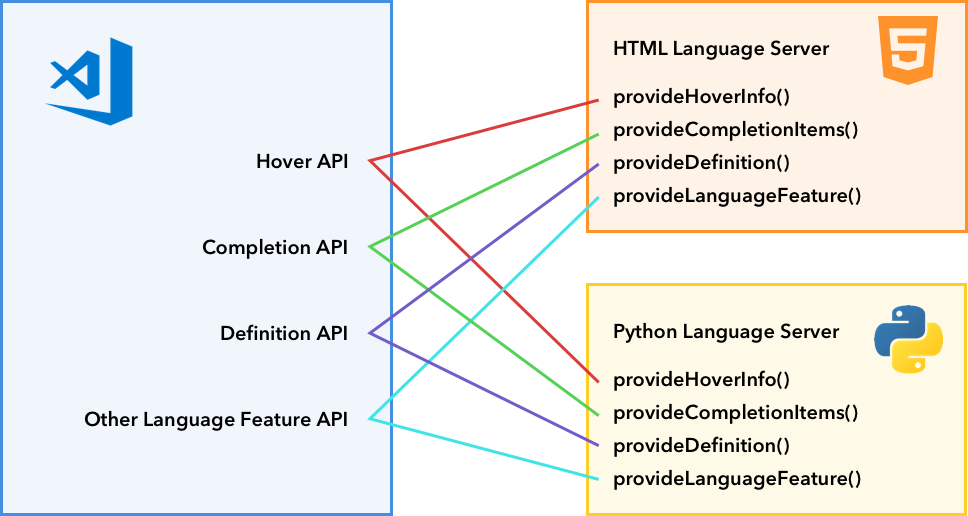
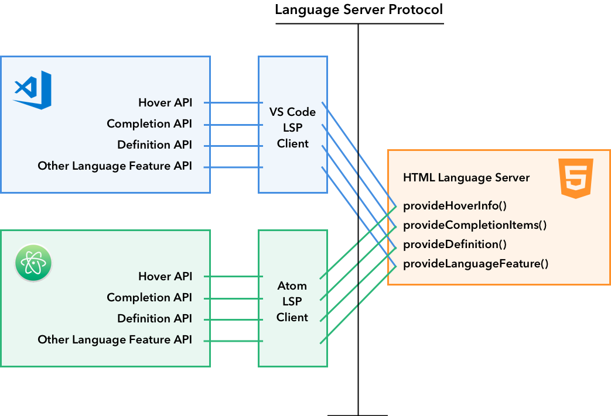

---
# DO NOT TOUCH — Managed by doc writer
ContentId: 8b70dba5-f71d-46dd-8da1-f5d44b9a6a96
DateApproved: 08/01/2024

# Summarize the whole topic in less than 300 characters for SEO purpose
MetaDescription: Learn how to write a Language Extension (plug-in) to add support for a programming language in Visual Studio Code.
---

# Language Extensions Overview

Visual Studio Code provides smart editing features for different programming languages through Language Extensions. VS Code doesn't provide built-in language support but offers a set of APIs that enable rich language features. For example, it has a bundled [HTML](https://github.com/microsoft/vscode/tree/main/extensions/html) extension that allows VS Code to show syntax highlighting for HTML files. Similarly, when you type `console.` and `log` shows up in IntelliSense, it is the [Typescript Language Features](https://github.com/microsoft/vscode/tree/main/extensions/typescript-language-features) extension at work.

Language features can be roughly put into two categories:

## Declarative language features

Declarative language features are defined in configuration files. Examples include [html](https://github.com/microsoft/vscode/tree/main/extensions/html), [css](https://github.com/microsoft/vscode/tree/main/extensions/css) and [typescript-basic](https://github.com/microsoft/vscode/tree/main/extensions/typescript-basics) extensions bundled with VS Code, which offer a subset of the following Declarative Language Features:

- Syntax highlighting
- Snippet completion
- Bracket matching
- Bracket autoclosing
- Bracket autosurrounding
- Comment toggling
- Auto indentation
- Folding (by markers)

We have three guides for writing Language Extensions that provide Declarative Language Features.

- [Syntax Highlight guide](/api/language-extensions/syntax-highlight-guide): VS Code uses TextMate grammar for syntax highlighting. This guide will walk you through writing a simple TextMate grammar and converting it into a VS Code extension.
- [Snippet Completion guide](/api/language-extensions/snippet-guide): This guide explains how to bundle a set of snippets into an extension.
- [Language Configuration guide](/api/language-extensions/language-configuration-guide): VS Code allows extensions to define a **language configuration** for any programming language. This file controls basic editing features such as comment toggling, bracket matching/surrounding and region folding (legacy).

## Programmatic language features

Programmatic Language Features include auto completion, error checking, and jump to definition. These features are often powered by a Language Server, a program that analyzes your project to provide the dynamic features.
One example is the [`typescript-language-features`](https://github.com/microsoft/vscode/tree/main/extensions/typescript-language-features) extension bundled in VS Code. It utilizes the [TypeScript Language Service](https://github.com/microsoft/TypeScript/wiki/Using-the-Language-Service-API) to offer Programmatic Language Features such as:

- Hover information ([`vscode.languages.registerHoverProvider`](/api/references/vscode-api#languages.registerHoverProvider))
- Auto completion ([`vscode.languages.registerCompletionItemProvider`](/api/references/vscode-api#languages.registerCompletionItemProvider))
- Jump to definition ([`vscode.languages.registerDefinitionProvider`](/api/references/vscode-api#languages.registerDefinitionProvider))
- Error checking
- Formatting
- Refactoring
- Folding

Here is a complete list of [Programmatic Language Features](/api/language-extensions/programmatic-language-features).

## Language Server Protocol

By standardizing the communication between a Language Server (a static code analysis tool) and a Language Client (usually a source code editor), the [Language Server Protocol](https://microsoft.github.io/language-server-protocol/) allows extension authors to write one code analysis program and reuse it in multiple editors.

In the [Programmatic Language Features](/api/language-extensions/programmatic-language-features) listing, you can find a listing of all VS Code language features and how they map to the [Language Server Protocol Specification](https://microsoft.github.io/language-server-protocol/specification).

We offer an in-depth guide that explains how to implement a Language Server extension in VS Code:

- [Language Server Extension Guide](/api/language-extensions/language-server-extension-guide)

## Special cases

### Multi-root workspace support

When the user opens a [multi-root workspace](/docs/editor/multi-root-workspaces), you might need to adapt your Language Server extensions accordingly. This topic discusses multiple approaches to supporting multi-root workspaces.

### Embedded languages

Embedded languages are common in web development. For example, CSS/JavaScript inside HTML, and GraphQL inside JavaScript/TypeScript. The [Embedded languages](/api/language-extensions/embedded-languages) topic discusses how you can make language features available to embedded languages.
