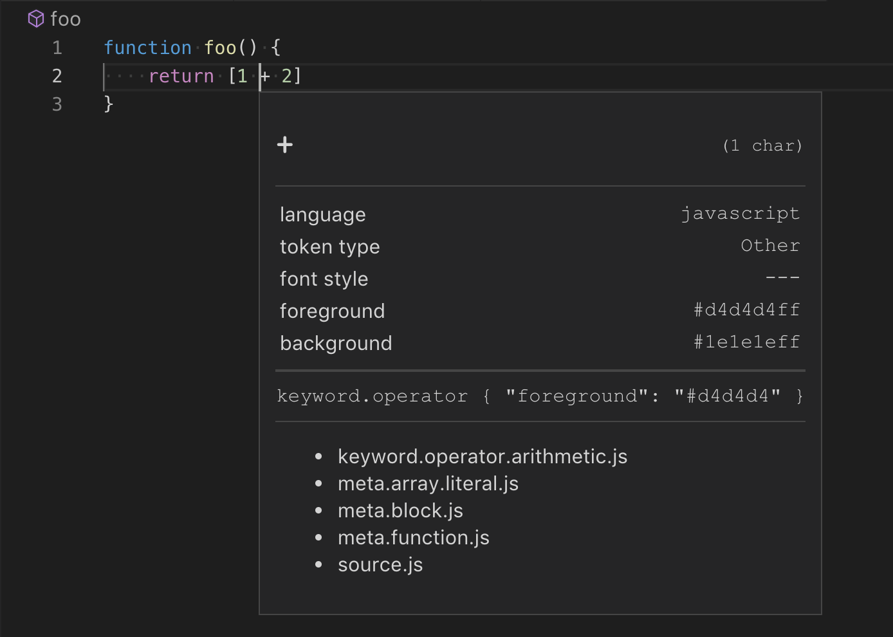
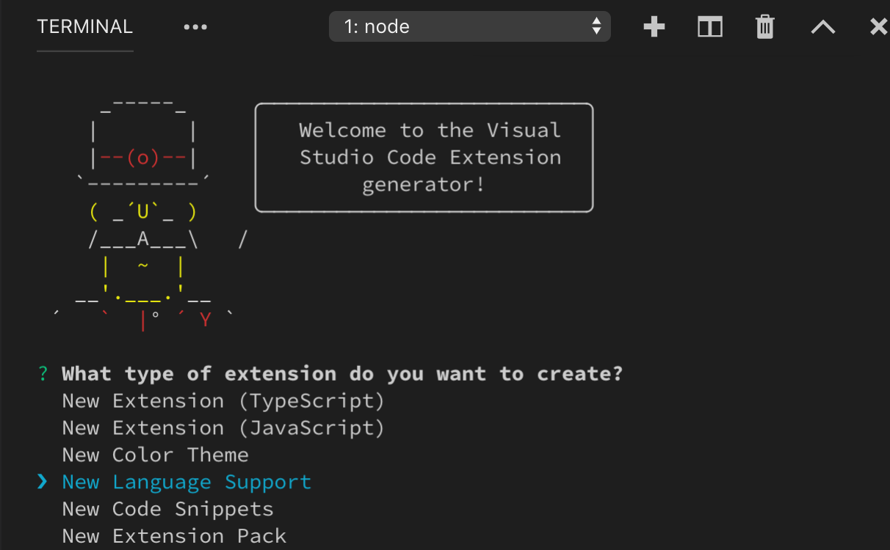
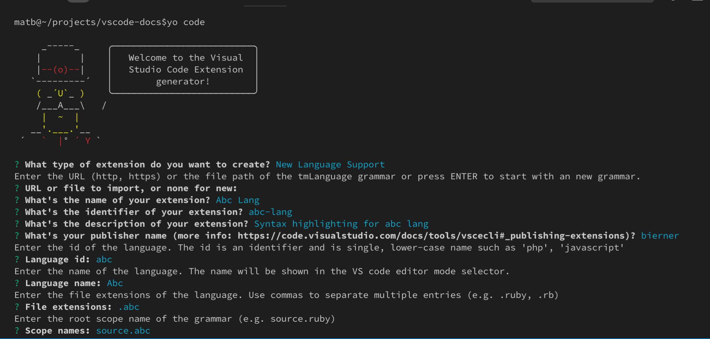
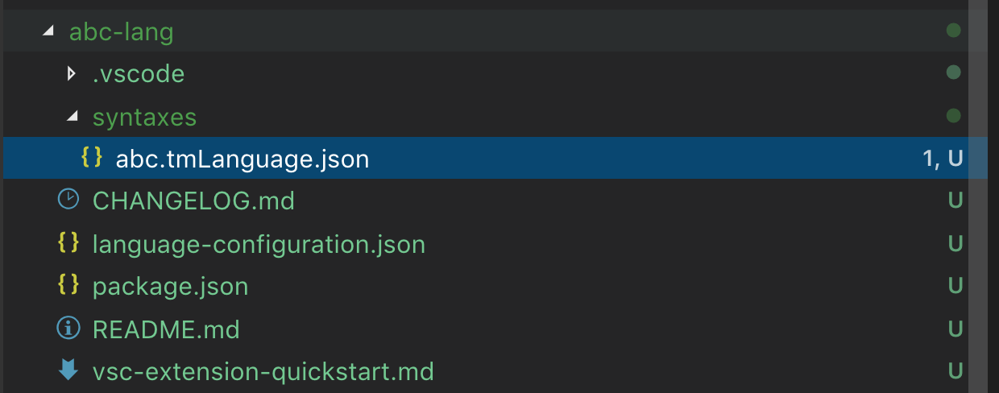
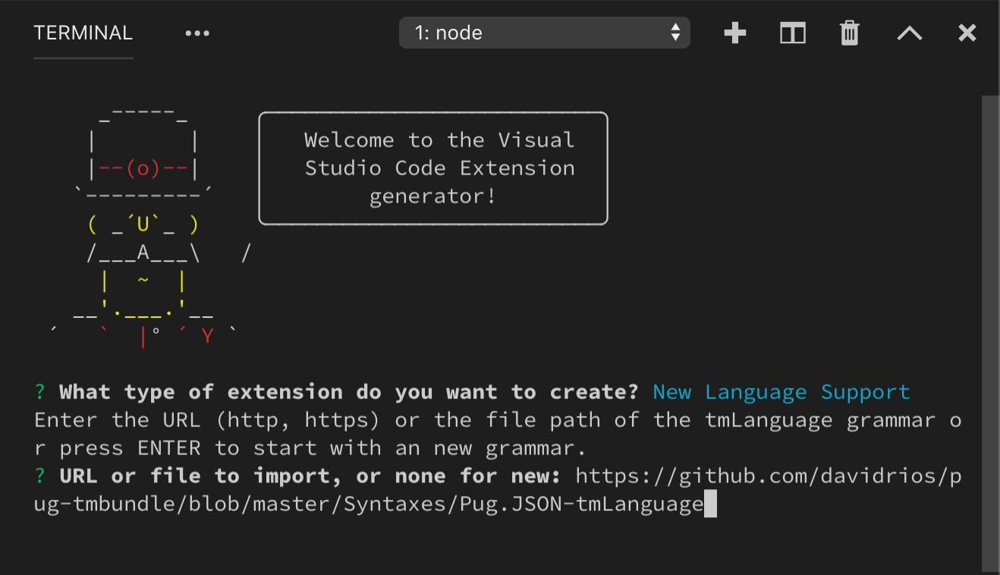
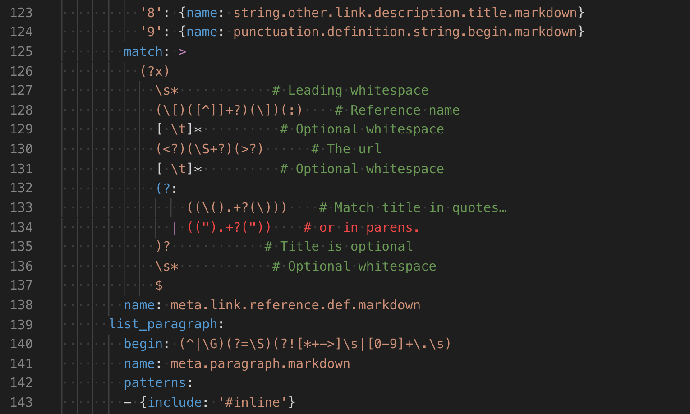

---
# DO NOT TOUCH — Managed by doc writer
ContentId: 2bb06188-d394-4b98-872c-0bf26c8a674d
DateApproved: 7/3/2019

# Summarize the whole topic in less than 300 characters for SEO purpose
MetaDescription: A guide to
---

# Syntax Highlight Guide

Syntax highlighting determines the color and style of source code displayed in the Visual Studio Code editor. It is responsible for colorizing keywords like `if` or `for` in JavaScript differently than strings and comments and variable names.

There are two components to syntax highlighting:

- Breaking text into a list of tokens and scopes using a grammar
- Then using a theme to map these scopes to specific colors and styles

This document only discusses the first part: breaking text into tokens and scopes that existing color themes can colorize. For more information about customizing the styling of different scopes in the editor, see the [Color Theme Guide](/api/extension-guides/color-theme#syntax-colors)

## TextMate grammars

VS Code uses [TextMate grammars][tm-grammars] to break text into a list of tokens. TextMate grammars are a structured collection of [Oniguruma regular expressions](https://macromates.com/manual/en/regular_expressions) and are typically written as a plist or JSON. You can find a good introduction to TextMate grammars [here](https://www.apeth.com/nonblog/stories/textmatebundle.html), and you can take a look at existing TextMate grammars to learn more about how they work.

### Tokens and scopes

Tokens are one or more characters that are part of the same program element. Example tokens include operators such as `+` and `*`, variable names such as `myVar`, or strings such as `"my string"`.

Each token is associated with a scope that defines the context of the token. A scope is a dot separated list of identifiers that specify the context of the current token. The `+` operation in JavaScript for example has the scope `keyword.operator.arithmetic.js`.

Themes map scopes to colors and styles to provide syntax highlighting. TextMate provides [list of common scopes][tm-grammars] that many themes target. In order to have your grammar as broadly supported as possible, try to build on existing scopes rather than defining new ones.

Scopes nest so that each token is also associated with a list of parent scopes. The example below uses the [scope inspector](#scope-inspector) to show the scope hierarchy for the `+` operator in a simple JavaScript function. The most specific scope is listed at the top, with more general parent scopes listed below:



Parent scope information is also used for theming. When a theme targets a scope, all tokens with that parent scope will be colorized unless the theme also provides a more specific colorization for their individual scopes.

### Contributing a basic grammar

VS Code supports json TextMate grammars. These are contributed through the `grammars` [contribution point](/api/references/contribution-points).

Each grammar contribution specifies: the identifier of the language the grammar applies to, the top level scope name for the tokens of the grammar, and the relative path to a grammar file. The example below shows a grammar contribution for a fictional `abc` language:

```json
{
  "contributes": {
    "languages": [
      {
        "id": "abc",
        "extensions": [".abc"]
      }
    ],
    "grammars": [
      {
        "language": "abc",
        "scopeName": "source.abc",
        "path": "./syntaxes/abc.tmGrammar.json"
      }
    ]
  }
}
```

The grammar file itself consists of a top level rule. This is typically split into a `patterns` section that lists the top level elements of the program and a `repository` that defines each of the elements. Other rules in the grammar can reference elements from the `repository` using `{ "include": "#id" }`.

The example `abc` grammar marks the letters `a`, `b`, and `c` as keywords, and nestings of parens as expressions.

```json
{
  "scopeName": "source.abc",
  "patterns": [{ "include": "#expression" }],
  "repository": {
    "expression": {
      "patterns": [{ "include": "#letter" }, { "include": "#paren-expression" }]
    },
    "letter": {
      "match": "a|b|c",
      "name": "keyword.letter"
    },
    "paren-expression": {
      "begin": "\\(",
      "end": "\\)",
      "beginCaptures": {
        "0": { "name": "punctuation.paren.open" }
      },
      "endCaptures": {
        "0": { "name": "punctuation.paren.close" }
      },
      "name": "expression.group",
      "patterns": [{ "include": "#expression" }]
    }
  }
}
```

The grammar engine will try to successively apply the `expression` rule to all text in the document. For a simple program such as:

```
a
(
    b
)
x
(
    (
        c
        xyz
    )
)
(
a
```

The example grammar produces the following scopes (listed left-to-right from most specific to least specific scope):

```
a               keyword.letter, source.abc
(               punctuation.paren.open, expression.group, source.abc
    b           keyword.letter, expression.group, source.abc
)               punctuation.paren.close, expression.group, source.abc
x               source.abc
(               punctuation.paren.open, expression.group, source.abc
    (           punctuation.paren.open, expression.group, expression.group, source.abc
        c       keyword.letter, expression.group, expression.group, source.abc
        xyz     expression.group, expression.group, source.abc
    )           punctuation.paren.close, expression.group, expression.group, source.abc
)               punctuation.paren.close, expression.group, source.abc
(               source.abc
a               keyword.letter, source.abc
```

Note that text that is not matched by one of the rules, such as the string `xyz`, is included in the current scope. The last paren at the end of the file is not part of the an `expression.group` since the `end` rule is not matched.

### Embedded languages

If your grammar include embedded languages within the parent language, such as CSS style blocks in HTML, you can use the `embeddedLanguages` contribution point to tell VS Code to treat the embedded language as distinct from the parent language. This ensures that bracket matching, commenting, and other basic language features work as expected in the embedded language.

The `embeddedLanguages` contribution point maps a scope in the embedded language to a top level language scope. In the example below, any tokens in the `meta.embedded.block.javascript` scope will be treated as javascript content:

```json
{
  "contributes": {
    "grammars": [
      {
        "path": "./syntaxes/abc.tmLanguage.json",
        "scopeName": "source.abc",
        "embeddedLanguages": {
          "meta.embedded.block.javascript": "source.js"
        }
      }
    ]
  }
}
```

Now if you try to comment code or trigger snippets inside an set of tokens marked `meta.embedded.block.javascript`, they will get the correct `//` JavaScript style comment and the correct JavaScript snippets.

## Developing a new grammar extension

To quickly create a new grammar extension, use [VS Code's Yeoman templates](/api/get-started/your-first-extension) to run `yo code` and select the `New Language` option:



Yeoman will walk you through some basic questions to scaffold the new extension. The important questions for creating a new grammar are:

- `Language Id` - A unique identifier for your language.
- `Language Name` - A human readable name for your language.
- `Scope names` - Root TextMate scope name for your grammar



The generator assumes that you want to define both a new language and a new grammar for that language. If you are creating a grammar for an existing language, just fill these in with your target language's information and be sure to delete the `languages` contribution point in the generated `package.json`.

After answering all the questions, Yeoman will create a new extension with the structure:



Remember, if you are contributing a grammar to a language that VS Code already knows about, be sure to delete the `languages` contribution point in the generated `package.json`.

### Converting an existing TextMate grammar

`yo code` can also help convert an existing TextMate grammar to a VS Code extension. Again, start by running `yo code` and selecting `Language extension`. When asked for an existing grammar file, give it the full path to either a `.tmLanguage` or `.json` TextMate grammar file:



### Using YAML to write a grammar

As a grammar grows more complex, it can become difficult to understand and maintain it as json. If you find yourself writing complex regular expressions or needing to add comments to explain aspects of the grammar, consider using yaml to define your grammar instead.

Yaml grammars have the exact same structure as a json based grammar but allow you to use yaml's more concise syntax, along with features such as multi-line strings and comments.



VS Code can only load json grammars, so yaml based grammars must be converted to json. The [`js-yaml` package](https://www.npmjs.com/package/js-yaml) and command-line tool makes this easy.

```bash
# Install js-yaml as a development only dependency in your extension
$ npm install js-yaml --save-dev

# Use the command-line tool to convert the yaml grammar to json
$ npx js-yaml syntaxes/abc.tmLanguage.yaml > syntaxes/abc.tmLanguage.json
```

### Scope inspector

VS Code's built-in scope inspector tool helps debug grammars. It displays the scopes for the token at the current position in a file, along with metadata about which theme rules apply to that token.

Trigger the scope inspector from the command palette with the `Developer: Inspect TM Scopes` command or [create a keybinding](/docs/getstarted/keybindings) for it:

```json
{
  "key": "cmd+alt+shift+i",
  "command": "editor.action.inspectTMScopes"
}
```


The scope inspector displays the following information:

1. The current token.
1. Metadata about the token and information about its computed appearance. If you are working with embedded languages, the important entries here `language` and `token type`.
1. Theme rules that apply to the token. This only shows the theme rules that are responsible for the token's current style, it does not show overridden rules.
1. Complete scope list, with the most specific scope at the top.

## Injection grammars

Injection grammars let you extend an existing grammar. An injection grammar is a regular TextMate grammar that is injected into a specific scope within an existing grammar. Example applications of injection grammars:

- Highlighting keywords such as `TODO` in comments.
- Add more specific scope information to an existing grammar.
- Adding highlighting for a new language to Markdown fenced code blocks.

### Creating a basic injection grammar

Injection grammars are contributed though the `package.json` just like regular grammars. However, instead of specifying a `language`, an injection grammar uses `injectTo` to specify a list of target language scopes to inject the grammar into.

For this example, we'll create a very simple injection grammar that highlights `TODO` as a keyword in javascript comments. To apply our injection grammar in javascript files, we use the `source.js` target language scope in `injectTo`:

```json
{
  "contributes": {
    "grammars": [
      {
        "path": "./syntaxes/injection.json",
        "scopeName": "todo-comment.injection",
        "injectTo": ["source.js"]
      }
    ]
  }
}
```

The grammar itself is a standard TextMate grammar except for the top level `injectionSelector` entry. The `injectionSelector` is a scope selector that specifies which scopes the injected grammar should be applied in. For our example, we want to highlight the word `TODO` in all `//` comments. Using the [scope inspector](#scope-inspector), we find that JavaScript's double slash comments have the scope `comment.line.double-slash`, so our injection selector is `L:comment.line.double-slash`:

```json
{
  "scopeName": "todo-comment.injection",
  "injectionSelector": "L:comment.line.double-slash",
  "patterns": [
    {
      "include": "#todo-keyword"
    }
  ],
  "repository": {
    "todo-keyword": {
      "match": "TODO",
      "name": "keyword.todo"
    }
  }
}
```

The `L:` in the injection selector means that the injection is added to the left of existing grammar rules. This basically means that our injected grammar's rules will be applied before any existing grammar rules.

### Embedded languages

Injection grammars can also contribute embedded languages to their parent grammar. Just like with a normal grammar, an injection grammars can use `embeddedLanguages` to map scopes from the embedded language to a top level language scope.

An extension that highlights sql queries in javascript strings for example may use `embeddedLanguages` to make sure all token inside the string marked `meta.embedded.inline.sql` are treated as sql for basic language features such as bracket matching and snippet selection.

```json
{
  "contributes": {
    "grammars": [
      {
        "path": "./syntaxes/injection.json",
        "scopeName": "sql-string.injection",
        "injectTo": ["source.js"],
        "embeddedLanguages": {
          "meta.embedded.inline.sql": "source.sql"
        }
      }
    ]
  }
}
```

### Token types and embedded languages

There is one additional complication for injection languages embedded languages: by default, VS Code treats all tokens within a string as string contents and all tokens with a comment as token content. Since features such as bracket matching and auto closing pairs are disabled inside of strings and comments, if the embedded language appears inside a string or comment, these features will also be disabled in the embedded language.

To override this behavior, you can use a `meta.embedded.*` scope to reset VS Code's marking of tokens as string or comment content. It is a good idea to always wrap embedded language in a `meta.embedded.*` scope to make sure VS Code treats the embedded language properly.

If you can't add a `meta.embedded.*` scope to your grammar, you can alternatively use `tokenTypes` in the grammar's contribution point to map specific scopes to content mode. The `tokenTypes` section below ensures that any content in the `my.sql.template.string` scope is treated as source code:

```json
{
  "contributes": {
    "grammars": [
      {
        "path": "./syntaxes/injection.json",
        "scopeName": "sql-string.injection",
        "injectTo": ["source.js"],
        "embeddedLanguages": {
          "my.sql.template.string": "source.sql"
        },
        "tokenTypes": {
          "my.sql.template.string": "other"
        }
      }
    ]
  }
}
```

[tm-grammars]: https://macromates.com/manual/en/language_grammars
