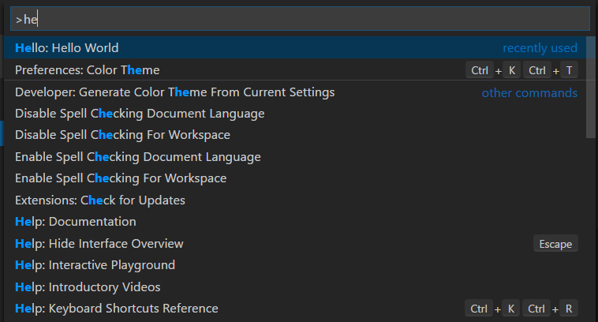
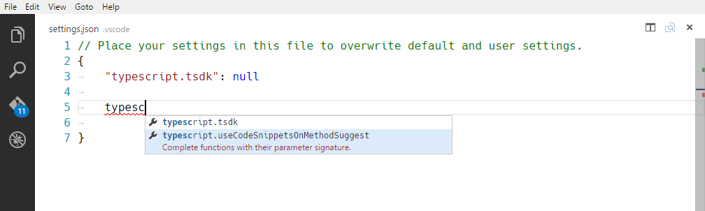
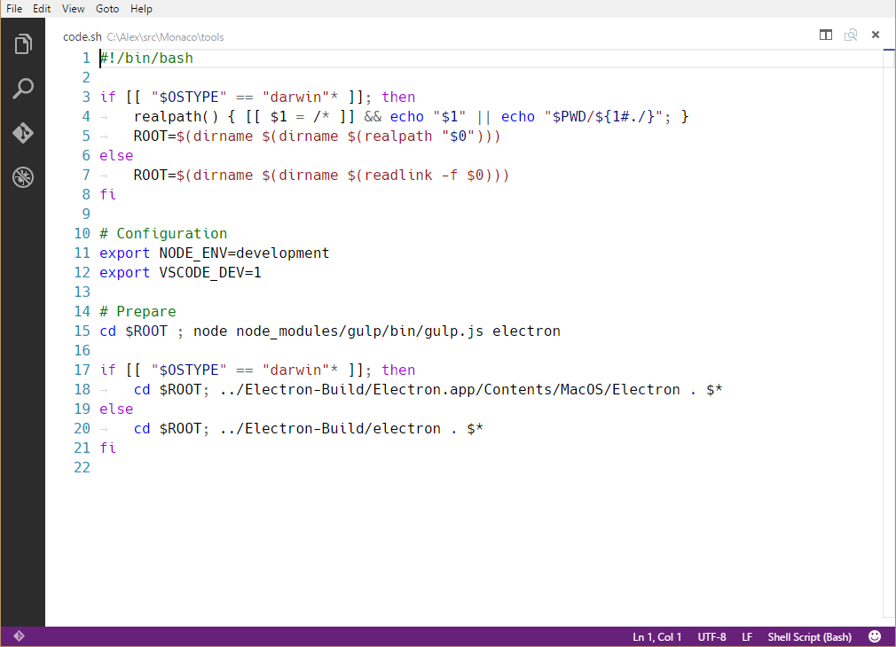
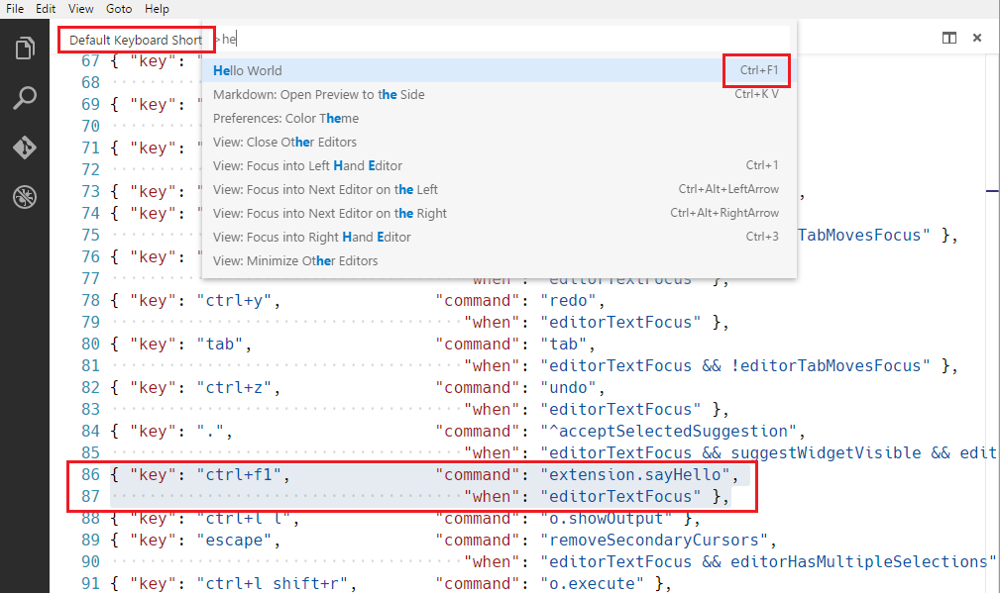
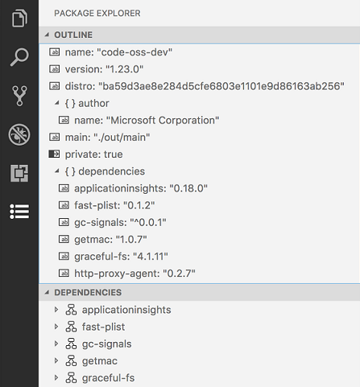

---
# DO NOT TOUCH — Managed by doc writer
ContentId: 2F27A240-8E36-4CC2-973C-9A1D8069F83F
DateApproved: 08/01/2024

# Summarize the whole topic in less than 300 characters for SEO purpose
MetaDescription: To extend Visual Studio Code, your extension (plug-in) declares which of the various Contribution Points it is using in its package.json Extension Manifest file.
---

# Contribution Points

**Contribution Points** are a set of JSON declarations that you make in the `contributes` field of the `package.json` [Extension Manifest](/api/references/extension-manifest). Your extension registers **Contribution Points** to extend various functionalities within Visual Studio Code. Here is a list of all available **Contribution Points**:

- [`breakpoints`](/api/references/contribution-points#contributes.breakpoints)
- [`colors`](/api/references/contribution-points#contributes.colors)
- [`commands`](/api/references/contribution-points#contributes.commands)
- [`configuration`](/api/references/contribution-points#contributes.configuration)
- [`configurationDefaults`](/api/references/contribution-points#contributes.configurationDefaults)
- [`customEditors`](/api/references/contribution-points#contributes.customEditors)
- [`debuggers`](/api/references/contribution-points#contributes.debuggers)
- [`grammars`](/api/references/contribution-points#contributes.grammars)
- [`icons`](/api/references/contribution-points#contributes.icons)
- [`iconThemes`](/api/references/contribution-points#contributes.iconThemes)
- [`jsonValidation`](/api/references/contribution-points#contributes.jsonValidation)
- [`keybindings`](/api/references/contribution-points#contributes.keybindings)
- [`languages`](/api/references/contribution-points#contributes.languages)
- [`menus`](/api/references/contribution-points#contributes.menus)
- [`problemMatchers`](/api/references/contribution-points#contributes.problemMatchers)
- [`problemPatterns`](/api/references/contribution-points#contributes.problemPatterns)
- [`productIconThemes`](/api/references/contribution-points#contributes.productIconThemes)
- [`resourceLabelFormatters`](/api/references/contribution-points#contributes.resourceLabelFormatters)
- [`semanticTokenModifiers`](/api/references/contribution-points#contributes.semanticTokenModifiers)
- [`semanticTokenScopes`](/api/references/contribution-points#contributes.semanticTokenScopes)
- [`semanticTokenTypes`](/api/references/contribution-points#contributes.semanticTokenTypes)
- [`snippets`](/api/references/contribution-points#contributes.snippets)
- [`submenus`](/api/references/contribution-points#contributes.submenus)
- [`taskDefinitions`](/api/references/contribution-points#contributes.taskDefinitions)
- [`terminal`](/api/references/contribution-points#contributes.terminal)
- [`themes`](/api/references/contribution-points#contributes.themes)
- [`typescriptServerPlugins`](/api/references/contribution-points#contributes.typescriptServerPlugins)
- [`views`](/api/references/contribution-points#contributes.views)
- [`viewsContainers`](/api/references/contribution-points#contributes.viewsContainers)
- [`viewsWelcome`](/api/references/contribution-points#contributes.viewsWelcome)
- [`walkthroughs`](/api/references/contribution-points#contributes.walkthroughs)

## contributes.breakpoints

Usually a debugger extension will also have a `contributes.breakpoints` entry where the extension lists the language file types for which setting breakpoints will be enabled.

```json
{
  "contributes": {
    "breakpoints": [
      {
        "language": "javascript"
      },
      {
        "language": "javascriptreact"
      }
    ]
  }
}
```

## contributes.colors

Contributes new themable colors. These colors can be used by the extension in editor decorators and in the status bar. Once defined, users can customize the color in the `workspace.colorCustomization` setting and user themes can set the color value.

```json
{
  "contributes": {
    "colors": [
      {
        "id": "superstatus.error",
        "description": "Color for error message in the status bar.",
        "defaults": {
          "dark": "errorForeground",
          "light": "errorForeground",
          "highContrast": "#010203",
          "highContrastLight": "#feedc3",
        }
      }
    ]
  }
}
```

Color default values can be defined for light, dark and high contrast theme and can either be a reference to an existing color or a [Color Hex Value](/api/references/theme-color#color-formats).

Extensions can consume new and existing theme colors with the `ThemeColor` API:

```ts
const errorColor = new vscode.ThemeColor("superstatus.error");
```

## contributes.commands

Contribute the UI for a command consisting of a title and (optionally) an icon, category, and enabled state. Enablement is expressed with [when clauses](/api/references/when-clause-contexts). By default, commands show in the **Command Palette** (`kb(workbench.action.showCommands)`) but they can also show in other [menus](/api/references/contribution-points#contributes.menus).

Presentation of contributed commands depends on the containing menu. The **Command Palette**, for
instance, prefixes commands with their `category`, allowing for easy grouping. However, the
**Command Palette** doesn't show icons nor disabled commands. The editor context menu, on the other
hand, shows disabled items but doesn't show the category label.

> **Note:** When a command is invoked (from a key binding, from the **Command Palette**, any other menu, or programmatically), VS Code will emit an activationEvent `onCommand:${command}`.

> **Note:** When using icons from [product icons](/api/references/icons-in-labels#icon-listing), setting `light` and `dark` will disable the icon.
> The correct syntax is `"icon": "$(book)"`

### command example

```json
{
  "contributes": {
    "commands": [
      {
        "command": "extension.sayHello",
        "title": "Hello World",
        "category": "Hello",
        "icon": {
          "light": "path/to/light/icon.svg",
          "dark": "path/to/dark/icon.svg"
        }
      }
    ]
  }
}
```

See the [Commands Extension Guide](https://code.visualstudio.com/api/extension-guides/command) to learn more about using commands in VS Code extensions.



### Command icon specifications

- `Size:` Icons should be 16x16 with a 1 pixel padding (image is 14x14) and centered.
- `Color:` Icons should use a single color.
- `Format:` It is recommended that icons be in SVG, though any image file type is accepted.


## contributes.configuration

Contribute configuration keys that will be exposed to the user. The user will be able to set these configuration options as User Settings or as Workspace Settings, either by using the Settings editor or by editing the JSON settings file directly.

This section can either be a single object, representing a single category of settings, or an array of objects, representing multiple categories of settings. If there are multiple categories of settings, the Settings editor will show a submenu in the table of contents for that extension, and the title keys will be used for the submenu entry names.

### Configuration example

```json
{
  "contributes": {
    "configuration": {
      "title": "TypeScript",
      "properties": {
        "typescript.useCodeSnippetsOnMethodSuggest": {
          "type": "boolean",
          "default": false,
          "description": "Complete functions with their parameter signature."
        },
        "typescript.tsdk": {
          "type": ["string", "null"],
          "default": null,
          "description": "Specifies the folder path containing the tsserver and lib*.d.ts files to use."
        }
      }
    }
  }
}
```



You can read these values from your extension using `vscode.workspace.getConfiguration('myExtension')`.

### Configuration schema

Your configuration entry is used both to provide intellisense when editing your settings in the JSON editor, and to define the way they appear in the settings UI.


**title**

The `title` 1️⃣️ of a category is the heading used for that category.

```json
{
  "configuration": {
    "title": "GitMagic"
  }
}
```

Note that if the extension has multiple categories of extensions, and the title of one of the categories is the same as the extension display name, then the settings for that category will be placed directly below the main extension heading, no matter what the `order` field is set to.

For both the `title` and `displayName` fields, words like "Extension", "Configuration", and "Settings" are redundant.

- ✔ `"title": "GitMagic"`
- ❌ `"title": "GitMagic Extension"`
- ❌ `"title": "GitMagic Configuration"`
- ❌ `"title": "GitMagic Extension Configuration Settings"`

**properties**

The `properties` 2️⃣ in your configuration will be a dictionary of configuration properties.

In the settings UI, your configuration key will be used to namespace and construct a title. Though an extension can contain multiple categories of settings, each setting of the extension must still have its own unique key. Capital letters in your key are used to indicate word breaks. For example, if your key is `gitMagic.blame.dateFormat`, the generated title for the setting will look like this:

> Blame: **Date Format**

Entries will be grouped according to the hierarchy established in your keys. So for example, these entries

```
gitMagic.blame.dateFormat
gitMagic.blame.format
gitMagic.blame.heatMap.enabled
gitMagic.blame.heatMap.location
```

will appear in a single group like this:

> Blame: **Date Format**
>
> Blame: **Format**
>
> Blame › Heat Map: **Enabled**
>
> Blame › Heat Map: **Location**

Otherwise, properties without an explicit order field appear in alphabetical order (**not** the order in which they're listed in the manifest).

### Configuration property schema

Configuration keys are defined using a superset of [JSON
Schema](https://json-schema.org/overview/what-is-jsonschema).

**description** / **markdownDescription**

Your `description` 3️⃣ appears after the title and before the input field, except for booleans, where the description is used as the label for the checkbox. 6️⃣

```json
{
  "gitMagic.blame.heatMap.enabled": {
    "description": "Specifies whether to provide a heatmap indicator in the gutter blame annotations"
  }
}
```

If you use `markdownDescription` instead of `description`, your setting description will be rendered as Markdown in the settings UI.

```json
{
  "gitMagic.blame.dateFormat": {
    "markdownDescription": "Specifies how to format absolute dates (e.g. using the `${date}` token) in gutter blame annotations. See the [Moment.js docs](https://momentjs.com/docs/#/displaying/format/) for valid formats"
  }
}
```

For `markdownDescription`, in order to add newlines or multiple paragraphs, use the string `\n\n` to separate the paragraphs instead of just `\n`.

**type**

Entries of type `number` 4️⃣ , `string` 5️⃣ , `boolean` 6️⃣ can be edited directly in the settings UI.

```json
{
  "gitMagic.views.pageItemLimit": {
    "type": "number",
    "default": 20,
    "markdownDescription": "Specifies the number of items to show in each page when paginating a view list. Use 0 to specify no limit"
  }
}
```

A string setting can be rendered with a multiline text input if it sets `"editPresentation": "multilineText"` on the configuration entry.

For `boolean` entries, the `description` (or `markdownDescription`) will be used as the label for the checkbox.

```json
{
  "gitMagic.blame.compact": {
    "type": "boolean",
    "description": "Specifies whether to compact (deduplicate) matching adjacent gutter blame annotations"
  }
}
```

Some `object` and `array` type settings will be rendered in the settings UI. Simple arrays of `number`, `string`, or `boolean` will be rendered as editable lists. Objects that have properties of type `string`, `number`, `integer`, and/or `boolean` will be rendered as editable grids of keys and values. Object settings should also have `additionalProperties` set to either `false`, or an object with an appropriate `type` property, to render in the UI.

If an `object` or `array` type setting can also contain other types like nested objects, arrays, or null, then the value won't be rendered in the settings UI and can only be modified by editing the JSON directly. Users will see a link to **Edit in settings.json** as shown in the screenshot above. 8️⃣

**order**

Both categories and the settings within those categories can take an integer `order` type property, which gives a reference to how they should be sorted relative to other categories and/or settings.

If two categories have `order` properties, the category with the lower order number comes first. If a category is not given an `order` property, it appears after categories that were given that property.

If two settings within the same category have `order` properties, the setting with the lower order number comes first. If another setting within that same category is not given an `order` property, it will appear after settings in that category that were given that property.

If two categories have the same `order` property value, or if two settings within the same category have the same `order` property value, then they will be sorted in increasing alphabetical order within the settings UI.

**enum** / **enumDescriptions** / **enumItemLabels**

If you provide an array of items under the `enum` 7️⃣ property, the settings UI will render a dropdown menu.


You can also provide an `enumDescriptions` property, which provides descriptive text rendered at the bottom of the dropdown:

```json
{
  "gitMagic.blame.heatMap.location": {
    "type": "string",
    "default": "right",
    "enum": ["left", "right"],
    "enumDescriptions": [
      "Adds a heatmap indicator on the left edge of the gutter blame annotations",
      "Adds a heatmap indicator on the right edge of the gutter blame annotations"
    ]
  }
}
```

You can also use `markdownEnumDescriptions`, and your descriptions will be rendered as Markdown.

To customize the dropdown options, you can use `enumItemLabels`. The `workbench.iconTheme` setting uses both `enumDescriptions` and `enumItemLabels`. In the screenshot below, the hovered option has the item label "None", with enum description "No file icons" and enum value `null`.


**deprecationMessage** / **markdownDeprecationMessage**

If you set `deprecationMessage`, or `markdownDeprecationMessage`, the setting will get a warning underline with your specified message. Also, the setting will be hidden from the settings UI unless it is configured by the user. If you set `markdownDeprecationMessage`, the markdown will not be rendered in the setting hover or the problems view. If you set both properties, `deprecationMessage` will be shown in the hover and the problems view, and `markdownDeprecationMessage` will be rendered as Markdown in the settings UI.

Example:

```json
{
  "json.colorDecorators.enable": {
    "type": "boolean",
    "description": "Enables or disables color decorators",
    "markdownDeprecationMessage": "**Deprecated**: Please use `#editor.colorDecorators#` instead.",
    "deprecationMessage": "Deprecated: Please use editor.colorDecorators instead."
  }
}
```

**Other JSON Schema properties**

You can use any of the validation JSON Schema properties to describe other constraints on configuration values:

- `default` for defining the default value of a property
- `minimum` and `maximum` for restricting numeric values
- `maxLength`, `minLength` for restricting string length
- `pattern` for restricting strings to a given regular expression
- `patternErrorMessage` for giving a tailored error message when a pattern does not match.
- `format` for restricting strings to well-known formats, such as `date`, `time`, `ipv4`, `email`,
  and `uri`
- `maxItems`, `minItems` for restricting array length
- `editPresentation` for controlling whether a single-line inputbox or multi-line textarea is rendered for the string setting in the Settings editor

**Unsupported JSON Schema properties**

Not supported in the configuration section are:

- `$ref` and `definition`: The configuration schemas needs to be self-contained and cannot make assumptions how the aggregated settings JSON schema document looks like.

For more details on these and other features, see the [JSON Schema Reference](https://json-schema.org/overview/what-is-jsonschema).

**scope**

A configuration setting can have one of the following possible scopes:

- `application` - Settings that apply to all instances of VS Code and can only be configured in user settings.
- `machine` - Machine specific settings that can be set only in user settings or only in remote settings. For example, an installation path which shouldn't be shared across machines.
- `machine-overridable` - Machine specific settings that can be overridden by workspace or folder settings.
- `window` - Windows (instance) specific settings which can be configured in user, workspace, or remote settings.
- `resource` - Resource settings, which apply to files and folders, and can be configured in all settings levels, even folder settings.
- `language-overridable` - Resource settings that can be overridable at a language level.

Configuration scopes determine when a setting is available to the user through the Settings editor and whether the setting is applicable. If no `scope` is declared, the default is `window`.

Below are example configuration scopes from the built-in Git extension:

```json
{
  "contributes": {
    "configuration": {
      "title": "Git",
      "properties": {
        "git.alwaysSignOff": {
          "type": "boolean",
          "scope": "resource",
          "default": false,
          "description": "%config.alwaysSignOff%"
        },
        "git.ignoredRepositories": {
          "type": "array",
          "default": [],
          "scope": "window",
          "description": "%config.ignoredRepositories%"
        },
        "git.autofetch": {
          "type": [
            "boolean",
            "string"
          ],
          "enum": [
            true,
            false,
            "all"
          ],
          "scope": "resource",
          "markdownDescription": "%config.autofetch%",
          "default": false,
          "tags": [
            "usesOnlineServices"
          ]
        }
      }
    }
  }
}
```

You can see that `git.alwaysSignOff` has `resource` scope and can be set per user, workspace, or folder, while the ignored repositories list with `window` scope applies more globally for the VS Code window or workspace (which might be multi-root).

**Linking to settings**

You can insert a link to another setting, which will be rendered as a clickable link in the settings UI, by using this special syntax in the markdown-type properties: ``` `#target.setting.id#` ```. This will work in `markdownDescription`, `markdownEnumDescriptions`, and `markdownDeprecationMessage`. Example:

```json
  "files.autoSaveDelay": {
    "markdownDescription": "Controls the delay in ms after which a dirty editor is saved automatically. Only applies when `#files.autoSave#` is set to `afterDelay`.",
    // ...
  }
```

In the settings UI, this is rendered as:


## contributes.configurationDefaults

Contribute default values for other registered configurations and override their defaults.

The following example overrides the default behavior of `files.autoSave` setting to AutoSave files on focus change.

```json
"configurationDefaults": {
      "files.autoSave": "onFocusChange"
}
```

You can also contribute default editor configurations for the provided language. For example, the following snippet contributes default editor configurations for the `markdown` language:

```json
{
  "contributes": {
    "configurationDefaults": {
      "[markdown]": {
        "editor.wordWrap": "on",
        "editor.quickSuggestions": {
                "comments": "off",
                "strings": "off",
                "other": "off"
        }
      }
    }
  }
}
```

## contributes.customEditors

The `customEditors` contribution point is how your extension tells VS Code about the custom editors that it provides. For example, VS Code needs to know what types of files your custom editor works with as well as how to identify your custom editor in any UI.

Here's a basic `customEditor` contribution for the [custom editor extension sample](https://github.com/microsoft/vscode-extension-samples/tree/main/custom-editor-sample):

```json
"contributes": {
  "customEditors": [
    {
      "viewType": "catEdit.catScratch",
      "displayName": "Cat Scratch",
      "selector": [
        {
          "filenamePattern": "*.cscratch"
        }
      ],
      "priority": "default"
    }
  ]
}
```

`customEditors` is an array, so your extension can contribute multiple custom editors.

- `viewType` - Unique identifier for your custom editor.

    This is how VS Code ties a custom editor contribution in the `package.json` to your custom editor implementation in code. This must be unique across all extensions, so instead of a generic `viewType` such as `"preview"` make sure to use one that is unique to your extension, for example `"viewType": "myAmazingExtension.svgPreview"`.

- `displayName` - Name that identifies the custom editor in VS Code's UI.

    The display name is shown to the user in VS Code UI such as the **View: Reopen with** dropdown.

- `selector` - Specifies which files a custom editor is active for.

    The `selector` is an array of one or more [glob patterns](/docs/editor/glob-patterns). These glob patterns are matched against file names to determine if the custom editor can be used for them. A `filenamePattern` such as `*.png` will enable the custom editor for all PNG files.

    You can also create more specific patterns that match on file or directory names, for example `**/translations/*.json`.

- `priority` - (optional) Specifies when the custom editor is used.

    `priority` controls when a custom editor is used when a resource is open. Possible values are:

  - `"default"` - Try to use the custom editor for every file that matches the custom editor's `selector`. If there are multiple custom editors for a given file, the user will have to select which custom editor they want to use.
  - `"option"` - Do not use the custom editor by default but allow users to switch to it or configure it as their default.

You can learn more in the [Custom Editors](/api/extension-guides/custom-editors) extension guide.

## contributes.debuggers

Contribute a debugger to VS Code. A debugger contribution has the following properties:

- `type` is a unique ID that is used to identify this debugger in a launch configuration.
- `label` is the user visible name of this debugger in the UI.
- `program` the path to the debug adapter that implements the VS Code debug protocol against the real debugger or runtime.
- `runtime` if the path to the debug adapter is not an executable but needs a runtime.
- `configurationAttributes` is the schema for launch configuration arguments specific to this debugger. Please note that the JSON schema constructs `$ref` and `definition` are not supported.
- `initialConfigurations` lists launch configurations that are used to populate an initial launch.json.
- `configurationSnippets` lists launch configurations that are available through IntelliSense when editing a launch.json.
- `variables` introduces substitution variables and binds them to commands implemented by the debugger extension.
- `languages` those languages for which the debug extension could be considered the "default debugger".

### debugger example

```json
{
  "contributes": {
    "debuggers": [
      {
        "type": "node",
        "label": "Node Debug",

        "program": "./out/node/nodeDebug.js",
        "runtime": "node",

        "languages": ["javascript", "typescript", "javascriptreact", "typescriptreact"],

        "configurationAttributes": {
          "launch": {
            "required": ["program"],
            "properties": {
              "program": {
                "type": "string",
                "description": "The program to debug."
              }
            }
          }
        },

        "initialConfigurations": [
          {
            "type": "node",
            "request": "launch",
            "name": "Launch Program",
            "program": "${workspaceFolder}/app.js"
          }
        ],

        "configurationSnippets": [
          {
            "label": "Node.js: Attach Configuration",
            "description": "A new configuration for attaching to a running node program.",
            "body": {
              "type": "node",
              "request": "attach",
              "name": "${2:Attach to Port}",
              "port": 9229
            }
          }
        ],

        "variables": {
          "PickProcess": "extension.node-debug.pickNodeProcess"
        }
      }
    ]
  }
}
```

For a full walkthrough on how to integrate a `debugger`, go to [Debugger Extension](/api/extension-guides/debugger-extension).

## contributes.grammars

Contribute a TextMate grammar to a language. You must provide the `language` this grammar applies to, the TextMate `scopeName` for the grammar and the file path.

> **Note:** The file containing the grammar can be in JSON (filenames ending in .json) or in XML plist format (all other files).

### grammar example

```json
{
  "contributes": {
    "grammars": [
      {
        "language": "markdown",
        "scopeName": "text.html.markdown",
        "path": "./syntaxes/markdown.tmLanguage.json",
        "embeddedLanguages": {
          "meta.embedded.block.frontmatter": "yaml"
        }
      }
    ]
  }
}
```

See the [Syntax Highlight Guide](/api/language-extensions/syntax-highlight-guide) to learn more about how to register TextMate grammars associated with a language to receive syntax highlighting.



## contributes.icons

Contribute a new icon by ID, along with a default icon. The icon ID can then be used by the extension (or any other extensions that depend on the extension) anywhere a `ThemeIcon` can be used `new ThemeIcon("iconId")`, in [Markdown strings](/api/references/icons-in-labels#icon-in-labels) (`$(iconId)`), and as icons in certain contribution points.

```json
{
  "contributes": {
    "icons": {
      "distro-ubuntu": {
        "description": "Ubuntu icon",
        "default": {
          "fontPath": "./distroicons.woff",
          "fontCharacter": "\\E001"
        }
      },
      "distro-fedora": {
        "description": "Ubuntu icon",
        "default": {
          "fontPath": "./distroicons.woff",
          "fontCharacter": "\\E002"
        }
      }
    }
  }
}
```

## contributes.iconThemes

Contribute a file icon theme to VS Code. File icons are shown next to file names, indicating the file type.

You must specify an id (used in the settings), a label and the path to the file icon definition file.

### file icon theme example

```json
{
  "contributes": {
    "iconThemes": [
      {
        "id": "my-cool-file-icons",
        "label": "Cool File Icons",
        "path": "./fileicons/cool-file-icon-theme.json"
      }
    ]
  }
}
```


See the [File Icon Theme Guide](/api/extension-guides/file-icon-theme) on how to create a File Icon Theme.

## contributes.jsonValidation

Contribute a validation schema for a specific type of `json` file. The `url` value can be either a local path to a schema file included in the extension or a remote server URL such as a [json schema store](https://www.schemastore.org/json).

```json
{
  "contributes": {
    "jsonValidation": [
      {
        "fileMatch": ".jshintrc",
        "url": "https://json.schemastore.org/jshintrc"
      }
    ]
  }
}
```

## contributes.keybindings

Contribute a key binding rule defining what command should be invoked when the user presses a key combination. See the [Key Bindings](/docs/getstarted/keybindings) topic where key bindings are explained in detail.

Contributing a key binding will cause the Default Keyboard Shortcuts to display your rule, and every UI representation of the command will now show the key binding you have added. And, of course, when the user presses the key combination the command will be invoked.

> **Note:** Because VS Code runs on Windows, macOS and Linux, where modifiers differ, you can use "key" to set the default key combination and overwrite it with a specific platform.

> **Note:** When a command is invoked (from a key binding or from the Command Palette), VS Code will emit an activationEvent `onCommand:${command}`.

### keybinding example

Defining that `kbstyle(Ctrl+F1)` under Windows and Linux and `kbstyle(Cmd+F1)` under macOS trigger the `"extension.sayHello"` command:

```json
{
  "contributes": {
    "keybindings": [
      {
        "command": "extension.sayHello",
        "key": "ctrl+f1",
        "mac": "cmd+f1",
        "when": "editorTextFocus"
      }
    ]
  }
}
```



## contributes.languages

Contribute definition of a programming language. This will introduce a new language or enrich the knowledge VS Code has about a language.

The main effects of `contributes.languages` are:

- Define a `languageId` that can be reused in other parts of VS Code API, such as `vscode.TextDocument.languageId` and the `onLanguage` Activation Events.
  - You can contribute a human-readable using the `aliases` field. The first item in the list will be used as the human-readable label.
- Associate file name extensions (`extensions`), file names (`filenames`), file name [glob patterns](/docs/editor/glob-patterns) (`filenamePatterns`), files that begin with a specific line (such as hashbang) (`firstLine`), and `mimetypes` to that `languageId`.
- Contribute a set of [Declarative Language Features](/api/language-extensions/overview#declarative-language-features) for the contributed language. Learn more about the configurable editing features in the [Language Configuration Guide](/api/language-extensions/language-configuration-guide).
- Contribute an icon which can be used as in file icon themes if theme does not contain an icon for the language

### language example

```json
{
  "contributes": {
    "languages": [
      {
        "id": "python",
        "extensions": [".py"],
        "aliases": ["Python", "py"],
        "filenames": [],
        "firstLine": "^#!/.*\\bpython[0-9.-]*\\b",
        "configuration": "./language-configuration.json",
        "icon": {
          "light": "./icons/python-light.png",
          "dark": "./icons/python-dark.png"
        }
      }
    ]
  }
}
```

## contributes.menus

Contribute a menu item for a command to the editor or Explorer. The menu item definition contains the command that should be invoked when selected and the condition under which the item should show. The latter is defined with the `when` clause, which uses the key bindings [when clause contexts](/api/references/when-clause-contexts).

A `command` property indicates which command to run when selecting a menu item. A `submenu` property indicates which submenu to render in this location.

When declaring a `command` menu item, an alternative command can also be defined using the `alt`-property. It will be shown and invoked when pressing `kbstyle(Alt)` while opening a menu. On Windows and Linux `kbstyle(Shift)` also does this, which is useful in situations where `kbstyle(Alt)` would trigger the window menu bar.

Last, a `group` property defines sorting and grouping of menu items. The `navigation` group is special as it will always be sorted to the top/beginning of a menu.

> **Note** that `when` clauses apply to menus and `enablement` clauses to commands. The `enablement` applies to all menus and even keybindings while the `when` only applies to a single menu.

Currently extension writers can contribute to:

- `commandPalette` - global Command Palette
- `comments/comment/title` - Comments title menu bar
- `comments/comment/context` - Comments context menu
- `comments/commentThread/title` - Comments thread title menu bar
- `comments/commentThread/context`- Comments thread context menu
- `debug/callstack/context` - Debug Call Stack view context menu
- `debug/callstack/context` group `inline` - Debug Call Stack view inline actions
- `debug/toolBar` - Debug view toolbar
- `debug/variables/context` - Debug Variables view context menu
- `editor/context` - editor context menu
- `editor/lineNumber/context` - editor line number context menu
- `editor/title` - editor title menu bar
- `editor/title/context` - editor title context menu
- `editor/title/run` - Run submenu on the editor title menu bar
- `explorer/context` - Explorer view context menu
- `extension/context` - Extensions view context menu
- `file/newFile`  - New File item in the File menu and Welcome page
- `interactive/toolbar` - Interactive Window toolbar
- `interactive/cell/title` - Interactive Window cell title menu bar
- `notebook/toolbar` - notebook toolbar
- `notebook/cell/title` - notebook cell title menu bar
- `notebook/cell/execute` - notebook cell execution menu
- `scm/title` - [SCM title menu](/api/extension-guides/scm-provider#menus)
- `scm/resourceGroup/context` - [SCM resource groups](/api/extension-guides/scm-provider#menus) menus
- `scm/resourceFolder/context` - [SCM resource folders](/api/extension-guides/scm-provider#menus) menus
- `scm/resourceState/context` - [SCM resources](/api/extension-guides/scm-provider#menus) menus
- `scm/change/title` - [SCM change title](/api/extension-guides/scm-provider#menus) menus
- `scm/sourceControl`- [SCM source control menu](/api/extension-guides/scm-provider#menus)
- `terminal/context` - terminal context menu
- `terminal/title/context` - terminal title context menu
- `testing/item/context` - Test Explorer item context menu
- `testing/item/gutter` - menu for a gutter decoration for a test item
- `timeline/title` - Timeline view title menu bar
- `timeline/item/context` - Timeline view item context menu
- `touchBar` - macOS Touch Bar
- `view/title` - [View title menu](/api/references/contribution-points#contributes.views)
- `view/item/context` - [View item context menu](/api/references/contribution-points#contributes.views)
- `webview/context` - any [webview](/api/extension-guides/webview) context menu
- Any [contributed submenu](/api/references/contribution-points#contributes.submenus)

> **Note 1:** When a command is invoked from a (context) menu, VS Code tries to infer the currently selected resource and passes that as a parameter when invoking the command. For instance, a menu item inside the Explorer is passed the URI of the selected resource and a menu item inside an editor is passed the URI of the document.

> **Note 2:** Commands of menu items contributed to `editor/lineNumber/context` are also passed the line number. Additionally these items can reference the `editorLineNumber` context key in their `when` clauses, for example by using the `in` or `not in` operators to test it against an array-valued context key managed by the extension.

In addition to a title, a contributed command can specify the icon which VS Code will show when the invoking menu item is represented as a button, for example on a title menu bar.

### menu example

Here's a command menu item:

```json
{
  "contributes": {
    "menus": {
      "editor/title": [
        {
          "when": "resourceLangId == markdown",
          "command": "markdown.showPreview",
          "alt": "markdown.showPreviewToSide",
          "group": "navigation"
        }
      ]
    }
  }
}
```


Similarly, here's a command menu item added to a particular view. The example below contributes to an arbitrary view like the terminal:

```json
{
  "contributes": {
    "menus": {
      "view/title": [
        {
          "command": "terminalApi.sendText",
          "when": "view == terminal",
          "group": "navigation"
        }
      ]
    }
  }
}
```


Here's a submenu menu item:

```json
{
  "contributes": {
    "menus": {
      "scm/title": [
        {
          "submenu": "git.commit",
          "group": "2_main@1",
          "when": "scmProvider == git"
        }
      ]
    }
  }
}
```


### Context specific visibility of Command Palette menu items

When registering commands in `package.json`, they will automatically be shown in the **Command Palette** (`kb(workbench.action.showCommands)`). To allow more control over command visibility, there is the `commandPalette` menu item. It allows you to define a `when` condition to control if a command should be visible in the **Command Palette** or not.

The snippet below makes the 'Hello World' command only visible in the **Command Palette** when something is selected in the editor:

```json
{
  "commands": [
    {
      "command": "extension.sayHello",
      "title": "Hello World"
    }
  ],
  "menus": {
    "commandPalette": [
      {
        "command": "extension.sayHello",
        "when": "editorHasSelection"
      }
    ]
  }
}
```

### Sorting of groups

Menu items can be sorted into groups. They are sorted in lexicographical order with the following defaults/rules.
You can add menu items to these groups or add new groups of menu items in between, below, or above.

The **editor context menu** has these default groups:

- `navigation` - The `navigation` group comes first in all cases.
- `1_modification` - This group comes next and contains commands that modify your code.
- `9_cutcopypaste` - The second last default group with the basic editing commands.
- `z_commands` - The last default group with an entry to open the Command Palette.


The **explorer context menu** has these default groups:

- `navigation` - Commands related to navigation across VS Code. This group comes first in all cases.
- `2_workspace` - Commands related to workspace manipulation.
- `3_compare` - Commands related to comparing files in the diff editor.
- `4_search` - Commands related to searching in the search view.
- `5_cutcopypaste` - Commands related to cutting, copying, and pasting of files.
- `6_copypath` - Commands related to copying file paths.
- `7_modification` - Commands related to the modification of file.

The **editor tab context menu** has these default groups:

- `1_close` - Commands related to closing editors.
- `3_preview` - Commands related to pinning editors.

The **editor title menu** has these default groups:

- `navigation` - Commands related to navigating.
- `1_run` - Commands related to running and debugging the editor.
- `1_diff` - Commands related to working with diff editors.
- `3_open` - Commands related to opening editors.
- `5_close` - Commands related to closing editors.

`navigation` and `1_run` are shown in the primary editor title area. The other groups are shown in the secondary area - under the `...` menu.

The **terminal tab context menu** has these default groups:

- `1_create` - Commands related to creating terminals.
- `3_run` - Commands related to running/executing something in the terminal.
- `5_manage` - Commands related to managing a terminal.
- `7_configure` - Commands related to terminal configuration.

The **terminal context menu** has these default groups:

- `1_create` - Commands related to creating terminals.
- `3_edit` - Commands related to manipulating text, the selection or the clipboard.
- `5_clear` - Commands related to clearing the terminal.
- `7_kill` - Commands related to closing/killing the terminal.
- `9_config` - Commands related to terminal configuration.

The **Timeline view item context menu** has these default groups:

- `inline` - Important or frequently used timeline item commands. Rendered as a toolbar.
- `1_actions` - Commands related to working with timeline items.
- `5_copy` - Commands related to copying timeline item information.

The **Extensions view context menu** has these default groups:

- `1_copy` - Commands related to copying extension information.
- `2_configure` - Commands related to configuring an extension.

### Sorting inside groups

The order inside a group depends on the title or an order-attribute. The group-local order of a menu item is specified by appending `@<number>` to the group identifier as shown below:

```json
{
  "editor/title": [
    {
      "when": "editorHasSelection",
      "command": "extension.Command",
      "group": "myGroup@1"
    }
  ]
}
```

## contributes.problemMatchers

Contribute problem matcher patterns. These contributions work in both the output panel runner and in the terminal runner. Below is an example to contribute a problem matcher for the gcc compiler in an extension:

```json
{
  "contributes": {
    "problemMatchers": [
      {
        "name": "gcc",
        "owner": "cpp",
        "fileLocation": ["relative", "${workspaceFolder}"],
        "pattern": {
          "regexp": "^(.*):(\\d+):(\\d+):\\s+(warning|error):\\s+(.*)$",
          "file": 1,
          "line": 2,
          "column": 3,
          "severity": 4,
          "message": 5
        }
      }
    ]
  }
}
```

This problem matcher can now be used in a `tasks.json` file via a name reference `$gcc`. An example looks like this:

```json
{
  "version": "2.0.0",
  "tasks": [
    {
      "label": "build",
      "command": "gcc",
      "args": ["-Wall", "helloWorld.c", "-o", "helloWorld"],
      "problemMatcher": "$gcc"
    }
  ]
}
```

Also see: [Defining a Problem Matcher](/docs/editor/tasks#_defining-a-problem-matcher)

## contributes.problemPatterns

Contributes named problem patterns that can be used in problem matchers (see above).

## contributes.productIconThemes

Contribute a product icon theme to VS Code. Product icons are all icons used in VS Code except file icons and icons contributed from extensions.

You must specify an id (used in the settings), a label and the path to the icon definition file.

### product icon theme example

```json
{
  "contributes": {
    "productIconThemes": [
      {
        "id": "elegant",
        "label": "Elegant Icon Theme",
        "path": "./producticons/elegant-product-icon-theme.json"
      }
    ]
  }
}
```


See the [Product Icon Theme Guide](/api/extension-guides/product-icon-theme) on how to create a Product Icon Theme.

## contributes.resourceLabelFormatters

Contributes resource label formatters that specify how to display URIs everywhere in the workbench. For example here's how an extension could contribute a formatter for URIs with scheme `remotehub`:

```json
{
  "contributes": {
    "resourceLabelFormatters": [
      {
        "scheme": "remotehub",
        "formatting": {
          "label": "${path}",
          "separator": "/",
          "workspaceSuffix": "GitHub"
        }
      }
    ]
  }
}
```

This means that all URIs that have a scheme `remotehub` will get rendered by showing only the `path` segment of the URI and the separator will be `/`. Workspaces which have the `remotehub` URI will have the GitHub suffix in their label.

## contributes.semanticTokenModifiers

Contributes new semantic token modifiers that can be highlighted via theme rules.

```json
{
  "contributes": {
    "semanticTokenModifiers": [
      {
        "id": "native",
        "description": "Annotates a symbol that is implemented natively"
      }
    ]
  }
}
```

See the [Semantic Highlighting Guide](/api/language-extensions/semantic-highlight-guide) to read more about semantic highlighting.

## contributes.semanticTokenScopes

Contributes mapping between semantic token types & modifiers and scopes either as a fallback or to support language-specific themes.

```json
{
  "contributes": {
    "semanticTokenScopes": [
      {
        "language": "typescript",
        "scopes": {
          "property.readonly": ["variable.other.constant.property.ts"]
        }
      }
    ]
  }
}
```

See the [Semantic Highlighting Guide](/api/language-extensions/semantic-highlight-guide) to read more about semantic highlighting.

## contributes.semanticTokenTypes

Contributes new semantic token types that can be highlighted via theme rules.

```json
{
  "contributes": {
    "semanticTokenTypes": [
      {
        "id": "templateType",
        "superType": "type",
        "description": "A template type."
      }
    ]
  }
}
```

See the [Semantic Highlighting Guide](/api/language-extensions/semantic-highlight-guide) to read more about semantic highlighting.

## contributes.snippets

Contribute snippets for a specific language. The `language` attribute is the [language identifier](/docs/languages/identifiers) and the `path` is the relative path to the snippet file, which defines snippets in the [VS Code snippet format](/docs/editor/userdefinedsnippets#_snippet-syntax).

The example below shows adding snippets for the Go language.

```json
{
  "contributes": {
    "snippets": [
      {
        "language": "go",
        "path": "./snippets/go.json"
      }
    ]
  }
}
```

## contributes.submenus

Contribute a submenu as a placeholder onto which menu items can be contributed. A submenu requires a `label` to be shown in the parent menu.

In addition to a title, commands can also define icons that VS Code will show in the editor title menu bar.

### submenu example

```json
{
  "contributes": {
    "submenus": [
      {
        "id": "git.commit",
        "label": "Commit"
      }
    ]
  }
}
```


## contributes.taskDefinitions

Contributes and defines an object literal structure that allows to uniquely identify a contributed task in the system. A task definition has at minimum a `type` property but it usually defines additional properties. For example a task definition for a task representing a script in a package.json file looks like this:

```json
{
  "taskDefinitions": [
    {
      "type": "npm",
      "required": ["script"],
      "properties": {
        "script": {
          "type": "string",
          "description": "The script to execute"
        },
        "path": {
          "type": "string",
          "description": "The path to the package.json file. If omitted the package.json in the root of the workspace folder is used."
        }
      }
    }
  ]
}
```

The task definition is defined using JSON schema syntax for the `required` and `properties` property. The `type` property defines the task type. If the above example:

- `"type": "npm"` associates the task definition with the npm tasks
- `"required": [ "script" ]` defines that `script` attributes as mandatory. The `path` property is optional.
- `"properties" : { ... }` defines the additional properties and their types.

When the extension actually creates a Task, it needs to pass a `TaskDefinition` that conforms to the task definition contributed in the package.json file. For the `npm` example a task creation for the test script inside a package.json file looks like this:

```ts
let task = new vscode.Task({ type: 'npm', script: 'test' }, ....);
```

## contributes.terminal

Contribute a terminal profile to VS Code, allowing extensions to handle the creation of the profiles. When defined, the profile should appear when creating the terminal profile

```json
{
  "activationEvents": [
    "onTerminalProfile:my-ext.terminal-profile"
  ],
  "contributes": {
    "terminal": {
      "profiles": [
        {
          "title": "Profile from extension",
          "id": "my-ext.terminal-profile"
        }
      ]
    },
  }
}
```

When defined, the profile will show up in the terminal profile selector. When activated, handle the creation of the profile by returning terminal options:

```ts
vscode.window.registerTerminalProfileProvider('my-ext.terminal-profile', {
  provideTerminalProfile(token: vscode.CancellationToken): vscode.ProviderResult<vscode.TerminalOptions | vscode.ExtensionTerminalOptions> {
    return { name: 'Profile from extension', shellPath: 'bash' };
  }
});
```

## contributes.themes

Contribute a color theme to VS Code, defining workbench colors and styles for syntax tokens in the editor.

You must specify a label, whether the theme is a dark theme or a light theme (such that the rest of VS Code changes to match your theme) and the path to the file (JSON format).

### theme example

```json
{
  "contributes": {
    "themes": [
      {
        "label": "Monokai",
        "uiTheme": "vs-dark",
        "path": "./themes/monokai-color-theme.json"
      }
    ]
  }
}
```


See the [Color Theme Guide](/api/extension-guides/color-theme) on how to create a Color Theme.

## contributes.typescriptServerPlugins

Contributes [TypeScript server plugins](https://github.com/microsoft/TypeScript/wiki/Writing-a-Language-Service-Plugin) that augment VS Code's JavaScript and TypeScript support:

```json
{
  "contributes": {
    "typescriptServerPlugins": [
      {
        "name": "typescript-styled-plugin"
      }
    ]
  }
}
```

The above example extension contributes the [`typescript-styled-plugin`](https://github.com/microsoft/typescript-styled-plugin) which adds styled-component IntelliSense for JavaScript and TypeScript. This plugin will be loaded from the extension and must be installed as a normal NPM `dependency` in the extension:

```json
{
  "dependencies": {
    "typescript-styled-plugin": "*"
  }
}
```

TypeScript server plugins are loaded for all JavaScript and TypeScript files when the user is using VS Code's version of TypeScript. They are not activated if the user is using a workspace version of TypeScript, unless the plugin explicitly sets `"enableForWorkspaceTypeScriptVersions": true`.

```json
{
  "contributes": {
    "typescriptServerPlugins": [
      {
        "name": "typescript-styled-plugin",
        "enableForWorkspaceTypeScriptVersions": true
      }
    ]
  }
}
```

### Plugin configuration

Extensions can send configuration data to contributed TypeScript plugins through an API provided by VS Code's built-in TypeScript extension:

```ts
// In your VS Code extension

export async function activate(context: vscode.ExtensionContext) {
  // Get the TS extension
  const tsExtension = vscode.extensions.getExtension('vscode.typescript-language-features');
  if (!tsExtension) {
    return;
  }

  await tsExtension.activate();

  // Get the API from the TS extension
  if (!tsExtension.exports || !tsExtension.exports.getAPI) {
    return;
  }

  const api = tsExtension.exports.getAPI(0);
  if (!api) {
    return;
  }

  // Configure the 'my-typescript-plugin-id' plugin
  api.configurePlugin('my-typescript-plugin-id', {
    someValue: process.env['SOME_VALUE']
  });
}
```

The TypeScript server plugin receives the configuration data through an `onConfigurationChanged` method:

```ts
// In your TypeScript plugin

import * as ts_module from 'typescript/lib/tsserverlibrary';

export = function init({ typescript }: { typescript: typeof ts_module }) {
  return {
    create(info: ts.server.PluginCreateInfo) {
      // Create new language service
    },
    onConfigurationChanged(config: any) {
      // Receive configuration changes sent from VS Code
    }
  };
};
```

This API allows VS Code extensions to synchronize VS Code settings with a TypeScript server plugin, or dynamically change the behavior of a plugin. Take a look at the [TypeScript TSLint plugin](https://github.com/microsoft/vscode-typescript-tslint-plugin/blob/main/src/index.ts) and [lit-html](https://github.com/mjbvz/vscode-lit-html/blob/master/src/index.ts) extensions to see how this API is used in practice.

## contributes.views

Contribute a view to VS Code. You must specify an identifier and name for the view. You can contribute to following view containers:

- `explorer`: Explorer view container in the Activity Bar
- `scm`: Source Control Management (SCM) view container in the Activity Bar
- `debug`: Run and Debug view container in the Activity Bar
- `test`: Test view container in the Activity Bar
- [Custom view containers](#contributes.viewsContainers) contributed by Extensions.

When the user opens the view, VS Code will then emit an activationEvent `onView:${viewId}` (`onView:nodeDependencies` for the example below). You can also control the visibility of the view by providing the `when` context value. The `icon` specified will be used when the title cannot be shown (e.g. when the view is dragged to the Activity Bar). The `contextualTitle` is used when the view is moved out of its default view container and needs additional context.

```json
{
  "contributes": {
    "views": {
      "explorer": [
        {
          "id": "nodeDependencies",
          "name": "Node Dependencies",
          "when": "workspaceHasPackageJSON",
          "icon": "media/dep.svg",
          "contextualTitle": "Package Explorer"
        }
      ]
    }
  }
}
```


The content of a view can be populated in two ways:

- With a [TreeView](/api/references/vscode-api#TreeView) by providing a [data provider](/api/references/vscode-api#TreeDataProvider) through `createTreeView` API or register the [data provider](/api/references/vscode-api#TreeDataProvider) directly through `registerTreeDataProvider` API to populate data. TreeViews are ideal for showing hierarchical data and lists. Refer to the [tree-view-sample](https://github.com/microsoft/vscode-extension-samples/tree/main/tree-view-sample).
- With a [WebviewView](/api/references/vscode-api#WebviewView) by registering a [provider](/api/references/vscode-api#WebviewViewProvider) with `registerWebviewViewProvider`. Webview views allow rendering arbitrary HTML in the view. See the [webview view sample extension](https://github.com/microsoft/vscode-extension-samples/tree/main/webview-view-sample) for more details.

## contributes.viewsContainers

Contribute a view container into which [Custom views](#contributes.views) can be contributed. You must specify an identifier, title, and an icon for the view container. At present, you can contribute them to the Activity Bar (`activitybar`) and Panel (`panel`). Below example shows how the `Package Explorer` view container is contributed to the Activity Bar and how views are contributed to it.

```json
{
  "contributes": {
    "viewsContainers": {
      "activitybar": [
        {
          "id": "package-explorer",
          "title": "Package Explorer",
          "icon": "resources/package-explorer.svg"
        }
      ]
    },
    "views": {
      "package-explorer": [
        {
          "id": "package-dependencies",
          "name": "Dependencies"
        },
        {
          "id": "package-outline",
          "name": "Outline"
        }
      ]
    }
  }
}
```



### Icon specifications

- `Size:` Icons should be 24x24 and centered.
- `Color:` Icons should use a single color.
- `Format:` It is recommended that icons be in SVG, though any image file type is accepted.
- `States:` All icons inherit the following state styles:

  | State   | Opacity |
  | ------- | ------- |
  | Default | 60%     |
  | Hover   | 100%    |
  | Active  | 100%    |

## contributes.viewsWelcome

Contribute welcome content to [Custom views](#contributes.views). Welcome content only applies to empty tree views. A view is considered empty if the tree has no children and no `TreeView.message`. By convention, any command links that are on a line by themselves are displayed as a button. You can specify the view that the welcome content should apply to with the `view` property. Visibility of the welcome content can be controlled with the `when` context value. The text to be displayed as the welcome content is set with the `contents` property.

```json
{
  "contributes": {
    "viewsWelcome": [
      {
        "view": "scm",
        "contents": "In order to use git features, you can open a folder containing a git repository or clone from a URL.\n[Open Folder](command:vscode.openFolder)\n[Clone Repository](command:git.clone)\nTo learn more about how to use git and source control in VS Code [read our docs](https://aka.ms/vscode-scm).",
        "when": "config.git.enabled && git.state == initialized && workbenchState == empty"
      }
    ]
  }
}
```


Multiple welcome content items can be contributed to one view. When this happens, the content that come from VS Code core comes first, followed by content from built-in extensions, followed by content from all other extensions.

## contributes.walkthroughs

[Sample extension](https://github.com/microsoft/vscode-extension-samples/tree/main/getting-started-sample)

Contribute walkthroughs to appear on the Getting Started page. Walkthroughs are automatically opened on install of your extension and provide a convenient way to introduce users to features of your extension.

Walkthroughs consist of a title, description, id, and a series of steps. Additionally, a `when` condition can be set to hide or show the walkthrough based on context keys. For example, a walkthrough to explain setup on a Linux platform could be given `when: "isLinux"` to only appear on Linux machines.

Each step in a walkthrough has a title, description, id, and media element (either an image or Markdown content), along with an optional set of events that will cause the step to be checked (shown in the example below). Step descriptions are Markdown content, and support `**bold**`, `__underlined__`, and ``` ``code`` ``` rendering, as well as links. Similar to walkthroughs, steps can be given when conditions to hide or show them based on context keys.

SVGs are recommended for images given their ability to scale and their support for VS Code's theme colors. Use the [Visual Studio Code Color Mapper](https://www.figma.com/community/plugin/1218260433851630449) Figma plugin to easily reference theme colors in the SVGs.

```json
{
  "contributes": {
    "walkthroughs": [
      {
        "id": "sample",
        "title": "Sample",
        "description": "A sample walkthrough",
        "steps": [
          {
            "id": "runcommand",
            "title": "Run Command",
            "description": "This step will run a command and check off once it has been run.\n[Run Command](command:getting-started-sample.runCommand)",
            "media": { "image": "media/image.png", "altText": "Empty image" },
            "completionEvents": ["onCommand:getting-started-sample.runCommand"]
          },
          {
            "id": "changesetting",
            "title": "Change Setting",
            "description": "This step will change a setting and check off when the setting has changed\n[Change Setting](command:getting-started-sample.changeSetting)",
            "media": { "markdown": "media/markdown.md" },
            "completionEvents": ["onSettingChanged:getting-started-sample.sampleSetting"]
          }
        ]
      }
    ]
  }
}
```


### Completion events

By default, if no `completionEvents` events are provided, the step will be checked off when any of it's buttons are clicked, or if the step has no buttons, when it is opened. If finer control is required, a list of `completionEvents` can be provided.

Available completion events include:

- `onCommand:myCommand.id`: Check off step when a command has been run.
- `onSettingChanged:mySetting.id`: Check off step once the given setting has been modified.
- `onContext:contextKeyExpression`: Check off step when a context key expression evaluates true.
- `extensionInstalled:myExt.id`: Check off step if the given extension is installed.
- `onView:myView.id`: Check off step once a given view becomes visible.
- `onLink:https://...`: Check off step once a given link has been opened via a Walkthrough.

Once a step has been checked off, it will remain checked off until the user explicitly unchecks the step or resets their progress (via the **Getting Started: Reset Progress** command).
