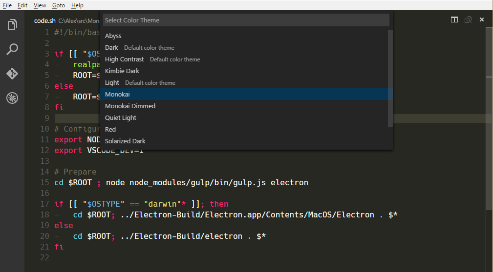

---
# DO NOT TOUCH — Managed by doc writer
ContentId: 2F27A240-8E36-4CC2-973C-9A1D8069F83F
DateApproved: 7/3/2019

# Summarize the whole topic in less than 300 characters for SEO purpose
MetaDescription: To extend Visual Studio Code, your extension (plug-in) declares which of the various Contribution Points it is using in its package.json Extension Manifest file.
---

# Contribution Points

**Contribution Points** are a set of JSON declarations that you make in the `contributes` field of the `package.json` [Extension Manifest](/api/references/extension-manifest). Your extension registers **Contribution Points** to extend various functionalities within Visual Studio Code. Here is a list of all available **Contribution Points**:

- [`configuration`](/api/references/contribution-points#contributes.configuration)
- [`commands`](/api/references/contribution-points#contributes.commands)
- [`menus`](/api/references/contribution-points#contributes.menus)
- [`keybindings`](/api/references/contribution-points#contributes.keybindings)
- [`languages`](/api/references/contribution-points#contributes.languages)
- [`debuggers`](/api/references/contribution-points#contributes.debuggers)
- [`breakpoints`](/api/references/contribution-points#contributes.breakpoints)
- [`grammars`](/api/references/contribution-points#contributes.grammars)
- [`themes`](/api/references/contribution-points#contributes.themes)
- [`snippets`](/api/references/contribution-points#contributes.snippets)
- [`jsonValidation`](/api/references/contribution-points#contributes.jsonValidation)
- [`views`](/api/references/contribution-points#contributes.views)
- [`viewsContainers`](/api/references/contribution-points#contributes.viewsContainers)
- [`problemMatchers`](/api/references/contribution-points#contributes.problemMatchers)
- [`problemPatterns`](/api/references/contribution-points#contributes.problemPatterns)
- [`taskDefinitions`](/api/references/contribution-points#contributes.taskDefinitions)
- [`colors`](/api/references/contribution-points#contributes.colors)
- [`typescriptServerPlugins`](/api/references/contribution-points#contributes.typescriptServerPlugins)

## contributes.configuration

Contribute configuration keys that will be exposed to the user. The user will be able to set these configuration options as User Settings or as Workspace Settings, either by using the Settings UI or by editing the JSON settings file directly.

### Configuration example

```json
"contributes": {
    "configuration": {
        "title": "TypeScript",
        "properties": {
            "typescript.useCodeSnippetsOnMethodSuggest": {
                "type": "boolean",
                "default": false,
                "description": "Complete functions with their parameter signature."
            },
            "typescript.tsdk": {
                "type": ["string", "null"],
                "default": null,
                "description": "Specifies the folder path containing the tsserver and lib*.d.ts files to use."
            }
        }
    }
}
```


You can read these values from your extension using `vscode.workspace.getConfiguration('myExtension')`.

### Configuration schema

Your configuration entry is used both to provide intellisense when editing your settings in the JSON editor, and to define the way they appear in the settings UI.


**title**

The `title` 1️⃣️ is the main heading that will be used for your configuration section. Normally you will only have one section for your extension.

```json
"configuration": {
    "title": "GitMagic",
    ...
}
```

The title should be the exact name of your extension. Words like "Extension", "Configuration", and "Settings" are redundant.

- ✔ `"title": "GitMagic"`
- ❌ `"title": "GitMagic Extension"`
- ❌ `"title": "GitMagic Configuration"`
- ❌ `"title": "GitMagic Extension Configuration Settings"`

**properties**

The `properties` 2️⃣ in your configuration will be a dictionary of configuration properties.

In the Settings UI, your configuration key will be used to namespace and construct a title. Capital letters in your key are used to indicate word breaks. For example, if your key is `gitMagic.blame.dateFormat`, the generated title for the setting will look like this:

> Blame: **Date Format**

Entries will be grouped according to the hierarchy established in your keys. So for example, these entries

```json
gitMagic.blame.dateFormat
gitMagic.blame.format
gitMagic.blame.heatMap.enabled
gitMagic.blame.heatMap.location
```

will appear in a single group like this:

> Blame: **Date Format**
>
> Blame: **Format**
>
> Blame › Heatmap: **Enabled**
>
> Blame › Heatmap: **Location**

Otherwise, properties appear in alphabetical order (**not** the order in which they're listed in the manifest).

### Configuration property schema

Configuration keys are defined using a superset of [JSON
Schema](https://json-schema.org/understanding-json-schema/reference/index.html).

**description** / **markdownDescription**

Your `description` 3️⃣ appears after the title and before the input field, except for booleans, where the description is used as the label for the checkbox. 6️⃣

```json
"gitMagic.blame.heatmap.enabled": {
    "description": "Specifies whether to provide a heatmap indicator in the gutter blame annotations",
    ...
}

```

If you use `markdownDescription` instead of `description`, your setting description will be rendered as Markdown in the settings UI.

```json
"gitMagic.blame.dateFormat": {
    "markdownDescription": "Specifies how to format absolute dates (e.g. using the `${date}` token)
        in gutter blame annotations. See the [Moment.js docs](https://momentjs.com/docs/#/displaying/format/)
        for valid formats",
    ...
}
```

**type**

Entries of type `number` 4️⃣ , `string` 5️⃣ , `boolean` 6️⃣ can be edited directly in the Settings UI.

```json
"gitMagic.views.pageItemLimit": {
    "type": "number",
    "default": 20,
    "markdownDescription": "Specifies the number of items to show in each page when paginating a view list. Use 0 to specify no limit",
}
```

For `boolean` entries, the `description` (or `markdownDescription`) will be used as the label for the checkbox.

```json
"gitMagic.blame.compact": {
    "type": "boolean",
    "description": "Specifies whether to compact (deduplicate) matching adjacent gutter blame annotations",
},
```

Other types, such as `object` and `array`, aren't exposed directly in the settings UI, and can only be modified by editing the JSON directly. Instead of controls for editing them, users will see a link to `Edit in settings.json` as shown in the screenshot above. 8️⃣

**enum** / **enumDescriptions**

If you provide an array of items under the `enum` 7️⃣ property, the settings UI will render a dropdown menu.


You can also provide an `enumDescriptions` property, which provides descriptive text rendered at the bottom of the dropdown:

```json
"gitMagic.blame.heatmap.location": {
    "type": "string",
    "default": "right",
    "enum": [
        "left",
        "right"
    ],
    "enumDescriptions": [
        "Adds a heatmap indicator on the left edge of the gutter blame annotations",
        "Adds a heatmap indicator on the right edge of the gutter blame annotations"
    ],
},
```

**Other JSON Schema properties**

You can use any the properties defined by JSON Schema to describe other constraints on configuration values.

- `default` for defining the default value of a property
- `minimum` and `maximum` for restricting numeric values
- `maxLength`, `minLength` for restricting string length
- `pattern` for restricting strings to a given regular expression
- `format` for restricting strings to well-known formats, such as `date`, `time`, `ipv4`, `email`,
  and `uri`
- `maxItems`, `minItems` for restricting array length

For more details on these and other features, see the [JSON Schema Reference](https://json-schema.org/understanding-json-schema/reference/index.html).

**scope**

A configuration setting can have one of four possible scopes:

- `application` - Settings that apply to all instances of VS Code and can only be configured in user settings.
- `window` - Windows (instance) specific settings which can be configured in user, workspace, or remote settings.
- `machine` - Machine specific settings. For example, an installation path which shouldn't be shared across machines.
- `resource` - Resource settings, which apply to files and folders and can be configured in all settings levels, even folder settings.

Configuration scopes determine when a setting is available to the user through the Settings editor and whether the setting is applicable.

Below are example configuration scopes from the built-in Git extension:

```json
"contributes": {
    "configuration": {
        "title": "Git",
        "properties": {
            "git.alwaysSignOff": {
                "type": "boolean",
                "scope": "resource",
                "default": false,
                "description": "%config.alwaysSignOff%"
            },
            "git.ignoredRepositories": {
                "type": "array",
                "default": [],
                "scope": "window",
                "description": "%config.ignoredRepositories%"
            },
        }
    }
}
```

You can see that `git.alwaysSignOff` has `resource` scope and can be set per user, workspace, or folder, while the ignored repositories list with `window` scope applies more globally for the VS Code window or workspace (which might be multi-root).

## contributes.configurationDefaults

Contribute default language-specific editor configurations. This will override default editor configurations for the provided language.

The following example contributes default editor configurations for the `markdown` language:

### Configuration default example

```json
"contributes": {
    "configurationDefaults": {
        "[markdown]": {
            "editor.wordWrap": "on",
            "editor.quickSuggestions": false
        }
    }
}
```

## contributes.commands

Contribute the UI for a command consisting of a title and (optionally) an icon, category, and enabled state. Enablement is expressed with `when` [clauses](/docs/getstarted/keybindings#_when-clause-contexts). By default, commands show in the **Command Palette** (`kb(workbench.action.showCommands)`) but they can also show in other [menus](/api/references/contribution-points#contributes.menus).

Presentation of contributed commands depends on the containing menu. The **Command Palette**, for
instance, prefixes commands with their `category`, allowing for easy grouping. However, the
**Command Palette** doesn't show icons nor disabled commands. The editor context menu, on the other
hand, shows disabled items but doesn't show the category label.

> **Note:** When a command is invoked (from a key binding, from the **Command Palette**, any other menu, or programmatically), VS Code will emit an activationEvent `onCommand:${command}`.

### command example

```json
"contributes": {
    "commands": [{
        "command": "extension.sayHello",
        "title": "Hello World",
        "category": "Hello"
    }]
}
```

See the [Commands Extension Guide](https://code.visualstudio.com/api/extension-guides/command) to learn more about using commands in VS Code extensions.


## contributes.menus

Contribute a menu item for a command to the editor or Explorer. The menu item definition contains the command that should be invoked when selected and the condition under which the item should show. The latter is defined with the `when` clause, which uses the key bindings [when clause contexts](/docs/getstarted/keybindings#_when-clause-contexts).

In addition to the mandatory `command` property, an alternative command can be defined using the `alt`-property. It will be shown and invoked when pressing `kbstyle(Alt)` while opening a menu.

Last, a `group` property defines sorting and grouping of menu items. The `navigation` group is special as it will always be sorted to the top/beginning of a menu.

> **Note** that `when` clauses apply to menus and `enablement` clauses to commands. The `enablement` applies to all menus and even keybindings while the `when` only applies to a single menu.

Currently extension writers can contribute to:

- The global Command Palette - `commandPalette`
- The Explorer context menu - `explorer/context`
- The editor context menu - `editor/context`
- The editor title menu bar - `editor/title`
- The editor title context menu - `editor/title/context`
- The debug callstack view context menu - `debug/callstack/context`
- The debug toolbar - `debug/toolbar`
- The [SCM title menu](/api/extension-guides/scm-provider#menus) - `scm/title`
- [SCM resource groups](/api/extension-guides/scm-provider#menus) menus - `scm/resourceGroup/context`
- [SCM resources](/api/extension-guides/scm-provider#menus) menus - `scm/resource/context`
- [SCM change title](/api/extension-guides/scm-provider#menus) menus - `scm/change/title`
- The [View title menu](/api/references/contribution-points#contributes.views) - `view/title`
- The [View item menu](/api/references/contribution-points#contributes.views) - `view/item/context`
- The macOS Touch Bar - `touchBar`
- The comment thread title - `comments/commentThread/title`
- The comment thread actions - `comments/commentThread/context`
- The comment title - `comments/comment/title`
- The comment actions - `comments/comment/context`

> **Note:** When a command is invoked from a (context) menu, VS Code tries to infer the currently selected resource and passes that as a parameter when invoking the command. For instance, a menu item inside the Explorer is passed the URI of the selected resource and a menu item inside an editor is passed the URI of the document.

In addition to a title, commands can also define icons which VS Code will show in the editor title menu bar.

### menu example

```json
"contributes": {
    "menus": {
        "editor/title": [{
            "when": "resourceLangId == markdown",
            "command": "markdown.showPreview",
            "alt": "markdown.showPreviewToSide",
            "group": "navigation"
        }]
    }
}
```


### Context specific visibility of Command Palette menu items

When registering commands in `package.json`, they will automatically be shown in the **Command Palette** (`kb(workbench.action.showCommands)`). To allow more control over command visibility, there is the `commandPalette` menu item. It allows you to define a `when` condition to control if a command should be visible in the **Command Palette** or not.

The snippet below makes the 'Hello World' command only visible in the **Command Palette** when something is selected in the editor:

```json
"commands": [{
    "command": "extension.sayHello",
    "title": "Hello World"
}],
"menus": {
    "commandPalette": [{
        "command": "extension.sayHello",
        "when": "editorHasSelection"
    }]
}
```

### Sorting of groups

Menu items can be sorted into groups. They are sorted in lexicographical order with the following defaults/rules.
You can add menu items to these groups or add new groups of menu items in between, below, or above.

The **editor context menu** has these default groups:

- `navigation` - The `navigation` group comes first in all cases.
- `1_modification` - This group comes next and contains commands that modify your code.
- `9_cutcopypaste` - The second last default group with the basic editing commands.
- `z_commands` - The last default group with an entry to open the Command Palette.


The **explorer context menu** has these default groups:

- `navigation` - Commands related to navigation across VS Code. This group comes first in all cases.
- `2_workspace` - Commands related to workspace manipulation.
- `3_compare` - Commands related to comparing files in the diff editor.
- `4_search` - Commands related to searching in the search view.
- `5_cutcopypaste` - Commands related to cutting, copying, and pasting of files.
- `6_copypath` - Commands related to copying file paths.
- `7_modification` - Commands related to the modification of file.

The **editor tab context menu** has these default groups:

- `1_close` - Commands related to closing editors.
- `3_preview` - Commands related to pinning editors.

The **editor title menu** has these default groups:

- `1_diff` - Commands related to working with diff editors.
- `3_open` - Commands related to opening editors.
- `5_close` - Commands related to closing editors.

### Sorting inside groups

The order inside a group depends on the title or an order-attribute. The group-local order of a menu item is specified by appending `@<number>` to the group identifier as shown below:

```json
"editor/title": [{
    "when": "editorHasSelection",
    "command": "extension.Command",
    "group": "myGroup@1"
}]
```

## contributes.keybindings

Contribute a key binding rule defining what command should be invoked when the user presses a key combination. See the [Key Bindings](/docs/getstarted/keybindings) topic where key bindings are explained in detail.

Contributing a key binding will cause the Default Keyboard Shortcuts to display your rule, and every UI representation of the command will now show the key binding you have added. And, of course, when the user presses the key combination the command will be invoked.

> **Note:** Because VS Code runs on Windows, macOS and Linux, where modifiers differ, you can use "key" to set the default key combination and overwrite it with a specific platform.

> **Note:** When a command is invoked (from a key binding or from the Command Palette), VS Code will emit an activationEvent `onCommand:${command}`.

### keybinding example

Defining that `kbstyle(Ctrl+F1)` under Windows and Linux and `kbstyle(Cmd+F1)` under macOS trigger the `"extension.sayHello"` command:

```json
"contributes": {
    "keybindings": [{
        "command": "extension.sayHello",
        "key": "ctrl+f1",
        "mac": "cmd+f1",
        "when": "editorTextFocus"
    }]
}
```


## contributes.languages

Contribute definition of a language. This will introduce a new language or enrich the knowledge VS Code has about a language.

The main effects of `contributes.languages` are:

- Define a `languageId` that can be reused in other parts of VS Code API, such as `vscode.TextDocument.getLanguageId()` and the `onLanguage` Activation Events.
  - You can contribute a human-readable using the `aliases` field. The first item in the list will be used as the human-readable label.
- Associate file name extensions, file name patterns, files that begin with a specific line (such as hashbang), mimetypes to that `languageId`.
- Contribute a set of [Declarative Language Features](/api/language-extensions/overview#declarative-language-features) for the contributed language. Learn more about the configurable editing features in the [Language Configuration Guide](/api/language-extensions/language-configuration-guide).

### language example

```json
...
"contributes": {
    "languages": [{
        "id": "python",
        "extensions": [ ".py" ],
        "aliases": [ "Python", "py" ],
        "filenames": [ ... ],
        "firstLine": "^#!/.*\\bpython[0-9.-]*\\b",
        "configuration": "./language-configuration.json"
    }]
}
```

## contributes.debuggers

Contribute a debugger to VS Code. A debugger contribution has the following properties:

- `type` is a unique ID that is used to identify this debugger in a launch configuration.
- `label` is the user visible name of this debugger in the UI.
- `program` the path to the debug adapter that implements the VS Code debug protocol against the real debugger or runtime.
- `runtime` if the path to the debug adapter is not an executable but needs a runtime.
- `configurationAttributes` is the schema for launch configuration arguments specific to this debugger.
- `initialConfigurations` lists launch configurations that are used to populate an initial launch.json.
- `configurationSnippets` lists launch configurations that are available through IntelliSense when editing a launch.json.
- `variables` introduces substitution variables and binds them to commands implemented by the debugger extension.
- `languages` those languages for which the debug extension could be considered the "default debugger".
- `adapterExecutableCommand` the command ID where the debug adapters executable path and arguments are dynamically calculated. The command returns a structure with this format:

  ```json
  command: "<executable>",
  args: [ "<argument1>", "<argument2>", ... ]
  ```

  The attribute `command` must be either an absolute path to an executable or a name of executable looked up via the PATH environment variable. The special value `node` will be mapped to VS Code's built-in node runtime without being looked up on the PATH.

### debugger example

```json
"contributes": {
    "debuggers": [{
        "type": "node",
        "label": "Node Debug",

        "program": "./out/node/nodeDebug.js",
        "runtime": "node",

        "languages": ["javascript", "typescript", "javascriptreact", "typescriptreact"],

        "configurationAttributes": {
            "launch": {
                "required": [ "program" ],
                "properties": {
                    "program": {
                        "type": "string",
                        "description": "The program to debug."
                    }
                }
            }
        },

        "initialConfigurations": [{
            "type": "node",
            "request": "launch",
            "name": "Launch Program",
            "program": "${workspaceFolder}/app.js"
        }],

        "configurationSnippets": [
            {
                "label": "Node.js: Attach Configuration",
                "description": "A new configuration for attaching to a running node program.",
                "body": {
                    "type": "node",
                    "request": "attach",
                    "name": "${2:Attach to Port}",
                    "port": 9229
                }
            }
        ],

        "variables": {
            "PickProcess": "extension.node-debug.pickNodeProcess"
        }
    }]
}
```

For a full walkthrough on how to integrate a `debugger`, go to [Debugger Extension](/api/extension-guides/debugger-extension).

## contributes.breakpoints

Usually a debugger extension will also have a `contributes.breakpoints` entry where the extension lists the language file types for which setting breakpoints will be enabled.

```json
"contributes": {
    "breakpoints": [
        {
            "language": "javascript"
        },
        {
            "language": "javascriptreact"
        }
    ]
}
```

## contributes.grammars

Contribute a TextMate grammar to a language. You must provide the `language` this grammar applies to, the TextMate `scopeName` for the grammar and the file path.

> **Note:** The file containing the grammar can be in JSON (filenames ending in .json) or in XML plist format (all other files).

### grammar example

```json
"contributes": {
    "grammars": [{
        "language": "markdown",
        "scopeName": "text.html.markdown",
        "path": "./syntaxes/markdown.tmLanguage.json",
        "embeddedLanguages": {
            "meta.embedded.block.frontmatter": "yaml",
            ...
        }
    }]
}
```

See the [Syntax Highlight Guide](/api/language-extensions/syntax-highlight-guide) to learn more about how to register TextMate grammars associated with a language to receive syntax highlighting.


## contributes.themes

Contribute a TextMate theme to VS Code. You must specify a label, whether the theme is a dark theme or a light theme (such that the rest of VS Code changes to match your theme) and the path to the file (XML plist format).

### theme example

```json
"contributes": {
    "themes": [{
        "label": "Monokai",
        "uiTheme": "vs-dark",
        "path": "./themes/Monokai.tmTheme"
    }]
}
```



See the [Color Theme Guide](/api/extension-guides/color-theme) on how to create a Color Theme.

## contributes.snippets

Contribute snippets for a specific language. The `language` attribute is the [language identifier](/docs/languages/identifiers) and the `path` is the relative path to the snippet file, which defines snippets in the [VS Code snippet format](/docs/editor/userdefinedsnippets#_snippet-syntax).

The example below shows adding snippets for the Go language.

```json
"contributes": {
    "snippets": [{
        "language": "go",
        "path": "./snippets/go.json"
    }]
}
```

## contributes.jsonValidation

Contribute a validation schema for a specific type of `json` file. The `url` value can be either a local path to a schema file included in the extension or a remote server URL such as a [json schema store](http://schemastore.org/json).

```json
"contributes": {
    "jsonValidation": [{
        "fileMatch": ".jshintrc",
        "url": "http://json.schemastore.org/jshintrc"
    }]
}
```

## contributes.views

Contribute a view to VS Code. You must specify an identifier and name for the view. You can contribute to following view containers:

- `explorer`: Explorer view container in the Activity Bar
- `scm`: Source Control Management (SCM) view container in the Activity Bar
- `debug`: Debug view container in the Activity Bar
- `test`: Test view container in the Activity Bar
- [Custom view containers](#contributes.viewsContainers) contributed by Extensions.

When the user opens the view, VS Code will then emit an activationEvent `onView:${viewId}` (`onView:nodeDependencies` for the example below). You can also control the visibility of the view by providing the `when` context value.

```json
"contributes": {
    "views": {
        "explorer": [
            {
                "id": "nodeDependencies",
                "name": "Node Dependencies",
                "when": "workspaceHasPackageJSON"
            }
        ]
    }
}
```


Extension writers should create a [TreeView](/api/references/vscode-api#TreeView) by providing a [data provider](/api/references/vscode-api#TreeDataProvider) through `createTreeView` API or register the [data provider](/api/references/vscode-api#TreeDataProvider) directly through `registerTreeDataProvider` API to populate data. Refer to examples [here](https://github.com/Microsoft/vscode-extension-samples/tree/master/tree-view-sample).

## contributes.viewsContainers

Contribute a view container into which [Custom views](#contributes.views) can be contributed. You must specify an identifier, title, and an icon for the view container. At present, you can contribute them to the Activity Bar (`activitybar`) only. Below example shows how the `Package Explorer` view container is contributed to the Activity Bar and how views are contributed to it.

```json
"contributes": {
        "viewsContainers": {
            "activitybar": [
                {
                    "id": "package-explorer",
                    "title": "Package Explorer",
                    "icon": "resources/package-explorer.svg"
                }
            ]
        },
        "views": {
            "package-explorer": [
                {
                    "id": "package-dependencies",
                    "name": "Dependencies"
                },
                {
                    "id": "package-outline",
                    "name": "Outline"
                }
            ]
        }
}
```


### Icon specifications

- `Size:` Icons should be 28x28 and centered.
- `Color:` Icons should use a single monochrome color.
- `Format:` It is recommended that icons be in SVG, though any image file type is accepted.
- `States:` All icons inherit the following state styles:

  | State   | Opacity |
  | ------- | ------- |
  | Default | 60%     |
  | Hover   | 100%    |
  | Active  | 100%    |

## contributes.problemMatchers

Contribute problem matcher patterns. These contributions work in both the output panel runner and in the terminal runner. Below is an example to contribute a problem matcher for the gcc compiler in an extension:

```json
"contributes": {
    "problemMatchers": [
        {
            "name": "gcc",
            "owner": "cpp",
            "fileLocation": ["relative", "${workspaceFolder}"],
            "pattern": {
                "regexp": "^(.*):(\\d+):(\\d+):\\s+(warning|error):\\s+(.*)$",
                "file": 1,
                "line": 2,
                "column": 3,
                "severity": 4,
                "message": 5
            }
        }
    ]
}
```

This problem matcher can now be used in a `tasks.json` file via a name reference `$gcc`. An example looks like this:

```json
{
  "version": "2.0.0",
  "tasks": [
    {
      "label": "build",
      "command": "gcc",
      "args": ["-Wall", "helloWorld.c", "-o", "helloWorld"],
      "problemMatcher": "$gcc"
    }
  ]
}
```

Also see: [Defining a Problem Matcher](/docs/editor/tasks#_defining-a-problem-matcher)

## contributes.problemPatterns

Contributes named problem patterns that can be used in problem matchers (see above).

## contributes.taskDefinitions

Contributes and defines an object literal structure that allows to uniquely identify a contributed task in the system. A task definition has at minimum a `type` property but it usually defines additional properties. For example a task definition for a task representing a script in a package.json file looks like this:

```json
"taskDefinitions": [
    {
        "type": "npm",
        "required": [
            "script"
        ],
        "properties": {
            "script": {
                "type": "string",
                "description": "The script to execute"
            },
            "path": {
                "type": "string",
                "description": "The path to the package.json file. If omitted the package.json in the root of the workspace folder is used."
            }
        }
    }
]
```

The task definition is defined using JSON schema syntax for the `required` and `properties` property. The `type` property defines the task type. If the above example:

- `"type": "npm"` associates the task definition with the npm tasks
- `"required": [ "script" ]` defines that `script` attributes as mandatory. The `path` property is optional.
- `"properties"` : { ... }` defines the additional properties and their types.

When the extension actually creates a Task, it needs to pass a `TaskDefinition` that conforms to the task definition contributed in the package.json file. For the `npm` example a task creation for the test script inside a package.json file looks like this:

```ts
let task = new vscode.Task({ type: 'npm', script: 'test' }, ....);
```

## contributes.colors

Contributes new themable colors. These colors can be used by the extension in editor decorators and in the status bar. Once defined, users can customize the color in the `workspace.colorCustomization` setting and user themes can set the color value.

```json
"contributes": {
  "colors": [{
      "id": "superstatus.error",
      "description": "Color for error message in the status bar.",
      "defaults": {
          "dark": "errorForeground",
          "light": "errorForeground",
          "highContrast": "#010203"
      }
  }]
}
```

Color default values can be defined for light, dark and high contrast theme and can either be a reference to an existing color or a [Color Hex Value](/api/references/theme-color#color-formats).

## contributes.typescriptServerPlugins

Contributes [TypeScript server plugins](https://github.com/Microsoft/TypeScript/wiki/Writing-a-Language-Service-Plugin) that augment VS Code's JavaScript and TypeScript support:

```json
"contributes": {
   "typescriptServerPlugins": [
      {
        "name": "typescript-styled-plugin"
      }
    ]
}
```

The above example extension contributes the [`typescript-styled-plugin`](https://github.com/Microsoft/typescript-styled-plugin) which adds styled-component IntelliSense for JavaScript and TypeScript. This plugin will be loaded from the extension and must be installed as a normal NPM `dependency` in the extension:

```json
{
  "dependencies": {
    "typescript-styled-plugin": "*"
  }
}
```

TypeScript server plugins are loaded for all JavaScript and TypeScript files when the user is using VS Code's version of TypeScript. They are not activated if the user is using a workspace version of TypeScript.

## contributes.resourceLabelFormatters

Contributes resource label formatters that specify how to display URIs everywhere in the workbench. For example here's how an extension could contribute a formatter for URIs with scheme `remotehub`:

```json
"contributes": {
   "resourceLabelFormatters": [
        {
            "scheme": "remotehub",
            "formatting": {
                "label": "${path}",
                "separator": "/",
                "workspaceSuffix": "GitHub"
            }
        }
    ]
}
```

This means that all URIs that have a scheme `remotehub` will get rendered by showing only the `path` segment of the URI and the separator will be `/`. Workspaces which have the `remotehub` URI will have the GitHub suffix in their label.

### Plugin configuration

Extensions can send configuration data to contributed TypeScript plugins through an API provided by VS Code's built-in TypeScript extension:

```ts
// In your VS Code extension

export async function activate(context: vscode.ExtensionContext) {
  // Get the TS extension
  const tsExtension = vscode.extensions.getExtension('vscode.typescript-language-features');
  if (!tsExtension) {
    return;
  }

  await tsExtension.activate();

  // Get the API from the TS extension
  if (!tsExtension.exports || !tsExtension.exports.getAPI) {
    return;
  }

  const api = tsExtension.exports.getAPI(0);
  if (!api) {
    return;
  }

  // Configure the 'my-typescript-plugin-id' plugin
  api.configurePlugin('my-typescript-plugin-id', {
    someValue: process.env['SOME_VALUE']
  });
}
```

The TypeScript server plugin receives the configuration data through an `onConfigurationChanged` method:

```ts
// In your TypeScript plugin

import * as ts_module from 'typescript/lib/tsserverlibrary';

export = function init({ typescript }: { typescript: typeof ts_module }) {
  return {
    create(info: ts.server.PluginCreateInfo) {
      // Create new language service
    },
    onConfigurationChanged(config: any) {
      // Receive configuration changes sent from VS Code
    }
  };
};
```

This API allows VS Code extensions to synchronize VS Code settings with a TypeScript server plugin, or dynamically change the behavior of a plugin. Take a look at the [TypeScript TSLint plugin](https://github.com/Microsoft/vscode-typescript-tslint-plugin/blob/master/src/index.ts) and [lit-html](https://github.com/mjbvz/vscode-lit-html/blob/master/src/index.ts) extensions to see how this API is used in practice.
