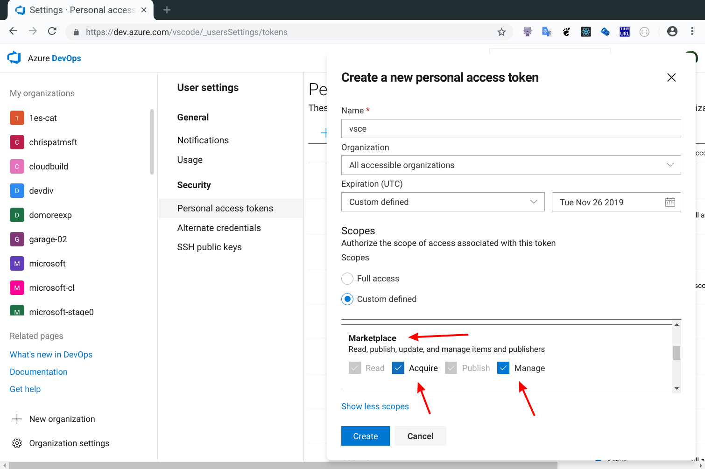

---
# DO NOT TOUCH — Managed by doc writer
ContentId: 7EA90618-43A3-4873-A9B5-61CC131CE4EE
DateApproved: 7/3/2019

# Summarize the whole topic in less than 300 characters for SEO purpose
MetaDescription: Learn how to publish Visual Studio Code extensions to the public Marketplace and share them with other developers.
---

# Publishing Extension

Once you have made a high-quality extension, you can publish it to the [VS Code Extension Marketplace](https://marketplace.visualstudio.com/vscode) so others can find, download and use your extension. Alternatively, you can [package](#packaging-extensions) an extension into the installable VSIX format and share it with other users.

This topics covers:

- Using [`vsce`](#vsce), the CLI tool for managing VS Code extensions
- [Packaging](#packaging-extensions), [publishing](#publishing-extensions) and [unpublishing](#unpublishing-extensions) extensions
- [Registering a `publisherId`](#create-a-publisher) necessary for publishing extensions

## vsce

[vsce](https://github.com/Microsoft/vsce), short for "Visual Studio Code Extensions", is a command-line tool for packaging, publishing and managing VS Code extensions.

### Installation

Make sure you have [Node.js](https://nodejs.org/) installed. Then run:

```bash
npm install -g vsce
```

### Usage

You can use `vsce` to easily [package](#packaging-extensions) and [publish](#publishing-extensions) your extensions:

```bash
$ cd myExtension
$ vsce package
# myExtension.vsix generated
$ vsce publish
# <publisherID>.myExtension published to VS Code MarketPlace
```

`vsce` can also search, get metadata of and unpublish extensions. For a reference on all the available `vsce` commands, run `vsce --help`.

## Publishing extensions

---

**Note:** Due to security concerns, `vsce` will not publish extensions which contain user provided SVG images.

The publishing tool checks the following constraints:

- The icon provided in `package.json` may not be an SVG.
- The badges provided in the `package.json` may not be SVGs unless they are from [trusted badge providers](/api/references/extension-manifest#approved-badges).
- Image URLs in `README.md` and `CHANGELOG.md` need to resolve to `https` URLs.
- Images in `README.md` and `CHANGELOG.md` may not be SVGs unless they are from [trusted badge providers](/api/references/extension-manifest#approved-badges).

---

Visual Studio Code leverages [Azure DevOps](https://azure.microsoft.com/services/devops/) for its Marketplace services. This means that authentication, hosting, and management of extensions are provided through Azure DevOps.

`vsce` can only publish extensions using [Personal Access Tokens](https://docs.microsoft.com/azure/devops/integrate/get-started/authentication/pats). You need to create at least one in order to publish an extension.

### Get a Personal Access Token

First, make sure you have an Azure DevOps [organization](https://docs.microsoft.com/azure/devops/organizations/accounts/create-organization-msa-or-work-student).

In the following examples, the organization's name is `vscode`. From your organization's home page (for example: `https://dev.azure.com/vscode`), go to the **Security** page:


Select `Personal access tokens` and click **New Token** to create a new Personal Access Token:


Give the Personal Access Token a name, optionally extend its expiration date to 1 year, make it accessible to every organization, select a **custom defined** scope ruleset and click **Show all scopes**:


Finally, scroll down the list of possible scopes until you find **Marketplace** and select both **Acquire** and **Manage**:



Click **Create** and you'll be presented with your newly created Personal Access Token. **Copy** it, you'll need it to create a publisher.

### Create a publisher

A **publisher** is an identity who can publish extensions to the Visual Studio Code Marketplace. Every extension needs to include a `publisher` name in its [`package.json` file](/api/references/extension-manifest).

Once you have a [Personal Access Token](/api/working-with-extensions/publishing-extension#get-a-personal-access-token), you can create a new publisher using `vsce`:

```bash
vsce create-publisher (publisher name)
```

`vsce` will remember the provided Personal Access Token for future references to this publisher.

**Note:** Alternatively, create your publisher in the Marketplace publisher [management page](https://marketplace.visualstudio.com/manage) and login in `vsce`, as described in the next section.

### Login to a publisher

If you already created a publisher before and want to use it with `vsce`:

```bash
vsce login (publisher name)
```

Similarly to the `create-publisher` command, `vsce` will ask you for the Personal Access Token and remember it for future commands.

You can also enter your Personal Access Token as you publish with an optional parameter `-p <token>`.

```bash
vsce publish -p <token>
```

## Auto-incrementing the extension version

You can auto-increment an extension's version number when you publish by specifying the [SemVer](https://semver.org/) compatible number to increment: `major`, `minor`, or `patch`.

For example, if you want to update an extension's version from 1.0.0 to 1.1.0, you would specify `minor`:

```bash
vsce publish minor
```

This will modify the extension's `package.json` [version](/api/references/extension-manifest#fields) attribute before publishing the extension.

You can also specify a complete SemVer compatible version on the command line:

```bash
vsce publish 2.0.1
```

>  **Note:** If `vsce publish` is run in a git repo, it will also create a version commit and tag via [npm-version](https://docs.npmjs.com/cli/version#description).  The default commit message will be extension's version, but you can supply a custom commit message using the `-m` flag.  (The current version can be referenced from
the commit message with `%s`.)

## Unpublishing extensions

You can unpublish an extension with the vsce tool by specifying the extension id `publisher.extension`.

```bash
vsce unpublish (publisher name).(extension name)
```

> **Note:** When you unpublish an extension, the Marketplace will remove any extension statistics it has collected. You may want to update your extension rather than unpublish it.

## Packaging extensions

If you want to test an extension on your local install of VS Code or distribute an extension without publishing it to VS Code MarketPlace, you can choose to package your extension. `vsce` can package your extension into a `VSIX` file, from which users can easily install. Some extensions publish VSIX files to each GitHub release.

For extension authors, they can run `vsce package` in extension root folder to create such VSIX files.

For users who receive such a VSIX file, they can install the extension with `code --install-extension my-extension-0.0.1.vsix`.

### Sharing privately with others

If you want to share your extension with others privately, you can send them your packaged extension `.vsix` file.

## Your extension folder

To load an extension, you need to copy the files to your VS Code extensions folder `.vscode/extensions`. Depending on your platform, it is located in the following folders:

- **Windows** `%USERPROFILE%\.vscode\extensions`
- **macOS** `~/.vscode/extensions`
- **Linux** `~/.vscode/extensions`

## Visual Studio Code compatibility

When authoring an extension, you will need to describe what is the extension's compatibility to Visual Studio Code itself. This can done via the `engines.vscode` field inside `package.json`:

```json
{
  "engines": {
    "vscode": "^1.8.0"
  }
}
```

A value of `1.8.0` means that your extension is compatible only with VS Code `1.8.0`. A value of `^1.8.0` means that your extension is compatible with VS Code `1.8.0` and onwards, including `1.8.1`, `1.9.0`, etc.

You can use the `engines.vscode` field to make sure the extension only gets installed for clients which contain the API you depend on. This mechanism plays well with the Stable release as well as the Insiders one.

For example, imagine that the latest Stable version of VS Code is `1.8.0` and that during `1.9.0`'s development a new API is introduced and thus made available in the Insider release through version `1.9.0-insider`. If you want to publish an extension version which benefits from this API, you should indicate a version dependency of `^1.9.0`. Your new extension version will be installed only on VS Code `>=1.9.0`, which means all current Insider customers will get it, while the Stable ones will only get the update when Stable reaches `1.9.0`.

## Advanced usage

### Marketplace integration

You can customize how your extension looks in the Visual Studio Marketplace. See the [Go extension](https://marketplace.visualstudio.com/items/ms-vscode.Go) for an example.

Here are some tips for making your extension look great on the Marketplace:

- A `README.md` file at the root of your extension will be used to populate the extension's Marketplace page's contents. `vsce` will modify README links for you in two different ways:
  - If you add a `repository` field to your `package.json` and if it is a public GitHub repository, `vsce` will automatically detect it and adjust the links accordingly.
  - You can override that behavior and/or set it by using the `--baseContentUrl` and `--baseImagesUrl` flags when running `vsce package`. Then publish the extension by passing the path to the packaged `.vsix` file as an argument to `vsce publish`.
- A `LICENSE` file at the root of your extension will be used as the contents for the extension's license.
- A `CHANGELOG.md` file at the root of your extension will be used as the contents for the extension's change log.
- You can set the banner background color by setting `galleryBanner.color` to the intended hex value in `package.json`.
- You can set an icon by setting `icon` to a relative path to a squared `128px` PNG file included in your extension, in `package.json`.

Also see [Marketplace Presentation Tips](/api/references/extension-manifest#marketplace-presentation-tips).

### `.vscodeignore`

You can create a `.vscodeignore` file to exclude some files from being included in your extension's package. This file is a collection of [glob](https://github.com/isaacs/minimatch) patterns, one per line.

For example:

```bash
**/*.ts
**/tsconfig.json
!file.ts
```

You should ignore all files not needed at runtime. For example, if your extension is written in TypeScript, you should ignore all `**/*.ts` files, like in the previous example.

**Note:** Development dependencies listed in `devDependencies` will be automatically ignored, you don't need to add them to the `.vscodeignore` file.

### Pre-publish step

It's possible to add a pre-publish step to your manifest file. The command will be called every time the extension is packaged.

```json
{
  "name": "uuid",
  "version": "0.0.1",
  "publisher": "someone",
  "engines": {
    "vscode": "0.10.x"
  },
  "scripts": {
    "vscode:prepublish": "tsc"
  }
}
```

This will always invoke the [TypeScript](https://www.typescriptlang.org/) compiler whenever the extension is packaged.

## Next steps

* [Extension Marketplace](/docs/editor/extension-gallery) - Learn more about VS Code's public extension Marketplace.
* [Testing Extensions](/api/working-with-extensions/testing-extension) - Add tests to your extension project to ensure high quality.
* [Bundling Extensions](/api/working-with-extensions/bundling-extension) - Improve load times by bundling your extension files with webpack.

## Common questions

### I get 403 Forbidden (or 401 Unauthorized) error when I try to publish my extension?

One easy mistake to make when creating the PAT (Personal Access Token) is to not select `all accessible accounts` in the Accounts field drop-down (instead selecting a specific account). You should also set the Authorized Scopes to `All scopes` for the publish to work.

### I can't unpublish my extension through the `vsce` tool?

You may have changed your extension ID or publisher name. You can also manage your extensions directly on the Marketplace by going to the [manage page](https://marketplace.visualstudio.com/manage). You can update or unpublish your extension from your publisher manage page.

### Why does vsce not preserve file attributes?

Please note that when building and publishing your extension from Windows, all the files included in the extension package will lack POSIX file attributes, namely the executable bit. Some `node_modules` dependencies rely on those attributes to properly function. Publishing from Linux and macOS works as expected.
