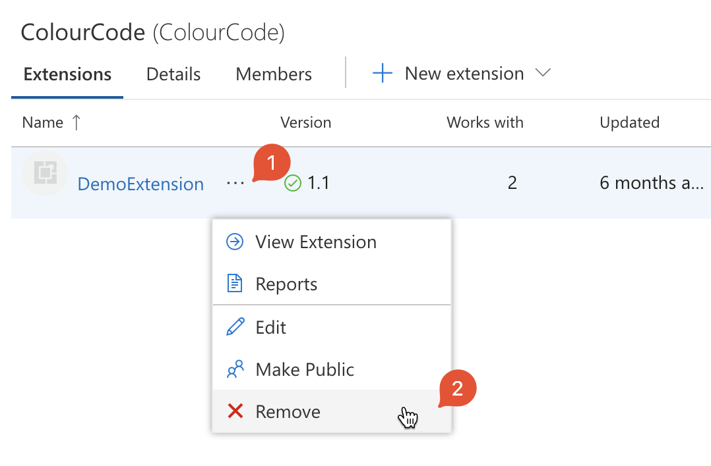
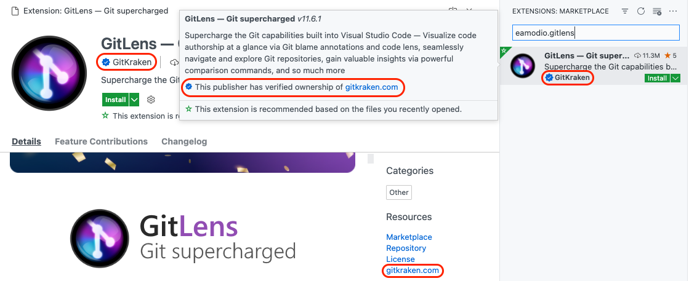
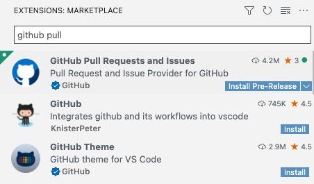

---
# DO NOT TOUCH — Managed by doc writer
ContentId: 7EA90618-43A3-4873-A9B5-61CC131CE4EE
DateApproved: 8/3/2023

# Summarize the whole topic in less than 300 characters for SEO purpose
MetaDescription: Learn how to publish Visual Studio Code extensions to the public Marketplace and share them with other developers.
---

# Publishing Extensions

Once you have made a high-quality extension, you can publish it to the [VS Code Extension Marketplace](https://marketplace.visualstudio.com/vscode) so others can find, download, and use your extension. Alternatively, you can [package](#packaging-extensions) an extension into the installable VSIX format and share it with other users.

This topic covers:

- Using [vsce](#vsce), the CLI tool for managing VS Code extensions
- [Packaging](#packaging-extensions), [publishing](#publishing-extensions) and [unpublishing](#unpublishing-extensions) extensions
- [Registering a publisher](#create-a-publisher) necessary for publishing extensions

## vsce

[vsce](https://github.com/microsoft/vscode-vsce), short for "Visual Studio Code Extensions", is a command-line tool for packaging, publishing and managing VS Code extensions.

### Installation

Make sure you have [Node.js](https://nodejs.org/) installed. Then run:

```bash
npm install -g @vscode/vsce
```

### Usage

You can use `vsce` to easily [package](#packaging-extensions) and [publish](#publishing-extensions) your extensions:

```bash
$ cd myExtension
$ vsce package
# myExtension.vsix generated
$ vsce publish
# <publisher id>.myExtension published to VS Code Marketplace
```

`vsce` can also search, retrieve metadata, and unpublish extensions. For a reference on all the available `vsce` commands, run `vsce --help`.

## Publishing extensions

---

**Note:** Due to security concerns, `vsce` will not publish extensions that contain user-provided SVG images.

The publishing tool checks the following constraints:

- The icon provided in `package.json` may not be an SVG.
- The badges provided in the `package.json` may not be SVGs unless they are from [trusted badge providers](/api/references/extension-manifest#approved-badges).
- Image URLs in `README.md` and `CHANGELOG.md` need to resolve to `https` URLs.
- Images in `README.md` and `CHANGELOG.md` may not be SVGs unless they are from [trusted badge providers](/api/references/extension-manifest#approved-badges).

---

Visual Studio Code uses [Azure DevOps](https://azure.microsoft.com/services/devops/) for its Marketplace services. This means that authentication, hosting, and management of extensions are provided through Azure DevOps.

`vsce` can only publish extensions using [Personal Access Tokens](https://learn.microsoft.com/azure/devops/organizations/accounts/use-personal-access-tokens-to-authenticate). You need to create at least one in order to publish an extension.

### Get a Personal Access Token

First off, follow the documentation to [create your own organization](https://learn.microsoft.com/azure/devops/organizations/accounts/create-organization) in Azure DevOps. In the following examples, the organization's name is `vscode`, you should use your new organization name as appropriate. Note that the organization's name doesn't necessarily have to be same as your publisher name.

1. From your organization's home page (for example: `https://dev.azure.com/vscode`), open the User settings dropdown menu next to your profile image and select **Personal access tokens**:

    

1. On the **Personal Access Tokens** page, select **New Token**:

    

1. In the Create a new personal access token modal, select the following details for the token:

    - Name: any name you want for the token
    - Organization: **All accessible organizations**
    - Expiration (optional): set the desired expiration date for the token
    - Scopes: **Custom defined**:
      - click **Show all scopes** link below the **Scopes** section
      - in the Scopes list, scroll to **Marketplace** and select **Manage** scope

    

1. Click **Create**.

    You'll be presented with your newly created Personal Access Token. **Copy** it to the safe location, you'll need it to [create a publisher](#create-a-publisher).

### Create a publisher

A **publisher** is an identity that can publish extensions to the Visual Studio Code Marketplace. Every extension needs to include a `publisher` name in its [`package.json` file](/api/references/extension-manifest).

To create a publisher:

1. Go to the [Visual Studio Marketplace publisher management page](https://marketplace.visualstudio.com/manage).
1. Log in with the same Microsoft account you used to create the [Personal Access Token](#get-a-personal-access-token) in the previous section.
1. Click **Create publisher** in the pane on the left.
1. In the new page, specify the mandatory parameters for a new publisher - identifier and name (**ID** and **Name** fields respectively):

    - **ID**: the **unique** identifier for your publisher in Marketplace that will be used in your extension URLs. ID cannot be changed once created.
    - **Name**: the **unique** name of your publisher that will be displayed in Marketplace with your extensions. This can be your company or brand name.

    Below is an example of publisher identifier and name for the Docker extension:

    

1. Optionally, fill out the rest of the fields.
1. Click **Create**
1. Verify the newly created publisher using `vsce`. In your terminal, run the following command, and when prompted, type the Personal Access Token created in the previous step:

    ```bash
    vsce login <publisher id>

    https://marketplace.visualstudio.com/manage/publishers/
    Personal Access Token for publisher '<publisher id>': ****************************************************

    The Personal Access Token verification succeeded for the publisher '<publisher id>'.
    ```

Once verified, you are ready to publish an extension.

### Publish an extension

You can publish an extension in two ways:

1. Automatically, using `vsce publish` command:

    ```bash
    vsce publish
    ```

    If you haven't already provided your personal access token with the `vsce login` command above, `vsce` will ask for it.

1. Manually, using `vsce package` to package the extension into the installable VSIX format and then uploading it to the [Visual Studio Marketplace publisher management page](https://marketplace.visualstudio.com/manage):

    

## Review extension installs and ratings

The [Visual Studio Marketplace publisher management page](https://marketplace.visualstudio.com/manage) gives you access to each extension's Acquisition Trend over time, as well as Total Acquisition counts and Ratings & Reviews. To see the reports, click an extension or choose **More Actions > Reports**.


## Auto-increment the extension version

When publishing an extension, you can auto-increment its version number by specifying the [SemVer](https://semver.org/)-compatible number or version (`major`, `minor`, or `patch`) to increment. For example, to update an extension's version from 1.0.0 to 1.1.0, you would specify:

```bash
vsce publish minor
```

or

```bash
vsce publish 1.1.0
```

Both commands will first modify the extension's `package.json` [version](/api/references/extension-manifest#fields) attribute and then publish it with the updated version.

> **Note:** If you run `vsce publish` in a git repo, it will also create a version commit and tag via [npm-version](https://docs.npmjs.com/cli/version#description). The default commit message will be the extension's version, but you can supply a custom commit message using the `-m` flag. (The current version can be referenced from the commit message with `%s`).

## Unpublishing extensions

You can unpublish an extension from the [Visual Studio Marketplace publisher management page](https://marketplace.visualstudio.com/manage) by clicking **More Actions > Unpublish**:


Once unpublished, the extension's Availability status is changed to **Unpublished** and it will no longer be available for download from both the Marketplace and Visual Studio Code:


> **Note:** When you unpublish an extension, the Marketplace will preserve the extension statistics.

## Removing extensions

You can remove an extension in two ways:

1. Automatically, using [`vsce`](#vsce) with the `unpublish` command:

    ```bash
    vsce unpublish <publisher id>.<extension name>
    ```

1. Manually, from the [Visual Studio Marketplace publisher management page](https://marketplace.visualstudio.com/manage) by clicking **More Actions > Remove**:

    

In both cases, you will be prompted to confirm the removal by typing the extension name. Note that the removal action is **irreversible**.

> **Note:** When you unpublish an extension, the Marketplace will remove any extension statistics. You may want to update your extension rather than unpublish it.

## Deprecating extensions

You can just deprecate an extension or deprecate in favor of another extension or a setting. The deprecated extension will be rendered with a dimmed strikethrough text in the UI:


Each deprecated extension has a yellow warning icon in the bottom right corner of the extension tile (see the screenshot above). When hovering over the extension tile, you can see deprecation details next to this icon, whether:

- The extension was deprecated without any alternatives:

  

- The extension was deprecated in favor of another extension:

  

- The extension was deprecated in favor of a setting:

  

VS Code will not automatically migrate or uninstall already installed deprecated extensions. If a deprecated extension has an alternative extension, or a setting, VS Code will show a **Migrate** button to help you quickly switch to the specified alternative:


To mark your extension as deprecated, please leave a comment in the [Deprecated extensions](https://github.com/microsoft/vscode-discussions/discussions/1) discussion thread.

> **Note:** For now, extensions are not rendered as deprecated in the Marketplace. This functionality will be available later.

## Packaging extensions

You can choose to package your extension if you want to:

- Test it on your VS Code instance.
- Distribute it without publishing it to the Marketplace.
- Share it with others privately.

Packaging means creating a `.vsix` file that contains your extension. This file can then be installed in VS Code. Some extensions publish `.vsix` files as a part of their GitHub releases.

For extension authors, to package an extension, run the following command in your extension's root folder:

```bash
vsce package
```

This command will create a `.vsix` file in your extension's root folder. For example, `my-extension-0.0.1.vsix`.

For users, to install a `.vsix` file in VS Code:

1. Go to the Extensions view.
1. Click **Views and More Actions...**
1. Select **Install from VSIX...**

or

in your terminal, run the following command:

```bash
# if you use VS Code
code --install-extension my-extension-0.0.1.vsix

# if you use VS Code Insiders
code-insiders --install-extension my-extension-0.0.1.vsix
```

## Your extension folder

To load an extension, you need to copy the files to your VS Code extensions folder `.vscode/extensions`. Depending on your operating system, this folder has a different location:

- **Windows:** `%USERPROFILE%\.vscode\extensions`
- **macOS:** `~/.vscode/extensions`
- **Linux:** `~/.vscode/extensions`

## Visual Studio Code compatibility

When authoring an extension, you must specify the versions of VS Code your extension is compatible with. To do this, use the `engines.vscode` parameter inside `package.json`:

```json
{
  "engines": {
    "vscode": "^1.8.0"
  }
}
```

- A value of `1.8.0` (without caret) means that your extension is compatible only with VS Code `1.8.0`.
- A value of `^1.8.0` means that your extension is compatible with VS Code `1.8.0` and onwards, including `1.8.1`, `1.9.0`, etc.

You can use the `engines.vscode` parameter to ensure the extension only gets installed for clients that contain the API you depend on. This mechanism plays well both with Stable and Insiders releases.

For example, imagine that the latest Stable version of VS Code is `1.8.0`. During the development of version `1.9.0`, a new API was introduced and made available in the Insider release through the version `1.9.0-insider`. If you want to publish an extension version that benefits from this API, you should indicate a version dependency of `^1.9.0`. In this way, your new extension version will only be available on VS Code `>=1.9.0` (in other words, users with the current Insiders release). Users with the VS Code Stable will only get the update when the Stable release reaches version `1.9.0`.

## Advanced usage

### Marketplace integration

You can customize how your extension looks in the Visual Studio Marketplace. See the [Go extension](https://marketplace.visualstudio.com/items/golang.go) for an example.

Here are some tips for making your extension look great on the Marketplace:

- A `README.md` file at the root of your extension will be used to populate the extension's Marketplace page's contents. `vsce` will modify README links for you in two different ways:
  - If you add a `repository` field to your `package.json` and it is a public GitHub repository, `vsce` will automatically detect it and adjust relative links accordingly, using the `master` branch by default. You can override the GitHub branch with the `--githubBranch` flag when running `vsce package` or `vsce publish`.
  - For more fine-grained control, you can set the `--baseContentUrl` and `--baseImagesUrl` flags to set the base URLs for relative links.
- A `LICENSE` file at the root of your extension will be used as the contents for the extension's license.
- A `CHANGELOG.md` file at the root of your extension will be used as the contents for the extension's change log.
- You can set the banner background color by setting `galleryBanner.color` to the intended hex value in `package.json`.
- You can set an icon by setting `icon` to a relative path to a squared `128px` PNG file included in your extension, in `package.json`.

Also see [Marketplace Presentation Tips](/api/references/extension-manifest#marketplace-presentation-tips).

### Verify a publisher

You can become a **verified publisher** by verifying ownership of an [eligible domain](#eligible-domains) associated with your brand or identity. Verifying your publisher will demonstrate your authenticity and add a verified badge to your extensions.



To verify a publisher:

1. Visit the Visual Studio Marketplace publisher [management page](https://marketplace.visualstudio.com/manage).
2. Select or create a publisher you wish to verify.
3. Input an [eligible domain](#eligible-domains) in the **Verified domain** field, save, and select **Verify**.
4. Follow the instructions in the dialog to add a TXT record to your domain's DNS configuration.
5. Select **Verify** to validate that the TXT record has been successfully added.

Once your TXT record has been validated, the Marketplace team will review your request and grant verification within 5 business days.

**Note**: Any changes to the publisher display name will revoke the verified badge.

### Eligible domains

Eligible domains meet the following criteria:

- Cannot be a subdomain ({subdomain}.github.io, {subdomain}.contoso.com, or similar).
- You must be able to manage the DNS configuration settings and add a TXT record.
- Your domain must use HTTPS protocol.
- Your domain must be able to serve an HTTP 200 status response to a HEAD request.

### Extension pricing label

You can add a pricing label to your extension in the Marketplace to indicate that it is `FREE` or `FREE TRIAL`.

As an extension author, you can opt-in to display a pricing label on your extension page by adding the `pricing` field to your `package.json`, for example:

```json
{
  "pricing": "Free"
}
```

The value of the `pricing` field can be either `Free` or `Trial`. Note that these values are case-sensitive.

If you do not add the `pricing` field to your `package.json`, the default label will be `FREE`.

>**Note:** Make sure to use the `vsce` version >= `2.10.0` when publishing your extension for the pricing label to work.

### Extension Sponsor

An extension can opt-in to sponsorship by adding a `sponsor` field in its `package.json`, with the `url` field for the sponsorship link the extension author would like to use. For example:

```json
"sponsor": {
  "url": "https://github.com/sponsors/nvaccess"
}
```

>**Note:** Make sure to use the `vsce` version >= `2.9.1` when publishing your extension for sponsorship to work.

If an extension opts-into this VS Code will render a **Sponsor** button in the extension details page header.


We hope this will allow our users to fund the extensions that they depend on to improve the extension's performance, reliability, and stability.

### Using .vscodeignore

You can create a `.vscodeignore` file to exclude some files from being included in your extension's package. This file is a collection of [glob](https://github.com/isaacs/minimatch) patterns, one per line.

For example:

```bash
**/*.ts
**/tsconfig.json
!file.ts
```

You should ignore all files not needed at runtime. For example, if your extension is written in TypeScript, you should ignore all `**/*.ts` files, like in the previous example.

**Note:** Development dependencies listed in `devDependencies` will be automatically ignored, you don't need to add them to the `.vscodeignore` file.

### Pre-publish step

It's possible to add a pre-publish step to your manifest file. The command will be called every time the extension is packaged.

```json
{
  "name": "uuid",
  "version": "0.0.1",
  "publisher": "someone",
  "engines": {
    "vscode": "0.10.x"
  },
  "scripts": {
    "vscode:prepublish": "tsc"
  }
}
```

This will always invoke the [TypeScript](https://www.typescriptlang.org/) compiler whenever the extension is packaged.

### Pre-release extensions

Users can choose to install pre-release versions of extensions in VS Code or VS Code Insiders in order to regularly get the latest extension version before the official extension release.



For extensions to publish a pre-release version, a `pre-release` flag needs to be passed in the package and publish step:

```bash
vsce package --pre-release
vsce publish --pre-release
```

We only support `major.minor.patch` for extension versions and `semver` pre-release tags are not supported. Thus, if you publish `major.minor.patch-tag` release to the Marketplace, it will be treated as `major.minor.patch` and the `tag` will be ignored. Versions must be different between pre-release and regular releases. That is, if 1.2.3 is uploaded as a pre-release, the next regular release must be uploaded with a distinct version, such as 1.2.4. Full `semver` support will arrive in the future.

VS Code will auto update extensions to the highest version available, so even if a user opted into a pre-release version and there is an extension release with a higher version, that user will be updated to the released version.
Because of this we recommend that extensions use `major.EVEN_NUMBER.patch` for release versions and `major.ODD_NUMBER.patch` for pre-release versions. For example: `0.2.*` for release and `0.3.*` for pre-release.

If extension authors do not want their pre-release users to be updated to the release version, we recommend to always increment and publish a new pre-release version before publishing a release version in order to make sure that the pre-release version is always higher. Note that while pre-release users will be updated to a release version if it is higher, they still remain eligible to automatically update to future pre-releases with higher version numbers than the release version.

Pre-release extensions are supported after VS Code version `1.63.0` and so all pre-release extensions needs to set `engines.vscode` value in their `package.json` to `>= 1.63.0`.

> **Note:** Extensions that already have a separate stand alone pre-release extension should reach out to the VS Code team to enable the automatic uninstall of the outdated separate extension and install of the pre-release version of the main extension.

### Platform-specific extensions

Extensions can publish different VSIXs for each platform (Windows, Linux, macOS) VS Code is running on. We call such extensions  **platform-specific extensions**.

Starting with version 1.61.0, VS Code looks for the extension package that matches the current platform.

Platform-specific extensions are useful if your extension has platform-specific libraries or dependencies, so you can control the exact binaries that are included in a platform package. A common use case is the use of **native node modules**.

When publishing platform-specific extensions, a separate package needs to be published for every platform that has platform-specific content. You can still publish a package without the `--target` flag and that package will be used as a fallback for all platforms for which there is no specific platform-specific package.

The currently available platforms are: `win32-x64`, `win32-ia32`, `win32-arm64`, `linux-x64`, `linux-arm64`, `linux-armhf`, `alpine-x64`, `alpine-arm64`, `darwin-x64`, `darwin-arm64` and `web`.

If you want a platform-specific extension to also support running in the browser as a [web extension](/api/extension-guides/web-extensions), it **must** target the `web` platform when publishing. The `web` platform will respect the `browser` entry point in the `package.json`. The extension capabilities that are not supported in the `web` should use `when` clauses in the `package.json` to make sure that they are disabled. We do not recommend that extensions ship a different `package.json` for the web platform or to remove parts of the VSIX that do not work in the `web`.

#### Publishing

Starting from version `1.99.0`, [vsce](https://github.com/microsoft/vscode-vsce) supports a `--target` parameter that allows you to specify the target platform while packaging and publishing a VSIX.

Here's how you can publish a VSIX for the `win32-x64` and `win32-ia32` platforms:

```bash
vsce publish --target win32-x64 win32-ia32
```

Alternatively, you can also use the `--target` option when packaging to simply create a platform-specific VSIX. The VSIX can later be published to the Marketplace as usual. Here's how to do it for the `win32-x64` platform:

```bash
vsce package --target win32-x64
vsce publish --packagePath PATH_TO_WIN32X64_VSIX
```

If VS Code does not detect a specific VSIX for `win32-x64` or `win32-arm64` platforms it will fallback to `win32-ia32` vsix. Because of this we recommend that if you publish multiple platforms that you publish `win32-ia32` last to avoid some users on `win32-x64` or `win32-arm64` getting the fallback package, while the right package is about to get uploaded.

#### Continuous Integration

Managing multiple platform-specific VSIXs might get overwhelming, so we suggest to automate your extension's build process in Continuous Integration. Using [GitHub Actions](https://github.com/features/actions) is a good approach. Our [platform-specific extension sample](https://github.com/microsoft/vscode-platform-specific-sample) can be used as a learning resource; its [workflow](https://github.com/microsoft/vscode-platform-specific-sample/blob/main/.github/workflows/ci.yml) enables the common scenario of using platform-specific extension support to distribute native node modules as dependencies across all supported VS Code targets.

## Next steps

- [Extension Marketplace](/docs/editor/extension-marketplace) - Learn more about VS Code's public Extension Marketplace.
- [Testing Extensions](/api/working-with-extensions/testing-extension) - Add tests to your extension project to ensure high quality.
- [Bundling Extensions](/api/working-with-extensions/bundling-extension) - Improve load times by bundling your extension files with webpack.

## Common questions

### I get a "You exceeded the number of allowed tags of 10" error when I try to publish my extension?

The Visual Studio Marketplace does not allow an extension package to have more than ten `keywords` in the `package.json`. Keep the number of keywords/tags to less than 10 to avoid this error.

### I get 403 Forbidden (or 401 Unauthorized) error when I try to publish my extension?

One easy mistake to make when creating the PAT (Personal Access Token) is to not select **All accessible organizations** in the **Organizations** field dropdown (instead selecting a specific organization). You should also set the Authorized Scopes to `Marketplace (Manage)` for the publish to work.

### I can't unpublish my extension through the `vsce` tool?

You may have changed your extension ID or publisher name. You can also manage your extensions directly on the Marketplace by going to the [manage page](https://marketplace.visualstudio.com/manage). You can update or unpublish your extension from your publisher manage page.

### Why does vsce not preserve file attributes?

Note that when building and publishing your extension from Windows, all the files included in the extension package will lack POSIX file attributes, namely the executable bit. Some `node_modules` dependencies rely on those attributes to properly function. Publishing from Linux and macOS works as expected.

### Can I publish from a continuous integration (CI) build?

Yes, see the [Automated publishing](/api/working-with-extensions/continuous-integration#automated-publishing) section of the [Continuous Integration](/api/working-with-extensions/continuous-integration) topic to learn how to configure Azure DevOps, GitHub Actions, and Travis CI to automatically publish your extension to the Marketplace.

### I get "ERROR The extension 'name' already exists in the Marketplace" error when I try to publish my extension?

The Marketplace requires the [extension name](/api/references/extension-manifest) to be unique for every extension. If an extension with the same name already exists in the Marketplace, you will get the following error:

```
ERROR The extension 'name' already exists in the Marketplace.
```

The same rule applies for the [display name](/api/references/extension-manifest) of an extension.