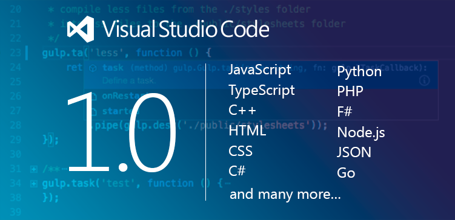

---
Order:
TOCTitle: 1.0 Release
PageTitle: Visual Studio Code 1.0 Release
MetaDescription: Visual Studio Code releases 1.0.
Date: 2016-04-14
ShortDescription: Visual Studio Code releases 1.0.
Author: PJ Meyer
MetaSocialImage: /assets/blogs/2016/04/14/header.png
---

# Visual Studio Code 1.0!

April 14, 2016 by The VS Code Team, [@code](https://twitter.com/code)

Today we’re very proud to release version 1.0 of Visual Studio Code. Since our initial launch one year ago, 2 million developers have installed VS Code. Today, we’re excited to report that more than 500,000 developers actively use VS Code each month.

What started as an experiment to build a production quality editor using modern web technologies has blossomed into a new kind of cross-platform development tool, one that focuses on core developer productivity by centering the product on rich code editing and debugging experiences. Visual Studio Code brings the industry-leading experiences of Visual Studio to a streamlined development workflow, that can be a core part of the tool set of every developer, building any kind of application.

Getting to "1.0" over the last few months has been about more than features. We have worked with the community to further improve stability, fixing hundreds of bugs. And we’ve pushed hard on getting the best performance we can out of the editing experience.

VS Code was initially built for developers creating web apps using JavaScript and TypeScript. But in less than 6 months since we made the product extensible, the community has built over [1000 extensions](https://marketplace.visualstudio.com/vscode) that now provide support for almost any language or runtime in VS Code. Today, a broad range of developers from individuals and startups to Fortune 500 companies, including audiences completely new to Microsoft’s tools, are all more productive with a tool that fits comfortably into their current tool chain and workflow, and supports the technologies they use, from Go and Python to React Native and C++. With this great ecosystem in place, we’re now confident in declaring our API as stable, and guaranteeing compatibility going forward.

And we have strived to make VS Code 1.0 a great editor for every developer. VS Code is now fully localizable, and ships in 9 different languages, including French, German, Japanese, and Chinese. And, we have worked to make VS Code the most accessible of modern editors, with full keyboard navigation and support for screen reading and accessible navigation for visually impaired developers.

We could not have reached this important milestone without the help of all our contributors. Since committing to doing development in the open less than four months ago, we’ve consumed over [300 pull requests](https://github.com/Microsoft/vscode/pulls?q=is%3Apr+is%3Aclosed).  Whether you created a PR, filed an issue, gave a thumbs up, tweeted, or simply used VS Code in your day-to-day, you’re a part of the team. **Thank you!**

## The History of VS Code

>*Can we build a code editor fast enough that it doesn’t feel like you’re typing in a browser?*

It was only a few short years ago that we kicked off what we then called the "Monaco" team. At the time, browsers were just beginning to introduce HTML5, and the race to build faster JavaScript runtimes was in full swing.

So we set out to answer the question, "Can we build a browser-based code editor that feels native?" Not just an experience for text editing, but source code editing.  Suggestion lists, error and warning squiggles, Go to Definition, and more.

Today, we believe the answer was a resounding "Yes". The editor we built can now be found on some of the most demanding global websites – OneDrive, Visual Studio Team Services, Bing Code Search, Azure – sites used by millions of people every day. It even ships to 100s of millions of Windows desktops with the F12 tools in Internet Explorer.  And that same editor is at the heart of VS Code.

Of course, to build the editor we needed a development tool. Developers know that one of the best ways to evolve your code quickly is to "dogfood" it: use it the same way your customers will.  It therefore made sense that we would create a local Node.js based service to serve up files and the editor in a lightweight development tool. This tool eventually made its way to the cloud as a part of Azure Websites.

But we strived to go further. We wanted to build a native development tool that developers could install and use anywhere, for any source code. And, from our experience, we believed that it was important to not just have an editor, but one that could help developers accomplish their most common tasks: navigating code, debugging, and working with Git.  And, so, Visual Studio Code was born.

Being built on web technologies made it easy to host the tool in a native cross-platform shell. We decided early on to use, and contribute to, a number of open source technologies – including GitHub’s great Electron shell, which combines web and native UI with a Node.js API. In just a few short months, we were able to release the [first preview](https://blogs.msdn.microsoft.com/somasegar/2015/04/29/introducing-visual-studio-code-visual-studio-2015-rc-application-insights-public-preview-and-net-core-preview-for-linux-and-ma) of Visual Studio Code at //build/ 2015.

The initial response to a code editor running on OS X, Windows, and Linux was overwhelmingly positive, even with two fundamental gaps in the offering – extensibility and open development.

Keeping our principle of using VS Code the way our customers do, we decided that the best way to deliver a rich and stable API was to build VS Code using the same API we would expose to extension developers. In fact, the core language services for JavaScript and TypeScript are actually extensions that just happen to be bundled with the distribution. Today, we use VS Code to build and debug VS Code, its extensions, and Node-based services. The same rich TypeScript editing, navigation, and debugging experiences we enjoy when building VS Code are available to everyone developing an extension for VS Code. Six months after our initial preview release, we declared VS Code to be Beta quality at Connect(); 2015, with a full extensibility model, and support in the new Visual Studio Marketplace.

And at the same time, we open-sourced the VS Code [repository](https://github.com/Microsoft/vscode) and many of our own extensions, and moved to developing Visual Studio Code in the open.

## Being "1.0"

Today, Visual Studio Code delivers on many of the aspects that we imagined during incubation. VS Code has great editing and navigation [experiences](/docs/editor/editingevolved), streamlined [debugging](/docs/editor/debugging), and built-in [Git support](/docs/editor/versioncontrol).

Developers today love VS Code for its powerful set of built-in features, intuitive editing and debugging experiences, performance and responsiveness, and great language and platform support. The VS Code download is under 40MB including support for 9 additional [languages](/docs/getstarted/locales) (Simplified Chinese, Traditional Chinese, French, German, Italian, Japanese, Korean, Russian and Spanish) and it installs in seconds.  With the help of developers like [@zersiax](https://twitter.com/zersiax), VS Code is now [accessible](/docs/editor/accessibility) to visually impaired developers on Windows and soon on OS X and Linux.

## Community at its Core

More than anything else, what drives the success of Visual Studio Code is the feedback and interactions from the community. From the beginning, we’ve striven to be as open as possible in our roadmap and vision for VS Code, and in November, we took that a step further by open-sourcing VS Code and adding the ability for anyone to make it better through submitting issues and feedback, making pull requests, or creating extensions.

The community responded, with huge growth in the number of extensions and the way they’re using VS Code. Today we have extensions for [Node.js](https://marketplace.visualstudio.com/search?term=node&target=VSCode&sortBy=Downloads), [Go](https://marketplace.visualstudio.com/search?term=go&target=VSCode&sortBy=Downloads), [C++](https://marketplace.visualstudio.com/search?term=c++&target=VSCode&sortBy=Downloads), [PHP](https://marketplace.visualstudio.com/search?term=php&target=VSCode&sortBy=Downloads), and [Python](https://marketplace.visualstudio.com/search?term=python&target=VSCode&sortBy=Downloads), as well as many more languages, linters, and tools.  And VS Code is being used both by teams of developers, but also in companies like Progressive Insurance, where VS Code is used not just by developers, but analysts and data scientists as well.

Seeing the support and help the community has already poured into the product, the potential for VS Code has never been greater.

## Looking Ahead

While we’re excited about releasing 1.0 today, we are even more excited about the future.

Of course, we will continue to focus on the fundamentals.  Performance, stability, accessibility, and compatibility are of utmost importance to our users, and they are to us as well. We will continue to invest in improving developer productivity, guided by the great user feedback on [UserVoice](https://go.microsoft.com/fwlink/?LinkID=533482). We will continue to work with partners and the community to expand support for new languages, and platforms, and experiences. And we will continue to work with you, our community, to build a great tool for you, and for every developer.

If you haven’t tried out Visual Studio Code yet, please [download](/Download) it and let us know what you think!

Thanks Again!

The VS Code Team, [@code](https://twitter.com/code)

