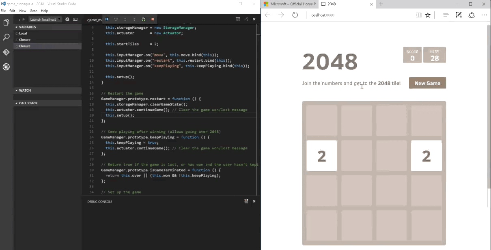
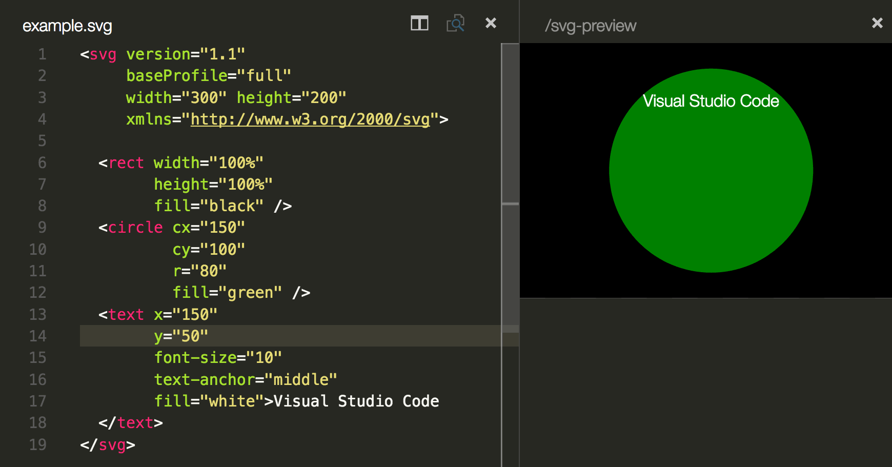
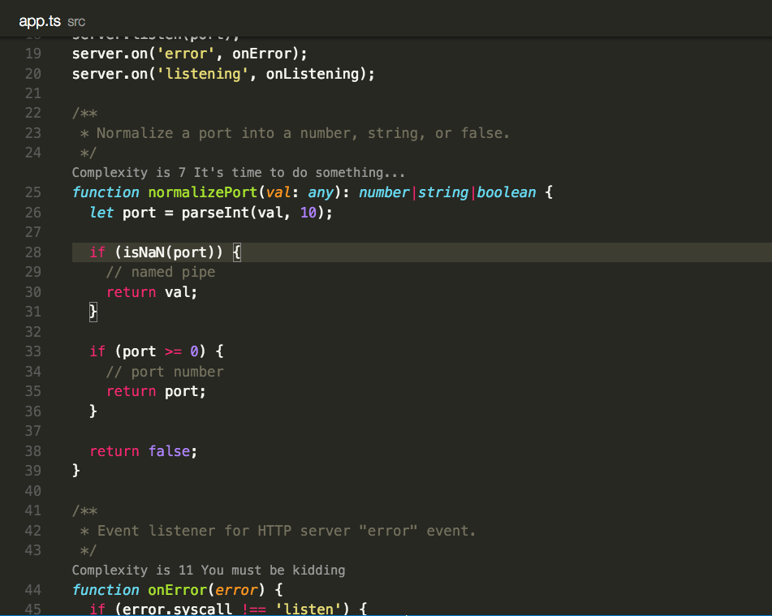

---
Order:
TOCTitle: Extensions Roundup
PageTitle: Visual Studio Code Extensions Roundup May 2016
MetaDescription: New, useful, and interesting extensions in Visual Studio Code for May 2016.
Date: 2016-05-04
ShortDescription: New, useful, and interesting extensions in Visual Studio Code.
Author: Wade Anderson
---

# Extensions Roundup

May 4, 2016 by Wade Anderson, [@waderyan_](https://twitter.com/waderyan_)

The Visual Studio Code Extension [Marketplace](https://marketplace.visualstudio.com/VSCode) does a great job of highlighting **Featured**, **Most Popular** and **Newly Added** extensions and we encourage you to browse the site to see what's new and what plug-ins other developers are using. In our extension roundups, we like to call out extensions that we've found interesting and useful.

If you are new to VS Code extensions, check out the [docs](/docs/editor/extension-marketplace.md) for instructions on finding and installing new extensions.

## Debugger for Edge by Microsoft JS Diagnostics

>**Install:** From within Visual Studio Code, you can use Quick Open (`kb(workbench.action.quickOpen)`) and paste `ext install debugger-for-edge` then press `kbstyle(Enter)`.

The same folks who created the very popular [Debugger for Chrome](https://marketplace.visualstudio.com/items?itemName=msjsdiag.debugger-for-chrome) extension have published [Debugger for Edge](https://marketplace.visualstudio.com/items?itemName=msjsdiag.debugger-for-edge) for the Microsoft Edge browser. They were able to reuse the same debugger using the [Chrome Debugger protocol](https://developer.chrome.com/devtools/docs/debugger-protocol). You can learn more about the details in their recent [blog post](https://blogs.windows.com/msedgedev/2016/04/27/introducing-edge-diagnostics-adapter/).

## SVG Viewer by cssho

>**Install:** Quick Open (`kb(workbench.action.quickOpen)`), paste `ext install vscode-svgviewer` and press `kbstyle(Enter)`.

This highly rated extension lets you view Scalable Vector Graphics (SVG) right from within VS Code. [See more details in the Marketplace](https://marketplace.visualstudio.com/items?itemName=cssho.vscode-svgviewer).

## CodeMetrics by Kiss Tamas

>**Install:** Quick Open (`kb(workbench.action.quickOpen)`), paste `ext install vscode-codemetrics` and press `kbstyle(Enter)`.

Curious if your TypeScript source code is getting a little too clever and hard for others to maintain? This [extension](https://marketplace.visualstudio.com/items?itemName=kisstkondoros.vscode-codemetrics) computes the complexity of your code and displays a rating in a CodeLens decoration in the editor. Clicking on the rating brings up the rules used to arrive at the complexity score.

## npm IntelliSense by Christian Kohler

>**Install:** Quick Open (`kb(workbench.action.quickOpen)`), paste `ext install npm-intellisense` and press `kbstyle(Enter)`.

Bring quick auto completion into the editor for your workspace's npm modules with this handy [extension](https://marketplace.visualstudio.com/items?itemName=christian-kohler.npm-intellisense).

## Let us know what extensions you're using

If you are using an extension that you really like and want to see it featured here, send us a [Tweet](https://twitter.com/code).

Most extensions are open sourced on [GitHub](https://github.com) so you can learn from the source code and contribute to your favorite extensions.

Wade Anderson, VS Code Team Member  
[@waderyan_](https://twitter.com/waderyan_)
