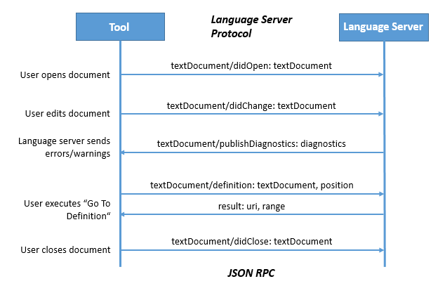

# A Common Protocol for Languages

June 27, 2016 by The VS Code Team, [@code](https://twitter.com/code)

Visual Studio Code is an editor for any developer, no matter what programming language you use.  Between languages bundled in the tool or extensions in the [Marketplace](https://marketplace.visualstudio.com/VSCode), we have support for over [150 languages](/blogs/2016/04/14/vscode-1.0.md).  We’re also committed to developing VS Code in the open, and making the components that power VS Code available and open source.  One of our most notable components is the [Monaco editor](https://github.com/Microsoft/monaco-editor), but another technology that powers VS Code is an [open, JSON-based protocol](https://github.com/Microsoft/language-server-protocol) that anyone can use to add support for a new programming language to VS Code by implementing a "language server".

## Any Language, Any Tool

Today at the [DevNation](https://www.devnation.org) conference in San Francisco, we’ve announced along with [Red Hat and Codenvy](https://developers.redhat.com/blog/2016/06/27/a-common-interface-for-building-developer-tools) that this language server protocol is now being adopted by tool creators and language providers across the industry. For language creators, this means an enhanced tooling experience for their language across a variety of development tools and operating systems, similar to the experience that [TypeScript](https://typescriptlang.org) developers or C# developers (via [OmniSharp](https://omnisharp.net)) get today.  It also means any developer can have a consistent editing experience for their favorite programming language on any tool – even if that tool isn’t VS Code.

## How it works

Visual Studio Code provides rich language support for many programming languages. Support for a particular programming language is powered by a **language server** that has a deep understanding of that language. VS Code communicates with these servers to enable rich editing capabilities like 'Errors & Warnings', 'Refactor', and 'Go To Definition'.

Here’s an example of how a tool and a language server could communicate semantic information during a routine editing session:

* The user opens a file (referred to as a *document*) in the tool: The tool notifies the language server that a document is open (`didOpen`) and that the information about that document is maintained by the tool in memory.

* The user makes edits: The tool notifies the server about the document change (`didChange`) and the semantic information of the program is updated by the language server. As this happens, the language server analyses this information and notifies the tool with the errors and warnings (`diagnostics`) that are found.

* The user executes 'Go To Definition' on a symbol: The tool sends a `definition` request to the server. The server responds with a `uri` of the document that holds the definition and the `range` inside the document. Based on this information, the tool can open the corresponding document at the defining position.

* The user closes the document (file): A `didClose` notification is sent from the tool, informing the language server that the document is now no longer in memory and instead maintained by (i.e. stored on) the file system.

This communication, which takes place over [JSON-RPC](http://www.jsonrpc.org/specification), happens many times over the course of a typical session.

This architecture allows for VS Code to interact with multiple language servers, each of which can be implemented in any language (independent of the language the tool was implemented in), and support a variety of features, as long as it utilizes the common JSON-based protocol.

It also enables a given language server to be implemented once and have different tools take advantage of it. That's why it's exciting that the protocol has been adopted by Codenvy, who have added it to the next generation Eclipse IDE, [Eclipse Che](https://che.eclipse.org/eclipse-che-now-strategic-platform-red-hat), as well as by Red Hat, who are working to publish a standalone language server for Java which can be consumed by any tool that utilizes the protocol.

## Open Specification

The complete specification for this protocol is available in a [public GitHub repository](https://github.com/Microsoft/language-server-protocol), as is a [history of how the protocol has evolved](https://github.com/Microsoft/language-server-protocol/wiki/Protocol-History) to date. As it continues to be adopted by more languages and tools, we intend to support and evolve the protocol, along with partners like Red Hat, Codenvy, and others in the open source community. Anyone can ask questions, file issues, or submit pull requests on the repo, just like any other open source project.

## What's Next

This is just the start – communities for programming languages like OmniSharp (C#), JSON, C++, xText, JavaFX, and R have made commitments to release language servers for their languages in the future.  A full [list of protocol implementations](https://github.com/Microsoft/language-server-protocol/wiki/Protocol-Implementations), including language servers, editors, and SDKs is available on the GitHub repo.

If you want to learn more, [view the breakout session](https://www.youtube.com/watch?v=2GqpdfIAhz8), check out the blog posts from [Red Hat](https://developers.redhat.com/blog/2016/06/27/a-common-interface-for-building-developer-tools) and the [Eclipse Che](https://che.eclipse.org/eclipse-che-now-strategic-platform-red-hat) team, and visit the [language server protocol repo](https://github.com/microsoft/language-server-protocol) on GitHub.  There is even a [Language Server Walkthrough](/docs/extensions/example-language-server.md) where you can step through the source code of a working language server implemented in TypeScript and Node.js. But of course you can implement a language server in any language!

Happy Coding!

The VS Code Team, [@code](https://twitter.com/code)
