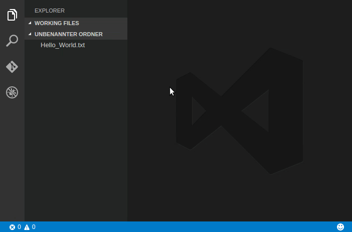

---
Order:
TOCTitle: Extensions Roundup - Fun with Git
PageTitle: Visual Studio Code Extensions Roundup - Git August 2016
MetaDescription: Extensions to super power your Git workflow.
Date: 2016-08-02
ShortDescription: Extensions to super power your Git workflow.
Author: Wade Anderson
---
# Extensions Roundup - Fun with Git

August 2, 2016 by Wade Anderson, [@waderyan_](https://twitter.com/waderyan_)

The first extension I built for Visual Studio Code was called [Git Blame](https://marketplace.visualstudio.com/items?itemName=waderyan.gitblame). It lets you quickly see which developer most recently modified the currently selected line ("blame"). It was simple and effective. Since the time when I built this extension, there have been many more awesome Git extensions added to the VS Code [Marketplace](https://marketplace.visualstudio.com/VSCode). Here are some of my favorite.

> Tip: Install any of these extensions by clicking the Extensions View button, typing the name of the extension in the Search box, and clicking **Install**. Learn more at [Browse for extensions](/docs/editor/extension-marketplace.md#browse-for-extensions).

## Annotator

Marketplace - [Annotator](https://marketplace.visualstudio.com/items?itemName=ryu1kn.annotator)

Publisher - [Ryuichi Inagaki](https://marketplace.visualstudio.com/search?term=publisher%3A%22Ryuichi%20Inagaki%22&target=VSCode)

This extension takes "blame" information to the next level. You can see all the commit information in the gutter and it's clickable! When you click on the blame, you see the diff of that commit. The gutter color is darker for older commits and lighter for the most recent commits, which was a smooth way to create the UI. Truly an excellent extension and my personal favorite.

## Git History

Marketplace - [Git History](https://marketplace.visualstudio.com/items?itemName=donjayamanne.githistory)

Publisher - [Don Jayamanne](https://marketplace.visualstudio.com/search?term=publisher%3A%22Don%20Jayamanne%22&target=VSCode)

With this extension, you will find a very rich feature set for your Git workflow:

- View history of a file or line.
- Compare a previous copy of a file against the local workspace version.
- View the changes to the active line.

## Share Code

Marketplace - [Share Code](https://marketplace.visualstudio.com/items?itemName=RolandGreim.sharecode)

Publisher - [Roland Greim](https://marketplace.visualstudio.com/search?term=publisher%3A%22Roland%20Greim%22&target=VSCode)

Ever wanted to send your code to Pastebin or a GitHub Gist? Open the file you want to share and share it with a couple commands in the **Command Palette**.

## Open in GitHub

Marketplace - [Open in GitHub](https://marketplace.visualstudio.com/items?itemName=ziyasal.vscode-open-in-github)

Publisher - [ziyasal](https://marketplace.visualstudio.com/search?term=publisher%3A%22ziyasal%22&target=VSCode)

One of the most popular extensions used by the VS Code team. This extension allows you to open the current line in GitHub.

## Git Project Manager

Marketplace - [Git Project Manager](https://marketplace.visualstudio.com/items?itemName=felipecaputo.git-project-manager)

Publisher - [Felipe Caputo](https://marketplace.visualstudio.com/search?term=publisher%3A%22Felipe%20Caputo%22&target=VSCode)

Do you have multiple Git projects that you want to open with VS Code? Install this extension and quickly switch between your projects.

## Partial Diff

Marketplace - [Partial Diff](https://marketplace.visualstudio.com/items?itemName=ryu1kn.partial-diff)

Publisher - [Ryuichi Inagaki](https://marketplace.visualstudio.com/search?term=publisher%3A%22Ryuichi%20Inagaki%22&target=VSCode)

Ryuichi's second time on this list (he is busy)! This extension isn't Git specific but lets you diff selected text which I have found very useful while coding my projects.

## gitignore

Marketplace - [gitignore](https://marketplace.visualstudio.com/items?itemName=michelemelluso.gitignore)

Publisher - [michelemelluso](https://marketplace.visualstudio.com/search?term=publisher%3A%22michelemelluso%22&target=VSCode)

This is the first of two gitignore extensions. With this gitignore extension, simply right click and add a file to your `.gitignore` configuration!

## gitignore #2

Marketplace - [gitignore](https://marketplace.visualstudio.com/items?itemName=codezombiech.gitignore)

Publisher - [CodeZombie](https://marketplace.visualstudio.com/search?term=publisher%3A%22CodeZombie%22&target=VSCode)

The second gitignore extension (note that they are from different publishers) will pull in template `.gitignore` files. Are you coding in Python and want all the "usual" Python `.gitignore` configurations? Install this extension and run a simple command to pull down the `.gitignore` from [github/gitignore](https://github.com/github/gitignore).

Wade Anderson, VS Code Team Member  
[@waderyan_](https://twitter.com/waderyan_)
