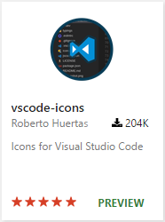

# File and Folder Icons in VS Code!

September 8, 2016 by Chris Dias,  [@chrisdias](https://twitter.com/chrisdias)

## Rebellion. Revolt. Uprising.

These words all describe the first time we added icons to the File Explorer tree in VS Code, back in 2014. [@dmitar-asenov](https://github.com/dimitar-asenov) was an intern in [@egamma](https://github.com/egamma)'s Zurich lab and spent a couple of hours hacking in a basic set of icons because he wanted to differentiate between files and folders when quickly glancing at the tree.

When we started work on the "Monaco" editor, icons in the Explorer didn't make the cut for a lightweight editor. The team loved the simple, clean look of an icon-less tree. To us, icons felt heavy and provided little value. We worried about maintaining 100+ icons and keeping them in sync with the Visual Studio IDE. We left in the icon implementation in case we changed our minds in the future, but we never turned it on.

Fast forward to February 2016. [PR 3200](https://github.com/microsoft/vscode/pull/3200) forced us to have the discussion again, but given our "1.0" deliverables and other feature requests (such as Tabs), we had to push out the conversation.

As we planned the August 2016 release, many of the [top feature requests](https://github.com/microsoft/vscode/issues?q=is%3Aopen+is%3Aissue+label%3Afeature-request) had been addressed and support for icons bubbled to the top:

* Over [200 thumbs up on GitHub](https://github.com/microsoft/vscode/issues/211).
* Number 9 with almost 2500 votes on the [recently retired](https://code.visualstudio.com/blogs/2016/08/19/goodbyeuservoice) User Voice list.
* With over 200K downloads, 170 reviews, and a 5 star rating, [Roberto Huertas](https://github.com/robertohuertasm)' [vscode-icons](https://marketplace.visualstudio.com/items?itemName=robertohuertasm.vscode-icons) extension had become the 5th most popular extension in the Marketplace.

Maybe we were wrong back in 2014. The 10 people on the VS Code team at that time hardly constituted a statistically significant data set. 200 thumbs up said we needed to listen to this feedback and look at this again. Thank you for the feedback!

It was clear from the start that we needed to make icon theming an extension point to VS Code. It would be impossible to come up with a single set of icons that everyone agreed upon. Without a proper extension mechanism, Roberto was forced to patch the installed sources in order to make the vscode-icons extension work properly.

Not only did this approach mean that the extension needed to be reinstalled on every daily or monthly update of VS Code, it opened up to a new class of issues which we could not easily diagnose or fix, since the core product was being modified after we shipped it. In the future, we'll be working on minimizing the risk of corrupting the core product so that users are not forced to reinstall VS Code as the result of installing an extension.

## File Icon Themes

With the 1.5 release of VS Code, we now support icons to the File Explorer.

From the **File** > **Preferences** menu or the **Command Palette** (`kb(workbench.action.showCommands)`) search for File Icon Theme:

Initially we were going to ship with a single, simple theme called **Minimal**, which has folder open/closed icons as well as a single file icon for all types.

## Seti Icon Theme

As we tested different icons and worked with Roberto to ensure we could support his key scenarios, we discovered the [Seti UI](https://github.com/jesseweed/seti-ui) icons, first popularized in Sublime Text.

And we were converted.

Most of the team now runs on the Seti icons so we decided to include them in the product for everyone to enjoy. Simply choose the **Seti (Visual Studio Code)** icon theme in the File Icon Theme selection dialog.

>**Note:** You can arrow up and down through the File Icon Theme list and see a preview of the selected theme, just as you can with the Color Themes!

## Create your own Icon Theme

It is incredibly easy for extension authors to create your own File Icon Theme packs, check out the raw documentation [here](https://github.com/microsoft/vscode/issues/10804) and the ["Adding a new Icon Theme"](/docs/extensions/themes-snippets-colorizers.md#adding-a-new-icon-theme) topic in the VS Code docs. Looking ahead, we will continue to fill out the API based on your feedback.

Thanks again for all of your feedback and thanks to Roberto for building a popular extension and helping us deliver great APIs.

Happy Coding,

Chris Dias