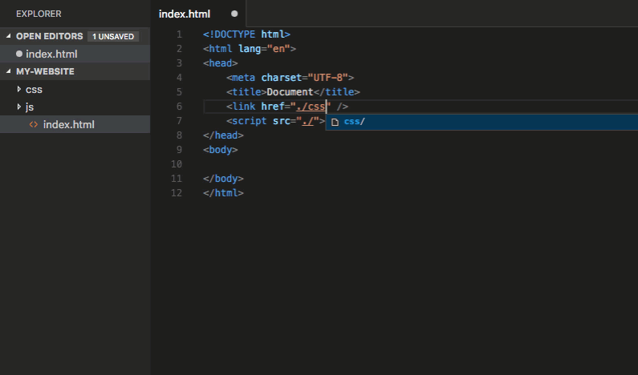

---
Order:
TOCTitle: JavaScript Extensions Part 1
PageTitle: Visual Studio Code JavaScript Extensions Part 1 Sep 2016
MetaDescription: Essential JavaScript extensions for Visual Studio Code.
Date: 2016-09-14
ShortDescription: Essential JavaScript extensions for Visual Studio Code.
Author: Wade Anderson
---

# JavaScript Extensions Part 1

September 14, 2016 by Wade Anderson, [@waderyan_](https://twitter.com/waderyan_)

> This is part one in a series on JavaScript extensions.

I learned JavaScript during an internship in the summer of 2013. Although not a difficult programming language, JavaScript didn't come easy. I used a lightweight editor along with the rest of my team and missed the deep language integration features of Visual Studio (C#) and Eclipse (Java).

Visual Studio Code is not an IDE, but you can extend it to do many of the things an IDE can do. VS Code extensions effectively bridge the gap between an IDE and a lightweight editor (read [here](/docs/extensionAPI/patterns-and-principles.md#core-concepts) to learn how we maintain high performance when extensions are added).

Below are some of the essential JavaScript extensions that I and many of you are using every day.

> **Tip:** Install any of these extensions by clicking the Extensions View button, typing the name of the extension in the Search box, and clicking **Install**. Learn more at [Browse for extensions](/docs/editor/extension-marketplace.md#browse-for-extensions).

## ESLint

Marketplace - [ESLint](https://marketplace.visualstudio.com/items?itemName=dbaeumer.vscode-eslint)

Publisher - [Dirk Baeumer](https://marketplace.visualstudio.com/search?term=publisher%3A%22Dirk%20Baeumer%22&target=VSCode)

Easily integrate [ESLint](https://eslint.org/) into your project. Dirk is a member of the VS Code team and he maintains this extension and just released an update. If ESLint isn't your favorite linter, choose among a variety of other linter extensions, including [JSHint](https://marketplace.visualstudio.com/items?itemName=dbaeumer.jshint), [JSCS](https://marketplace.visualstudio.com/items?itemName=ms-vscode.jscs), and [JS Standard](https://marketplace.visualstudio.com/items?itemName=shinnn.standard).

Read more about setting up JavaScript linters in the VS Code [documentation](/docs/languages/javascript.md#linters).

## JavaScript (ES6) code snippets

Marketplace - [JavaScript (ES6) code snippets](https://marketplace.visualstudio.com/items?itemName=xabikos.JavaScriptSnippets)

Publisher - [charalampos karypidis](https://marketplace.visualstudio.com/search?term=publisher%3A%22charalampos%20karypidis%22&target=VSCode)

VS Code comes with many built-in code snippets. The **JavaScript (ES6) code snippets** extension adds snippets for ES6 (ECMAScript 6) syntax. Here is a small sampling of the snippets provided by this extension. See the extension's [README](https://marketplace.visualstudio.com/items?itemName=xabikos.JavaScriptSnippets) to see the dozens of snippets this pack gives you.

You can read more about JavaScript snippets in the VS Code [documentation](/docs/languages/javascript.md#snippets). For additional snippet packs, including [Angular 1](https://marketplace.visualstudio.com/items?itemName=johnpapa.Angular1), [Angular 2](https://marketplace.visualstudio.com/items?itemName=johnpapa.Angular2), [Bootstrap 3](https://marketplace.visualstudio.com/items?itemName=wcwhitehead.bootstrap-3-snippets), [ReactJs](https://marketplace.visualstudio.com/items?itemName=xabikos.ReactSnippets), and [jQuery](https://marketplace.visualstudio.com/items?itemName=donjayamanne.jquerysnippets), check out the Marketplace's [Snippets category](https://marketplace.visualstudio.com/vscode/Snippets?sortBy=Downloads).

## Path IntelliSense

Marketplace - [Path IntelliSense](https://marketplace.visualstudio.com/items?itemName=christian-kohler.path-intellisense)

Publisher - [Christian Kohler](https://marketplace.visualstudio.com/search?term=publisher%3A%22Christian%20Kohler%22&target=VSCode)

This extension autocompletes file paths in your source code. Use this in JavaScript, HTML, CSS files and more.

## npm IntelliSense

Marketplace - [npm IntelliSense](https://marketplace.visualstudio.com/items?itemName=christian-kohler.npm-intellisense)

Publisher - [Christian Kohler](https://marketplace.visualstudio.com/search?term=publisher%3A%22Christian%20Kohler%22&target=VSCode)

A second incredibly useful extension from Christian Kohler. This extension provides IntelliSense for npm modules.

Wade Anderson, VS Code Team Member  
[@waderyan_](https://twitter.com/waderyan_)
