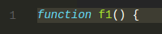
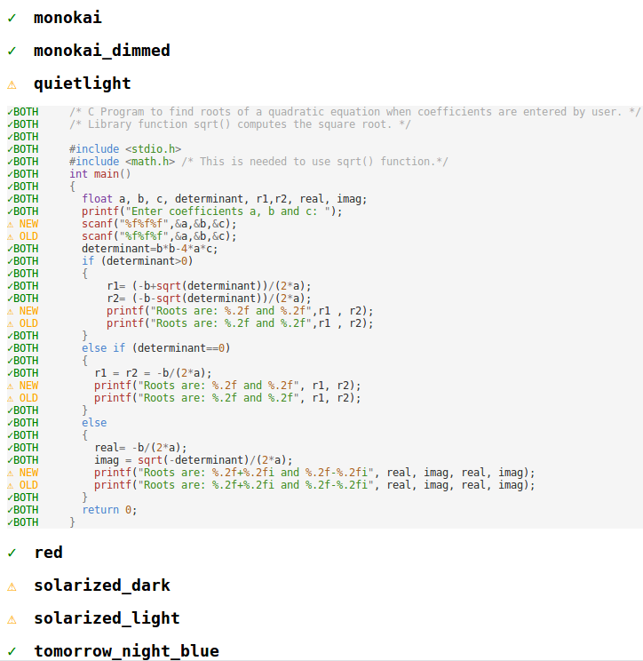
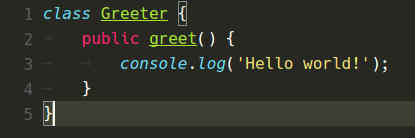
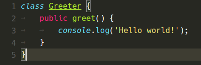
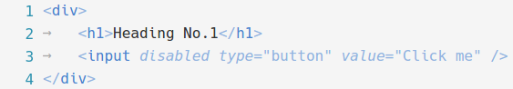
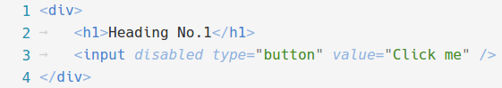
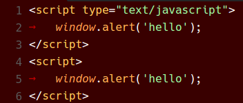
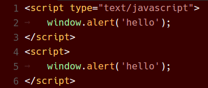

---
Order:
TOCTitle: Optimizations in Syntax Highlighting
PageTitle: Optimizations in Syntax Highlighting, a Visual Studio Code Story
MetaDescription: Optimizations in tokenization and syntax highlighting in the Visual Studio Code/Monaco editor
Date: 2017-02-08
Author: Alexandru Dima
MetaSocialImage: /assets/blogs/2017/02/08/syntax-highlighting-optimizations-social.png
---
# Optimizations in Syntax Highlighting

February 8, 2017 - Alexandru Dima

Visual Studio Code version 1.9 includes a cool performance improvement that we've been working on and I wanted to tell its story.

**TL;DR** TextMate themes will look more like their authors intended in VS Code 1.9, while being rendered faster and with less memory consumption.

---

## Syntax Highlighting

Syntax Highlighting usually consists of two phases. Tokens are assigned to source code, and then they are targeted by a theme, assigned colors, and voilà, your source code is rendered with colors. It is the one feature that turns a text editor into a code editor.

Tokenization in VS Code (and in the [Monaco Editor](https://microsoft.github.io/monaco-editor/)) runs line-by-line, from top to bottom, in a single pass. A tokenizer can store some state at the end of a tokenized line, which will be passed back when tokenizing the next line. This is a technique used by many tokenization engines, including TextMate grammars, that allows an editor to retokenize only a small subset of the lines when the user makes edits.

Most of the time, typing on a line results in only that line being retokenized, as the tokenizer returns the same end state and the editor can assume the following lines are not getting new tokens:

<center>

</center>

More rarely, typing on a line results in a retokenization/repaint of the current line and some of the ones below (until an equal end state is encountered):

<center>

</center>

---

## How we represented tokens in the past

The code for the editor in VS Code was written long before VS Code existed. It was shipped in the form of the [Monaco Editor](https://microsoft.github.io/monaco-editor/) in various Microsoft projects, including Internet Explorer's F12 tools. One requirement we had was to reduce memory usage.

In the past, we wrote tokenizers by hand (there is no feasible way to interpret TextMate grammars in the browser even today, but that's another story). For the line below, we would get the following tokens from our hand-written tokenizers:

<center>

</center>

```javascript
tokens = [
    { startIndex:  0, type: 'keyword.js' },
    { startIndex:  8, type: '' },
    { startIndex:  9, type: 'identifier.js' },
    { startIndex: 11, type: 'delimiter.paren.js' },
    { startIndex: 12, type: 'delimiter.paren.js' },
    { startIndex: 13, type: '' },
    { startIndex: 14, type: 'delimiter.curly.js' },
]
```

Holding on to that tokens array takes 648 bytes in Chrome and so storing such an object is quite costly in terms of memory (each object instance must reserve space for pointing to its prototype, to its properties list, etc). Our current machines do have a lot of RAM, but storing 648 bytes for a 15 characters line is unacceptable.

So, at the time, we came up with a binary format to store the tokens, a format that was being used up to and including [VS Code 1.8](https://github.com/microsoft/vscode/blob/release/1.8/src/vs/editor/common/model/tokensBinaryEncoding.ts). Given that there would be duplicate token types, we collected them in a separate map (per file), doing something like the following:

```javascript
//     0        1               2                  3                      4
map = ['', 'keyword.js', 'identifier.js', 'delimiter.paren.js', 'delimiter.curly.js'];
tokens = [
    { startIndex:  0, type: 1 },
    { startIndex:  8, type: 0 },
    { startIndex:  9, type: 2 },
    { startIndex: 11, type: 3 },
    { startIndex: 12, type: 3 },
    { startIndex: 13, type: 0 },
    { startIndex: 14, type: 4 },
]
```

We'd then encode the `startIndex` (32 bits) and the `type` (16 bits) in 48 bits of [the 53 mantissa bits](https://stackoverflow.com/a/2803010) a JavaScript number has. Our tokens array would finally look like this, and the map array would be reused for the entire file:

```javascript
tokens = [
                 //       type                 startIndex
     4294967296, // 0000000000000001 00000000000000000000000000000000
              8, // 0000000000000000 00000000000000000000000000001000
     8589934601, // 0000000000000010 00000000000000000000000000001001
    12884901899, // 0000000000000011 00000000000000000000000000001011
    12884901900, // 0000000000000011 00000000000000000000000000001100
             13, // 0000000000000000 00000000000000000000000000001101
    17179869198, // 0000000000000100 00000000000000000000000000001110
]
```

Holding on to this tokens array takes 104 bytes in Chrome. The elements themselves should take only 56 bytes (7 x 64-bit numbers), and the rest is probably explained by v8 storing other metadata with the array, or probably allocating the backing store in powers of 2. However, the memory savings are obvious and get better with more tokens per line. We were happy with this approach and we've been using this representation ever since.

> Note: There may be more compact ways of storing the tokens, but having them in a binary-searchable linear format gives us the best trade-off in terms of memory usage and access performance.

---

## Tokens <-> Theme matching

We thought it would be a good idea to follow browser best practices, such as leaving the styling up to CSS, so when rendering the above line, we'd decode the binary tokens using the `map`, and then render it using the token types like this:

```html
  <span class="token keyword js">function</span>
  <span class="token">&nbsp;</span>
  <span class="token identifier js">f1</span>
  <span class="token delimiter paren js">(</span>
  <span class="token delimiter paren js">)</span>
  <span class="token">&nbsp;</span>
  <span class="token delimiter curly js">{</span>
```

And we'd write our themes [in CSS](https://github.com/microsoft/vscode/blob/1.8.0/src/vs/editor/browser/standalone/media/standalone-tokens.css) (for example the Visual Studio theme):

```css
...
.monaco-editor.vs .token.delimiter          { color: #000000; }
.monaco-editor.vs .token.keyword            { color: #0000FF; }
.monaco-editor.vs .token.keyword.flow       { color: #AF00DB; }
...
```

It turned out quite nicely, we could flip a class name somewhere and immediately get a new theme applied to the editor.

---

## TextMate Grammars

For the launch of VS Code, we had something like 10 hand-written tokenizers, mostly for web languages, which would definitely not be sufficient for a general-purpose desktop code editor. Enter [TextMate grammars](https://manual.macromates.com/en/language_grammars), a descriptive form of specifying the tokenization rules, which has been adopted in numerous editors. There was one problem though, TextMate grammars didn't work quite like our hand-written tokenizers.

TextMate grammars, through their use of begin/end states, or while states, can push scopes that can span multiple tokens. Here's the same example under a JavaScript TextMate Grammar (ignoring whitespace for brevity):


---

## TextMate Grammars in VS Code 1.8

If we were to make a section through the scopes stack, each token basically gets an array of scope names, and we'd get something like the following back from the tokenizer:

<center>

</center>

```javascript
tokens = [
  { startIndex:  0, scopes: ['source.js','meta.function.js','storage.type.function.js'] },
  { startIndex:  8, scopes: ['source.js','meta.function.js'] },
  { startIndex:  9, scopes: ['source.js','meta.function.js','meta.definition.function.js',
                             'entity.name.function.js'] },
  { startIndex: 11, scopes: ['source.js','meta.function.js','meta.parameters.js',
                             'punctuation.definition.parameters.js'] },
  { startIndex: 13, scopes: ['source.js','meta.function.js'] },
  { startIndex: 14, scopes: ['source.js','meta.function.js','meta.block.js',
                             'punctuation.definition.block.js'] },
]
```

All of the token types were strings and our code was not ready to handle string arrays, not to mention the implications on the binary encoding of tokens. We therefore proceeded to "approximate"* the array of scopes into a single string using the following strategy:

* Ignore the least specific scope (i.e. `source.js`); it was rarely adding any value.
* Split each remaining scope on `"."`.
* De-duplicate unique pieces.
* Sort the remaining pieces with a stable sort function (not necessarily lexicographic sort).
* Join the pieces on `"."`.

```javascript
tokens = [
    { startIndex:  0, type: 'meta.function.js.storage.type' },
    { startIndex:  9, type: 'meta.function.js' },
    { startIndex:  9, type: 'meta.function.js.definition.entity.name' },
    { startIndex: 11, type: 'meta.function.js.definition.parameters.punctuation' },
    { startIndex: 13, type: 'meta.function.js' },
    { startIndex: 14, type: 'meta.function.js.definition.punctuation.block' },
]
```

> *: What we were doing was plain wrong and "approximate" is a very nice word for it :).

These tokens would then "fit in" and would follow the same code path as the manual written tokenizers (get binary encoded), and then would render the same way too:

```html
<span class="token meta function js storage type">function</span>
<span class="token meta function js">&nbsp;</span>
<span class="token meta function js definition entity name">f1</span>
<span class="token meta function js definition parameters punctuation">()</span>
<span class="token meta function js">&nbsp;</span>
<span class="token meta function js definition punctuation block">{</span>
```

## TextMate Themes

TextMate Themes work with [scope selectors](https://manual.macromates.com/en/scope_selectors.html) which select tokens with certain scopes and apply theming information to them, such as color, boldness, etc.

Given a token with the following scopes:

```javascript
//            C                     B                             A
scopes = ['source.js', 'meta.definition.function.js', 'entity.name.function.js']
```

Here are some simple selectors that would match, sorted by their rank (descending):

<table class="table table-striped" style="font-size: 80%">
<tr>
    <th>Selector</th>
    <th>C</th>
    <th>B</th>
    <th>A</th>
</tr>
<tr>
    <td><samp>source</samp></td>
    <td><samp><span style="color:blue">source</span>.js</samp></td>
    <td><samp>meta.definition.function.js</samp></td>
    <td><samp>entity.name.function.js</samp></td>
</tr>
<tr>
    <td><samp>source.js</samp></td>
    <td><samp><span style="color:blue">source.js</span></samp></td>
    <td><samp>meta.definition.function.js</samp></td>
    <td><samp>entity.name.function.js</samp></td>
</tr>
<tr>
    <td><samp>meta</samp></td>
    <td><samp>source.js</samp></td>
    <td><samp><span style="color:blue">meta</span>.definition.function.js</samp></td>
    <td><samp>entity.name.function.js</samp></td>
</tr>
<tr>
    <td><samp>meta.definition</samp></td>
    <td><samp>source.js</samp></td>
    <td><samp><span style="color:blue">meta.definition</span>.function.js</samp></td>
    <td><samp>entity.name.function.js</samp></td>
</tr>
<tr>
    <td><samp>meta.definition.function</samp></td>
    <td><samp>source.js</samp></td>
    <td><samp><span style="color:blue">meta.definition.function</span>.js</samp></td>
    <td><samp>entity.name.function.js</samp></td>
</tr>
<tr>
    <td><samp>entity</samp></td>
    <td><samp>source.js</samp></td>
    <td><samp>meta.definition.function.js</samp></td>
    <td><samp><span style="color:blue">entity</span>.name.function.js</samp></td>
</tr>
<tr>
    <td><samp>entity.name</samp></td>
    <td><samp>source.js</samp></td>
    <td><samp>meta.definition.function.js</samp></td>
    <td><samp><span style="color:blue">entity.name</span>.function.js</samp></td>
</tr>
<tr>
    <td><samp>entity.name.function</samp></td>
    <td><samp>source.js</samp></td>
    <td><samp>meta.definition.function.js</samp></td>
    <td><samp><span style="color:blue">entity.name.function</span>.js</samp></td>
</tr>
<tr>
    <td><samp>entity.name.function.js</samp></td>
    <td><samp>source.js</samp></td>
    <td><samp>meta.definition.function.js</samp></td>
    <td><samp><span style="color:blue">entity.name.function.js</span></samp></td>
</tr>
</table>
<br>

> Observation: `entity` wins over `meta.definition.function` because it matches a scope that is more specific (`A` over `B`, respectively).

> Observation: `entity.name` wins over `entity` because they both match the same scope (`A`), but `entity.name` is more specific than `entity`.

### Parent selectors

To make things a bit more complicated, TextMate themes also support parent selectors. Here are some examples of using both simple selectors and parent selectors (again sorted by their rank descending):

<table class="table table-striped" style="font-size: 80%">
<tr>
    <th>Selector</th>
    <th>C</th>
    <th>B</th>
    <th>A</th>
</tr>
<tr>
    <td><samp>meta</samp></td>
    <td><samp>source.js</samp></td>
    <td><samp><span style="color:blue">meta</span>.definition.function.js</samp></td>
    <td><samp>entity.name.function.js</samp></td>
</tr>
<tr>
    <td><samp>source meta</samp></td>
    <td><samp><span style="color:blue">source</span>.js</samp></td>
    <td><samp><span style="color:blue">meta</span>.definition.function.js</samp></td>
    <td><samp>entity.name.function.js</samp></td>
</tr>
<tr>
    <td><samp>source.js meta</samp></td>
    <td><samp><span style="color:blue">source.js</span></samp></td>
    <td><samp><span style="color:blue">meta</span>.definition.function.js</samp></td>
    <td><samp>entity.name.function.js</samp></td>
</tr>
<tr>
    <td><samp>meta.definition</samp></td>
    <td><samp>source.js</samp></td>
    <td><samp><span style="color:blue">meta.definition</span>.function.js</samp></td>
    <td><samp>entity.name.function.js</samp></td>
</tr>
<tr>
    <td><samp>source meta.definition</samp></td>
    <td><samp><span style="color:blue">source</span>.js</samp></td>
    <td><samp><span style="color:blue">meta.definition</span>.function.js</samp></td>
    <td><samp>entity.name.function.js</samp></td>
</tr>
<tr>
    <td><samp>entity</samp></td>
    <td><samp>source.js</samp></td>
    <td><samp>meta.definition.function.js</samp></td>
    <td><samp><span style="color:blue">entity</span>.name.function.js</samp></td>
</tr>
<tr>
    <td><samp>source entity</samp></td>
    <td><samp><span style="color:blue">source</span>.js</samp></td>
    <td><samp>meta.definition.function.js</samp></td>
    <td><samp><span style="color:blue">entity</span>.name.function.js</samp></td>
</tr>
<tr>
    <td><samp>meta.definition entity</samp></td>
    <td><samp>source.js</samp></td>
    <td><samp><span style="color:blue">meta.definition</span>.function.js</samp></td>
    <td><samp><span style="color:blue">entity</span>.name.function.js</samp></td>
</tr>
<tr>
    <td><samp>entity.name</samp></td>
    <td><samp>source.js</samp></td>
    <td><samp>meta.definition.function.js</samp></td>
    <td><samp><span style="color:blue">entity.name</span>.function.js</samp></td>
</tr>
<tr>
    <td><samp>source entity.name</samp></td>
    <td><samp><span style="color:blue">source</span>.js</samp></td>
    <td><samp>meta.definition.function.js</samp></td>
    <td><samp><span style="color:blue">entity.name</span>.function.js</samp></td>
</tr>
</table>
<br>

> Observation: `source entity` wins over `entity` because they both match the same scope (`A`), but `source entity` also matches a parent scope (`C`).

> Observation: `entity.name` wins over `source entity` because they both match the same scope (`A`), but `entity.name` is more specific than `entity`.

> Note: There is a third kind of selector, one that involves excluding scopes, which we'll not discuss here. We didn't add support for this kind and we've noticed it is rarely used in the wild.

---

## TextMate Themes in VS Code 1.8

Here are two Monokai theme rules (as JSON here for brevity; the original is in XML):

```json
...
// Function name
{ "scope": "entity.name.function", "fontStyle": "", "foreground":"#A6E22E" }
...
// Class name
{ "scope": "entity.name.class", "fontStyle": "underline", "foreground":"#A6E22E" }
...
```

In VS Code 1.8, to match our "approximated" scopes, we would generate the following dynamic CSS rules:

```css
...
/* Function name */
.entity.name.function { color: #A6E22E; }
...
/* Class name */
.entity.name.class { color: #A6E22E; text-decoration: underline; }
...
```

We would then leave it up to CSS to match the "approximated" scopes with the "approximated" rules. But the CSS matching rules are different from the TextMate selector matching rules, especially when it comes to ranking. CSS ranking is based on the number of class names matched, while TextMate selector ranking has clear rules regarding scope specificity.

That's why TextMate themes in VS Code would look OK, but never quite like their authors intended. Sometimes, the differences would be small, but sometimes these differences would completely change the feel of a theme.

---

## Some stars lining up

Over time, we have phased out our hand-written tokenizers (the last one, for HTML, only a couple months ago). So, in VS Code today, all the files get tokenized with TextMate grammars. For the Monaco Editor, we've migrated to using [Monarch](https://microsoft.github.io/monaco-editor/monarch.html) (a descriptive tokenization engine similar at heart with TextMate grammars, but a bit more expressive and that can run in a browser) for most of the supported languages, and we've added a wrapper for manual tokenizers. All in all, that means supporting a new tokenization format would require changing 3 tokens providers (TextMate, Monarch and the manual wrapper) and not more than 10.

A few months ago we reviewed all the code we have in the VS Code core that reads token types and we noticed that those consumers only cared about strings, regular expressions or comments. For example, the bracket matching logic ignores tokens that contain the scope `"string"`, `"comment"` or `"regex"`.

Recently we've gotten the OK from our internal partners (other teams inside Microsoft consuming the Monaco Editor), that they no longer need support for IE9 and IE10 in the Monaco Editor.

Probably most important, the number one most voted feature for the editor is [minimap support](https://github.com/microsoft/vscode/issues/4865). To render a minimap in a reasonable amount of time, we cannot use DOM nodes and CSS matching. We will probably use a canvas, and we're going to need to know the color of each token in JavaScript, so we can paint those tiny letters with the right colors.

Perhaps the biggest breakthrough we've had is that we **don't need to store tokens, nor their scopes**, since tokens only produce effects in terms of a theme matching them or in terms of bracket matching skipping strings.

## Finally, what's new in VS Code 1.9

### Representing a TextMate theme

Here's how a very simple theme might look like:

```json
theme = [
  {                                  "foreground": "#F8F8F2"                           },
  { "scope": "var",                  "foreground": "#F8F8F2"                           },
  { "scope": "var.identifier",       "foreground": "#00FF00", "fontStyle": "bold"      },
  { "scope": "meta var.identifier",  "foreground": "#0000FF"                           },
  { "scope": "constant",             "foreground": "#100000", "fontStyle": "italic"    },
  { "scope": "constant.numeric",     "foreground": "#200000"                           },
  { "scope": "constant.numeric.hex",                          "fontStyle": "bold"      },
  { "scope": "constant.numeric.oct",                          "fontStyle": "underline" },
  { "scope": "constant.numeric.dec", "foreground": "#300000"                           },
];
```

When loading it, we will generate an id for each unique color that shows up in the theme and store it into a color map (similar as we did for token types above):


```json
//                          1          2          3          4          5           6
colorMap = ["reserved", "#F8F8F2", "#00FF00", "#0000FF", "#100000", "#200000", "#300000"]
theme = [
  {                                  "foreground": 1                           },
  { "scope": "var",                  "foreground": 1,                          },
  { "scope": "var.identifier",       "foreground": 2, "fontStyle": "bold"      },
  { "scope": "meta var.identifier",  "foreground": 3                           },
  { "scope": "constant",             "foreground": 4, "fontStyle": "italic"    },
  { "scope": "constant.numeric",     "foreground": 5                           },
  { "scope": "constant.numeric.hex",                  "fontStyle": "bold"      },
  { "scope": "constant.numeric.oct",                  "fontStyle": "underline" },
  { "scope": "constant.numeric.dec", "foreground": 6                           },
];
```

We will then generate a [Trie](https://en.wikipedia.org/wiki/Trie) data structure out of the theme rules, where each node holds on to the resolved theme options:

<center>

</center>

> Observation: The nodes for `constant.numeric.hex` and `constant.numeric.oct` contain the instruction to change foreground to `5`, as they *inherit* this instruction from `constant.numeric`.

> Observation: The node for `var.identifier` holds on to the extra parent rule `meta var.identifier` and will answer queries accordingly.

When we want to find out how a scope should be themed, we can query this trie.

For example:

| Query     | Results |
|-----------|---------|
| <samp style="font-size:90%">constant</samp>             | set foreground to <samp style="font-size:90%">4</samp>, fontStyle to <samp style="font-size:90%">italic</samp> |
| <samp style="font-size:90%">constant.numeric</samp>     | set foreground to <samp style="font-size:90%">5</samp>, fontStyle to <samp style="font-size:90%">italic</samp> |
| <samp style="font-size:90%">constant.numeric.hex</samp> | set foreground to <samp style="font-size:90%">5</samp>, fontStyle to <samp style="font-size:90%">bold</samp> |
| <samp style="font-size:90%">var</samp>                  | set foreground to <samp style="font-size:90%">1</samp> |
| <samp style="font-size:90%">var.baz</samp>              | set foreground to <samp style="font-size:90%">1</samp> (matches <samp style="font-size:90%">var</samp>) |
| <samp style="font-size:90%">baz</samp>                  | do nothing (no match) |
| <samp style="font-size:90%">var.identifier</samp>       | if there is a parent scope <samp style="font-size:90%">meta</samp>, then set foreground to <samp style="font-size:90%">3</samp>, fontStyle to <samp style="font-size:90%">bold</samp>,<br/> otherwise, set foreground to <samp style="font-size:90%">2</samp>, fontStyle to <samp style="font-size:90%">bold</samp> |


### Changes to tokenization

All the TextMate tokenization code used in VS Code lives in a separate project, [vscode-textmate](https://github.com/microsoft/vscode-textmate), which can be used independently of VS Code. We've changed the way we represent the scope stack in `vscode-textmate` to be [an immutable linked list](https://github.com/microsoft/vscode-textmate/blob/main/src/grammar.ts#L946) that also stores the fully resolved `metadata`.

When pushing a new scope onto the scope stack, we will look up the new scope in the theme trie. We can then compute immediately the fully resolved desired foreground or font style for a scope list, based on what we inherit from the scope stack and on what the theme trie returns.

Some examples:

| Scope Stack | Metadata |
|---|---|
| <samp style="font-size:90%">["source.js"]</samp> | foreground is <samp style="font-size:90%">1</samp>, font style is regular (the default rule without a scope selector) |
| <samp style="font-size:90%">["source.js","constant"]</samp> | foreground is <samp style="font-size:90%">4</samp>, fontStyle is <samp style="font-size:90%">italic</samp> |
| <samp style="font-size:90%">["source.js","constant","baz"]</samp> | foreground is <samp style="font-size:90%">4</samp>, fontStyle is <samp style="font-size:90%">italic</samp> |
| <samp style="font-size:90%">["source.js","var.identifier"]</samp> | foreground is <samp style="font-size:90%">2</samp>, fontStyle is <samp style="font-size:90%">bold</samp> |
| <samp style="font-size:90%">["source.js","meta","var.identifier"]</samp> | foreground is <samp style="font-size:90%">3</samp>, fontStyle is <samp style="font-size:90%">bold</samp> |

When popping from the scope stack, there is no need to compute anything, since we can just use the metadata stored with the previous scope list element.

Here's the TypeScript class that represents an element in the scope list:

```typescript
export class ScopeListElement {
    public readonly parent: ScopeListElement;
    public readonly scope: string;
    public readonly metadata: number;
    ...
}
```

We store 32 bits of metadata:

```
/**
 * - -------------------------------------------
 *     3322 2222 2222 1111 1111 1100 0000 0000
 *     1098 7654 3210 9876 5432 1098 7654 3210
 * - -------------------------------------------
 *     xxxx xxxx xxxx xxxx xxxx xxxx xxxx xxxx
 *     bbbb bbbb bfff ffff ffFF FTTT LLLL LLLL
 * - -------------------------------------------
 *  - L = LanguageId (8 bits)
 *  - T = StandardTokenType (3 bits)
 *  - F = FontStyle (3 bits)
 *  - f = foreground color (9 bits)
 *  - b = background color (9 bits)
 */
```

Finally, instead of emitting tokens as objects from the tokenization engine:

```javascript
// These are generated using the Monokai theme.
tokens_before = [
  { startIndex:  0, scopes: ['source.js','meta.function.js','storage.type.function.js'] },
  { startIndex:  8, scopes: ['source.js','meta.function.js'] },
  { startIndex:  9, scopes: ['source.js','meta.function.js','meta.definition.function.js',
                             'entity.name.function.js'] },
  { startIndex: 11, scopes: ['source.js','meta.function.js','meta.parameters.js',
                             'punctuation.definition.parameters.js'] },
  { startIndex: 13, scopes: ['source.js','meta.function.js'] },
  { startIndex: 14, scopes: ['source.js','meta.function.js','meta.block.js',
                             'punctuation.definition.block.js'] },
]

// Every even index is the token start index, every odd index is the token metadata.
// We get fewer tokens because tokens with the same metadata get collapsed
tokens_now = [
                 // bbbbbbbbb fffffffff FFF TTT LLLLLLLL
    0, 16926743, // 000000010 000001001 001 000 00010111
    8, 16793623, // 000000010 000000001 000 000 00010111
    9, 16859159, // 000000010 000000101 000 000 00010111
    11, 16793623 // 000000010 000000001 000 000 00010111
]
```

And they get rendered with:

```html
<span class="mtk9 mtki">function</span>
<span class="mtk1">&nbsp;</span>
<span class="mtk5">f1</span>
<span class="mtk1">()&nbsp;{</span>
```



The tokens are returned as an [Uint32Array](https://developer.mozilla.org/en-US/docs/Web/JavaScript/Reference/Global_Objects/Uint32Array) straight from the tokenizer. We hold on to the backing [ArrayBuffer](https://developer.mozilla.org/en-US/docs/Web/JavaScript/Reference/Global_Objects/ArrayBuffer) and for the example above that takes 96 bytes in Chrome. The elements themselves should take only 32 bytes (8 x 32-bit numbers), but again we're probably observing some v8 metadata overhead.

### Some numbers

To get the following measurements, I've picked three files with different characteristics and different grammars:

| File name | File size | Lines | Language | Observation |
|---|---|---|---|---|
| <samp style="font-size:90%">checker.ts</samp> | 1.18 MB | 22,253 | TypeScript | Actual source file used in TypeScript compiler |
| <samp style="font-size:90%">bootstrap.min.css</samp> | 118.36 KB | 12 | CSS | Minified CSS file |
| <samp style="font-size:90%">sqlite3.c</samp> | 6.73 MB | 200,904 | C | Concatenated distribution file of SQLite

I've run the tests on a somewhat powerful desktop machine on Windows (which uses Electron 32 bit).

I had to make some changes to the source code in order to compare apples with apples, such as ensuring the exact same grammars are used in both VS Code versions, turning off rich language features in both versions, or lifting the 100 stack depth limitation in VS Code 1.8 which no longer exists in VS Code 1.9, etc. I also had to split bootstrap.min.css into multiple lines to get each line under 20k chars.

### Tokenization times

Tokenization runs in a yielding fashion on the UI thread, so I had to add some code to force it to run synchronously in order to measure the following times (median of 10 runs presented):

| File name | File size | VS Code 1.8 | VS Code 1.9 | Speed-up |
|---|---|---|---|---|
| <samp style="font-size:90%">checker.ts</samp> | 1.18 MB | 4606.80 ms | 3939.00 ms | <span style="color:green">14.50%</span> |
| <samp style="font-size:90%">bootstrap.min.css</samp> | 118.36 KB | 776.76 ms | 416.28 ms | <span style="color:green">46.41%</span> |
| <samp style="font-size:90%">sqlite3.c</samp> | 6.73 MB | 16010.42 ms | 10964.42 ms | <span style="color:green">31.52%</span> |

<center>

</center>

> Although tokenization now also does theme matching, the time savings can be explained by doing a single pass over each line. Whereas before, there would be a tokenization pass, a secondary pass to "approximate" the scopes to a string, and a third pass to binary encode the tokens, now the tokens are generated straight in a binary encoded fashion from the TextMate tokenization engine. The amount of generated objects that need to be garbage collected has been also reduced substantially.

### Memory usage

Folding is consuming a lot of memory, especially for large files (that's an optimization for another time), so I've collected the following Heap Snapshot numbers with folding turned off. This shows the memory held by the Model, without accounting for the original file string:

| File name | File size | VS Code 1.8 | VS Code 1.9 | Memory savings |
|---|---|---|---|---|
| <samp style="font-size:90%">checker.ts</samp> | 1.18 MB | 3.37 MB | 2.61 MB | <span style="color:green">22.60%</span> |
| <samp style="font-size:90%">bootstrap.min.css</samp> | 118.36 KB | 267.00 KB | 201.33 KB | <span style="color:green">24.60%</span> |
| <samp style="font-size:90%">sqlite3.c</samp> | 6.73 MB | 27.49 MB | 21.22 MB | <span style="color:green">22.83%</span> |

<center>

</center>

> The reduced memory usage can be explained by no longer holding on to a tokens map, the collapse of consecutive tokens with the same metadata, and the usage of `ArrayBuffer` as the backing store. We could further improve here by always collapsing whitespace-only tokens into the previous token, as it does not matter what color whitespace gets rendered (whitespace is invisible).

### New TextMate Scope Inspector Widget

We've added a new widget to help with authoring and debugging themes or grammars: You can run it with **Developer: Inspect Editor Tokens and Scopes** in the **Command Palette** (`kb(workbench.action.showCommands)`).


### Validating the change

Making changes in this component of the editor presented some serious risk as any bug in our approach (in the new trie creation code, in the new binary encoding format, etc) could potentially result in huge user-visible differences.

In VS Code, we have an integration suite that asserts colors for all the programming languages we ship across the five themes we author (Light, Light+, Dark, Dark+, High Contrast). These tests are very helpful both when making changes to one of our themes and also when updating a certain grammar. Each of the 73 integration tests consists of a fixture file (for example [test.c](https://github.com/microsoft/vscode/blob/release/1.9/extensions/cpp/test/colorize-fixtures/test.c)) and the expected colors for the five themes ([test_c.json](https://github.com/microsoft/vscode/blob/release/1.9/extensions/cpp/test/colorize-results/test_c.json)), and they run on each commit on our [CI build](https://travis-ci.org/Microsoft/vscode/jobs/198766250#L3184).

To validate the tokenization change, we've collected colorization results from these tests, across all the 14 themes we ship with (not just the five themes we author) using the old CSS based approach. Then, after each change, we ran the same tests using the new trie-based logic and, using a custom-built visual diff (and patch) tool, we would look into each and every color difference and figure out the root cause of the color change. We caught at least 2 bugs using this technique and we were able to change our five themes to get minimal color changes across VS Code versions:



### Before and After

Below are various color themes as they appeared in VS Code 1.8 and now in VS Code 1.9:

Monokai Theme





Quiet Light Theme





Red Theme





## In conclusion

I hope you will appreciate the extra CPU time and RAM you get from upgrading to VS Code 1.9 and that we can continue to empower you to code in an efficient and pleasant way.

Happy coding!

[Alexandru Dima](https://github.com/alexandrudima/), VS Code Team Member
[@alexdima123](https://twitter.com/alexdima123)
