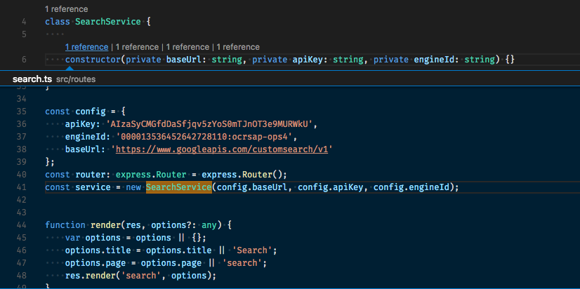
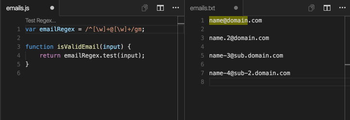

---
Order:
TOCTitle: Extensions using CodeLens
PageTitle: Visual Studio Code Extensions using CodeLens
MetaDescription: Visual Studio Code Extensions using CodeLens
Date: 2017-02-12
ShortDescription: Visual Studio Code Extensions using CodeLens
Author: Wade Anderson
---
# Extensions using CodeLens

February 12, 2017 Wade Anderson, [@waderyan_](https://twitter.com/waderyan_)

CodeLens is a popular feature in Visual Studio Code. The essence of the feature is "actionable contextual information interspersed" in your source code. That's quite a mouthful. Let me break it down for you.

CodeLens are links in your code:

- **Actionable** - You can click on the link and something happens.
- **Contextual** - The links are close to the code they are representing.
- **Interspersed** - The links located throughout your source code.


VS Code comes with CodeLens for TypeScript. You can enable it in User Settings with `"typescript.referencesCodeLens.enabled": true`.



You can create your own extension with the CodeLens feature. Get started by checking out the [documentation](/docs/extensionAPI/language-support.md#codelens-show-actionable-context-information-within-source-code). Additionally, you can find popular extensions in the Marketplace that use CodeLens. This blog post lists some of my favorite.

> **Tip:** You can install all of these extensions at once by installing the [CodeLens Roundup](https://marketplace.visualstudio.com/items?itemName=waderyan.code-lens-roundup) Extension Pack. How do you bundle extensions together? Check out [Extension Packs](/docs/extensionAPI/extension-manifest.md#extension-packs).

## Git Lens

Marketplace - [Git Lens](https://marketplace.visualstudio.com/items?itemName=eamodio.gitlens)

Author - [eamodio](https://marketplace.visualstudio.com/search?term=publisher%3A%22eamodio%22&target=VSCode)

This feature-rich extension will meet all your Git needs. eamodio uses the CodeLens UI to show you the most recent commit, number of authors, inline blame annotations, and exposes the Peek window for a full history view. See the extension's [README](https://marketplace.visualstudio.com/items?itemName=eamodio.gitlens) for the full list of features. With 14 five stars, this is a highly rated, excellent extension.


## Azure Application Insights

Marketplace - [Azure Application Insights](https://marketplace.visualstudio.com/items?itemName=VisualStudioOnlineApplicationInsights.application-insights)

Author - [Microsoft](https://marketplace.visualstudio.com/search?term=publisher%3A%22Microsoft%22&target=VSCode)

As you can imagine, this is a popular one on the VS Code team. Use this extension to see information on your production services right in VS Code!


## CodeMetrics

Marketplace - [CodeMetrics](https://marketplace.visualstudio.com/items?itemName=kisstkondoros.vscode-codemetrics)

Author - [Kiss Tamás](https://marketplace.visualstudio.com/search?term=publisher%3A%22Kiss%20Tam%C3%A1s%22&target=VSCode)

Imagine you have this colleague who likes to write complex functions. They thinks it's cool and are less concerned with maintainability. Use this extension to show them the complexity of their functions and also to check metrics on the source code you are writing.


As an added bonus, you can customize the descriptions. Here is the configuration we like to use on our team:

```
"codemetrics.basics.ComplexityLevelExtremeDescription": "😱",
"codemetrics.basics.ComplexityLevelHighDescription": "😳",
"codemetrics.basics.ComplexityLevelLowDescription": "🤓",
"codemetrics.basics.ComplexityLevelNormalDescription": "🤔",
"codemetrics.basics.ComplexityTemplate": "Complexity is {0} {1}"
```

As you can see, we like emojis.

## Regex Previewer

Marketplace - [Regex Previewer](https://marketplace.visualstudio.com/items?itemName=chrmarti.regex)

Author - [Christof Marti](https://marketplace.visualstudio.com/search?term=publisher%3A%22Christof%20Marti%22&target=VSCode)

Do you write a lot of regular expressions? This is an excellent extension to quickly test your regex.



## Version Lens

Marketplace - [Version Lens](https://marketplace.visualstudio.com/items?itemName=pflannery.vscode-versionlens)

Author - [pflannery](https://marketplace.visualstudio.com/search?term=publisher%3A%22pflannery%22&target=VSCode)

With support for many package management systems, including npm, bower, dotnet, and jspm, this extension is very useful. Install the extension and see what packages are out of date. With a quick click of the mouse, you can upgrade the version.


## Pro Tip - Preview your Extension

Marketplace - [Extension Manifest Editor](https://marketplace.visualstudio.com/items?itemName=ms-devlabs.extension-manifest-editor)

Author - [Microsoft DevLabs](https://marketplace.visualstudio.com/search?term=publisher%3A%22Microsoft%20DevLabs%22&target=VSCode)

Sometimes when I'm making an extension, I think it would be great to see how the extension will look in the Marketplace before publishing. The Extension Manifest Editor allows you to preview your extension's Marketplace presentation within VS Code.


Wade Anderson, VS Code Team Member 
[@waderyan_](https://twitter.com/waderyan_)
