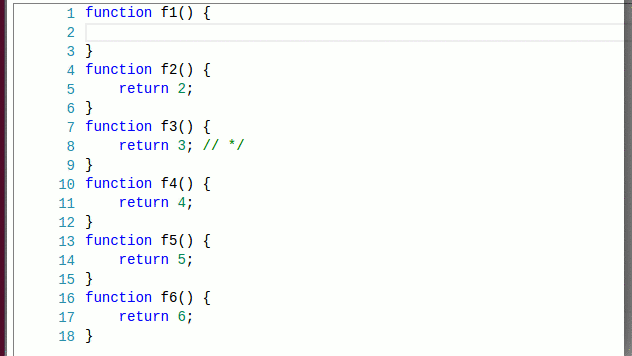
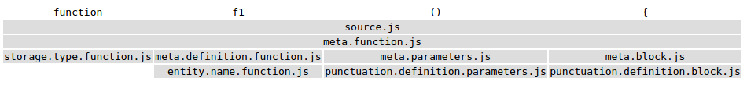
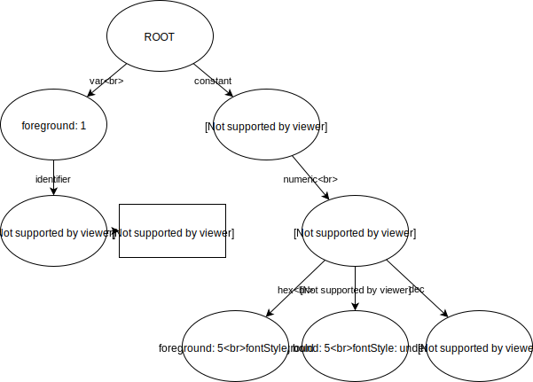
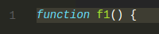
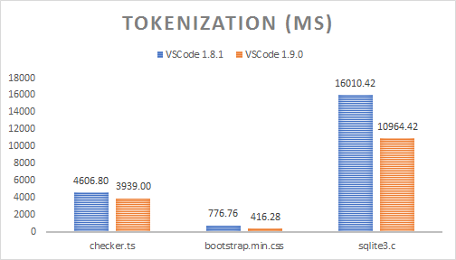
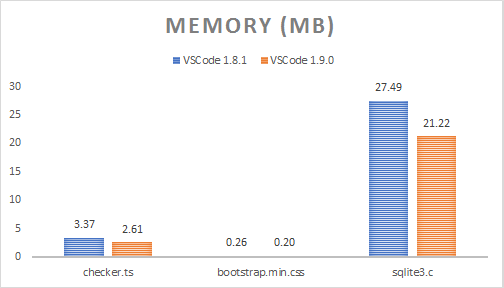

# STATUS: NOT DONE

# Tokenization improvements in VS Code 1.9.0

The upcoming release of VS Code will contain a cool change that has been cooking for a while, and I wanted to tell its story.

**TL;DR** TM themes will look more like their authors intended in VS Code 1.9.0, while being rendered faster and with less memory consumption.

---
## Tokenization

Tokenization is the process of assigning tokens to source code. Tokens are then targetted by a theme, assigned colors, and voilla, your source code is rendered with colors. It is the one feature that turns a text editor into a code editor.

Tokenization in VS Code (and in the Monaco Editor) runs line-by-line, from top to bottom, in a single pass. A tokenizer can store some state at the end of a tokenized line, which will be passed back when tokenizing the next line. This is a technique used by many tokenization engines, including TextMate grammars, that allows for an editor to retokenize only a small subset of the lines when making edits.

Most of the times, typing on a line results in only that line being retokenized, as the tokenizer returns the same end state and the editor can assume the following lines are not getting new tokens. The following gif shows what lines get repainted in different circumstances:
* most of the times, e.g. when typing `return 1;`, only the current line needs to be retokenized/repainted.
* more rarely, e.g. when typing `/*`, it is necessary to retokenize/repaint the current line and some of the ones below.



---
## How we used to represent tokens

The code for the editor in VSCode got written long before VSCode existed. It got shipped in the form of the Monaco Editor in various Microsoft projects, including Internet Explorer's F12 tools. One requirement that we got from them was that we needed to reduce memory usage.

Back in the day, we used to write tokenizers by hand (there's no feasible way to interpret TM grammars in the browser even today, but that's another story). All in all, for a line like the following we would get the following tokens from our hand-written tokenizers:

```js
function f1() {
```

| Offset  | 0 | 1 | 2 | 3 | 4 | 5 | 6 | 7 | 8 | 9 | 10 | 11 | 12 | 13 | 14 |
|---------|---|---|---|---|---|---|---|---|---|---|----|----|----|----|----|
| Content | f | u | n | c | t | i | o | n |   | f |  1 | (  | )  |    | {  |

```js
tokens = [
    { startIndex:  0, type: 'keyword.js' },
    { startIndex:  8, type: '' },
    { startIndex:  9, type: 'identifier.js' },
    { startIndex: 11, type: 'delimiter.paren.js' },
    { startIndex: 12, type: 'delimiter.paren.js' },
    { startIndex: 13, type: '' },
    { startIndex: 14, type: 'delimiter.curly.js' },
]
```

Holding on to that tokens array takes 648 bytes in Chrome, the reason for that is that storing an object is quite costly in terms of memory (each object instance must reserve space for pointing to its prototype, to its properties list, etc.). Now, our machines have a lot of RAM, but storing 648 bytes for a 15 characters long line is unacceptable.

So, at the time, we came up with a binary format to store the tokens, a format that was being used up to and including [VS Code 1.8.1](https://github.com/Microsoft/vscode/blob/1.8.1/src/vs/editor/common/model/tokensBinaryEncoding.ts). Given the token types would be repeating a lot, we'd collect them in a separate map (per file), doing something like the following:

```js
//     0        1               2                  3                      4
map = ['', 'keyword.js', 'identifier.js', 'delimiter.paren.js', 'delimiter.curly.js'];
tokens = [
    { startIndex:  0, type: 1 },
    { startIndex:  8, type: 0 },
    { startIndex:  9, type: 2 },
    { startIndex: 11, type: 3 },
    { startIndex: 12, type: 3 },
    { startIndex: 13, type: 0 },
    { startIndex: 14, type: 4 },
]
```

And then we'd encode the `startIndex` (32 bits) and the `type` (16 bits) in 48 bits of [the 53 mantissa bits](http://stackoverflow.com/a/2803010) a JavaScript number has. Our tokens array would finally look like this, and the map array would be reused for the entire file:

```js
tokens = [4294967296, 8, 8589934601, 12884901899, 12884901900, 13, 17179869198]
```

Holding on to this tokens array takes 104 bytes in Chrome. The elements themselves should take only 56 bytes (7 64-bit numbers), and the rest probably is explained by v8 storing other metadata with the array, or probably allocating the baking store in power of 2s, etc. However, the memory savings are obvious and do get better with more tokens per line. Anyways, we were happy with that and we've been using this representation ever since.

---
## Tokens <-> Theme matching

We thought it would be a good idea to follow browser best practices, such as leaving the styling up to CSS, so when rendering the above line, we'd decode the binary tokens using the `map`, and we'd render it using the token types like this:

```html
  <span class="token keyword js">function</span>
  <span class="token">&nbsp;</span>
  <span class="token identifier js">f1</span>
  <span class="token delimiter paren js">(</span>
  <span class="token delimiter paren js">)</span>
  <span class="token">&nbsp;</span>
  <span class="token delimiter curly js">{</span>
```

And we'd write our themes [in CSS](https://github.com/Microsoft/vscode/blob/1.8.0/src/vs/editor/browser/standalone/media/standalone-tokens.css):
```CSS
...
.monaco-editor.vs .token.delimiter          { color: #000000; }
.monaco-editor.vs .token.keyword            { color: #0000FF; }
.monaco-editor.vs .token.keyword.flow       { color: #AF00DB; }
...
```

It turned out quite nicely, we could flip a class name somewhere and immediately get a new theme applied to the editor.

---
## TextMate Grammars

For the launch of VS Code, we had something like 10 hand-written tokenizers, mostly for web-ish languages, which would definitely not be sufficient for a general-purpose desktop code editor. Enter TextMate grammars. There was one problem though, TM grammars don't work quite like our hand-written tokenizers.

TM grammars, through their use of begin/end states, or while states, can push scopes that can span multiple tokens. Here's a very simple example:

```js
function f1() {
```

If we were to make a section through the scopes stack, each token basically gets an array of scope names:



---
## TextMate Grammars in VSCode 1.8.1

| Offset  | 0 | 1 | 2 | 3 | 4 | 5 | 6 | 7 | 8 | 9 | 10 | 11 | 12 | 13 | 14 |
|---------|---|---|---|---|---|---|---|---|---|---|----|----|----|----|----|
| Content | f | u | n | c | t | i | o | n |   | f |  1 | (  | )  |    | {  |

For the same example, from a JS TM Grammar, we'd get something like the following back from the tokenizer:

```js
tokens = [
    { startIndex:  0, scopes: ['source.js', 'meta.function.js', 'storage.type.function.js'] },
    { startIndex:  8, scopes: ['source.js', 'meta.function.js'] },
    { startIndex:  9, scopes: ['source.js', 'meta.function.js', 'meta.definition.function.js', 'entity.name.function.js'] },
    { startIndex: 11, scopes: ['source.js', 'meta.function.js', 'meta.parameters.js', 'punctuation.definition.parameters.js'] },
    { startIndex: 13, scopes: ['source.js', 'meta.function.js'] },
    { startIndex: 14, scopes: ['source.js', 'meta.function.js', 'meta.block.js', 'punctuation.definition.block.js'] },
]
```

All our tokens types were strings, and our code was not ready to handle string arrays, not to mention the implications on the binary encoding of tokens. We therefore proceeded to "approximate"[*] the array of scopes into a single string using the following strategy:
> [*] What we were doing was plain wrong and "approximate" is a very nice word for it :).
* ignore the least specific scope (i.e. `source.js`). It is rarely adding any value.
* split each remaining scope on `"."`.
* dedup unique pieces
* sort the remaining pieces with a stable sort function (not necessarily lexicographic sort)
* join the pieces on `"."`

```js
tokens = [
    { startIndex:  0, type: 'meta.function.js.storage.type' },
    { startIndex:  9, type: 'meta.function.js' },
    { startIndex:  9, type: 'meta.function.js.definition.entity.name' },
    { startIndex: 11, type: 'meta.function.js.definition.parameters.punctuation' },
    { startIndex: 13, type: 'meta.function.js' },
    { startIndex: 14, type: 'meta.function.js.definition.punctuation.block' },
]
```

These tokens would then follow the same code path as the manual written tokenizers (i.e. get binary encoded), and then would render the same way too:

```html
<span class="token meta function js storage type">function</span>
<span class="token meta function js">&nbsp;</span>
<span class="token meta function js definition entity name">f1</span>
<span class="token meta function js definition parameters punctuation">()</span>
<span class="token meta function js">&nbsp;</span>
<span class="token meta function js definition punctuation block">{</span>
```


## TextMate Themes

TextMate Themes work with scope selectors. They're documented quite well [here](https://manual.macromates.com/en/scope_selectors.html). Given a token with the following scopes:
```js
//           D                  C                        B                           A
scopes = ['source.js', 'meta.function.js', 'meta.definition.function.js', 'entity.name.function.js']
```

Here are some simple selectors that would match, sorted by their rank (descending):

| Rank | Selector | Explanation |
|---|---|---|
| 12. | <code>source</code> | Partial match on `D`
| 11. | <code>source.js</code> | Complete match on `D`
| ... | ... | ... |
| 6. | <code>meta.definition.function</code> | Partial match on `B`
| 5. | <code>meta.definition.function.js</code> | Complete match on `B`
| 4. | <code>entity</code> | Partial match on `A`
| 3. | <code>entity.name</code> | Partial match on `A`
| 2. | <code>entity.name.function</code> | Partial match on `A`
| 1. | <code>entity.name.function.js</code> | Complete match on `A`

> Rule: `entity` wins over `meta.definition.function.js` because it matches a scope that is more specific (`A` over `B`, respectively).

> Rule: `entity.name` wins over `entity` because they both match the same scope (`A`), but `entity.name` is more specific than `entity`.

To make things a bit more complicated, TextMate themes also support parent selectors (also sorted descending by rank):

| Selector | Explanation |
|---|---|
| <code>meta</code> | Partial match on `B`
| <code>source meta</code> | Same partial match on `B`, parent match on `D`.
| <code>source.js meta</code> | Same partial match on `B`, better parent match on `D`.
| <code>meta.definition</code> | Better partial match on `B`.
| <code>source meta.definition</code> | Same partial match on `B`, parent match on `D`.
| ... | ... |
| <code>entity</code> | Partial match on `A`.
| <code>source entity</code> | Partial match on `A`, parent match on `D`.
| <code>meta.definition entity</code> | Partial match on `A`, parent match on `B`.

> Rule: `source entity` wins over `entity` because they both match the same scope (`A`), but `source entity` also matches a parent scope (`B`).

> Rule `entity.name` wins over `source entity` because they both match the same scope (`A`), but `entity.name` is more specific than `entity`.

> Note: There is a third kind of selector, one that involves excluding scopes, which we'll not discuss here. We didn't add support for this kind, and we've noticed it is rarely used in the wild.

---

## TextMate Themes in VSCode 1.8.1

Here are two Monokai theme rules (as JSON here for brevity; the original is in XML):
```js
...
// Function name
{ "scope": "entity.name.function", "fontStyle": "", "foreground":"#A6E22E" }
...
// Class name
{ "scope": "entity.name.class", "fontStyle": "underline", "foreground":"#A6E22E" }
...
```

We would simply generate dynamic CSS rules from the selectors:

```css
...
/* Function name */
.entity.name.function { color: #A6E22E; }
...
/* Class name */
.entity.name.class { color: #A6E22E; text-decoration: underline; }
...
```

We would then leave it up to CSS to match the "approximated" scopes. But the CSS matching rules are very different than the TM selector matching rules, especially when it comes to ranking. That's why TM themes in VSCode would look OK-ish, but never quite like their authors intended. Sometimes, the differences would be small, but sometimes these differences would completely change the feel of a theme.

---

## Some stars ligning up

Over time, we have phased out our hand-written tokenizers (the last one, for HTML, only a couple months ago). So, in VSCode, all our files get today tokenized with TM Grammars. For the Monaco Editor, we've migrated to using Monarch (a descriptive tokenization engine similar at heart with TM Grammars, but a bit more expressive and that can run in a browser) for most of the supported languages, and we've added a wrapper for manual tokenizers. All in all, that means supporting a new tokenization format would require changing 3 tokens providers (TM, Monarch and the manual wrapper) and not more than 10.

Already a few months ago, we've reviewed all the code we have in the VSCode core that used to read token types and we figured out that those consumers only cared about strings, regular expressions or comments. e.g. The bracket matching logic skips tokens that contain the scope `"string"`, `"comment"` or `"regex"`.

Since a few weeks, we've gotten the OK from our internal partners (other teams inside Microsoft consuming the Monaco Editor), that it is OK to drop support for IE9 and IE10 in the Monaco Editor.

Probably most important, the number one most voted feature on the editor is [minimap support](https://github.com/Microsoft/vscode/issues/4865). To render a minimap in any decent amount of time, we cannot use DOM nodes and CSS matching. We will probably use a canvas, and we're going to need to know the color of each token in JavaScript, so we can paint those tiny letters with the right colors.

Perhaps the biggest breakthrough we've had is that we **don't need to store tokens, nor their scopes**, since tokens only produce effects in terms of a theme matching them or in terms of bracket matching skipping strings, etc.

## Finally, what's new in VSCode 1.9.0

### Representing a TM theme

Here's how a simplified theme might look like:

```js
theme = [
  {                                  "foreground": "#F8F8F2"                           },
  { "scope": "var",                  "foreground": "#F8F8F2"                           },
  { "scope": "var.identifier",       "foreground": "#00FF00", "fontStyle": "bold"      },
  { "scope": "meta var.identifier",  "foreground": "#0000FF"                           },
  { "scope": "constant",             "foreground": "#100000", "fontStyle": "italic"    },
  { "scope": "constant.numeric",     "foreground": "#200000"                           },
  { "scope": "constant.numeric.hex",                          "fontStyle": "bold"      },
  { "scope": "constant.numeric.oct",                          "fontStyle": "underline" },
  { "scope": "constant.numeric.dec", "foreground": "#300000"                           },
];
```

When loading a theme, we will generate a numeric id for each unique color that shows up in the theme and store it into a color map (similar as we did for token types above):


```js
//                          1          2          3          4          5           6
colorMap = ['reserved', '#F8F8F2', '#00FF00', '#0000FF', '#100000', '#200000', '#300000']
theme = [
  {                                  "foreground": 1                           },
  { "scope": "var",                  "foreground": 1,                          },
  { "scope": "var.identifier",       "foreground": 2, "fontStyle": "bold"      },
  { "scope": "meta var.identifier",  "foreground": 3                           },
  { "scope": "constant",             "foreground": 4, "fontStyle": "italic"    },
  { "scope": "constant.numeric",     "foreground": 5                           },
  { "scope": "constant.numeric.hex",                  "fontStyle": "bold"      },
  { "scope": "constant.numeric.oct",                  "fontStyle": "underline" },
  { "scope": "constant.numeric.dec", "foreground": 6                           },
];
```

We will then generate a [Trie](https://en.wikipedia.org/wiki/Trie) out of the theme rules:



Each node holds on to the resolved options. e.g. The node for `constant.numeric.hex` contains the instruction to change foreground to `5`, as it inherits it from `constant.numeric`, even if the foreground was not explicitly set in the original theme rule.

Note how the node for `var.identifier` holds on to the extra parent rule `meta var.identifier` and will answer queries accordingly.

When a scope is encountered, we can query this Trie. e.g:

| Query     | Results |
|-----------|---------|
| `constant`             | set foreground to `4`, fontStyle to `italic` |
| `constant.numeric`     | set foreground to `5`, fontStyle to `italic` |
| `constant.numeric.hex` | set foreground to `5`, fontStyle to `bold` |
| `var`                  | set foreground to `1` |
| `var.baz`              | set foreground to `1` (matches `var`) |
| `baz`                  | do nothing (no match) |
| `var.identifier`       | if there is a parent scope `meta`, then set foreground to `3`, fontStyle to `bold`,<br/> otherwise, set foreground to `2`, fontStyle to `bold` |


### Changes to tokenization

We've changed the way we represent the scope stack in [`vscode-textmate`](https://github.com/Microsoft/vscode-textmate) to be [an immutable linked list](https://github.com/Microsoft/vscode-textmate/blob/master/src/grammar.ts#L946) that also stores the fully resolved `metadata`.

When pushing a new scope onto the scope stack, we will look up the new scope in the theme trie. We can then compute immediately the fully resolved desired foreground or font style for a scope list, based on what we inherit from the scope stack and on what the theme trie returns.

Some examples:
| Scope Stack | Metadata |
|---|---|
| `["source.js"]` | foreground is `1`, font style is regular (the default rule without a scope selector)
| `["source.js","constant"]` | foreground is `4`, fontStyle is `italic`
| `["source.js","constant","baz"]` | foreground is `4`, fontStyle is `italic`
| `["source.js","var.identifier"]` | foreground is `2`, fontStyle is `bold`
| `["source.js","meta","var.identifier"]` | foreground is `3`, fontStyle is `bold`

When popping from the scope stack, there is no need to compute anything, since we can just use the metadata stored with the previous scope list element.

```ts
export class ScopeListElement {
    public readonly parent: ScopeListElement;
    public readonly scope: string;
    public readonly metadata: number;
    ...
}
```

We store 32 bits of metadata:
```
/**
 * - -------------------------------------------
 *     3322 2222 2222 1111 1111 1100 0000 0000
 *     1098 7654 3210 9876 5432 1098 7654 3210
 * - -------------------------------------------
 *     xxxx xxxx xxxx xxxx xxxx xxxx xxxx xxxx
 *     bbbb bbbb bfff ffff ffFF FTTT LLLL LLLL
 * - -------------------------------------------
 *  - L = LanguageId (8 bits)
 *  - T = StandardTokenType (3 bits)
 *  - F = FontStyle (3 bits)
 *  - f = foreground color (9 bits)
 *  - b = background color (9 bits)
 */
```

Finally, instead of emitting tokens as objects from the tokenization engine:

```js
// These are generated using the Monokai theme.

tokens_before = [
    { startIndex:  0, scopes: ['source.js', 'meta.function.js', 'storage.type.function.js'] },
    { startIndex:  8, scopes: ['source.js', 'meta.function.js'] },
    { startIndex:  9, scopes: ['source.js', 'meta.function.js', 'meta.definition.function.js', 'entity.name.function.js'] },
    { startIndex: 11, scopes: ['source.js', 'meta.function.js', 'meta.parameters.js', 'punctuation.definition.parameters.js'] },
    { startIndex: 13, scopes: ['source.js', 'meta.function.js'] },
    { startIndex: 14, scopes: ['source.js', 'meta.function.js', 'meta.block.js', 'punctuation.definition.block.js'] },
]

// Every even index is the token start index, every odd index is the token metadata.
// We get less tokens because tokens with the same metadata get collapsed
tokens_now = [
                 // bbbbbbbbb fffffffff FFF TTT LLLLLLLL
    0, 16926743, // 000000010 000001001 001 000 00010111
    8, 16793623, // 000000010 000000001 000 000 00010111
    9, 16859159, // 000000010 000000101 000 000 00010111
    11, 16793623 // 000000010 000000001 000 000 00010111
]
```

And they get rendered with:

```html
<span class="mtk9 mtki">function</span>
<span class="mtk1">&nbsp;</span>
<span class="mtk5">f1</span>
<span class="mtk1">()&nbsp;{</span>
```




The tokens are returned as an [`Uint32Array`](https://developer.mozilla.org/en-US/docs/Web/JavaScript/Reference/Global_Objects/Uint32Array) straight from the tokenizer. We hold on to the backing [`ArrayBuffer`](https://developer.mozilla.org/en-US/docs/Web/JavaScript/Reference/Global_Objects/ArrayBuffer) and for the example above that takes 96 bytes in Chrome. The elements themselves should take only 32 bytes (8 32-bit numbers), but again we're probably observing some v8 metadata overhead.

### Some numbers

To get the following measurements, I've picked three files:

| File name | File size | Lines count | Language | Obs |
|---|---|---|---|---|
| `checker.ts` | 1.18 MB | 22,253 | TypeScript | Actual source file used in TypeScript compiler |
| `bootstrap.min.css` | 118.36 KB | 12 | CSS | Minified CSS file |
| `sqlite3.c` | 6.73 MB | 200,904 | C | Concatenated distribution file of SQLite

I've ran the tests on a beefy desktop machine on Windows (which uses Electron 32 bit).

I had to make some changes to the source code in order to compare apples with apples, such as ensuring the exact same grammars are used in both VS Code versions, turning off rich language features in both versions, or lifting the 100 stack depth limitation in VS Code 1.8.1 which no longer exists in VS Code 1.9.0, etc. I also had to split bootstrap.min.css into multiple lines to get each line under 20k chars.

Tokenization runs in a yielding fashion on the UI thread, I had to add some code to force it to run synchronously, in order to measure the following times (median of 10 runs presented):

| File name | File size | VSCode 1.8.1 | VSCode 1.9.0 | Speed-up |
|---|---|---|---|---|
| `checker.ts` | 1.18 MB | 4606.80 ms | 3939.00 ms | 14.50% |
| `bootstrap.min.css` | 118.36 KB | 776.76 ms | 416.28 ms | 46.41% |
| `sqlite3.c` | 6.73 MB | 16010.42 ms | 10964.42 ms | 31.52% |




Folding is consuming a lot of memory, especially for large files (that's an optimization for another time), so I've collected the following Heap Snapshot numbers with folding turned off. This shows the memory held by the Model, without accounting for the original file string:

| File name | File size | VSCode 1.8.1 | VSCode 1.9.0 | Memory savings |
|---|---|---|---|---|
| `checker.ts` | 1.18 MB | 3.37 MB | 2.61 MB | 22.60% |
| `bootstrap.min.css` | 118.36 KB | 267.00 KB | 201.33 KB | 24.60% |
| `sqlite3.c` | 6.73 MB | 27.49 MB | 21.22 MB | 22.83% |


