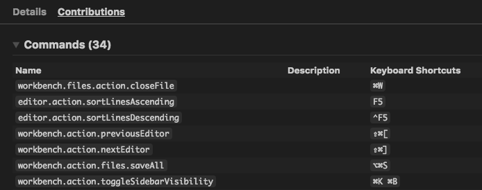
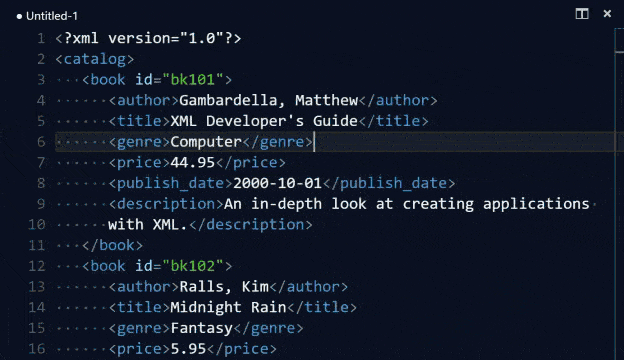

# Sublime Text Extension Roundup

April 10, 2017 Wade Anderson, [@waderyan_](https://twitter.com/waderyan_)

I'm a big fan of Sublime Text. It was my [go to editor](https://www.youtube.com/watch?v=OnkYnm-WiVo&t=15s) for my first few years of programming. Naturally, I now like VS Code more, but sometimes I miss things from Sublime Text.

We wrote an [extension](https://marketplace.visualstudio.com/items?itemName=ms-vscode.sublime-keybindings) to help alleviate some of the pain I felt (for example, keyboard muscle memory). There is still more work to do (see this [GitHub issue](https://github.com/Microsoft/vscode/issues/3776)), but the gaps are closing fast. You can find other extensions to cover almost all of the features you are missing.

In this blog, I'll present some existing VS Code features and suggested extensions to help you if you are coming from Sublime Text.

>**Tip:** To install all of the extensions mentioned in this blog post, check out this [extension pack](https://marketplace.visualstudio.com/items?itemName=waderyan.sublime-text-pack).

## VS Code features

VS Code has several features you can enable to more closely match the coding experience on Sublime Text.

## Minimap

VS Code has an excellent minimap, but it requires a setting change. Use the following setting to turn on the minimap:

```json
"editor.minimap.enabled": true
```

## Format on Paste

Format on paste is a fantastic feature when moving source code around. Use this setting to enable format on paste:

```json
"editor.formatOnPaste": true
```

## Suggestion Ordering

Sublime Text and VS Code order snippets differently in their code completion widgets. To make VS Code work more like Sublime Text, use this setting to put snippets at the top:

```json
"editor.snippetSuggestions": "top"
```

## Extensions

To ease moving from Sublime Text, I recommend using the following extensions:

## Sublime Text Keymap

Marketplace - [Sublime Text Keymap](https://marketplace.visualstudio.com/items?itemName=ms-vscode.sublime-keybindings)

Author - [Microsoft](https://marketplace.visualstudio.com/search?term=publisher%3A%22Microsoft%22&target=VSCode)

You have memorized the keyboard shortcuts and you won't need to change your muscle memory to move to VS Code. This extension ports the most popular keyboard shortcuts from Sublime Text to VS Code.



> **Tip:** There are some conflicts with VS Code and Sublime Text keyboard shortcuts. Currently the extension chooses Sublime Text's shortcuts over VS Code's. This means that some VS Code keyboard shortcuts don't work the same after installing the extension (for example, `kbstyle(F5)` to debug). You can easily modify any shortcut yourself with **Preferences** > **Keyboard Shortcuts**.

## Expand Selection To Scope

Marketplace - [Expand Selection To Scope](https://marketplace.visualstudio.com/items?itemName=vittorioromeo.expand-selection-to-scope)

Author - [Vittorio Romeo](https://marketplace.visualstudio.com/search?term=publisher%3A%22Vittorio%20Romeo%22&target=VSCode)

VS Code has existing support for expanding text selection, but this extension hits a nice sweet spot. Expand your selection to the scope incrementally, including for multiple cursors.


## Close HTML / XML Tag

Marketplace - [Close HTML / XML tag](https://marketplace.visualstudio.com/items?itemName=Compulim.compulim-vscode-closetag)

Author - [Compulim](https://marketplace.visualstudio.com/search?term=publisher%3A%22Compulim%22&target=VSCode)

Adds a keyboard shortcut to add the closing tag for XML and HTML.



## Sublime Commands

Marketplace - [Sublime Commands](https://marketplace.visualstudio.com/items?itemName=Zarel.sublime-commands)

Author - [Zarel](https://marketplace.visualstudio.com/search?term=publisher%3A%22Zarel%22&target=VSCode)

Ports the **Transpose**, **Expand Selection to Line**, and **Split into Lines** commands to VS Code.

## Want to see your extension featured?

Have other extensions you like or want to see your extension in the next Roundup? Ping me on [Twitter](https://twitter.com/waderyan_)!

Wade Anderson, VS Code Team Member
[@waderyan_](https://twitter.com/waderyan_)