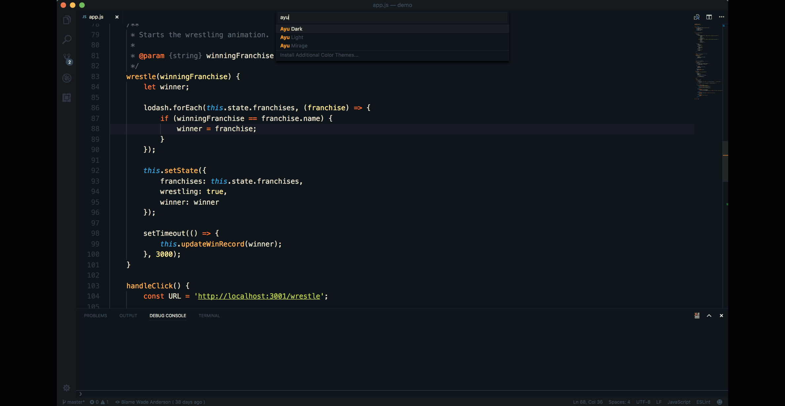

# Fresh Paint - Give VS Code a New Look

June 20, 2017 Wade Anderson, [@waderyan_](https://twitter.com/waderyan_)

Having a great looking editor is a necessity for any full-time developer. We spend a lot of time in our editor and we like to keep things fresh and interesting!

Visual Studio Code supports a lot of customizations, in particular the look of your environment. In this blog, we're going to look at [Color Themes](/docs/getstarted/themes.md), [File Icon Themes](/docs/getstarted/themes.md#icon-themes), and other [settings](/docs/getstarted/settings.md) to change the look and feel of the code editor.

## Color Themes

A powerful customization is the ability to change a Color Theme. A Color Theme is a set of colors for the editor background, text, language syntax, etc. VS Code comes with several built-in themes and there are hundreds you can install from the [Marketplace](https://marketplace.visualstudio.com/search?term=tag%3A%22color%20theme%22&target=VSCode&category=Themes&sortBy=Downloads).

Some of the favorite themes used the VS Code team are **Sapphire**, **Nord** and **Ayu**, shown below.

### Sapphire Theme

Marketplace - [Sapphire Theme](https://marketplace.visualstudio.com/items?itemName=Tyriar.theme-sapphire)

Author - [Daniel Imms](https://marketplace.visualstudio.com/search?term=publisher%3A%22Daniel%20Imms%22&target=VSCode&category=All%20categories&sortBy=Relevance)

### Nord

Marketplace - [Nord](https://marketplace.visualstudio.com/items?itemName=arcticicestudio.nord-visual-studio-code)

Author - [arcticicestudio](https://marketplace.visualstudio.com/search?term=publisher%3A%22arcticicestudio%22&target=VSCode&category=All%20categories&sortBy=Relevance)

### Ayu

Marketplace - [Ayu](https://marketplace.visualstudio.com/items?itemName=teabyii.ayu)

Author - [teabyii](https://marketplace.visualstudio.com/search?term=publisher%3A%22teabyii%22&target=VSCode&category=All%20categories&sortBy=Relevance)

## File Icon Themes

Using a File Icon Theme helps you quickly see file types in the Explorer and tabs through colorful icons. Here is a screenshot of supported icons from [VSCode Great Icons](https://marketplace.visualstudio.com/items?itemName=emmanuelbeziat.vscode-great-icons).

Just as with Color Themes, there are many popular File Icon Themes in the [Marketplace](https://marketplace.visualstudio.com/search?term=tag%3A%22icon%20theme%22&target=VSCode&category=Themes&sortBy=Downloads).

## Font Ligatures

There are many settings you can tweak to make VS Code look good. One of my favorites is font ligatures, where two characters are combined into a single expressive character. Enable font ligatures by setting `"editor.fontLigatures"` to `true`. You must have a font installed that supports font ligatures, such as [Fira Code](https://github.com/tonsky/FiraCode).

## How do you make your editor look good?

What do you do to make your editor look good? Ping me on [Twitter](https://twitter.com/waderyan_) and I'd love to share your tips in a future blog post.

Wade Anderson, VS Code Team Member
[@waderyan_](https://twitter.com/waderyan_)
