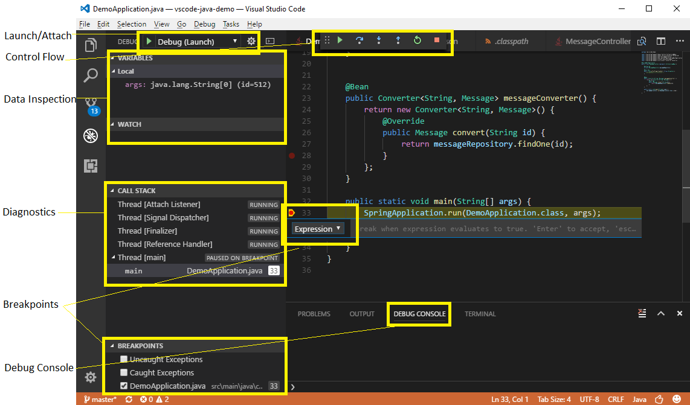

---
Order:
TOCTitle: Java Debugging
PageTitle: Using Visual Studio Code to Debug Java Applications
MetaDescription: Java Development with VS Code
Date: 2017-09-28
ShortDescription: Using VS Code to Debug Java Applications
Author: Xiaokai He
---
# Using VS Code to Debug Java Applications

September 28, 2017 Xiaokai He

For Java developers on Visual Studio Code, the [Language Support for Java™ by Red Hat](https://marketplace.visualstudio.com/items?itemName=redhat.java) extension has been great for providing language features such as IntelliSense and project support. At the same time, we've also heard feedback that users would also like Java debugging. Today, we're excited to announce our ongoing collaboration with Red Hat and enabling Java developers to debug Java applications with a new lightweight [Debugger for Java](https://marketplace.visualstudio.com/items?itemName=vscjava.vscode-java-debug) based on [Java Debug Server](https://github.com/microsoft/java-debug).

To help Java developers to get started with VS Code quickly, we also created an [Extension Pack for Java](https://marketplace.visualstudio.com/items?itemName=vscjava.vscode-java-pack) which includes both the [Language Support for Java™ by Red Hat](https://marketplace.visualstudio.com/items?itemName=redhat.java) and [Debugger for Java](https://marketplace.visualstudio.com/items?itemName=vscjava.vscode-java-debug) extensions so you won't need to search for them individually. This is just the start to creating a modern workflow for Java and we'll be adding more features and extensions to the **Extension Pack for Java** in the future.

## Getting started

To get started:

1. In Visual Studio Code, open the **Extensions** view (`kb(workbench.view.extensions)`).
2. Type "java" to filter the list.
3. Find and install the [Extension Pack for Java](https://marketplace.visualstudio.com/items?itemName=vscjava.vscode-java-pack) or standalone [Debugger for Java](https://marketplace.visualstudio.com/items?itemName=vscjava.vscode-java-debug) extension if you already have [Language Support for Java™ by Red Hat](https://marketplace.visualstudio.com/items?itemName=redhat.java) installed.

You also install the **Extension Pack for Java** directly from this blog post:

<a class="install-extension-btn" href="vscode:extension/vscjava.vscode-java-pack">Install the Extension Pack for Java</a>

After reloading VS Code, open a folder that contains a Java project and follow below steps:

1. Prepare the project. Open a `.java` file, and the Java extensions will be activated. Maven, Gradle and Eclipse projects are supported. Project build is automatically handled by the extensions, no need to be triggered manually.
2. Start debugging. Switch to **Run** view (`kb(workbench.view.debug)`) and open `launch.json` to add a debug configuration for Java.
3. Fill in the `mainClass` for `Launch` setting or `hostName` and `port` for `Attach`.
4. Set your breakpoint and hit `F5` to start debugging.

## Supported features

In this release, we support the following features:

- **Launch/Attach** - You can either launch the Java project within VS Code or attach to any running JVM process in debug mode, locally or remotely.
- **Breakpoints** - Conditional breakpoints by Hit Count is supported and can easily be set using the inline breakpoint settings window. This allows you to conveniently add conditional breakpoints to your code, directly in the source viewer, without requiring a modal window. Break on exceptions is also supported.
- **Control flow** - Including **Pause**, **Continue** `F5`, **Step over** `F10`, **Step into** `F11`, **Step out** `Shift+F11`
- **Data inspection** - When you're stopped at a breakpoint, the debugger has access to the variable names and values that are currently stored in memory. Inspect/Watch/Set Variables are supported.
- **Diagnostics** - The **CALL STACK** panel shows the call stack of your program and allows you to navigate through the call path of each captured allocation. Multi-threaded debugging is supported by parallel stacks.
- **Debug Console** - The Debug Console lets you see information from both stdout and stderr.

## Next Steps

- Checkout more about [Java on VS Code](/docs/languages/java.md)

## Feedback

Please share your feedback and ask questions to help us improve. You can contact us on [Gitter](https://gitter.im/Microsoft/vscode-java-debug).

Xiaokai He, [@JavaOnAzure](https://twitter.com/JavaOnAzure)
