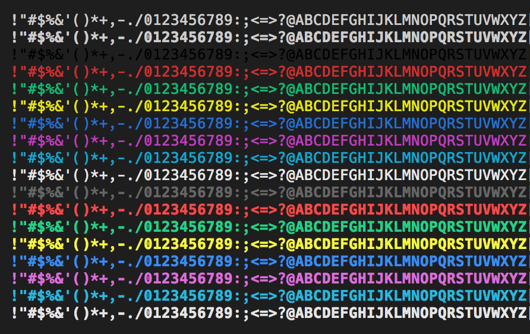

# Integrated Terminal Performance Improvements

October 3, 2017 Daniel Imms, [@Tyriar](https://twitter.com/Tyriar)

The rendering engine of the Integrated Terminal has been completely re-written with performance in mind for the upcoming version 1.17 of Visual Studio Code. In this version, we move away from a DOM-based rendering system to using the HTML [canvas](https://developer.mozilla.org/en-US/docs/Web/HTML/Element/canvas) element.

## DOM Rendering

It's somewhat surprising, but rendering an interactive terminal was possible in a system designed for displaying static documents. However, as time went on we found that certain functionality provided by the DOM needed to be overridden to fix several issues:

**Selection**: There was a lot of working against the DOM's selection system to cover the terminal use case. Since we always rendered only what was visible to the DOM, you could not select multiple pages of content without reimplementing selection. Scrolling would also cause the selection to be dropped. In order to resolve these issues, custom selection logic was added in VS Code version [1.14](https://code.visualstudio.com/updates/v1_14#_selection-reimplemented).

**Misaligned characters**: Due to many monospace fonts not being strictly monospace for some Unicode characters, this could lead to situations like the one seen on the right-side of the image below:

A workaround for this would be to wrap all Unicode characters in fixed width spans, however this increases the time it takes to render a frame.

**Excessive garbage collection**: Due to the number of elements needed to render the terminal, the garbage collector needed to clean up memory frequently, often pushing out rendering time by a noticeable amount. An object pool was put in place to try to work around this problem, allowing DOM elements to be recycled.

**Performance**: No matter how hard we try to resolve these issues, performance will always have the hard cap imposed by the layout engine.

## Sidestepping the Layout Engine

In some cases, composing elements and doing a layout could take longer than a frame (16.6ms) all by itself, which is unacceptable if we want to maintain a smooth 60 frames per second (FPS) in the terminal. The solution for this was a new canvas-based rendering engine.

The [`<canvas>` HTML element](https://developer.mozilla.org/en-US/docs/Web/HTML/Element/canvas) allows drawing graphics and text using a JavaScript API.

## Render Layers

A number of canvas elements known as "render layers" are used to simplify the rendering of different parts of the terminal.

The current layers, in order, are:

1. **Text**: Background colors and foreground text, this layer is opaque.
2. **Selection**: Selection using the mouse.
3. **Link**: The underline when hovering over links.
4. **Cursor**: The terminal's cursor.

Separating these parts out into their own little components has vastly simplified how drawing is done.

## Only Draw What Changed

An important part of the new renderer is that it only draws what has *changed*. To do so, a slim internal model is kept which contains the minimal amount of information about a cell's drawn state. The state is then used to quickly check when a cell needs to change before the more expensive draw action is performed. In the case of the **Text** layer, this model includes a reference to the character, text styles, foreground color and background color.

This is compared to the previous rendering engine where the entire line would be removed from the DOM, reconstructed and re-added, even when nothing changed.

*The green rectangles in the image above indicate the regions that are redrawn.*

## The Texture Atlas

A texture atlas is used to boost rendering time even further. There is an [`ImageBitmap`](https://developer.mozilla.org/en-US/docs/Web/API/ImageBitmap) behind the scenes which contains all ASCII characters in the most common styles on the default background color.

When drawing these styles of text, the texture atlas is used instead of a regular call to [`CanvasRenderingContext2D.fillText`](https://developer.mozilla.org/en-US/docs/Web/API/CanvasRenderingContext2D/fillText). As the `ImageBitmap` is co-located on the GPU, the speed of drawing is improved considerably.

## Forced Frame Skipping

Due to the speed of rendering in the DOM, it was necessary to skip extra frames in order to ensure the parser had enough CPU time. While this enabled commands to run faster than before, a lot of data being streamed through the terminal would cause the frame rate to drop below 10 FPS.

With the new renderer, this restriction has been removed and you can now enjoy up to 60 FPS in the terminal.

## The Results

Our benchmarks have measured that the Integrated Terminal now renders approximately **5 to 45 times faster than before**, depending on the situation. Even if you don't notice the increased responsiveness and frame rate, faster rendering also means less battery usage! We hope you enjoy the performance improvements, they are coming to version 1.17 of VS Code in a few days and are available to test in the [Insiders build](https://code.visualstudio.com/insiders) right now.

You can also jump into the [original xterm.js pull request](https://github.com/sourcelair/xterm.js/pull/938) that added the feature for a more detailed look.

Happy Coding!

Daniel Imms, VS Code Team member [@Tyriar](https://twitter.com/Tyriar)
