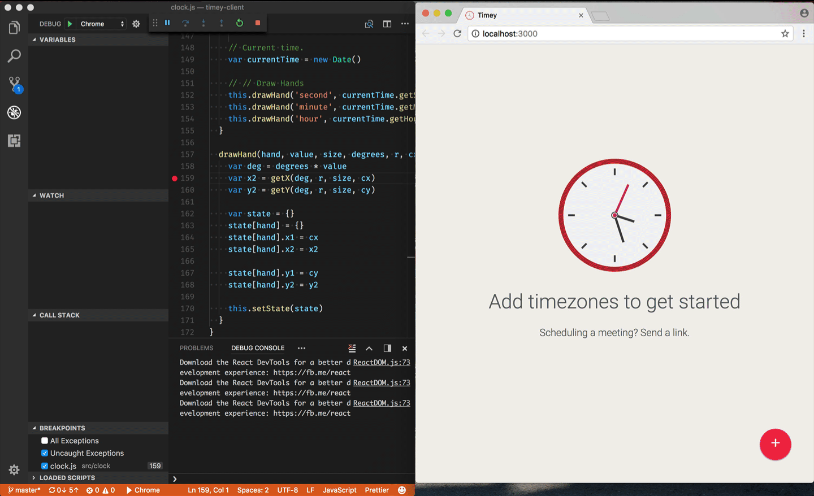
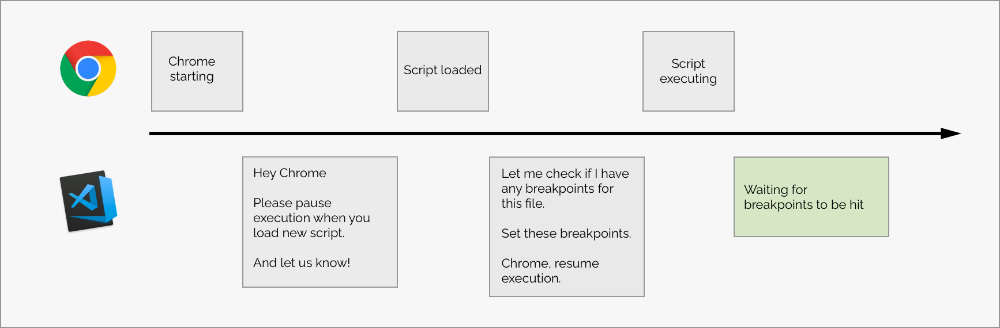

# What's new for Chrome debugging in VS Code
Over the recent months we have been busy improving the Chrome debugging experience for VS Code, and today we are happy to release two new significant features that we think will help make client-side JavaScript debugging in VS Code a more realiable and easier experience.

If you aren't familiar with our Chrome Debugger for VS Code then it allows you to debug your client-side JavaScript running in Google Chrome, and adds a new aspect to our existing JavaScript debugging experience where we out of the box allows you to debug your server-side JavaScript in Node. Having both debuggers allows you to do seamless full-stack JavaScript debugging.

### Use VS Code and Chrome DevTools at the same time!
The first thing we have been working on with the Google Chrome team is to make it posssible to use both VS Code and Chrome DevTools at the same time!

Since day one we heard this feedback from you, but we have been limited by Chrome's lack of [support of multi remote debugging connections](https://bugs.chromium.org/p/chromium/issues/detail?id=129539). This has meant that when VS Code connected to Chrome, their Chrome DevTools would be kicked out, and when you opened Chrome DevTools, VS Code would be kicked out.

Multiple connections means that you now can debug your JavaScript from VS Code while using the DOM Explorer, profiler or any other tool inside Chrome DevTools, without getting disconnected!

>

The Chrome team began working on this few months ago, and we have been working closely with them to make sure the VS Code experience is optimal.
Multi-connections shipped officially in Chrome 63, and works out of the box with VS Code.

To get this, just update to the latest Chrome version, and you should be good to go.

#### Syncronized stepping between Chrome DevTools and VS Code

We think being able to combine VS Code and Chrome DevTools is an extremely powerful experience, as it enables you to pick and choose right tools for the relevant, without being forced to make the hard choice of replacing one tool with another.

We believe JavaScript script debugging belongs to your editor, but we also recognize that some prefers to debug JavaScript from DevTools, so instead of trying to replace DevTools, we instead see this as an oppertunity to integrate.

The first step we are taking towards better integrating the tools are syncronized stepping between Chrome DevTools and VS Code, as shown here:

>

Syncronized stepping allows you to debug your JavaScript code in VS Code and Chrome DevTools at the same time, and gives you the oppertunity to seamlessly jump between the two tools. From within each tool you can step-in, continue and debug your JavaScript without worrying about the other debugger becoming out of sync.

It's still early days, and we are excited on taking the first steps on integrating VS Code further with DevTools, and to explore the new world of integrations that's possible with connected editors and DevTools.


### We now set your breakpoints before your app runs
Another feature we have been working on with our friends in Visual Studio, is the ablity for us to set your breakpoints in your JavaScript  before it get's executed in Chrome. This sounds very simple, but is quite complicated when you dive into the details of how JavaScript can be loaded and executed in many asynchronous ways.

The problem has been that many of you have been experiencing to set breakpoints in VS Code followed by launching Chrome just to discover that the breakpoint wasn't hit. This has lead to many thinking that debugger didn't work, and to confuse things more a simple page refresh would make the breakpoints work for most.

Why would that be? It's a bit complicated, but there's been a potential timing issue between VS Code and Chrome, which is best simpler to illustrate in a timeline:


As you can see on the timeline illustrated in yellow, the issue has been that sometimes JavaScript could have executed before VS Code got to set the breakpoints.

This has meant that if you had breakpoints set in code that would get *immediately executed* as a part of a page load, VS Code mostly hasn't been able to set breakpoints in time before execution had completed. The workaround for this was a page refresh as it would re-execute the code and therefore trigger the breakpoints.

Good news! We have found a way where you reliably can set breakpoints in immediately executed code, which we call [`break-on-load breakpoints`](https://github.com/Microsoft/vscode-chrome-debug/issues/445).

Break-on-load breakpoints is powered by DOM Instrumentation Breakpoints in Chrome that allows us to pause script execution every time a new script is loaded. This changes the workflow for our debugger, and allows us to have more time to set the breakpoints before your JavaScript get's executed.



### Enable break-on-load breakpoints with a new setting

We are releasing break-on-load breakpoints as a new experimental feature for our Chrome Debugger, and you can enable the feature by using the new `breakOnLoad` property to `true` in a launch config like:

```json
{
    "type": "chrome",
    "request": "launch",
    "name": "Chrome",
    "url": "http://localhost:3000",
    "webRoot": "${workspaceRoot}/src",
    "breakOnLoad": true
}
```

Having break-on-load breakpoints enabled will have an impact on your initial page load performance, as we'll quickly pause Chrome every time a new script is loaded. This is the reason for why we are releasing this as an opt-in feature. If you have experienced the problems described earlier, please don't hesitate on enabling break-on-load breakpoints and let us know how they work for you.

This is a big update for our Chrome debugger, and we can't wait to hear your feedback on these new features. In a world where your editor is more integrated with DevTools, what would expect or want from your tools? Let us know!

Happy Coding!

Kenneth ([@auchenberg](https://twitter.com/auchenberg))
