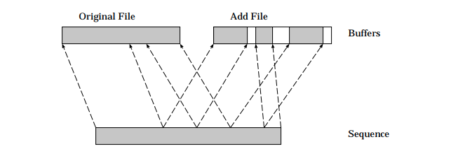
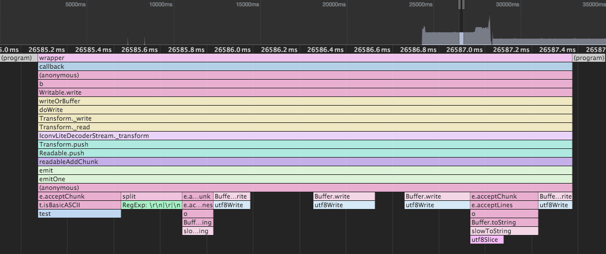
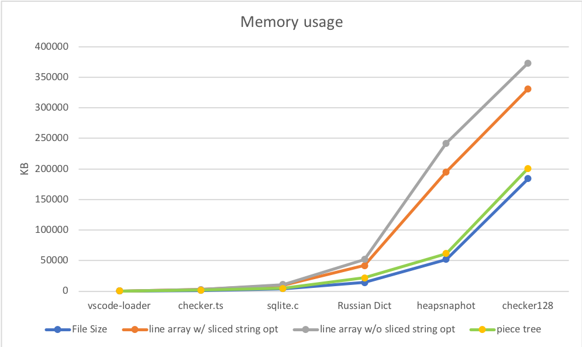
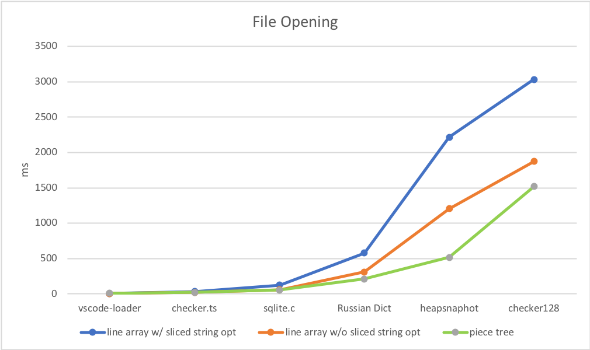
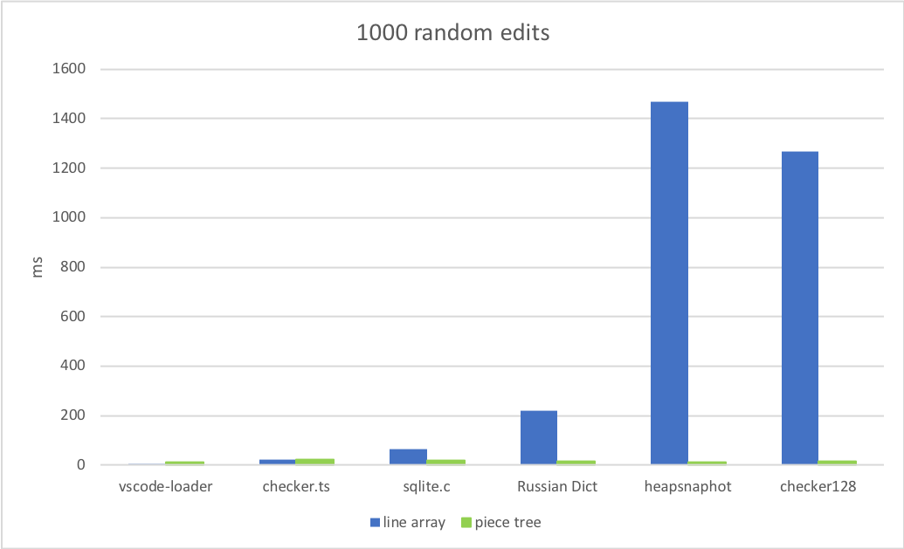
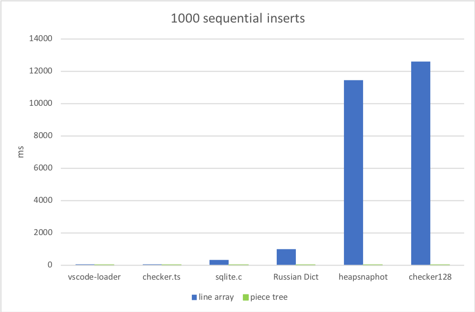
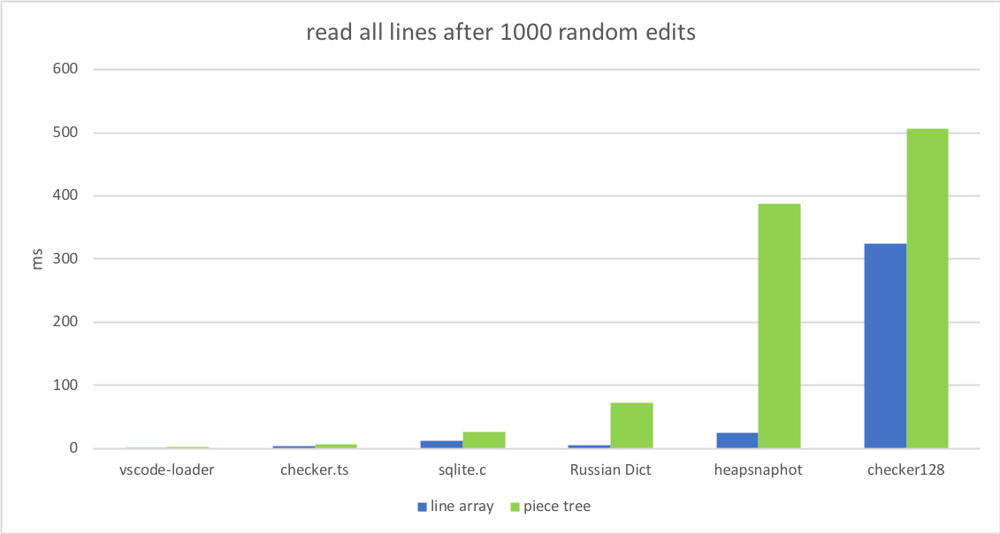
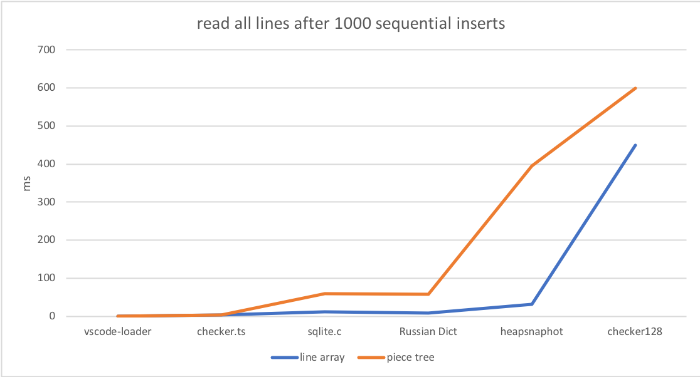
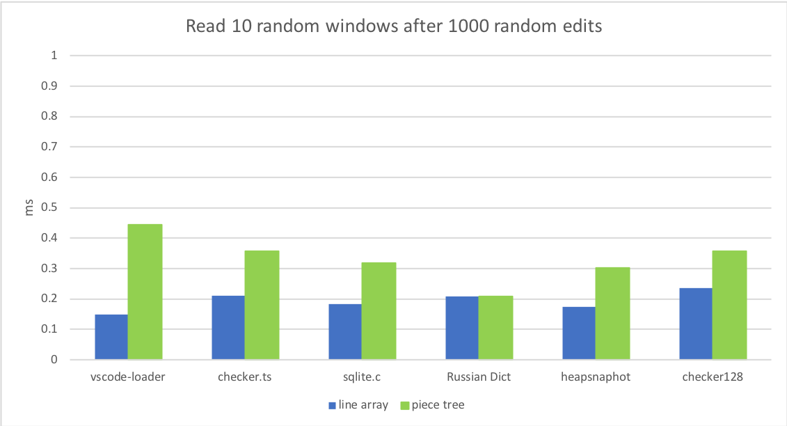
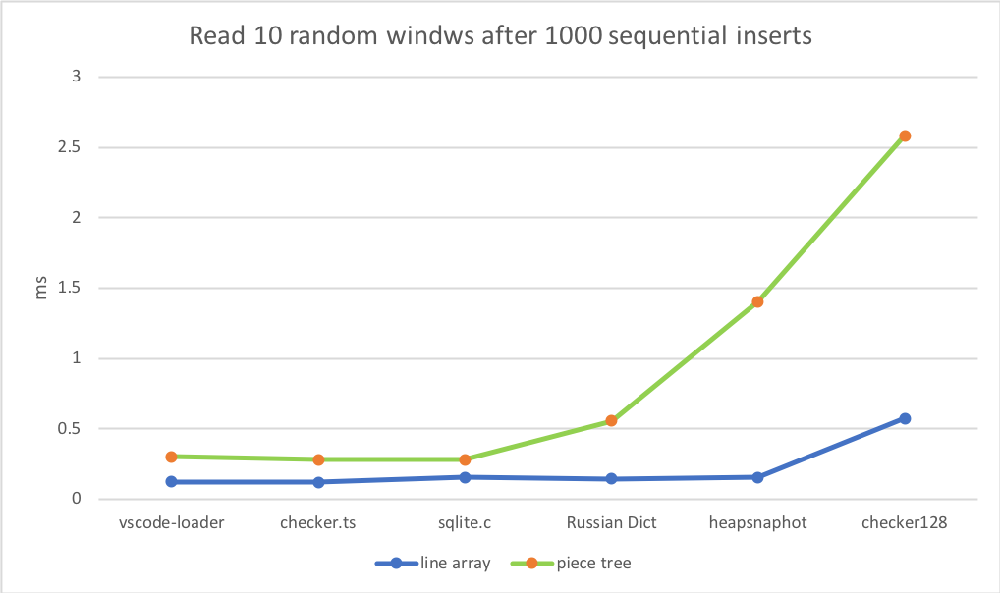

---
Order:
TOCTitle: Text Buffer Reimplementation
PageTitle: Text Buffer Reimplementation, a Visual Studio Code Story
MetaDescription: Text Buffer Reimplementation in the Visual Studio Code/Monaco editor
Date: 2018-02-28
Author: Peng Lyu
MetaSocialImage:
---
# Text Buffer Reimplementation
Feb 21, 2018 by Peng Lyu, [@njukidreborn](https://twitter.com/njukidreborn)

We started discussions of implementing the text buffer in native code more than one year ago. After doing so, we found that the memory usage is reduced considerably for large files but we didn't see much performance enhancement. Converting strings between native and JavaScript was found to be costly and only having text buffer in native does give us the full power of native execution speed. We have more detailed explanation in [the end](#why-not-native) of this post blog.

We know there are many ways to make JavaScript code as performant as native ones, especially after reading some inspiring [blog posts](http://mrale.ph/blog/2018/02/03/maybe-you-dont-need-rust-to-speed-up-your-js.html) from [Vyacheslav Egorov](http://mrale.ph). Your code just needs to ask JavaScript engine politely to do some optimizations. So we reimplemented the text buffer in another data structure in JavaScript and this article is about the fun journey behind it.

## Text buffer data structure in the past

Text buffer in the editor is line based by definition. We read and write code line by line, tokenization runs on lines, linters provide line/column based diagnostics, etc. So we split document content into lines and store them in a JavaScript array from the first day we kicked off the Monaco project. The Line Array data structure works pretty well as the text documents we work on in browsers and VSCode are relatively small most of the time but we are aware of its limitation, it starts to choke when handling large files.

We kept receiving issue reports that people tried to open files but VSCode crashes or freezes, even when the file size is not particularly large sometimes. For example, this user failed to open a [35 MB file](https://github.com/Microsoft/vscode/issues/13187). People may have different definitions of large files but 35 MB should not be a problem. After analyzing the file, we found the root cause is that file has too many lines (13.7 million).

We can do a simple math here: we create a ModelLine object for each line and every object uses around 40-60 Bytes, the Line Array uses around 600MB memory in total to store the document. On a 32bit machine, the renderer process of chromium can easily crash in this case.

Another realistic problem with Line Array is file opening is slow for large files. We need to split the content by line breaks to an array, it is costly and you can know that without profiling.

## An ideal solution

To reduce the memory usage, we should store less metadata; to make file opening faster, we should perform fewer operations. The solution is obvious then: storing nothing and does nothing while we build the buffer. No code is the most performant code.

### Piece Table

<center>

</center>


```js
class PieceTable {
	ori: string, // original content
	add: string, // user edits
	nodes: Node[]
}

class Node {
	file: ori | add,
	start: number,
	length: number
}
```

When the file is initially loaded, the Piece Table only contains one single node and a reference to the string buffer `ori`. When users make edits, we append the newly added content to `add` string buffer. The initial memory usage of metadata is close to the document content size and the incremental part is proportional to edit count.


### Lookup by line number

The traditional Piece Table only focuses on offsets, we can add line break caches on top of it to make line content lookup faster. The intuitive way to store line break positions is putting them in each node:

```js
class PieceTable {
	ori: string,
	add: string,
	nodes: Node[]
}

class Node {
	file: ori | add,
	start: number,
	length: number,
	lineStarts: number[]
}
```

For example, if you want to access the second line in a `Node`, you can simple read `ori.substring(node.start + node.lineStarts[1] + 1, node.start + node.lineStarts[2])` (let's assume we don't exceed boundaries). As we know how many line breaks a node has, accessing a random line in the document is straight forward: read from the first node to the last until we find the target line break.

The algorithm for now is simple and a bit stupid but it's okay, like a lot other software applications, we make sure it's correct first and then optimize it for performance step by step.

### String concatenation trap

The traditional piece table holds two buffers, one for original content loaded from disk, and another for user edits. In VS Code, we are loading text files using node's `fs.readFile`, which gives out chunks (64KB each), so when the file is large, let's say 64 MB, we'll receive 1000 chunks in sequence. To respect the data structure, we can do a string concatenation after receiving the last chunk and store the single large string in the `original` field of the Piece Table.

Opening a 50MB file is already problematic, what if we open a 500 MB file? Electron will throw an exception. This is because V8 has a limitation of string length and in our V8 version, it's around 256MB. This limit will be increased to 1GB in following V8 but that doesn't really solve the problem.

Instead of just holding two buffers, we can hold a list of buffers. Each time we receive a 64KB chunk from disk, we push it to the buffers array and create a node which maps to this buffer. The node will be like

```js
class PieceTable {
	buffers: Buffer[],
	nodes: Node[],
	containNonASCII: boolean
}

class Node {
	bufferIndex: number,
	start: number, // start offset in buffers[bufferIndex]
	length: number,
	lineStarts: number[]
}
```

### List -> Tree

Once we stop doing string concatenation, we can run into a potential performance issue when the file is large. Say we load a 64MB file, the piece table will have 1000 nodes. Even though we already have line break position caches in every node, but that's not enough for lookup as we don't know the absolute line number of a line break in a random node. To get the content of a line, we have to go through all these nodes until we find the node containing that line. The time complexity of the worst case is O(N) (N is the count of nodes).

Caching absolute line number in each node and running binary search on the list can boost lookup but whenever we modify a node, we have to visit all following nodes to apply the line number delta. This is a no-go but the idea of binary search is good. To achieve the same effect, we can directly leverage a balanced binary tree.

The only problem we have now is what metadata we use as the comparable key for the tree node. As described above, using the node's offset in the document or the absolute line number as key will make the editing operation time complexity O(N), instead we need something that's only related to tree node's sub tree if we want O(log n). When users edit the text, we recompute the metadata for the nodes we modified, then bubble the metadata change to the root.

When a Node only has four properties (`bufferIndex`, `start`, `length`, `lineStarts`), it takes seconds to find the result. We can store the text length and the line breaks count of a node's left sub tree in that node, then whether we search by offset or line number from the root can be efficient. Storing metadata of the right sub tree is the same but we don't need to cache both.

The tree node now looks like this

```js
class PieceTable {
	buffers: Buffer[],
	rootNode: Node
}

class Node {
	...
	left_subtree_length: number,
	left_subtree_lfcnt: number,
	left: Node,
	right: Node,
	parent: Node
}
```

Among all kinds of balanced binary tree, we choose Red Black Tree which is more `editing` friendly.

### Reduce objects allocation

If we store the line break offsets in each node, whenever we tweak the node, we need to update the line break offsets if necessary. For example, say we have a node which contains 999 line breaks, the `lineStarts` array has 1000 elements. If we split the node into two nodes evenly, then we'll create two nodes, each of them has an array containing around 500 elements. As we are not directly operating on linear memory space, splitting an array to two is way more costly than just moving pointers.

The good news is buffers in Piece Table are either readonly (original buffers) or append-only (changed buffers), so the line break on the buffers don't move. `Node` can simply hold two references to the line break offsets on its corresponding buffer.

```js
class Buffer {
	value: string,
	lineStarts: number[];
}

class BufferPosition {
	index: number; // index in Buffer.lineStarts
	remainder: number;
}

class PieceTable {
	buffers: Buffer[],
	rootNode: Node
}

class Node {
	bufferIndex: number;
	start: BufferPosition;
	end: BufferPosition
	...
}
```

## Piece Tree

I'd love to call this text buffer *Multiple buffer piece table with red black tree, optimized for line model*, but in our daily standup, everyone has 90 seconds to share what he/she has done in that day, repeating this sentence multiple times is not wise so I gave it a shorter name Piece Tree, which reflects what it is.

Having a theoretical understanding of this data structure is one thing, real world performance is another. The language you use, the environment the code runs on, the way others invoke your API and a lot others may affect the result significantly. We should run some benchmarks on small/medium/large files against original Line Array and piece tree.

One thing to note here is in July 2017, we had a huge [memory usage improvements](https://github.com/Microsoft/vscode/issues/30180#issuecomment-313509308) for Line Array, among which *avoid sliced string* is an interesting one. If we do some profiling with file opening in VSCode 1.19

<center>

</center>

You can see that `Buffer.toString/Buffer.write` takes the majority of time. This was used to avoid sliced string ref on each split string, it saves quite a lot memory when the file has a lot of lines. The side effect is obvious though, it slows down the file opening. It's a classic speed/memory tradeoff. Last month, we disabled sliced string optimization but here I want to run benchmarks against both of them to make sure we don't lose opportunities to improve.

### Preparations

I try to do benchmarks against some realistic files we can find online

* [vscode-loader](https://github.com/Microsoft/vscode/blob/master/src/vs/loader.js), 77KB, 1682 lines.
* [checker.ts](https://github.com/Microsoft/TypeScript/blob/master/src/compiler/checker.ts) 1.46 MB, 26k lines.
* [sqlite.c](https://github.com/kripken/emscripten/blob/master/tests/sqlite/sqlite3.c)  4.31MB, 128k lines.
* [Russian English Bilingual dictionary](https://github.com/titoBouzout/Dictionaries/blob/master/Russian-English%20Bilingual.dic) 14MB, 552k lines

and some manually created large files

* chromium heap snapshot of newly opened VSCode Insider, 54MB, 3M lines.
* checker.ts * 128, 184MB, 3M lines

### 1. Memory usage
Here we didn't compare heap size as for small files we'll do tokenization and have multiple copies of the buffer (worker, etc) while we stop doing that for large files, so we just check the memory usage of text buffer.

<center>

</center>

As we can see from above, whether to do sliced string optimization in Line Array is a difficult decision to make. `sliced string` uses more memory (proportional to line count), but reducing the memory takes time. Piece Tree doesn't have this trouble as there is no string splitting.

First round, Piece Tree wins.

### 2. File opening

<center>

</center>

Fun facts here:
* For Line Array, if we don't do sliced string optimization, most time is spent in splitting string into arrays.
* For Line Array, if we do sliced string optimization, the model building time almost doubles when the file size grows.
* For Piece Tree, most time is spent in finding offsets of line breaks.
* Checking charCode is cheaper than splitting.

Once the file is opened, we don't need to worry the sliced string problem, so in following benchmarks, we only compare Line Model w/o sliced string opt and Piece Tree.

### 3. Writing
For now I don't have concrete data of users' behaviors while using the editor, but there are still two typical user workflows I'm familiar with

* Jumping around in the document, and make edits. For instance, changing function signature.
* Typing in sequence. It's not often but I do enter zen mode sometimes when writing blogs.

So here I try to mimic these two scenarios. Apply 1000 random edits and 1000 sequential inserts to the document, and see how much time every text buffer needs. Besides, we apply edits one by one to avoid bulk edits optimization by purpose.

*1000 random edits*

<center>

</center>

*1000 sequential inserts*

<center>

</center>

Line Array wins when the file size small (KBs), this is as expected: accessing a random position in a small array and tweaking a string which has around 100~150 characters is really fast. It starts to choke when the file as a lot of lines (100k+), you may think the array size should not affect the performance but actually it does as array of objects are usually not sitting in a linear memory space.

<center>

</center>

Sequential inserts in large files makes this situation worse as JavaScript engine does heavy lifting when resizing the super large array. Piece Tree behaves stably in these Mega bytes files as each edit is just a string append and a couple RBTree operations.

### 4. Reading
Unlike Word or similar text sequence applications, in text buffer, `getLineContent` is the hottest method for reading. Tokenizer, LSP, link detector, and any component relying on document content will finally invoke this method.

To avoid JavaScript engine optimization, every time we get the content of a line, we'll do some simple math

```js
let firstChar = str.charCodeAt(0);
let lastChar = str.charCodeAt(str.length - 1);
firstChar = firstChar - lastChar;
lastChar = firstChar + lastChar;
firstChar = lastChar - firstChar;
```

<center>

</center>

<center>

</center>

<center>

</center>

<center>

</center>


TADA, we found the achilles heel of Piece Tree. A large file (which creates a lot of nodes once loaded) with 1000 random edits will lead to thousands or tens of thousands of nodes. Even though the time complexity is O(log N) the performance still downshifts.

However, we are talking about microseconds here for each `getLineContent` operation. Like I said before, reading is not just about text buffer, there are a lot post processes after getting the line content. For example, users scroll the window to see some more lines:

<center>

</center>

`getLineContent` doesn't even show up in the chart as some microseconds are just a small portion of one frame. Other scenarios like  tokenization or compute links, `getLineContent` doesn't really affect the overall speed. The text buffer performance might be the last one to blame but if it grows to milliseconds somehow one day, then we need to think seriously about it as it may affect the frame rate.

## Conclusion and Gotchas

Piece Tree outperforms Line Array in most scenarios, downshift a bit in read operations but don't affect real world experience.

### Real world profiling
The most important lesson this reimplementation taught me is always doing real world profiling, every time I did that I found some stupid code here and there. Maybe I should keep the secrets to ensure I don't lose my job but I'd like to share some gotchas with you

* When I started to write this Piece Tree stuff, I focused majorly on tuning three atomic operations, `insert`, `delete` and `search`. I even thought about adding a fancy cache to make them faster. After integrating the text buffer with VSCode, all of a sudden the improvements I worked on disappeared (they are still there but not noticeable). The reality is in VSCode the most frequent search request is `getLineContent` and we didn't have any special optimization for them at that moment.
* CRLF. It's a nightmare for Piece Tree. For every modification, we need to check if the edit splits CRLF or we somehow create a CRLF after deleting some content. Firstly I added a brute validation for these scenarios, the overall performance decreased by 300% as executing `charCodeAt` on long strings is heavy. Then I tried to leverage short-circuit evaluation everywhere to avoid `charCodeAt` if possible and finally brought the performance back.
* Mixed Line Break. It gave me some headache when the editor asks for line content without line break since I need to check the last two characters for every line. I felt super satisfied when the code passed all my randomly generated test cases but one day I realized that in VSCode scenario, we don't have mixed line breaks as we'll pre-normalize the content.
* GC can easily eat your CPU time. Our text model and other components used to have the assumption that the buffer is stored in an array so we heavily use `getLineContent` even though sometimes it's not necessary. Say we just want to know the char code of the first character of a line, we used to do a `getLineContent` first and then run `charCodeAt` but with Piece Tree, `getLineContent` creates a substring and after checking the char code, we throw it away immediately. For a short period, GC is the bottleneck of Piece Tree but after removing unnecessary intermediate objects allocation, GC is mild now.
* One small trick for caching line break positions, I use `UInt16Array` to store numbers when they are smaller than 65536 and `Number` for larger ones. This is useful for VSCode as we load content by chunks and max chunk size is 64KB, we are using `UInt16Array` most of the time. Our first grade math knowledge tells us it saves three quarters of memory for line break positions cache.

### Why not Native

When we started the new text buffer exploration, both Alex and me chose C++, which can be easily bind to Node.js by some glue code. Alex wrote a chunk based text buffer in C++ called EdCore and we used that as a baseline while implementing Piece Tree. To some extent, Line Array is chunk based as well, in which a chunk is just a single line. EdCore proves that increasing the chunk size can reduce the metadata memory usage.

> It's not hard to understand. Elements in Line Array are single lines but if we store two lines in an element, we reduce the array size to half; if we store four lines in an element, then the array size becomes a quarter. The smaller the array is, the less memory we use for metadata. In EdCore, the average chunk size is 64KB, which is the size of chunks we get from Node.js streaming API.

However from the performance's perspective, only rewriting the text buffer in C++ doesn't give us too much advantage. It turns out that only moving text buffer to native leads to many *C++ <=> JavaScript* round trip. For example, Toggle Line Comment command reads the content of current line, analyzes the language around the cursor, loads the comment style for that language and finally pushes minimal content change to the editor. The whole logic now is implemented as a contribution of the editor (you can see it as an extension which runs in renderer process instead of extension host), the line content and content changes cross the boundary every time and lead to unnecessary cost.

To avoid copying data when it crosses C++/JavaScript boundary, we may want to leverage V8 API to create and maintain objects instead of normal C++ memory allocations. In our case, we are manipulating `String` most of the time so we need `SlicedString`, `ConsString`, `charCodeAt` and some other String related Type/Function, it sounds like we are reinventing V8's String data structure. But can we outperform V8 if we are fully on top of its API? Another huge advantage of native code is multithreading but accessing V8 objects in pure C++ thread is not safe. Besides, it's problematic if we want to compile the text buffer to web assembly for Monaco Editor as we are dependent on V8. `Buffer` looks like a better option in terms of thread safety and web assembly, but most of our code doesn't handle numbers directly, no even to say encoding.

Another alternative here is moving all other text model related code to native. It's doable but we have a long list of to do items, as we are rewriting the whole text model and part of editor contributions (maybe most of them).

Rather than spending half a year on something we don't know yet, we decided to push our JavaScript code to its limit and the result is appealing. If one day we want to go Native again, the lessons we learnt here can still benefit us.

## Future work

We have the confidence that the new text buffer provides user better experience, however we are still halfway to the sweet spot as there are still a handful of cases we can optimize.

### Find in file
Imagine you have a folder or workspace which contains a few large files, maybe log files. There are some useful information buried in these hundreds of MegaBytes content so you decide to locate them. First of all you open the Search Viewlet and type some fuzzy keywords, the results show up immediately; and then you click on one giant file, it opens and navigates to that occurrence before you get a chance to switch to Facebook page; you modify the content and jump around in the editor, just like what you usually do in a small file. I can already see half gentle smile on your face.

All of a sudden, you see a suspicious keyword and you wonder how many occurrences there are in this single document, you move the mouse to that keyword, press `Cmd/Ctrl+F` but VSCode freezes for two dozens of seconds. The smile goes away and you go out to grab something to drink.

The catch here is currently we run Find in file line by line due to the fact contents are stored in an array. The speed is proportional to content size/line number but in old days you did't complain about that often as other steps were slow. Now this becomes the bottleneck of our large file support and we have a number of ways to speed it up. We can run regex searches on buffers directly as we are already off Line Array, or even leverage ripgrep (similarly to how we implement Search Viewlet) if the content is not modified.

### Model syncing

When a file is opened, there are several copies of the text buffer alive, the renderer process has one, which is the source of truth, extension host holds one and we may have another in web worker for time costly calculations. Syncing between these models hasn't been tuned for Piece Tree yet but we can see the potential of lightweight data transfer as buffers in Piece Tree are somewhat *immutable*.

### Tree normalization

It is possible to end up in a situation where each character gets a TreeNode allocated and the larger the document is, the more nodes we have. We may want to squash tree nodes and buffers when it's affecting the general performance.