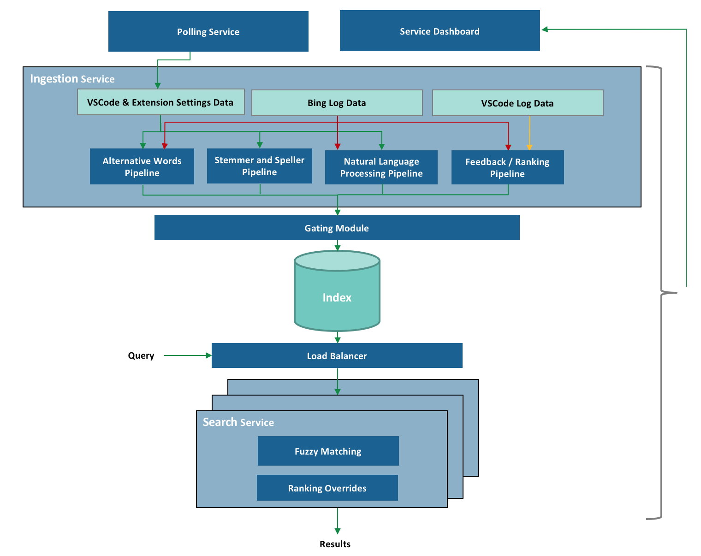

# How We Improved VS Code Settings Search With Bing

Last month, we released an improvement to settings search in VS Code. We have tweaked our settings editor many times in the past, but this was different - it involved a large-scale collaboration with another team, and was the first experience that our team had with designing and managing an external service to power a core feature. Now each time you search for settings, you will see intelligent results powered by Bing.

[first one should be a more recognizable setting]

Being a highly customizable editor has a cost. VS Code includes more than 400 settings out of the box, and if you include settings contributed by extensions, especially certain extensions (I'm looking at you, GitLens!) many users can have significantly more available. This is enough to discourage a new user who doesn't know exactly which setting they are looking for. We have about 30,000 new users trying VS Code for the first time every day, and it's important to us that they are able to customize VS Code successfully and get up to speed.

Looking across common Github issues, StackOverflow questions, Twitter, and user studies that we did on usertesting.com, we've seen many users having issues finding settings. We've seen users who just didn't know which words to use to describe a certain feature. We've seen users making typos and misspellings. And we've seen many other queries which just didn't fit into the strict filtering model that we had previously implemented for searching settings. There are a large number of users making simple common queries, like "font", which we can handle perfectly well. But there is also a very long tail of less common queries which don't produce literal matches, and which we can't understand without some extra intelligence. So several months ago, we started talking to the Bing team.

## Working with the Bing team

After a period of discussion and prototyping, we decided on an arrangement in which the Bing team would run a settings search service that would provide intelligent fuzzy settings matches for queries that users search for in VS Code's settings editor.

Integrating Bing's natural language search capabilities into VS Code proved challenging. To search documents on the web, Bing considers thousands of signals relating to page similarity, click data, user behavior data, etc. But we didn't have this sort of rich metadata available for our settings - just a brief name and description for each one. So the Bing team combined custom services and Bing's fundamental search capabilities to create a system tuned to our search scenario.

Here is a high level overview of the system:

Let's take a look at each part.

## Deep Dive

There are essentially two sides to this system - collecting and indexing setting details offline, and serving up results online. The first part of that is implemented by the Ingestion Service. It's responsible for creating a rich index containing settings from VS Code itself and from extensions. Since we want query response time to be as short as possible, we do as much work as possible up front while ingesting settings to reduce the work we have to do while handling the query.

We are a relatively small development team, and we knew that if we were to start maintaining a service like this, we would not be able to spend a lot of time managing it manually. So we built a fully automated system that constantly updates the indexed settings in real-time for each of our stable release builds and our daily Insiders builds with no human interaction. Within minutes of the completion of a build, Bing's index has been updated to include any newly added settings.

### Ingestion Service

**Collecting VS Code and Extension Settings Data**

During each build, VS Code starts up in a mode where it writes all of its configuration to a JSON file. We have to actually start VS Code, because we can't determine all the configuration metadata statically. The file includes a few pieces of information per setting - the name, description, type, default value, and for "enum"-type settings, the list of valid values and their descriptions. We then upload the file to Azure Storage. If you're curious, you can see the latest one here: https://ticino.blob.core.windows.net/configuration/122001350/6c22e21cdcd6811770ddcc0d8ac3174aaad03678/configuration.json. 122001350 is a unique build number, computed from the product version plus the number of git commits since the previous release. 6c22e21cd... is the git commit that the build was built off of. And Ticino, some of you diehard fans might remember, was our original short-lived code name.

Bing's Polling Service watches the Azure Storage container, notices a new build, and notifies the Ingestion Service. At the same time, Bing is constantly crawling the VS Code extension marketplace, waiting for extension updates and new extensions. When it finds one, it downloads its package.json (for extensions, all configuration metadata is contained in the package.json. No need to start it up.) and passes those settings to the Ingestion Service as well.

**1. Alternative Words Pipeline**

Users sometimes search with words that are different but equivalent to the words we use in setting names and descriptions. To ensure that we can handle those cases, we integrated Bing's "Alternative Word" generation pipeline. This pipeline collects words with similar meanings to each other from Bing's search data using signals such as user behavior, clicks, online ranking, and page similarity. For example, "update" and "upgrade" are set as "alternative words", and a search for one will return settings that include the other.

**2. Stemmer and Speller Pipeline**

We don't want to penalize the user for misspelling the name of a setting, but we found early on that simple fuzzy matching would either miss variations of an English word that a human could understand, or would include too many false positive matches. So we also included a Speller and a Stemmer service which enrich the index with common misspellings and alternate forms of the same word stem. For example, "formatted", "formatter", "format" - all will be indexed for a setting that uses the word "formatting". These are lightweight custom services extracted from the full-fledged services that are used on Bing.com.

**3. Natural Language Processing (NLP) Pipeline**

We also want to enable users to describe their query in their own natural language, so we added Cortana's Natural Language Processing pipeline. The pipeline collects commonly used speech and text patterns and adds them to the indexes. For example, it enables the system to identify the important words in "how to disable css validation" to find `"css.validate"`.

**4. Feedback/Ranking Pipeline**

We created a feedback mechanism that lets us learn and improve from user feedback. It allows us to manually specify new Alternative Word pairs, or to boost expected results for certain queries. The feedback is uploaded to the service and reflected in search results almost immediately.

**Gating Module**

Every ingestion into the index goes through the gating module which just ensures that the index hasn't, due to some programming error, become corrupted. We have test cases written that verify the following:

- The new index is backwards compatible and serves all VS Code builds
- Our Golden query set returns the expected results

Failure in the gating module will prevent an index ingestion and notifies the team immediately. A dashboard service was also created that allows us to monitor the health of all stages of the pipeline. It has alerting mechanisms and the ability to rollback to the last known good state, to ensure that any issue can be resolved quickly with minimum downtime.

### Search Service

Finally, at runtime, the query from our users hits the [Azure Load Balancer](https://docs.microsoft.com/en-us/azure/load-balancer/load-balancer-overview) service that selects one of our geo-replicated servers to handle the query, based on its physical proximity or current load. The Search Service hosted at that location retrieves the relevant results with a lookup in the index, applies manual ranking overrides in some cases, [rm or expand...?] and returns them to the VS Code client.

Putting it all together, we now have a system which does a much better job of understanding settings queries and delivers results for many queries that would have returned nothing before.

Here are some examples:

## Bing's Cognitive Services

[Is this actually Azure Cognitive Services? Also first link goes to web search API, not a general page]

[Needs to imply that these were the services used to build our system, but are not a complete solution for developing what we have]

[Original: In case you want to try some of the other wonderful API services that are provided by Bing, do check out Bing's Cognitive services. They have many such capabilities that will help you achieve more in your applications. E.g:]

[Bing's Cognitive Services](https://azure.microsoft.com/en-us/services/cognitive-services/bing-web-search-api/). They provide a bunch of services that will help you add some intelligence into your own apps. For example:
- [Bing Spell Check API](https://azure.microsoft.com/en-us/services/cognitive-services/spell-check/)
- [Language Understanding (LUIS)](https://azure.microsoft.com/en-us/services/cognitive-services/language-understanding-intelligent-service/)
- [Bing Web Search API](https://azure.microsoft.com/en-us/services/cognitive-services/bing-web-search-api/)
- [Bing Custom Search API](https://azure.microsoft.com/en-us/services/cognitive-services/bing-custom-search/)

## Testing

While developing this system, we needed a way to quantitatively evaluate the results. We decided to build a test system based on the concept of [Normalized Discounted Cumulative Gain, or NDCG](https://en.wikipedia.org/wiki/Discounted_cumulative_gain). Without getting too far into the weeds, this is a way to grade the results from a search engine, given a query, a set of results, and scores for those results. We wrote quite a few test cases by hand, but realized that we needed an automated way to generate test cases for all settings, including new settings as they would be added, and settings in extensions. So we wrote a tool that can generate test cases automatically for any setting. It uses words from the setting name and description, and runs them through different transformers that simulate users choosing alternate words, making typos, or searching using natural language patterns. We also generated test cases for settings from some popular extensions.

We run the full test suite every 6 hours, and it can update itself automatically so that it's always testing settings from the latest build. The test suite assures us that the system is running properly, and gives us confidence that when we make changes on the backend, we are not hurting the result quality.

## Future Work

There are several ways that we can continue to improve the system. For example, we are also setting up an automated feedback loop based on user behavior. If many people search for similar queries, then pick the same result, we know that result is probably a good one and should be ranked higher.

Currently the service is only indexing in English, but we'd like to index the translated setting descriptions and support searching in non-English languages. There is also some configuration metadata that isn't currently indexed, like possible values for the `"workbench.colorCustomizations"` setting. And taking search a little further, we would like to show results for extensions that aren't currently installed. If you search `"debug python"`, and don't have strong matches for local settings, then we would like to lead you towards an extension that can help you debug Python code. We have also thought about other applications for this technology within VS Code. Maybe the command palette could be powered by a similar service.

## Intelligent settings search

So now it should be much easier to find settings. Please go try it out, and file issues on Github if you don't see the results that you expect. In fact, if you're using [VS Code Insiders](https://code.visualstudio.com/insiders/) you will even see a button that will invoke our new issue reporter to make it easier for you to file an issue that includes all the details we need.

Happy Coding!

Rob ([@roblourens](https://twitter.com/roblourens))

Ankith ([ankar@microsoft.com](mailto:ankar@microsoft.com))