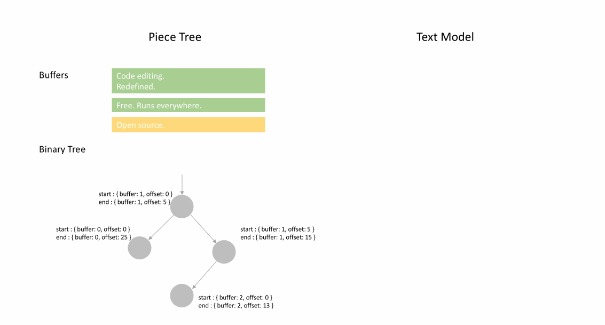

---
Order:
TOCTitle: Text Buffer Reimplementation
PageTitle: Text Buffer Reimplementation, a Visual Studio Code Story
MetaDescription: Text Buffer Reimplementation in the Visual Studio Code/Monaco editor
Date: 2018-03-23
Author: Peng Lyu
MetaSocialImage:
---
# Text Buffer Reimplementation

March 23, 2018 by Peng Lyu, [@njukidreborn](https://twitter.com/njukidreborn)

The Visual Studio Code 1.21 release includes a brand new text buffer implementation which is much more performant, both in terms of speed and memory usage. In this blog post, I'd like to tell the story of how we selected and designed the data structures and algorithms that led to those improvements.

Performance discussions about JavaScript programs usually involve a discussion about how much should be implemented in native code. For the VS Code text buffer, these discussions started more than a year ago. During an in-depth exploration, we found that a C++ implementation of the text buffer could lead to significant memory savings, but we didn't see the performance enhancements we were hoping for. Converting strings between a custom native representation and V8's strings is costly and in our case, compromised any performance gained from implementing text buffer operations in C++. We will discuss this in more detail at [the end](#why-not-native) of this post.

Not going native, we had to find ways to improve our JavaScript/TypeScript code. Inspiring blog posts like [this one](https://mrale.ph/blog/2018/02/03/maybe-you-dont-need-rust-to-speed-up-your-js.html) from [Vyacheslav Egorov](https://mrale.ph) show ways to push a JavaScript engine to its limits and squeeze out as much performance as possible. Even without low level engine tricks, it is still possible to improve speed by one or more orders of magnitude by using better suited data structures and faster algorithms.

## Previous text buffer data structure

The mental model for an editor is line based. Developers read and write source code line by line, compilers provide line/column based diagnostics, stack traces contain line numbers, tokenization engines run line by line, etc. Although simple, the text buffer implementation powering VS Code hadn't changed much since the first day we kicked off the Monaco project. We used an array of lines, and it worked pretty well because typical text documents are relatively small. When the user is typing, we located the line to modify in the array and replaced it. When inserting a new line, we spliced a new line object into the line array and the JavaScript engine would do the heavy lifting for us.

However, we kept receiving reports that opening certain files would cause Out-Of-Memory crashes in VS Code. For example, one user failed to open a [35 MB file](https://github.com/microsoft/vscode/issues/13187). The root cause was that the file had too many lines, 13.7 million. We would create a `ModelLine` object for each line and every object used around 40-60 bytes, so the line array used around 600MB memory to store the document. That's roughly 20 times the initial file size!

Another problem with the line array representation was the speed of opening a file. To construct the array of lines, we had to split the content by line breaks, such that we would get a string object per line. The split itself hurts performance which you'll see in benchmarks further down.

## Finding a new text buffer implementation

The old line array representation can take a lot of time to create and consumes a lot of memory, but it gives fast line look-up. In a perfect world, we would store only the text of the file and no additional metadata. Thus, we started looking for data structures that require less metadata. After reviewing various data structures, I found that [piece table](https://en.wikipedia.org/wiki/Piece_table) may be a good candidate to start with.

### Avoiding too much meta-data by using a piece table

Piece table is a data structure used to represent a series of edits on a text document (source code in TypeScript):

```ts
class PieceTable {
    original: string; // original contents
    added: string; // user added contents
    nodes: Node[];
}

class Node {
    type: NodeType;
    start: number;
    length: number;
}

enum NodeType {
    Original,
    Added
}
```

After the file is initially loaded, the piece table contains the whole file contents in the `original` field. The `added` field is empty. There is a single node of type `NodeType.Original`. When a user types at the end of a file, we append the new content to the `added` field, and we will insert a new node of type `NodeType.Added` at the end of the node list. Similarly, when a user makes edits in the middle of a node, we will split that node and insert a new one as needed.

The animation below shows how to access the document line by line in a piece table structure. It has two buffers (`original` and `added`) and three nodes (which is caused by an insertion in the middle of the `original` content`).

---


---

The initial memory usage of a piece table is close to the size of the document and the memory needed for modifications is proportional to the number of edits and text added. So typically a piece table makes good use of memory. However, the price for low memory usage is that accessing a logical line is slow. For example, if you want to get the content of the 1000th line, the only way is to iterate over every character starting at the beginning of the document, find the first 999 line breaks, and read each character until the next line break.

### Use caching for faster line lookup

The traditional piece table nodes only contain offsets, but we can add line break information to make line content lookup faster. The intuitive way to store line break positions is to store the offsets for each line break encountered in a node's text:

```ts
class PieceTable {
    original: string;
    added: string;
    nodes: Node[];
}

class Node {
    type: NodeType;
    start: number;
    length: number;
    lineStarts: number[];
}

enum NodeType {
    Original,
    Added
}
```

For example, if you want to access the second line in a given `Node` instance, you can read `node.lineStarts[0]` and `node.lineStarts[1]` which will give the relative offsets at which a line begins and ends. Since we know how many line breaks a node has, accessing a random line in the document is straight forward: read each node starting from the first one until we find the target line break.

The algorithm remains simple, and it works better than before as we can now jump over entire chunks of text rather than iterate character-by-character. We'll see later on that we can do even better than that.

### Avoid the string concatenation trap

The piece table holds two buffers, one for original content loaded from disk, and another for user edits. In VS Code, we are loading text files using Node.js `fs.readFile` that delivers content in 64KB chunks. So when the file is large, for example 64 MB, we'll receive 1000 chunks. After having received all of the chunks, we can concatenate them into one large string and store it in the `original` field of the piece table.

This sounds reasonable until V8 steps on your toes. I tried to open a 500MB file and got an exception because in the version of V8 I used, the maximum string length is 256MB. This limit will be lifted to 1GB in future versions of V8 but that doesn't really solve the problem.

Instead of holding an `original` and an `added` buffer, we can hold a list of buffers. We can try to keep that list short or we can be inspired by what we get back from `fs.readFile` and avoid any string concatenation. Each time we receive a 64KB chunk from disk, we push it directly to the `buffers` array and create a node that points to this buffer:

```ts
class PieceTable {
    buffers: string[];
    nodes: Node[];
}

class Node {
    bufferIndex: number;
    start: number; // start offset in buffers[bufferIndex]
    length: number;
    lineStarts: number[];
}
```

### Boost line lookup by using a balanced binary tree

With string concatenation out of the way, we can now open large files but this leads us to another potential performance issue. Say we load a 64MB file, the piece table will have 1000 nodes. Even though we cache line break positions in every node, we don't know which absolute line number is in which node. To get the content of a line, we have to go through all nodes until we find the node containing that line. In our example, we have to iterate through up to 1000 nodes depending on which line number we look for. Thus, the time complexity of the worst case is O(N) (N is the count of nodes).

Caching the absolute line numbers in each node and using binary search on the list of nodes boosts lookup speed but whenever we modify a node, we have to visit all following nodes to apply the line number delta. This is a no-go but the idea of binary search is good. To achieve the same effect, we can leverage a balanced binary tree.

We now have to decide what metadata we should use as the key to compare tree nodes. As said, using the node's offset in the document or the absolute line number will bring the time complexity of editing operations to O(N). If we want a time complexity of O(log n), we need something that's only related to a tree node's subtree. Thus, when a user edits text, we recompute the metadata for the modified nodes, and then bubble the metadata change along the parent nodes all the way to the root.

If a `Node` has only four properties (`bufferIndex`, `start`, `length`, `lineStarts`), it takes seconds to find the result. To get faster, we can also store the text length and the line break count of a node's left subtree. This way searching by offset or line number from the root of the tree can be efficient. Storing metadata of the right subtree is the same but we don't need to cache both.

The classes now look like this:

```ts
class PieceTable {
    buffers: string[];
    rootNode: Node;
}

class Node {
    bufferIndex: number;
    start: number;
    length: number;
    lineStarts: number[];

    left_subtree_length: number;
    left_subtree_lfcnt: number;
    left: Node;
    right: Node;
    parent: Node;
}
```

Among all the different types of balanced binary trees, we choose [red-black tree](https://en.wikipedia.org/wiki/Red–black_tree) because it is more 'editing' friendly.

### Reduce objects allocation

Assume we store the line break offsets in each node. Whenever we change the node, we might have to update the line break offsets. For example, say we have a node that contains 999 line breaks, the `lineStarts` array has 1000 elements. If we split the node evenly, then we'll create two nodes, each has an array containing around 500 elements. As we are not directly operating on linear memory space, splitting an array into two is more costly than just moving pointers.

The good news is that the buffers in a piece table are either readonly (original buffers) or append-only (changed buffers), so the line breaks within a buffer don't move. `Node` can simply hold two references to the line break offsets on its corresponding buffer. The less we do, the better the performance is. Our benchmarks showed that applying this change made the text buffer operations in our implementation three times faster. But more about the actual implementation later.

```ts
class Buffer {
    value: string;
    lineStarts: number[];
}

class BufferPosition {
    index: number; // index in Buffer.lineStarts
    remainder: number;
}

class PieceTable {
    buffers: Buffer[];
    rootNode: Node;
}

class Node {
    bufferIndex: number;
    start: BufferPosition;
    end: BufferPosition;
    ...
}
```

---



---

## Piece tree

I'd love to call this text buffer **"Multiple buffer piece table with red-black tree, optimized for line model"**. But in our daily standup, when everyone is limited to 90 seconds to share what they've been up to, repeating this long name multiple times would not be wise. So I simply started calling it **"piece tree"**, which reflects what it is.

Having a theoretical understanding of this data structure is one thing, real world performance is another. The language you use, the environment the code runs in, the way clients invoke your API, and other factors may significantly affect the outcome. Benchmarks can provide a comprehensive picture so we ran benchmarks on small/medium/large files against the original line array implementation and the piece tree implementation.

### Preparations

For telling results, I looked for realistic files online:

* [checker.ts](https://github.com/microsoft/TypeScript/blob/master/src/compiler/checker.ts) - 1.46 MB, 26k lines.
* [sqlite.c](https://github.com/kripken/emscripten/blob/master/tests/sqlite/sqlite3.c) - 4.31MB, 128k lines.
* [Russian English Bilingual dictionary](https://github.com/titoBouzout/Dictionaries/blob/master/Russian-English%20Bilingual.dic) - 14MB, 552k lines.

and manually created a couple of large files:

* Chromium heap snapshot of newly opened VS Code Insider - 54MB, 3M lines.
* checker.ts X 128 - 184MB, 3M lines.

### 1. Memory usage

The memory usage of the piece tree immediately after loading is very close to the original file size, and it is significantly lower than the old implementation. First round, piece tree wins:


### 2. File opening times

Finding and caching line breaks is much faster than splitting the file into an array of strings:


### 3. Editing

I have simulated two workflows:

* Making edits in random positions in the document.
* Typing in sequence.

I tried to mimic these two scenarios: Apply 1000 random edits or 1000 sequential inserts to the document, then see how much time every text buffer needs:


As expected, line array wins when the file is very small. Accessing a random position in a small array and tweaking a string which has around 100~150 characters is really fast. The line array starts to choke when the file has many lines (100k+). Sequential inserts in large files make this situation worse as the JavaScript engine does a lot of work in order to resize the large array. Piece tree behaves in a stable fashion as each edit is just a string append and a couple red-black tree operations.

### 4. Reading

For our text buffers, the hottest method is `getLineContent`. It is invoked by the view code, by the tokenizer, the link detector, and pretty much every component relying on document content. Some of the code traverses the entire file, like the link detector, while other code reads only a window of sequential lines, like the view code. So I set out to benchmark this method in various scenarios:

* Call `getLineContent` for all lines after doing 1000 random edits.
* Call `getLineContent` for all lines after doing 1000 sequential inserts.
* Read 10 distinct line windows after doing 1000 random edits.
* Read 10 distinct line windows after doing 1000 sequential inserts.


TA DA, we found the Achilles heel of piece tree. A large file, with 1000s of edits, will lead to thousands or tens of thousands of nodes. Even though looking up a line is `O(log N)`, where `N` is the number of nodes, that is significantly more than `O(1)` which the line array enjoyed.

Having thousands of edits is relatively rare. You might get there after replacing a commonly occurring sequence of characters in a large file. Also, we are talking about microseconds for each `getLineContent` call so it is not something we are concerned about at this time. Most of `getLineContent` calls are from view rendering and tokenization, and the post processes of line contents are much more time consuming. DOM construction and rendering or tokenization of a view port usually takes tens of milliseconds, in which `getLineContent` only accounts for less than 1%. Nevertheless, we are considering eventually implementing a normalization step, where we would recreate buffers and nodes if certain conditions such as a high number of nodes are met.

## Conclusion and gotchas

Piece tree outperforms line array in most scenarios, with the exception of line based lookup, which was to be expected.

### Lessons learned

* The most important lesson this reimplementation taught me is to **always do real world profiling**. Every time I found that my assumptions about which methods would be hot did not match reality. For example, when I started the piece tree implementation, I focused on tuning the three atomic operations: `insert`, `delete` and `search`. But when I integrated it in VS Code, none of those optimizations mattered. The hottest method was `getLineContent`.
* **Dealing with `CRLF` or mixed line breaks sequences is a programmer's nightmare**. For every modification, we need to check if it splits a Carriage Return/Line Feed (CRLF) sequence, or if it creates a new CRLF sequence. Dealing with all the possible cases, in the context of a tree, took several attempts until I had a solution that was correct and fast.
* **GC can easily eat your CPU time**. Our text model used to assume that the buffer is stored in an array and we frequently use `getLineContent` even though sometimes it wasn't necessary. For example, if we just want to know the character code of the first character of a line, we used a `getLineContent` first and then did `charCodeAt`. With piece tree, `getLineContent` creates a substring and after checking the character code, the line substring is thrown away immediately. This is wasteful and we are working on adopting better suited methods.

### Why not native?

I promised at the beginning that I would get back to this question.

**TL;DR**: We tried. It didn't work out for us.

We built a text buffer implementation in C++ and used native node module bindings to integrate it in VS Code. The text buffer is a popular component in VS Code and thus many calls were being made to the text buffer. When both the caller and the implementation were written in JavaScript, V8 was able to inline many of these calls. With a native text buffer, there are **JavaScript <=> C++** round trips and given the number to round-trips, they slowed everything down.

For example, the VS Code **Toggle Line Comment** command is implemented by looping through all the selected lines, and analyzing them one-by-one. This logic is written in JavaScript, and will invoke `TextBuffer.getLineContent` for each line. For each call, we end up crossing the C++/JavaScript boundary and we have to return a JavaScript `string` in order to respect the API that all of our code is built on top of.

Our options are simple. In C++, we either allocate a new JavaScript `string` on each call to `getLineContent` which implies copying the actual string bytes around, or we leverage V8's `SlicedString` or `ConstString` types. However, we can use V8's string types only if our underlying storage is also using V8's strings. Unfortunately, V8's strings are not multi-thread safe.

We could have tried to overcome this by changing the TextBuffer API, or by moving more and more code to C++ to avoid the JavaScript/C++ boundary cost. However, we realized we were doing two things at the same time: we were writing a text buffer using a different data structure than a line array, and we were writing it in C++ rather than JavaScript. So, rather than spending half a year on something we didn't know would pay off, we decided to keep the text buffer's runtime in JavaScript, and only change the data structure and associated algorithms. In our opinion, this was the right decision.

## Future work

We still have a handful of cases that need to be optimized. For example, the **Find** command currently runs line-by-line but shouldn't. We can also avoid needless calls to `getLineContent` when only a line substring is needed. We will incrementally release these optimizations. Even without these further optimizations, the new text buffer implementation provides a better user experience then what we had before and is now the default in the latest stable VS Code version.

Happy Coding!

Peng Lyu, VS Code Team member [@njukidreborn](https://twitter.com/njukidreborn)