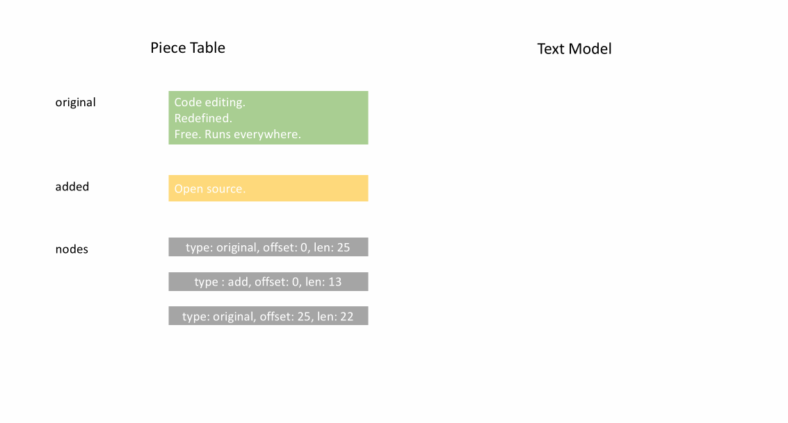
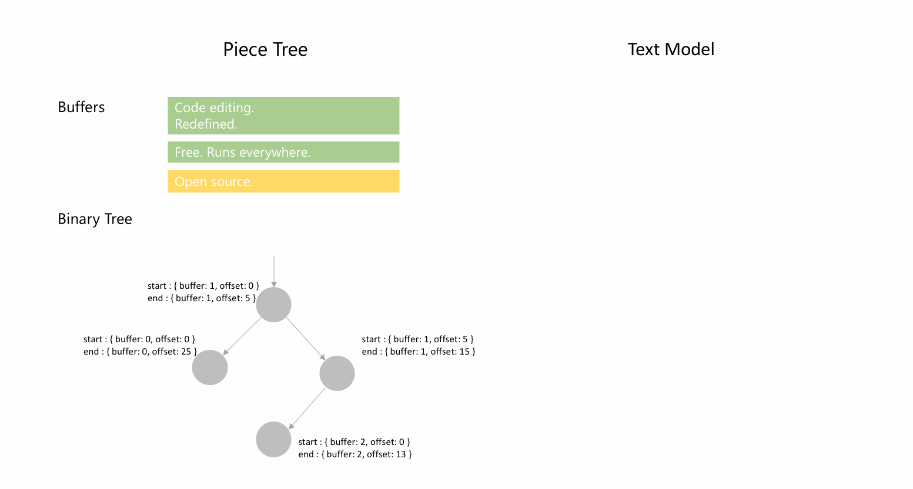
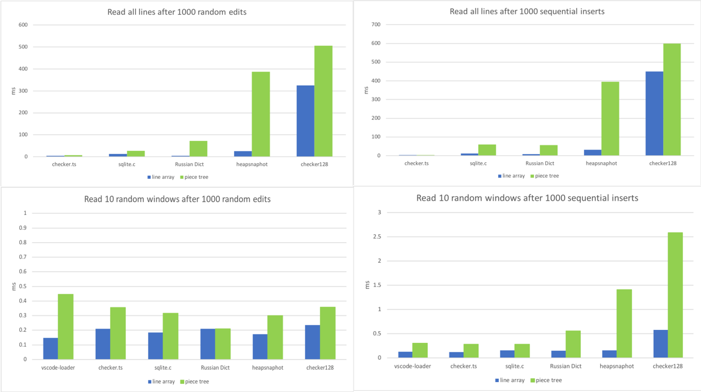

---
Order:
TOCTitle: Text Buffer Reimplementation
PageTitle: Text Buffer Reimplementation, a Visual Studio Code Story
MetaDescription: Text Buffer Reimplementation in the Visual Studio Code/Monaco editor
Date: 2018-02-28
Author: Peng Lyu
MetaSocialImage:
---
# Text Buffer Reimplementation
March 20, 2018 by Peng Lyu, [@njukidreborn](https://twitter.com/njukidreborn)

VS Code 1.21 includes a brand new text buffer implementation, much more performant both in terms of speed and of memory usage. We managed to get all these improvements by changing the underlying data structure and associated algorithms. In this blog post I'd like to tell the story.

Discussions of implementing the text buffer in native code started more than a year ago. After exploration, we found that a C++ implementation of the text buffer could lead to significant memory savings, but we didn't see the performance enhancements we were hoping for. Converting strings between a custom native representation and v8's strings is somewhat costly and, at least for us, compromised any performance gained by implementing text buffer operations in C++. We will discuss this in more detail at [the end](#why-not-native) of this post.

Inspiring blog posts like [this one](http://mrale.ph/blog/2018/02/03/maybe-you-dont-need-rust-to-speed-up-your-js.html) from [Vyacheslav Egorov](http://mrale.ph) show ways in which it is possible to push a JavaScript engine to its limits and squeeze out as much performance as necessary. But even without low level engine tricks, it is typically possible to improve by one or more orders of magnitude by applying an algorithmic or data structure change.

## The old text buffer data structure

The mental model for an editor is line based. We read and write code line by line, compilers provide line/column based diagnostics, stack traces contain line numbers, tokenization engines run line by line, etc. Although dead simple, the text buffer implementation powering VS Code hasn't changed much since the first day we kicked off the Monaco project. We used an array of lines, and it worked pretty well, as the typical text documents we work on are relatively small. When typing, we would locate the line that should be modified in the array, and replace it. When inserting a new line, we would splice a new object in the lines array and the JavaScript engine would do the heavy lifting for us.

But we kept receiving issue reports that opening certain files, even when the file size is not particularly large, would cause Out-Of-Memory crashes in VS Code. For example, this user failed to open a [35 MB file](https://github.com/Microsoft/vscode/issues/13187). The root cause is that the file has too many lines, 13.7 million. We would create a `ModelLine` object for each line and every object used around 40-60 bytes, so the lines array implementation used around 600MB memory in total to store the document, roughly 20 times the initial file size!

Another problem with the lines array representation was the speed of opening a file. To construct the array of lines, we had to split the content by line breaks, such that we would get a string object per line. The split itself hurts performance, and later we will show the benchmarks.

## Our solution

The lines array representation takes a lot of time to create and then consumes a lot of memory in order to give fast line look-up speeds. In a perfect world, we would store only the text of the file and no additional metadata. After searching in the data structure arsenal for a while, I found that [Piece Table](https://en.wikipedia.org/wiki/Piece_table) may be a good candidate. We can tweak it and see how far we can go.

### Piece Table

Piece table is a data structure used to represent a series of edits on a text document (code is TypeScript):

```ts
class PieceTable {
	original: string; // original content
	added: string; // user added content
	nodes: Node[];
}

class Node {
	type: NodeType;
	start: number;
	length: number;
}

enum NodeType {
	Original,
	Added
}
```

When the file is initially loaded, the Piece Table contains the file contents in the `original` field, the `added` field is empty, and it has a single node of type `NodeType.Original`. When a user is typing at the end of a file, we will append the newly typed content to the `added` field, and we will insert a new node of type `NodeType.Added` at the end of the node list. Similarly, when a user makes edits in the middle of a node, we will split that node and insert a new one as needed.

Below recording shows how to access the document line by line in a piece table structure. It has two buffers (`original` and `added`) and three nodes (which is caused by an insertion in the middle of the `original` content`).

<center>

</center>


The initial memory usage of a Piece Table is close to the document content size and the incremental part is proportional to edit count, so characteristically a Piece Table would make very good usage of memory. However, accessing a logical line would be very slow as a price. For example, if you want to get the content of the 1000th line, the only way would be to go through each character from the beginning, find the first 999 line breaks, read from that character until the next line break.

### Caching for line lookup

The traditional Piece Table only focuses on offsets, but we can add line break information on top of it to make line content lookup faster. The intuitive way to store line break positions is to store the offsets for each line break encountered in a node's text:

```ts
class PieceTable {
	original: string;
	added: string;
	nodes: Node[];
}

class Node {
	type: NodeType;
	start: number;
	length: number;
	lineStarts: number[];
}

enum NodeType {
	Original,
	Added
}
```

For example, if you want to access the second line in a given `Node` instance, you can read `node.lineStarts[0]` and `node.lineStarts[1]` which will give the relative offsets at which a line begins and ends. As we know how many line breaks a node has, accessing a random line in the document is straight forward: read from the first node to the last until we find the target line break.

The algorithm for now remains simple, but it works better than before, as we can now jump over entire chunks of text, whereas before we would iterate character-by-character. We will revisit this later.

### Avoid string concatenation trap

The traditional piece table holds two buffers, one for original content loaded from disk, and another for user edits. In VS Code, we are loading text files using node's `fs.readFile`, which gives out chunks (64KB each), so when the file is large, let's say 64 MB, we'll receive 1000 chunks in sequence. To respect the data structure, we can do a string concatenation after receiving the last chunk and store the single large string in the `original` field of the Piece Table.

This sounds reasonable till V8 steps on your toe. I tried to open a 500MB file and Electron throwed an exception, because V8 has a maximum string length, which is around 256MB in the V8 version we use. This limit will be lifted to 1GB in newer versions of V8 but that doesn't really solve the problem.

Instead of holding an `original` and an `added` buffer, we can hold a list of buffers. Each time we receive a 64KB chunk from disk, we push it to the buffers array and create a node which points to this buffer:

```ts
class PieceTable {
	buffers: string[];
	nodes: Node[];
}

class Node {
	bufferIndex: number;
	start: number; // start offset in buffers[bufferIndex]
	length: number;
	lineStarts: number[];
}
```

### Boost line lookup by Balanced Binary Tree

Once conquering string concatenation, we run into another potential performance issue when the file is large. Say we load a 64MB file, the piece table will have 1000 nodes. Even though we already have line break position caches in every node, but that's not enough for lookup as we don't know the absolute line number of a line break in a random node. To get the content of a line, we have to go through all these nodes till we find the node containing that line. The time complexity of the worst case is O(N) (N is the count of nodes).

Caching absolute line number in each node and running binary search on the list can boost lookup but whenever we modify a node, we have to visit all following nodes to apply the line number delta. This is a no-go but the idea of binary search is good. To achieve the same effect, we can directly leverage a balanced binary tree.

The only problem we have now is what metadata we use as the comparable key for the tree node. As described above, using the node's offset in the document or the absolute line number as key will make the editing operation time complexity O(N), instead we need something that's only related to tree node's sub tree if we want O(log n). When users edit the text, we recompute the metadata for the nodes we modified, then bubble the metadata change to the root.

When a Node only has four properties (`bufferIndex`, `start`, `length`, `lineStarts`), it takes seconds to find the result. We can store the text length and the line breaks count of a node's left sub tree in that node, then whether we search by offset or line number from the root can be efficient. Storing metadata of the right sub tree is the same but we don't need to cache both.

The classes now look like this:

```ts
class PieceTable {
	buffers: string[];
	rootNode: Node;
}

class Node {
	bufferIndex: number;
	start: number;
	length: number;
	lineStarts: number[];

	left_subtree_length: number;
	left_subtree_lfcnt: number;
	left: Node;
	right: Node;
	parent: Node;
}
```

Among all kinds of balanced binary tree, we choose Red Black Tree which is more `editing` friendly.

### Reduce objects allocation

Assume we store the line break offsets in each node, whenever we tweak the node, the line break offsets need to be updated if necessary. For example, say we have a node which contains 999 line breaks, the `lineStarts` array has 1000 elements. If we split the node into two nodes evenly, then we'll create two nodes, each of them has an array containing around 500 elements. As we are not directly operating on linear memory space, splitting an array to two is way more costly than just moving pointers.

The good news is buffers in Piece Table are either readonly (original buffers) or append-only (changed buffers), so the line break on the buffers don't move. `Node` can simply hold two references to the line break offsets on its corresponding buffer. The less we do the better the performance is. Applying this change makes the text buffer operations three times faster based on our benchmarks.

```ts
class Buffer {
	value: string;
	lineStarts: number[];
}

class BufferPosition {
	index: number; // index in Buffer.lineStarts
	remainder: number;
}

class PieceTable {
	buffers: Buffer[];
	rootNode: Node;
}

class Node {
	bufferIndex: number;
	start: BufferPosition;
	end: BufferPosition;
	...
}
```

<center>

</center>


## Piece Tree

I'd love to call this text buffer *Multiple buffer piece table with red black tree, optimized for line model*, but in our daily standup, everyone has 90 seconds to share what he/she has done in that day, repeating this long name multiple times is not wise so I simply called it Piece Tree, which reflects what it is.

Having a theoretical understanding of this data structure is one thing, real world performance is another. The language you use, the environment the code runs on, the way others invoke your API and a lot of other factors may affect the result significantly. We should run some benchmarks on small/medium/large files against original Line Array and piece tree.

### Preparations

I try to do benchmarks against some realistic files we can find online

* [checker.ts](https://github.com/Microsoft/TypeScript/blob/master/src/compiler/checker.ts) 1.46 MB, 26k lines.
* [sqlite.c](https://github.com/kripken/emscripten/blob/master/tests/sqlite/sqlite3.c)  4.31MB, 128k lines.
* [Russian English Bilingual dictionary](https://github.com/titoBouzout/Dictionaries/blob/master/Russian-English%20Bilingual.dic) 14MB, 552k lines

and some manually created large files

* chromium heap snapshot of newly opened VSCode Insider, 54MB, 3M lines.
* checker.ts * 128, 184MB, 3M lines

### 1. Memory usage
The memory usage of the Piece Tree immediately after loading is very close to the original file size, and it is significantly lower than the old implementation. First round, Piece Tree wins:

<center>

</center>

### 2. File opening times

Finding and caching line breaks is a lot faster than splitting the file string into an array of strings, as we are allocating a lot less:

<center>

</center>

### 3. Editing

I have simulated two workflows:
* Making edits in random positions in the document.
* Typing in sequence.
So here I try to mimic these two scenarios. Apply 1000 random edits or 1000 sequential inserts to the document, then see how much time every text buffer needs:

<center>

</center>

Line Array wins when the file is very small, but this is as expected: accessing a random position in a small array and tweaking a string which has around 100~150 characters is really fast. The Line Array starts to choke when the file has a lot of lines (100k+). Sequential inserts in large files make this situation worse as the JavaScript engine does a lot of work in order to resize the large array. Piece Tree behaves in a stable fashion in these Mega bytes files, as each edit is just a string append and a couple RBTree operations.

### 4. Reading

In our text buffer, the hottest method is named `getLineContent`. It is invoked by the view code, by the tokenizer, link detector, and pretty much any component relying on document content. Some of the code will traverse the entire file, like the link detector, while some of the code will read a window of sequential lines, like the view.
So I've set out to benchmark this method in various scenarios:

 * call `getLineContent` for all lines after doing 1000 random edits
 * call `getLineContent` for all lines after doing 1000 sequential inserts
 * read 10 distinct line windows after doing 1000 random edits
 * read 10 distinct line windows after doing 1000 sequential inserts.

<center>

</center>

TADA, we found the achilles heel of Piece Tree. A large file, with 1000s of edits, will lead to thousands or tens of thousands of nodes. Even though looking up a line is `O(log N)`, where `N` is the number of nodes, that is significantly more than `O(1)` which the line array enjoyed.

However, we are talking about microseconds for each `getLineContent` call, and it is not something we are concerned with at this time. Most of `getLineContent` calls are from View Rendering and Tokenizer, and the post processes of line contents are much more time consuming. DOM construction and rendering or tokenization of a view port usually takes tens of milliseconds, in which `getLineContent` only accounts for less than 1%. But we are considering eventually implementing a *normalization* step, where we would recreate buffers and nodes if certain conditions are met (like a very high number of nodes).

## Conclusion and Gotchas

Piece Tree outperforms Line Array in most scenarios, with the exception of line based lookup, which was to be expected.

### Lessons learned

* The most important lesson this reimplementation taught me is to **always do real world profiling**, every time I did that I found that my assumptions about which methods would be hot did not match the reality, For example, I focused a lot on tuning three atomic operations, `insert`, `delete` and `search` when I started the Piece Tree implementation, but when I integrated it in VSCode, none of those optimizations mattered, as the hottest method was `getLineContent`.
* **Dealing with `CRLF` or mixed line breaks sequences is a programmer's nightmare**. For every modification, we need to check if the edit splits a CRLF sequence, or if it creates a new CRLF sequence by deleting some content. Dealing with all the possible cases, in the context of a tree, took a lot of attempts until I've reached a solution which is both correct and fast.
* **GC can easily eat your CPU time**. Our text model and other components used to have the assumption that the buffer is stored in an array so we heavily use `getLineContent` even though sometimes it's not necessary. Say we just want to know the char code of the first character of a line, we used to do a `getLineContent` first and then run `charCodeAt` but with Piece Tree, `getLineContent` creates a substring and after checking the char code, the line substring is thrown away immediately. We are working on adopting better suited methods.

### Why not Native

**TL;DR**: We tried. It didn't work out for us.

We built a TextBuffer implementation in C++ and used native node module bindings to integrate it in VS Code. But, who would have guessed, the text buffer turned out to be a pretty popular component in VS Code. We found very many calls were being made at runtime to the text buffer. These calls, which were before inlined, as both the caller and the implementation were written in JavaScript, were now replaced with *JavaScript <=> C++* round trips. There were so many of them that they were slowing down everything.

For example, the Toggle Line Comment command is implemented by looping through all the selected lines, and analyzing them, one-by-one, if they are already commented or not, and building up the minimal edits. This logic is written in JavaScript, and will invoke `TextBuffer.getLineContent` for each line. For each call, we end up crossing the C++/JavaScript boundary, and we have to return a JavaScript `string` in order to respect the API that all of our code is built on top of.

Our options are simple, in C++, we either allocate a new JavaScript `string` on each call to `getLineContent`, which implies always copying the actual string bytes around, or we leverage v8's `SlicedString` or `ConsString` types. But we can use v8's string types only if our underlying storage is also using v8's strings. But v8's strings are not multi-thread safe, and we'd also be in a dead-end w.r.t the Monaco Editor which is currently extracted from VS Code's sources.
We could have persisted and tried to overcome this by changing the TextBuffer API, or by moving more and more code to C++ to avoid the Javascript/C++ boundary cost. However, we realized we were doing two things at the same time: we were writing a TextBuffer using a different data structure than a lines array, and writing it in C++ at the same time.

So, rather than spending half a year on something we don't know if it would pay off, we decided to keep the TextBuffer's runtime in JavaScript, and change the data structure and associated algorithms, and in our opinion, this has more than payed off.

## Future work
We still have a handful of cases to optimize, such as finding in file, which currently runs line-by-line, or avoiding needless calls to `getLineContent` when only a line substring was needed, etc. We will gradually get these optimizations in, but we have a lot of confidence that the new text buffer already provides a better user experience, so that's why it is the default implementation for a TextBuffer in the latest stable VS Code version.

Happy Coding!

Peng Lyu, VS Code Team member [@njukidreborn](https://twitter.com/njukidreborn)
