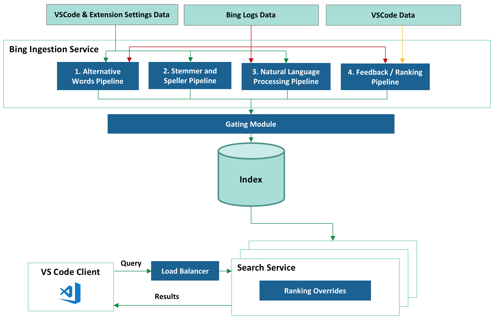

# Bing-powered settings search in VS Code

April 25, 2018 by Rob Lourens [@roblourens](https://twitter.com/roblourens) and Ankith Karat [ankar@microsoft.com](mailto:ankar@microsoft.com)

Have you ever had trouble finding a certain setting in VS Code? You're not alone. Looking across common GitHub issues, StackOverflow questions, tweets, and user studies that we've done, we've seen many users having issues finding settings. This is no surprise given that VS Code includes more than 400 settings out of the box, and with extensions installed, many users can have significantly more. If you include typical user mistakes such as typos and the challenge of picking the right search terms, users have a hard time.

So several months ago, we started talking to the Bing team about whether they could apply their search expertise to our problem. And two months ago, we shipped the result - an intelligent settings search experience powered by Bing.

    

        <h3 style="text-align: center">Before</h3>
        
    

    

        <h3 style="text-align: center">After</h3>
        
    

## How it works

After a period of discussion and prototyping, we decided on an arrangement in which the Bing team would run a settings search service that would provide intelligent fuzzy settings matches for queries that users search for in VS Code's settings editor.

Integrating Bing's natural language search capabilities into VS Code proved challenging. To search documents on the web, Bing considers thousands of signals relating to page similarity, click data, user behavior data, etc. But we didn't have this sort of rich metadata available for our settings - just a brief name and description for each one. So the Bing team combined custom services and Bing's fundamental search capabilities to create a system tuned to our search scenario.

Here is a high level overview of the system:

Let's take a look at each part.

There are essentially two sides to this system - collecting and indexing setting details offline, and serving up results online. The first part of that is implemented by the Ingestion Service. It's responsible for creating a rich index containing settings from VS Code itself and from extensions. Since we want query response time to be as short as possible, we do as much work as possible up front while ingesting settings to reduce the work we have to do while handling the query.

### Bing Ingestion Service

**Collecting VS Code and Extension Settings Data**

During each build, VS Code starts up in a mode where it writes all of its configuration to a JSON file. We have to actually start VS Code, because we can't determine all the configuration metadata statically. The file includes a few pieces of information per setting - the name, description, type, default value, and for "enum"-type settings, the list of valid values and their descriptions. We then upload the file to Azure Storage. If you're curious, you can see a recent example here:

[https://ticino.blob.core.windows.net/configuration/123000832/c1cd4378.../configuration.json](https://ticino.blob.core.windows.net/configuration/123000832/c1cd4378c5e5dc434ed959e13556d05240a8ca18/configuration.json)

`123000832` is a unique build number, computed from the product version plus the number of Git commits since the previous release. `c1cd4378...` is the Git commit id that the build was built off of. And `ticino`, some of you diehard fans might remember, was our original short-lived code name.

Bing's Polling Service watches the Azure Storage container, notices a new build, and notifies the Ingestion Service. At the same time, Bing is constantly crawling the VS Code Extension Marketplace, waiting for extension updates and new extensions. When it finds one, it downloads its `package.json` file (for extensions, all configuration metadata is contained in the `package.json`. No need to start it up.) and passes those settings to the Ingestion Service as well.

This entire process is fully automated and constantly updates the indexed settings in real-time for each of our stable release builds and our daily Insiders builds. Within minutes of the completion of a build, Bing's index has been updated to include any newly added settings.

**1. Alternative Words Pipeline**

Users sometimes search with words that are different but equivalent to the words we use in setting names and descriptions. To ensure that we can handle those cases, we integrated Bing's "Alternative Word" generation pipeline. This pipeline collects words with similar meanings to each other from Bing's search data using signals such as user behavior, clicks, online ranking, and page similarity. For example, "update" and "upgrade" are set as "alternative words", and a search for one will return settings that include the other.

**2. Stemmer and Speller Pipeline**

We don't want to penalize the user for misspelling the name of a setting, but we found early on that simple fuzzy matching would either miss variations of an English word that a human could understand, or would include too many false positive matches. So we also included a Speller and a Stemmer service, extracted from the full-fledged services that are used on [Bing.com](https://www.bing.com), which enrich the index with common misspellings and alternate forms of the same word stem. For example, "formatted", "formatter", "format" - all will be indexed for a setting that uses the word "formatting".

**3. Natural Language Processing (NLP) Pipeline**

We also want to enable users to describe their query in their own natural language, so we added Bing's Natural Language Processing pipeline. The pipeline collects commonly used speech and text patterns and adds them to the indexes. For example, it enables the system to identify the important words in "how to disable css validation" to find `"css.validate"`.

**4. Feedback/Ranking Pipeline**

We created a feedback mechanism that lets us learn and improve from user feedback. It allows us to manually specify new word pairs or to boost expected results for certain queries. The feedback is uploaded to the service and is reflected by the search results almost immediately.

**Gating Module**

Every ingestion into the index goes through the gating module which just ensures that the index hasn't, due to some programming error, become corrupted. We have test cases written that verify the following:

- The new index is backwards compatible and serves all VS Code builds
- Our Golden query set returns the expected results

Failure in the gating module will prevent an index ingestion and notifies the team immediately. A dashboard service was also created that allows us to monitor the health of all stages of the pipeline. It has alerting mechanisms and the ability to roll back to the last known good state, to ensure that any issue can be resolved quickly with minimum downtime.

### Search Service

Finally, at runtime, the query from our users hits the [Azure Load Balancer](https://learn.microsoft.com/azure/load-balancer/load-balancer-overview) service that selects one of our geo-replicated servers to handle the query, based on its physical proximity or current load. The Search Service hosted at that location retrieves the relevant results with a lookup in the index, applies manual ranking overrides in some cases, and returns them to the VS Code client.

## Putting it all together

We now have a system which does a better job of understanding settings queries and delivers results for many queries that would have returned nothing before.

Here are some examples:

If you have a similar problem and don't have a search team to build you a custom service as the Bing team did for us, we still have some good news. You can get started with [Bing's Cognitive Services](https://azure.microsoft.com/en-us/services/cognitive-services/bing-web-search-api/), which will help you add some intelligence into your own apps. For example:
- [Bing Spell Check API](https://azure.microsoft.com/en-us/services/cognitive-services/spell-check/)
- [Language Understanding (LUIS)](https://azure.microsoft.com/en-us/services/cognitive-services/language-understanding-intelligent-service/)
- [Bing Web Search API](https://azure.microsoft.com/en-us/services/cognitive-services/bing-web-search-api/)
- [Bing Custom Search API](https://azure.microsoft.com/en-us/services/cognitive-services/bing-custom-search/)

## A note about testing

While developing this system, we needed a way to quantitatively evaluate the results. We decided to build a test framework based on the concept of [Normalized Discounted Cumulative Gain, or NDCG](https://en.wikipedia.org/wiki/Discounted_cumulative_gain). Without getting too far into the weeds, this is a way to grade the results from a search engine, given a query, a set of results, and scores for those results. We wrote quite a few test cases by hand, but realized that we needed an automated way to generate test cases for all settings, including new settings as they would be added, and settings in extensions. So we wrote a tool that can generate test cases automatically for any setting. It uses words from the setting name and description, and runs them through different transformers that simulate users choosing alternate words, making typos, or searching using natural language patterns. We also generated test cases for settings from some popular extensions.

We run the full test suite every 6 hours, and it can update itself automatically so that it's always testing settings from the latest build. The test suite assures us that the system is running properly, and gives us confidence that when we make changes on the backend, we are not hurting the result quality.

## What's next

There are several ways that we can continue to improve the system. For example, we are also setting up an automated feedback loop based on user behavior. If many people search for similar queries, then pick the same result, we know that result is probably a good one and should be ranked higher.

Currently the service is only indexing in English, but we'd like to index the translated setting descriptions and support searching in non-English languages. There is also some configuration metadata that isn't currently indexed, like possible values for the `"workbench.colorCustomizations"` setting. And taking search a little further, we would like to show results for extensions that aren't currently installed. If you search `"debug python"`, and don't have strong matches for local settings, then we would like to lead you towards an extension that can help you debug Python code. We have also thought about other applications for this technology within VS Code. Maybe the command palette could benefit from a similar service.

## We need your feedback

It is now easier to find settings thanks to our friends on the Bing team! User feedback is the best way for us to improve the results, so as you search for settings, please file issues on GitHub if you don't see the results that you expect. In fact, if you're using [VS Code Insiders](https://code.visualstudio.com/insiders/) you will even see a button that will invoke our new issue reporter to make it easier for you to file an issue that includes all the details we need.

Happy Coding!

Rob Lourens, VS Code - [@roblourens](https://twitter.com/roblourens)

Ankith Karat, Bing - [ankar@microsoft.com](mailto:ankar@microsoft.com)
