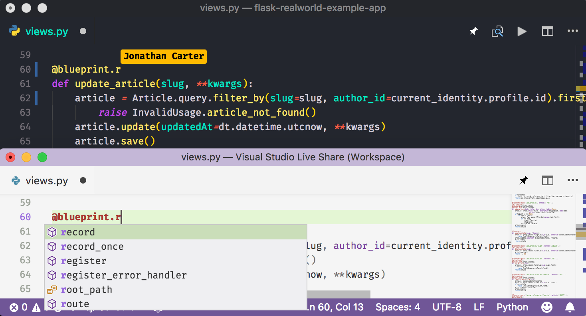
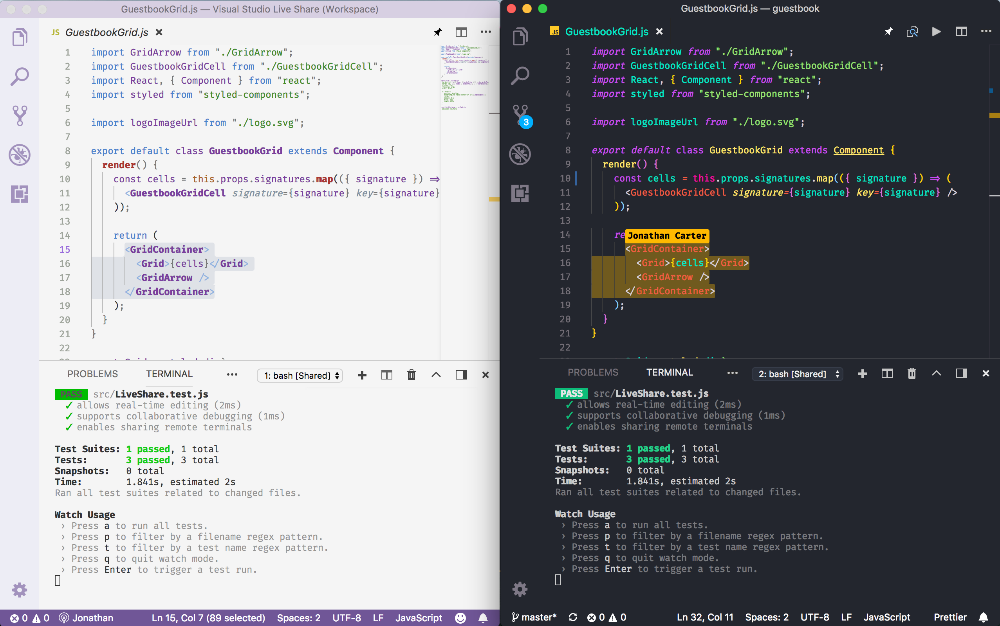
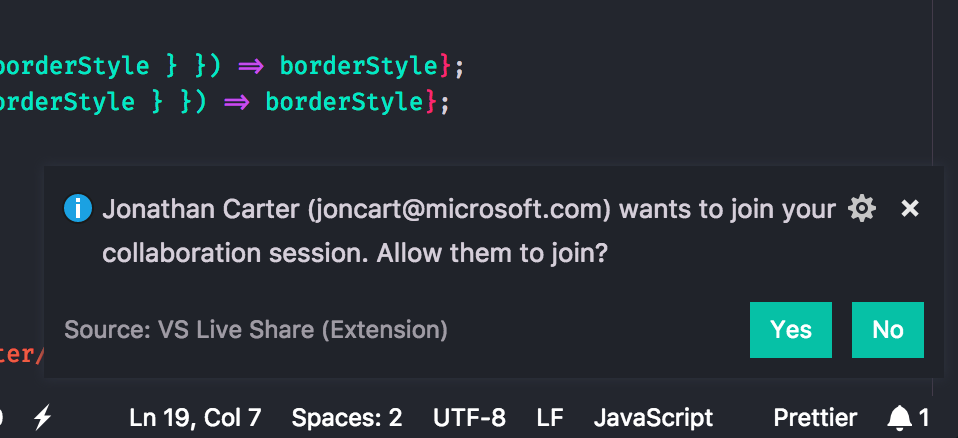
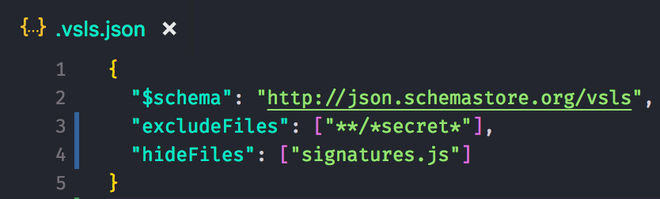

# Visual Studio Live Share Public Preview

May 7, 2018 Amanda Silver, [@amandaksilver](https://twitter.com/amandaksilver)

We are excited to announce the public preview of Visual Studio Live Share! At [Connect last November](https://code.visualstudio.com/blogs/2017/11/15/live-share), we showed how Live Share enables real-time collaborative editing and debugging from the comfort of your favorite tools. Since then, we’ve worked with thousands of developers worldwide, resolved hundreds of issues, and addressed top feature requests such as [adding support for Linux](https://github.com/MicrosoftDocs/live-share/issues/24). We’ve benefited greatly from all the feedback thus far, thank you! Today, we’re excited to announce that every developer using Visual Studio and Visual Studio Code can [get started with Live Share today](https://aka.ms/vsls)!

## Universal Collaboration

When talking with developers, the need for better collaboration tools is clear, and isn't limited to any particular programming language or app type. To empower the diverse and increasingly polyglot developer community, we’ve brought Live Share to all the languages and platforms.

Whether you’re building a Python web app, a Go microservice, a React Native mobile app or an Ethereum smart contract, you can use Live Share. Everything from Go to Definition, code fixes/refactorings ("lightbulbs"), build errors, and debugging sessions are shared with guests, which ensures that everyone stays productive no matter what you’re working on. Even better, all of this works without requiring guests to have any language extensions, dependencies, or SDKs installed! You can instantly invite others to work with you and allow them to share the context from your development environment.

## Shared Terminals

Modern development commonly makes use of command-line tools to perform tasks such as build and running unit tests. Because the command line represents such a core component of the common developer workflow, it’s critical that participants within a Live Share session can use them, without requiring a separate tool. To further support your collaborative debugging sessions, and address one of our [top feature requests](https://github.com/MicrosoftDocs/live-share/issues/41), Live Share now allows hosts to share terminals with their guests.

When you share a new terminal, it is read-only by default. This allows everyone to see the real-time results of any command you run without needing to expose access to your machine. Additionally, you can choose to make a shared terminal writable, which enables a fully collaborative experience between you and your guests which executes in your environment. This makes pair programming much easier, especially when seeking help with environment configuration.

## Secure Sharing

We want collaboration to become simpler and more natural for everyone so that ad-hoc interactions can occur more frequently. However, developers also need to be confident that when they share their source code, they have the necessary control and visibility into who has access, and what files they can see. To improve this balance between simplicity and security, Live Share provides two capabilities:

1. You can require each guest to be explicitly approved by you before joining your collaboration session. This way, simply gaining access to the share URL (which is already unique for each session) isn't enough to join.

  

2. You can exclude specific files from your sharing session, so guests can only view what you want them to. No surprises. By default, your .gitignore file is used to determine which files to exclude, but you can customize that behavior using a .vsls.json configuration file.

  

These enhancements represent some of our most [frequently requested](https://github.com/MicrosoftDocs/live-share/issues/52) items so you can collaborate with confidence, without adding unnecessary friction. For more information on how to share your projects securely, refer to the [documentation](https://docs.microsoft.com/en-us/visualstudio/liveshare/reference/security).

## We need your feedback!

We are excited for you to give [Visual Studio Live Share a try](https://aka.ms/vsls)! Please give us feedback how we might improve the experience for real-time collaborative development even further. If you'd like to learn more, you can refer to the Visual Studio Live Share [documentation](https://aka.ms/vsls-docs). Additionally, if you have any questions, encounter any issues, or have feature requests, please don’t hesitate to [let us know](https://github.com/microsoft/live-share).

Happy Collaborating! 
Amanda, [@amandaksilver](https://twitter.com/amandaksilver)
