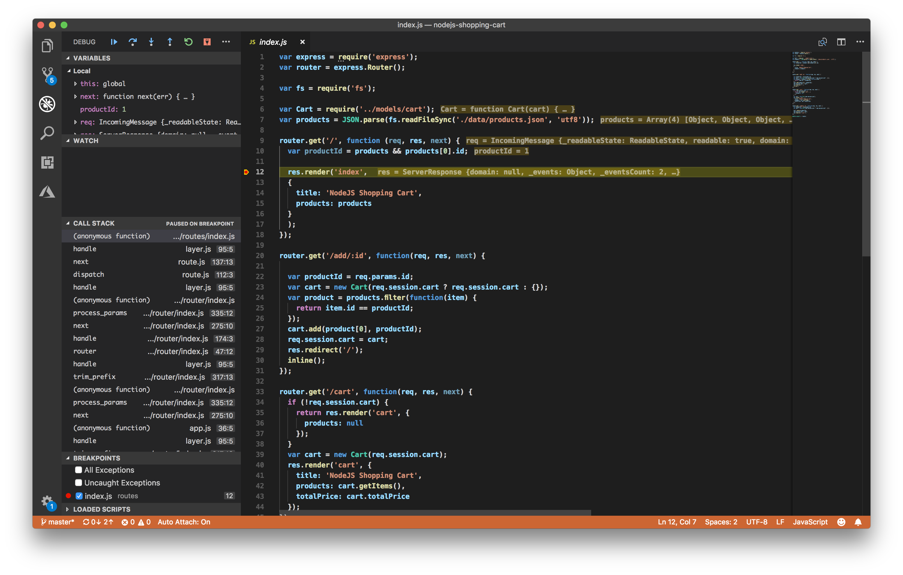
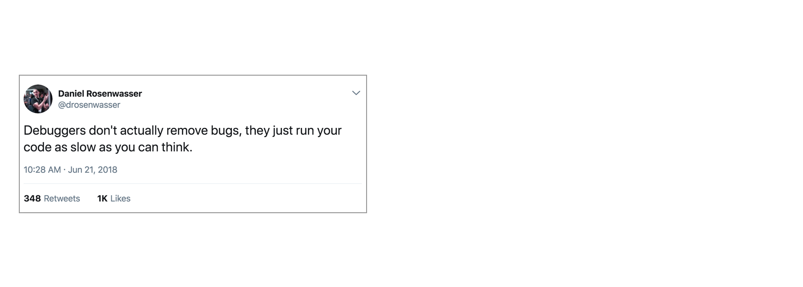

# Introducing Logpoints and auto-attach

July 11, 2018 Kenneth Auchenberg, [@auchenberg](https://twitter.com/auchenberg)

In this post I'm going to talk about the way we think about debugging, the feedback we hear from our users and how we are making debugging easier and simpler to use in VS Code.

Since the early days of VS Code we have shipped an integrated debugging experience in VS Code, as we believe debugging should be an integrated part of the place where you write and edit your code - your editor.

Below the surface our debugging experience is powered by a generic debugger UI that communicates through the Debug Adaptor Protocol (DAP) with a specific type of VS Code extensions that we call for Debug Adaptor's (DA). The DA talks to a real debugger and translates between the DAP and the runtime specific debug protocol or API of the debugger.

This means that the core of VS Code is fully decoupled from the specific debuggers, and this architecture allows VS Code to debug anything, as long as there's a Debug Adapter available.

## Observations and pain points in our debugging experience

Today we already have a large happy group of developers who are debugging in VS Code on a regular basis, but as a part of our mission we want to make debugging better and more available to developers.

So over the past months we engaged in conversations to better understand the pain points of debugging in VS Code, and why some developers don't use a debugger at all.

This is our observations:

### Debug configuration is hard to get right

Because VS Code is a general editor with a generic debugger, and not a specialized tool for a particular stack or runtime, we can't provide an opinionated default debug configuration that will work for everyone.

This means that VS Code requires you to have a set of debug configurations that tells us what debugger to use, and how to start your runtime with the right parameters, etc.

We recognize that this can be hard to get right, but we don't see a way to completely eliminate debug configuration for everyone. That being said we believe that debug configuration can be simplified and sometimes in the right context be reduced to a minimum.

I'll get back to this later.

In VS Code we have two core concept for debugging: Launch and attach, which caters to two different segments of developers. Depending on which segment you belong to, it can be confusing to determine what kind of debug configuration you need for your project.

If you come from a browser DevTools background you aren't used to the concept of "launching from your tool", as your browser instance already is open, and when opening DevTools you simply attach DevTools to your browser tab. On the other hand, if you come from a Java background it's quite normal to have your editor launch your Java process for you, and have your editor attaching it's debugger to the newly launched process.

In general we recommend using launch configurations if you have an application that requires some sort of build step before it can be launched, as it allows you offload some of the cognitive overhead of building and running your app to your editor.

But as we talked to developers about launching their applications we recognized a pattern and made one important observation:

**Observation**: Many developers who are using VS Code really loves the integrated terminal and relies on command line tools to launch their applications. For many it's a more natural workflow to run a command in the terminal followed by attaching the debugger from the editor. Much like opening DevTools after the browser has been launched.

This observation is key, and we acknowledge that many don't want a full "magical" launch experience in their editor, but want to keep their editor place to edit code and debug, while using the terminal to launch apps, run build scripts, etc.

### Many developers don't use breakpoints because their debugging workflow is focused at a different purpose

When looking at how developers are debugging their applications we also recognized another interesting pattern: The usage of logging instead of breakpoints.

Using logging for debugging isn't new concept, and has been around for many decades now, and the observation here is key:

**Observation**: When looking at the debugging workflows it's important to recognize, that traditional debugging experiences have been focused around slowing down execution to allow a specific set of logic to be inspected, while logging workflows usually are focused around inspecting state and how it changes throughout the execution workflow of an application. The fundamental  observation here is that debugging purpose between the workflows are vastly different.

This observation is especially relevant for JavaScript developers who mostly are dealing with the complexity of managing state, and this might explain why [most JavaScript developers still prefers to add console.log's](https://christianheilmann.com/2017/07/08/debugging-javascript-console-loggerheads/) to their code instead of using a script debugger.

## Introducing Logpoints  -  a new kind of breakpoint that doesn't halt execution

Based on this learning we believe there's an opportunity to combine the debugging experience with the purpose of state inspection, so in [our March iteration](https://code.visualstudio.com/updates/v1_22#_logpoints) of VS Code we released the first iteration of a debugging concept that we call Logpoints. Logpoints are a new kind breakpoint variant that does not "break" into the debugger but instead logs a message to the console.

The concept for Logpoints isn't new, and over the past many years we have seen multiple flavors of this concept in tools like [Visual Studio](https://codewala.net/2018/01/25/tracepoint-an-awsome-feature-of-visual-studio/), [Edge DevTools](https://docs.microsoft.com/en-us/microsoft-edge/devtools-guide/debugger) and [GDB](https://sourceware.org/gdb/onlinedocs/gdb/Tracepoints.html) under several names such as [Tracepoints](https://blogs.msdn.microsoft.com/devops/2013/10/10/tracepoints/) and [Logpoints](https://blogs.msdn.microsoft.com/visualstudio/2017/09/13/debug-live-apps-in-azure-with-the-snappoints-and-logpoints-preview/).

### Why and when to use Logpoints?

Logpoints are based on the observation that in many cases you don't want to stop execution in a particular part of your application, but instead you want to inspect how state mutates throughout the lifetime of the application.

Logpoints allows you to "inject" on-demand logging statements into your application logic, just like if you had added logging statements into your application before starting it. Because Logpoints are injected at execution time, and not persisted in the source code, this means that you don't have to think ahead of time, but can inject Logpoints as you need them, and a nice benefit is that you don't have to worry about cleaning up after you are finished debugging.

For JavaScript developers this means that you don't have to worry about leaving `console.log's` behind anymore -  just use Logpoints!

### Logpoints are extra useful in cloud contexts

Logpoints are particular useful in cloud contexts (or any remote context really), as they enable you to inject logging into remote environments without having to redeploy your applications, and because you don't halt script execution, your users aren't affected, like they would have been if you were using regular breakpoints.

You can read more about how to use [Logpoints for Node.js on Azure here](https://medium.com/@auchenberg/introducing-remote-debugging-of-node-js-apps-on-azure-app-service-from-vs-code-in-public-preview-9b8d83a6e1f0).

### Supported languages

Since our first release of Logpoints in VS Code we have seen growing adoption of Logpoints in our VS Code Debug Adapters, and today we have support for the following languages:

- [Node.js debugger](https://github.com/Microsoft/vscode-node-debug2/)
- [Chrome debugger](https://github.com/Microsoft/vscode-chrome-debug/)
- [Firefox debugger](https://github.com/hbenl/vscode-firefox-debug/commit/0c90a695e304bb54402ada129f8fafae462718f5)
- [Microsoft Edge debugger](https://github.com/Microsoft/vscode-edge-debug2)
- [React Native Debugger](https://github.com/Microsoft/vscode-react-native)
- [Python Debugger](https://github.com/Microsoft/vscode-python)
- [Dart debugger](https://github.com/Dart-Code/Dart-Code)
- [Lua debugger](https://github.com/actboy168/vscode-lua-debug)
- [Java Debugger](https://github.com/Microsoft/java-debug/pull/184)

### Logpoints in the VS Code Debug Protocol

If you are interested in adding Logpoints support in your Debug Adapter for VS Code, please take a look at [these changes](https://github.com/Microsoft/vscode-debugadapter-node/commit/aeda2ba8ae526906585a5ccb7d8346a71b83ed10) in the protocol, and you can look at the above debug adapters for inspiration on how each runtime have chosen to implement Logpoints.

## Auto-attaching our debugger to Node processes started from the integrated terminal

When reflecting on the learning of how some developers are using the integrated terminal, we saw a unique opportunity emerge. By  leveraging the contextual information we have inside VS Code from your editor and integrated terminal,  we had a way to detect your context and reason about your intent to debug, and this could provide a much simpler debugging experience for Node.js developers.

So in [our March iteration](https://code.visualstudio.com/updates/v1_22#_node-debugging) of VS Code, we released a new feature that called Auto Attach for Node, that enables the Node debugger to automatically attach to Node.js processes that have been launched in debug mode from VS Code's Integrated Terminal.

You enable auto attach by running **Debug: Toggle Auto Attach** command from the Command Palette, and once activated you can toggle auto attached from the Status bar too.

This feature completely eliminates any debug configuration, as we interpret any Node process started with `node -inspect` as an intent to debug, and when combining this with our integrated terminal, we can provide a much simpler debugging experience that allows developers to launch their app in their own way, while eliminating debug configuration at the same time! 🎉

## Debugging from the NPM Scripts explorer

In [our April 2018 iteration](https://code.visualstudio.com/updates/v1_23#_npm-script-running), we added a new NPM scripts explorer that allows you to browse and run your NPM scripts directly from the UI. As a part of our journey of simplifying debug configuration, we also made it possible to start Node debugging directly from the explorer, without having to create debug configuration.

If you have a `npm script` that includes an debugging argument like `--inspect` we'll automatically detect this and provide a debug action that launches the debugger, as seen here:

I hope you'll find these new debugging features useful, and as always please share your thoughts and feedback on how we can make debugging easier, more productive and more fun on [GitHub](https://github.com/Microsoft/vscode), and [@code on Twitter](https://twitter.com/code)

On behalf of the VS Code team, Happy Coding!

/Kenneth Auchenberg - [@auchenberg on Twitter](https://twitter.com/auchenberg)