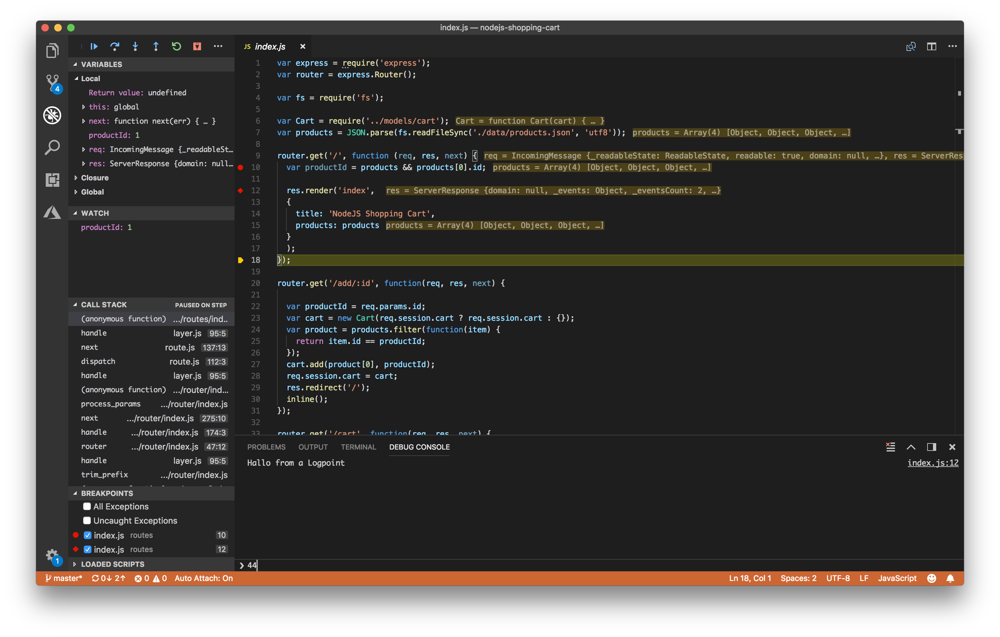
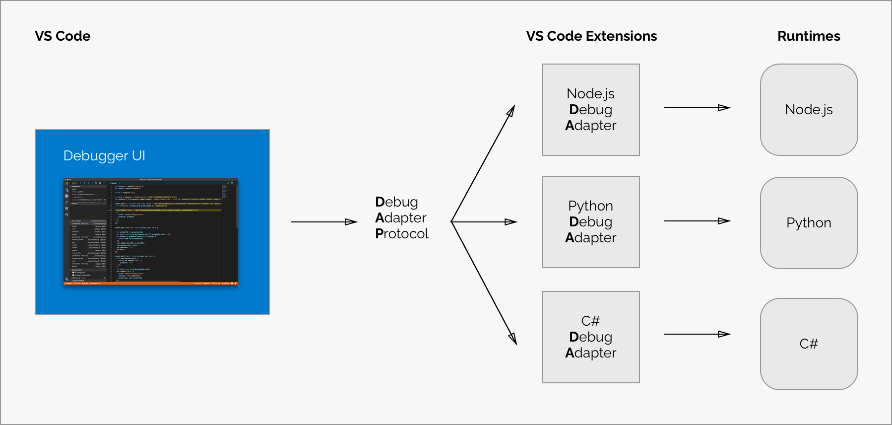
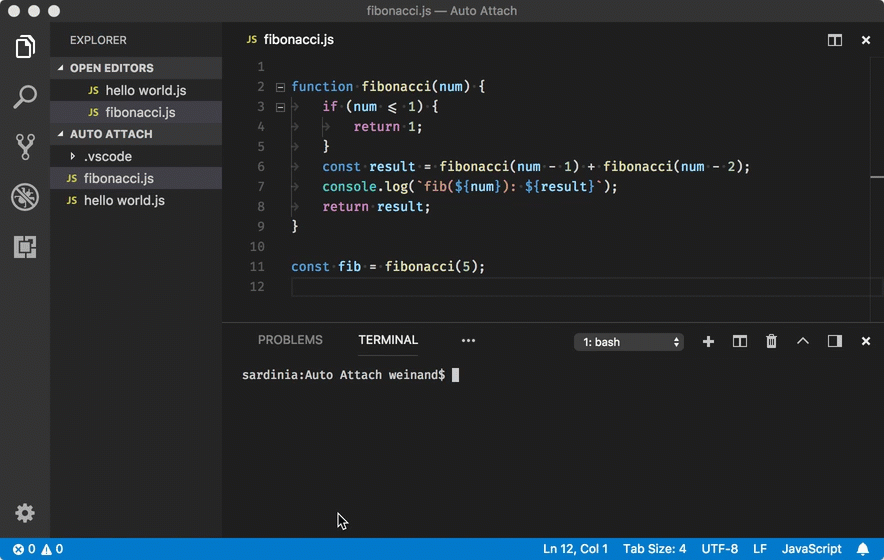
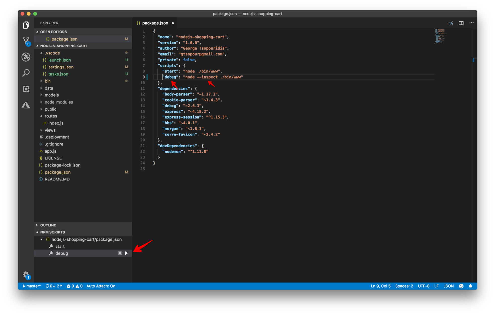
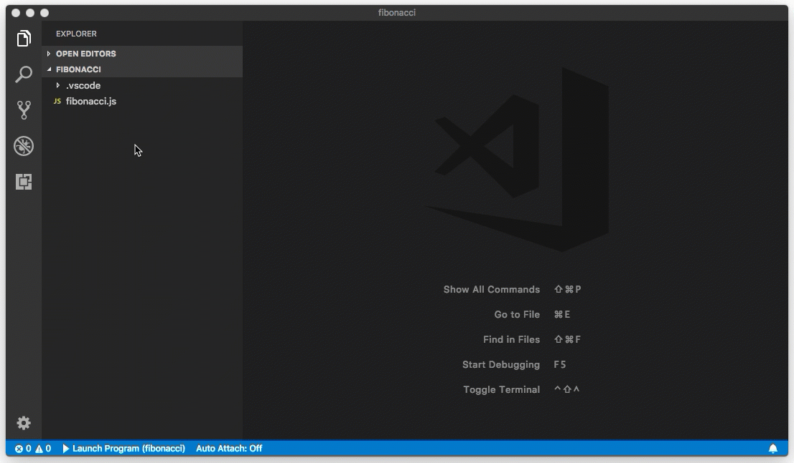

---
Order:
TOCTitle: Logpoints and auto-attach
PageTitle: Introducing Logpoints and auto-attach
MetaDescription: Introducing Logpoints and auto-attach to make debugging easier and simpler to use in Visual Studio Code
MetaSocialImage: /assets/blogs/2018/07/12/debugger.png
Date: 2018-07-12
ShortDescription: Introducing Logpoints and auto-attach to make debugging easier and simpler to use
Author: Kenneth Auchenberg
---
# Introducing Logpoints and auto-attach

July 12, 2018 Kenneth Auchenberg, [@auchenberg](https://twitter.com/auchenberg)

Over the past few months we have been busy improving the debugging experience in Visual Studio Code, and in this post, I'm going to talk about how we think about debugging, present the feedback we heard from our users, and explain the steps we are taking to make debugging easier and simpler in VS Code.

Since the start of VS Code, we have shipped with an integrated debugging experience as we believe debugging should be an integral part of where you write and edit your source code  ––  your editor.

The VS Code debugging experience is powered by a generic debugger UI that communicates through the Debug Adapter Protocol (DAP) with a specific type of VS Code extension that we call a Debug Adapter (DA). The DA talks to a real debugger and translates between the DAP and the runtime specific debug protocol or API of the debugger.

This means that the core of VS Code is fully decoupled from the specific debugger and this architecture allows VS Code to debug anything, as long as there's a Debug Adapter available, as illustrated here:

 

 

## Observations and pain points

Today there are a large group of satisfied developers debugging with VS Code on a regular basis, but, as a part of our mission, we want to make debugging easier and available to more developers.

To this end, we began conversations to better understand the pain points of debugging in VS Code and learn why some developers aren't using our debugger at all.

Here are our observations:

### Debug configuration is hard to get right

VS Code is a general editor with a generic debugger and is not specialized for a particular stack or runtime. For this reason, we can't provide an opinionated default debug configuration that will work for everyone.

This means that VS Code requires you to configure settings for the debugger as well as specify how you want to start your runtime with the right parameters, etc.

We recognize that this can be hard to get right, but we don't see a way to completely eliminate debug configuration for everyone. However, we do believe that debug configuration can be simplified and depending on the context, reduced to a minimum.

I'll get back to this later.

### Confusion between launch and attach configs

In VS Code, we have two core concepts for debugging: **Launch** and **Attach**, which handle two different workflows and segments of developers. Depending on your workflow, it can be confusing to know what type of configuration is appropriate for your project.

If you come from a browser DevTools background, you aren't used to the concept of "launching from your tool" since your browser instance is already open. When you open DevTools, you are simply **attaching** DevTools to your open browser tab. On the other hand, if you come from a Java background, it's quite normal to have your editor **launch** your Java process for you, and your editor automatically attaches its debugger to the newly launched process.

The best way to explain the difference between **launch** and **attach** is to think about [launch configurations](/docs/editor/debugging#_launch-configurations) as a recipe for how to start your app in debug mode **before** VS Code attaches to it, while an [attach config](/docs/editor/debugging#_launchjson-attributes) is a recipe for how to connect VS Code's debugger to an app or process that's **already** running.

The value of [launch configurations](/docs/editor/debugging#_launch-configurations) is that they give you a way to offload some of the cognitive overhead of launching your app with the right debugging parameters by creating a configuration that's repeatable and shareable with your project and team.

However, when we talked to developers about how they were launching their applications, we saw a pattern and made one important observation:

**Observation**: Many developers who are using VS Code really love the Integrated Terminal and rely on command-line tools to launch their applications. For many, it's a more natural workflow to run a command in the terminal followed by attaching the debugger from the editor. This is similar to opening DevTools after the browser has been launched.

This observation was key, and we realized that many users don't want a full "magical" launch experience in their editor. They want to keep their editor as the place to edit and debug source code and use the terminal to launch apps, run build scripts, etc. This is one of the reasons why we have an Integrated Terminal experience inside VS Code, as we believe a good functional UI should co-exist and integrate well with the terminal.

### Many developers don't use breakpoints because they are inspecting state changes

When looking at how developers debug their applications, we also saw another interesting pattern: The use of logging instead of breakpoints.

Logging for debugging isn't a new concept but the observation was important:

**Observation**: Traditional debugging workflows are most focused around slowing down execution to inspect program logic, while logging workflows usually involve inspecting program state and how it changes during the normal execution of an application. The fundamental observation here is that the two techniques are used for different debugging purposes.

This observation is especially relevant for JavaScript developers, who mostly deal with the complexity of managing state, and this might explain why [most JavaScript developers still prefer to add console.log's](https://christianheilmann.com/2017/07/08/debugging-javascript-console-loggerheads/) to their source code instead of using a script debugger.

## Auto-attaching to Node processes

When reflecting on how some developers are using the Integrated Terminal to launch their debugging session, we saw a unique opportunity emerge. By leveraging the contextual information we have inside VS Code from your editor and Integrated Terminal, we could detect your context and reason about your intent to debug, and this could provide a much simpler debugging experience for Node.js developers.

So in [our March iteration](https://code.visualstudio.com/updates/v1_22#_node-debugging) of VS Code, we released a new feature that called **Auto Attach for Node**, that enables the Node debugger to automatically attach to Node.js processes that have been launched in debug mode from VS Code's Integrated Terminal.

You enable auto attach by running **Debug: Toggle Auto Attach** command from the Command Palette, and once activated you can toggle auto attach from the Status Bar as well.

 

 

This feature completely eliminates any debug configuration, as we interpret any Node.js process started with `node --inspect` as an intent to debug. When combined with the Integrated Terminal, it is a much simpler debugging experience that allows developers to launch their app in their own way, while eliminating debug configuration at the same time! 🎉

## NPM scripts and debugging

Many Node.js developers rely on [npm scripts](https://docs.npmjs.com/misc/scripts) to launch applications or start debugging sessions, and we have some great news on that front too: Auto-attach also works with npm scripts. If you run `npm run debug` and the `"debug"` script is `"node --inspect"` or any other command that includes `--inspect`, then auto attach will detect that and attach the debugger 🎉

We also recognized that some developers wanted a more visual way to find and run their npm scripts, so in [our April 2018 iteration](https://code.visualstudio.com/updates/v1_23#_npm-script-running), we added a new NPM scripts explorer that allows you to browse and run your NPM scripts directly from the UI. As a part of our work to simplify debug configuration, we also made it possible to start Node.js debugging directly from the explorer, without having to create a debug configuration.

If you have a npm script that includes a debugging argument like `--inspect`, we'll automatically detect this and provide a debug action that launches the debugger, as seen here:

## Introducing Logpoints

Based on the learning that logging is an important debugging technique, we saw an opportunity to add state inspection to our existing debugging experience. In [the March iteration](https://code.visualstudio.com/updates/v1_22#_logpoints) of VS Code, we released the first implementation of a debugging feature that we call Logpoints.

A Logpoint is a breakpoint variant that does not "break" into the debugger but instead logs a message to the console.

The concept for Logpoints isn't new, and over the past few years, we have seen different flavors of this concept in tools like [Visual Studio](https://codewala.net/2018/01/25/tracepoint-an-awsome-feature-of-visual-studio/), [Edge DevTools](https://learn.microsoft.com/microsoft-edge/devtools-guide-chromium/landing/) and [GDB](https://sourceware.org/gdb/onlinedocs/gdb/Tracepoints.html) under several names such as Tracepoints and [Logpoints](https://devblogs.microsoft.com/visualstudio/debug-live-apps-in-azure-with-the-snappoints-and-logpoints-preview).

### Why and when to use Logpoints?

Logpoints are based on the observation that in many cases, you don't want to stop execution in a particular part of your application, but instead you want to inspect how state mutates throughout the lifetime of the application.

Logpoints allows you to "inject" on-demand logging statements into your application logic, just like if you had added logging statements into your application before starting it. Logpoints are injected at execution time and not persisted in the source code, so you don't have to plan ahead but can inject Logpoints as you need them. Another nice benefit is that you don't have to worry about cleaning up your source code after you are finished debugging.

For JavaScript developers, this means that you don't have to worry about leaving `console.log`s behind anymore  ––  just use Logpoints! Even better, you can combine `console.log` and Logpoints. If you insert a Logpoint into a block of source code that already has `console.log`s, you'll see both types of logging statements inside the Debug Console.

### Logpoints in cloud contexts

Logpoints are particular useful in cloud contexts (or any remote context really), as they enable you to inject logging into remote environments without having to redeploy your applications. Equally important, you don't halt script execution with Logpoints, so your users aren't affected unlike halting the running application on a regular breakpoint.

You can read more about how to use [Logpoints for Node.js on Azure here](https://medium.com/@auchenberg/introducing-remote-debugging-of-node-js-apps-on-azure-app-service-from-vs-code-in-public-preview-9b8d83a6e1f0).

### Supported languages

Since the first release of Logpoints in VS Code, we have seen a growing adoption by VS Code Debug Adapters, and today there is Logpoint support for the following languages:

- [Node.js debugger](https://github.com/microsoft/vscode-node-debug2/)
- [Chrome debugger](https://github.com/microsoft/vscode-chrome-debug/)
- [Firefox debugger](https://github.com/hbenl/vscode-firefox-debug/commit/0c90a695e304bb54402ada129f8fafae462718f5)
- [Microsoft Edge debugger](https://github.com/microsoft/vscode-edge-debug2)
- [React Native Debugger](https://github.com/microsoft/vscode-react-native)
- [Python Debugger](https://github.com/microsoft/vscode-python)
- [Dart debugger](https://github.com/Dart-Code/Dart-Code)
- [Lua debugger](https://github.com/actboy168/vscode-lua-debug)
- [Java Debugger](https://github.com/microsoft/java-debug/pull/184)
- [Debugger for Mainframe](https://marketplace.visualstudio.com/items?itemName=broadcomMFD.debugger-for-mainframe)

### Logpoints in the VS Code

If you are interested in adding Logpoint support in your Debug Adapter for VS Code, please take a look at [these changes](https://github.com/microsoft/vscode-debugadapter-node/commit/aeda2ba8ae526906585a5ccb7d8346a71b83ed10) in the protocol. You can also look at the above debug adapters to see how each runtime has chosen to implement Logpoints.

## Next steps

That's it for now, but we aren't finished. In our [July iteration](https://github.com/microsoft/vscode/issues/53850), we are making improvements to auto-attach in order to aid discoverability ([#53640](https://github.com/microsoft/vscode/issues/53640)), based on user feedback.

We hope the introduction of auto-attach, NPM scripts explorer, and Logpoints are going to make it easier to debug with VS Code. As always, we are eager to hear your feedback, so reach out to us at [GitHub](https://github.com/microsoft/vscode) or [@code on Twitter](https://twitter.com/code).

On behalf of the VS Code team: Happy Coding!

/Kenneth Auchenberg - [@auchenberg on Twitter](https://twitter.com/auchenberg)
