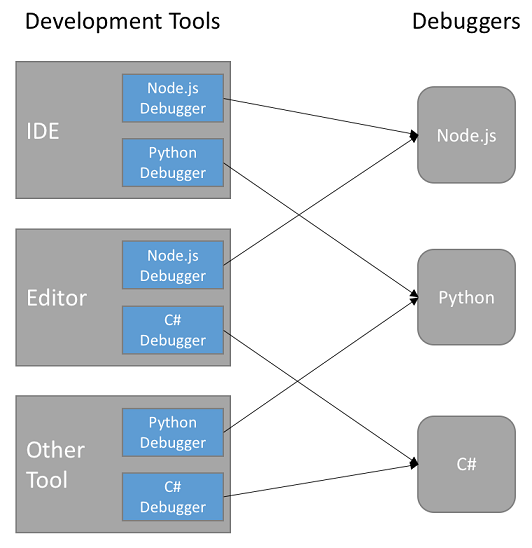
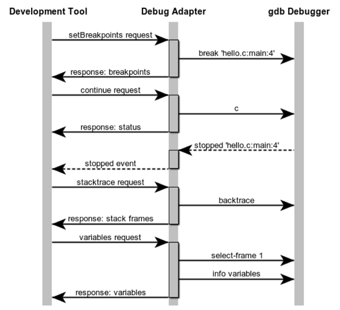
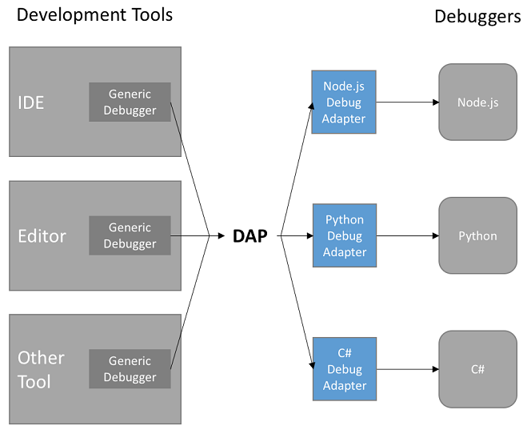

---
Order:
TOCTitle: New home for Debug Adapter Protocol
PageTitle: A new home for the Debug Adapter Protocol
MetaDescription: A new home for the Debug Adapter Protocol
MetaSocialImage: /assets/blogs/2018/08/07/with-DAP.png
Date: 2018-08-07
ShortDescription: The new Debug Adapter Protocol website
Author: André Weinand
---
# New home for the Debug Adapter Protocol

August 7, 2018 André Weinand, [@weinand](https://twitter.com/weinand)

One goal of the July milestone was to move the **Debug Adapter Protocol** -- which was hiding itself in a somewhat obscure [GitHub project](https://github.com/microsoft/vscode-debugadapter-node) -- to a more prominent website (see feature request [#19636](https://github.com/microsoft/vscode/issues/19636)).

This blog provides some background about protocols, the Debug Adapter Protocol, and the motivation behind the move.

## Why the need for decoupling with protocols?

From another [blog](https://code.visualstudio.com/blogs/2016/06/27/common-language-protocol):

**_"Visual Studio Code is an editor for any developer, no matter what programming language you use."_**

This promise is based on (at least) two pillars:

- An extensible tool platform and ecosystem where everyone can easily contribute.
- Technology that makes it easy to add great tool support for any programming language.

Supporting a programming language from a development tool means:

- Rich editing support based on a deep understanding of a language (AKA "language smartness").
- Debugging support for the language integrated into the editing tool.

The latter might come as a surprise to some, but it was always our firm belief that debugging is an integral part of where the source code is written: the editor. Debugging is an important part of the development "inner loop."

But adding a debugger for a new language to an IDE or editor is a significant effort as the list of standard debugging features is not small:

- Source, function, conditional, inline breakpoints, and [logpoints](https://code.visualstudio.com/blogs/2018/07/12/introducing-logpoints-and-auto-attach).
- Variable values shown in hovers or inlined in the source.
- Multi-process and multi-thread support.
- Navigating through complex data structures.
- Watch expressions.
- Debug console for interactive evaluation with autocomplete (REPL).

Implementing these features for a new language is not only a significant effort, it is also frustrating that this work must be repeated for each development tool, as each tool uses different APIs for implementing its user interface.

This results in lots of duplicated functionality (and implementation) as visualized by the blue boxes in the following picture:

When we started the work on Visual Studio Code, we always envisioned decoupling the "frontend" UI from the language specific "backend" implementation as much as possible. We wanted to do this for both language smartness and debugging support.

Today we believe that we have achieved this ambitious goal:

We have created two abstract protocols that allow for decoupling the editing and debugging user interfaces in the "frontend" from the language specific smartness and debugging functionality provided by "backend" components.

The "deep understanding of a language" is surfaced by the [Language Server Protocol](https://microsoft.github.io/language-server-protocol/) (LSP) and the "debugging support" by the Debug Adapter Protocol (DAP).

## The Debug Adapter Protocol

The idea behind the Debug Adapter Protocol is to standardize an abstract protocol for how the debugging component of a development tool communicates with concrete debuggers or runtimes.

Since it is unrealistic to assume that existing debuggers or runtimes would adopt this protocol any time soon, we instead designed an **intermediary** component to take over the role of adapting an existing debugger or runtime API to the Debug Adapter Protocol. This intermediary becomes the Debug Adapter which explains the name of the protocol: Debug Adapter Protocol.

Here’s an example of how a development tool could use the DAP to communicate with a Debug Adapter for the popular "gdb" debugger:

We assume that the user has already started a debug session, but is currently stopped at the entry point of their program and wants to set (and later hit) a breakpoint.

- The user sets one or more breakpoints in a specific source file by clicking in the breakpoint gutter. The development tool sends a `setBreakpoints` request to the Debug Adapter which registers the breakpoint with the gdb debugger.
- The user then presses the **Continue** button to resume execution. The tool sends a `continue` request to the Debug Adapter which translates this into the corresponding gdb command.
- Some time later, the breakpoint is hit and the Debug Adapter receives some notification from gdb and translates this into a DAP `stopped` event which gets sent to the development tool.
- In response to this `stopped` event, the development tool updates its UI and shows a stack trace view. This triggers a `stacktrace` request which returns all the information that is displayed for the individual stack frames.
- If the user selects one stack frame, the development tool requests the variables of that frame with a `variables` request.

For [historical reasons](https://github.com/microsoft/vscode-debugadapter-node/issues/58), DAP uses a JSON-based wire-format inspired by the (now obsolete) [V8 Debugging Protocol](https://github.com/dtretyakov/node-tools/wiki/Debugging-Protocol). Please note that this format is similar to but not compatible with the JSON-RPC used in the LSP.

After this short example of DAP communication, let's review the characteristics of the DAP approach:

The picture shows two important benefits of the DAP approach:

- Debug Adapters can be shared between different development tools, which helps amortize their development cost.
- The Debug Adapter Protocol is not tied to VS Code and can be used as the foundation for a generic debugger UI in other development tools.

These characteristics are similar to those of the Language Server Protocol published on its own [website](https://microsoft.github.io/language-server-protocol/) in 2016.

## A new home for the DAP

Now we have followed suit for the Debug Adapter Protocol by moving the DAP specification from its [old location](https://github.com/microsoft/vscode-debugadapter-node) to a new website [https://microsoft.github.io/debug-adapter-protocol](https://microsoft.github.io/debug-adapter-protocol/) and a corresponding repository [https://github.com/microsoft/debug-adapter-protocol](https://github.com/microsoft/debug-adapter-protocol).

This move should emphasize that the Debug Adapter Protocol in not specific to Visual Studio Code. For example, Visual Studio is now also [supporting this protocol](https://devblogs.microsoft.com/visualstudio/adding-support-for-debug-adapters-to-visual-studio-ide).

In the new location we provide:

- An [overview and introduction](https://microsoft.github.io/debug-adapter-protocol/overview) to the protocol.
- The [protocol specification](https://microsoft.github.io/debug-adapter-protocol/debugAdapterProtocol.json) as a machine-processable [JSON-schema](https://json-schema.org).
- [Detailed documentation](https://microsoft.github.io/debug-adapter-protocol/specification) automatically generated from the protocol specification.
- [Debug Adapters](https://microsoft.github.io/debug-adapter-protocol/implementors/adapters/) implementing the protocol.
- [Development tools](https://microsoft.github.io/debug-adapter-protocol/implementors/tools/) hosting the protocol.
- [SDKs](https://microsoft.github.io/debug-adapter-protocol/implementors/sdks/) supporting the protocol.
- Bugs, feature requests, and pull requests can be created under the [Issues](https://github.com/microsoft/debug-adapter-protocol/issues) section of the new repository.

The [old location](https://github.com/microsoft/vscode-debugadapter-node) will continue to host the source for the three npm modules for DAP:

- [vscode-debugprotocol](https://www.npmjs.com/package/vscode-debugprotocol)
- [vscode-debugadapter](https://www.npmjs.com/package/vscode-debugadapter)
- [vscode-debugadapter-testsupport](https://www.npmjs.com/package/vscode-debugadapter-testsupport)

## What's Next?

Since the Debug Adapter Protocol has already been available for quite some time, the move to a new website is not really an inception, but just a move to a new home...

We'd like to invite all existing and future users of the DAP to visit our new home and continue the collaboration there. For example, you can help to keep the list of supporting tools and implementations up to date by submitting pull requests in GitHub against these Markdown files:
[Debug Adapters](https://github.com/microsoft/debug-adapter-protocol/blob/gh-pages/_implementors/adapters.md),
[Tools](https://github.com/microsoft/debug-adapter-protocol/blob/gh-pages/_implementors/tools.md), and
[SDKs](https://github.com/microsoft/debug-adapter-protocol/blob/gh-pages/_implementors/sdks.md).

On behalf of the VS Code team: Happy Coding!

André Weinand -  [@weinand on Twitter](https://twitter.com/weinand)
