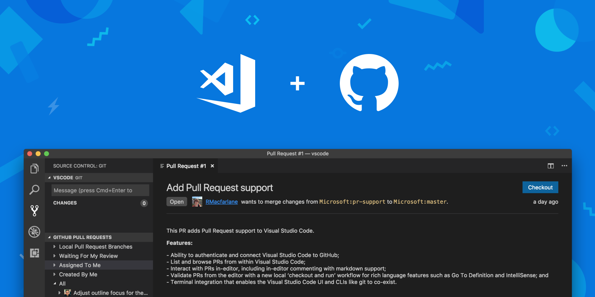
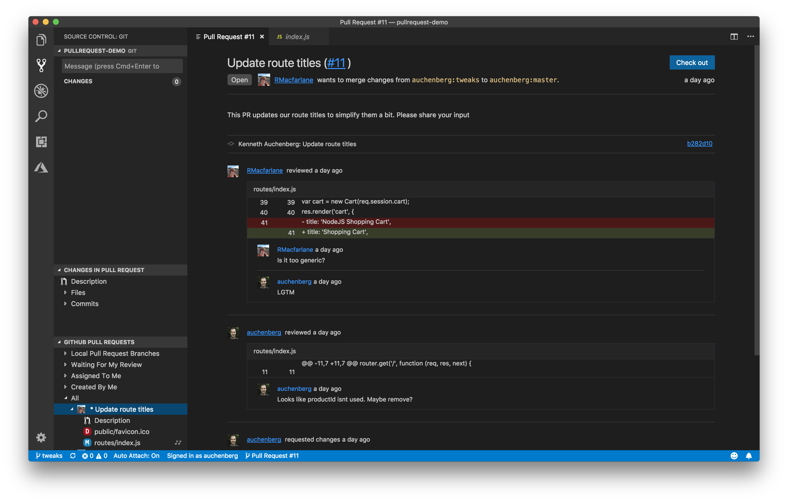

---
Order:
TOCTitle: GitHub Pull Requests
PageTitle: Introducing GitHub Pull Requests for Visual Studio Code
MetaDescription: Introducing GitHub Pull Requests for Visual Studio Code
MetaSocialImage: /assets/blogs/2018/09/10/github_pr_hero.png
Date: 2018-09-10
ShortDescription: Introducing GitHub Pull Requests for Visual Studio Code
Author: Kenneth Auchenberg
---
# GitHub Pull Requests in Visual Studio Code

September 10, 2018 Kenneth Auchenberg, [@auchenberg](https://twitter.com/auchenberg)

Like many other open-source projects, the [Visual Studio Code community collaborates](https://github.com/microsoft/vscode) through [pull requests](https://github.com/microsoft/vscode/pulls) to land fixes and new features. Starting this past spring, our team has been working to bring you a new integrated pull request experience so that you can collaborate, comment, review, and validate GitHub pull requests directly from within Visual Studio Code.

Today, we are announcing the public preview of [GitHub Pull Requests for Visual Studio Code](https://aka.ms/vscodepr-download), closing a gap in the workflow that we and millions of engineers experience every day: The ability to review source code where it was written – inside the editor.

## Review and manage Pull Requests

The new GitHub Pull Requests extension is designed to help you review and manage pull requests (PR) from within Visual Studio Code, including:

- Ability to authenticate and connect Visual Studio Code to GitHub.
- List and browse PRs from within Visual Studio Code.
- Interact with PRs in-editor, including in-editor commenting with Markdown support.
- Validate PRs from the editor with a new local `checkout and run` workflow for rich language features such as Go To Definition and IntelliSense.
- Terminal integration so that the Visual Studio Code UI and command-line tools like `git` can co-exist.

## Collaboration with GitHub

As part of our broader efforts to bring pull requests into Visual Studio Code in the past year, we reached out to numerous partners. After learning that the GitHub Editor team was already thinking along these lines, we began to work together in April to create a new pull request experience in Visual Studio Code. We developed a new extension to create and review pull requests integrated directly into Visual Studio Code through a set of new Visual Studio Code extension APIs.

## A more natural PR experience

Today when reviewing source code, many of us are forced to leave our editors to use a simplified web interface or third party review tool that presents changes in a different editor. This makes it easy to get a visual overview of the changes, but most of the time you don’t have full context of where the changes were made and how they affect surrounding source code. Being outside of your normal coding environment also means that you don’t have your favorite keyboard shortcuts, themes, and customizations. More importantly, it means that you don’t have an environment with the power to navigate the source code and validate that the changes you are reviewing actually work as expected.

The new pull request extension changes this with a new **Pull Requests** explorer inside the Source Control view in Visual Studio Code, where you can browse and interact with pull requests.

## New open extension APIs

Our new pull requests experience is powered by a set of extension APIs that allow Visual Studio Code extension authors to create extensions that manage pull requests and their related metadata. This open extension model means that pull request providers work just like our existing source control providers and anyone can write an extension for Visual Studio Code that provides in-editor commenting and capabilities to review source code hosted on their platform. You can read more about the new APIs in our [August 2018 release notes](https://code.visualstudio.com/updates/v1_27#_comment-providers).

If you are interested, you can read more about how we are introducing new APIs, and the details for our [extension API process here](https://github.com/microsoft/vscode/wiki/Extension-API-process).

## Going forward

We are excited about bringing pull requests into Visual Studio Code, as we believe it will simplify the way you review source code. Our GitHub extension is just the first example of integrating source control platform providers for code reviews in Visual Studio Code.

Please try out the public preview of [GitHub Pull Requests for Visual Studio Code](https://aka.ms/vscodepr-download), and as always, we are eager to hear your feedback, so don’t hesitate in reaching to us on [GitHub](https://github.com/microsoft/vscode-pull-request-github) or [@code on Twitter](https://twitter.com/code).

One more thing, today we are also releasing [Azure DevOps](https://azure.microsoft.com/services/devops), and the new [Azure Pipelines](https://github.com/marketplace/azure-pipelines) extension on the GitHub Marketplace. For more information, visit [https://aka.ms/azurecicd](https://aka.ms/azurecicd).

[Kenneth Auchenberg (Microsoft)](https://twitter.com/auchenberg), Rachel Macfarlane (Microsoft), [Kai Maetzel (Microsoft)](https://twitter.com/kaimaetzel), [Peng Lyu (Microsoft)](https://twitter.com/njukidreborn)
, [Sarah Guthals (GitHub)](https://twitter.com/sarahguthals) and [Andreia Gaita (GitHub)](https://twitter.com/shana)

and on behalf of the Visual Studio Code team:

Happy Coding!
