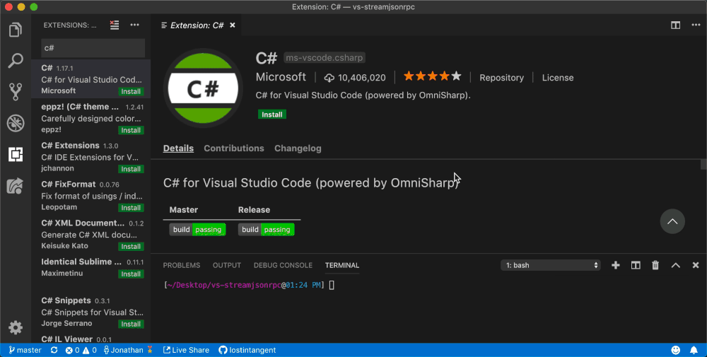
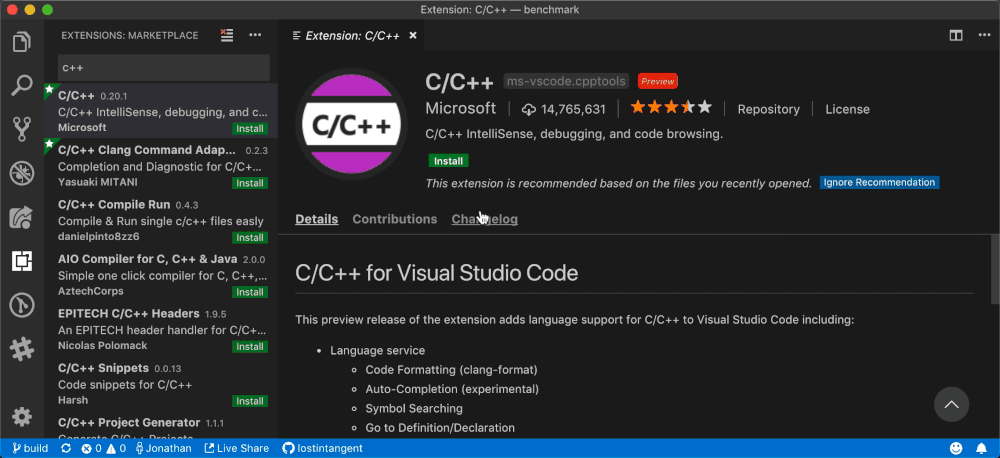
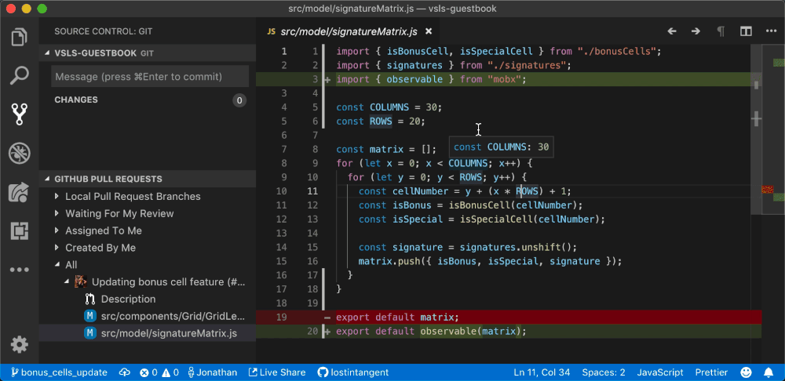

# First look at a rich code navigation experience

December 4, 2018 Jonathan Carter, [@lostintangent](https://twitter.com/LostInTangent)

Pull requests are a critical collaboration tool for millions of developers every day, facilitating asynchronous code reviews and the distribution of knowledge amongst teams and open-source communities. Because of this widespread utility and adoption, any advancement to the PR review workflow can have a significant impact on developer productivity, product quality and release velocity.

In September, along with GitHub, [we announced the GitHub Pull Requests extension](https://code.visualstudio.com/blogs/2018/09/10/introducing-github-pullrequests), which enabled developers to review source code in the same place they write it: inside their familiar and highly-customized editor. Today, we're excited to share a sneak peek of a new experience that will further enhance in-editor PR reviews with support for **rich, multi-repository code navigations**.

<iframe src="https://www.youtube.com/embed/DAqDEi0fGco?rel=0&amp;disablekb=0&amp;modestbranding=1&amp;showinfo=0" frameborder="0" allowfullscreen></iframe>

## Say goodbye to superficial reviews

To thoroughly review a pull request, you need to understand the context of its changes and how they impact the broader codebase. Today, many developers do "lightweight reviews" in their browser, which provides an extremely convenient workflow, but makes it easy to miss much-needed context (for example, "Does this change break any consumers of the API?"). The [GitHub Pull Requests](https://marketplace.visualstudio.com/items?itemName=GitHub.vscode-pull-request-github) extension improved that experience by allowing you to leverage the capabilities of your developer environment to build and navigate the source code under review, but still requires you to checkout branches locally, and have the necessary platform SDKs and language extensions installed. Doing this for every PR can require a significant amount of time and context switches, which leaves you with the choice between the convenience of quickly reviewing remote PRs, or the power of reviewing them in your local editor. **We think developers should have both**.

The rich code navigation experience we're building helps developers keep track of the pull requests they're interested in from within their development environment (via the [Visual Studio](https://marketplace.visualstudio.com/items?itemName=GitHub.GitHubExtensionforVisualStudio) and [Visual Studio Code](https://marketplace.visualstudio.com/items?itemName=GitHub.vscode-pull-request-github) extensions), and at any time, begin seamlessly navigating changes across remotely-hosted PRs, without needing to checkout those topic branches locally. Specifically, it enhances files that you open from the *GitHub Pull Requests* view with the same code navigation capabilities that drives other editor experiences (e.g. hover info, go to definition, find all references), but in this case, **powered entirely by the cloud**. We believe this can enable teams to be more productive, and make superficial reviews a thing of the past.

*Navigating a C#-based PR on macOS, without even having the C# extension or .NET Core installed.*

*Navigating a C++-based PR on macOS, without even having the C++ extension installed.*

*Navigating a Java-based PR on macOS, without even having the Java extension installed.*

## Navigate all the things

With this experience, you can navigate to symbols (e.g. classes, functions, properties) defined within the file you’re reviewing, within other files that were changed as part of the PR, as well as within arbitrary files in the same repository. This way, your ability to understand changes within the context of the entire codebase isn’t limited by the scope of the PR or your local environment.

Additionally, if the PR you're reviewing makes use of dependencies in external repos, or includes APIs that are consumed by code in external repos, you can directly navigate to those sources as well! This way, you can fully—and more importantly, quickly—assess the impact of a change, **regardless how your application is organized in version control**. We believe this is an extremely powerful capability, especially as more teams are building multi-repository applications/microservices and relying heavily on OSS.

*Navigating directly into the [MobX repo](https://github.com/mobxjs/mobx) on GitHub from an [external](https://github.com/lostintangent/vsls-guestbook/pull/11/files#diff-babc63cbfdb83a46e935f16e3eb9066fR20) reference to its [observable](https://github.com/mobxjs/mobx/blob/master/src/api/observable.ts#L183) function.*

## Community-focused design

Behind the scenes, this experience is powered by an addition to the [Language Server Protocol](https://microsoft.github.io/language-server-protocol) (LSP), which is already the foundation for language support across a number of [tools](https://microsoft.github.io/language-server-protocol/implementors/tools), such as Visual Studio and Visual Studio Code. This proposal, called the Language Server Index Format (LSIF, pronounce like "else if"), provides a means for language servers to persist their runtime intelligence, so that it can be subsequently used to answer LSP requests at-scale (for example, hover and go to definition). Additionally, the data model that LSIF defines enables repositories to be represented via rich graphs of source code, and the relationships that code has with external repositories.

As part of building out this service, we've begun implementing LSIF support for various languages ([TypeScript](https://github.com/Microsoft/lsif-node), [Java](https://github.com/Microsoft/lsif-java), C++, and C#), and we're extremely excited with the results so far. However, in order for this effort to be successful, it's critical that we partner with the community on both the standard, as well as additional language implementations. To learn more about LSIF, and contribute to this conversation moving forward, check out the [the draft LSIF specification](https://aka.ms/lsif-spec).

## We need your feedback!

We're excited to share this first look of the rich code navigation experience! We've got a lot of work left to do before this becomes something you can try out, but we wanted to start an open conversation with the community about what we're working on. If you're interested in chatting with our team, and taking part in a potential preview, you can sign-up [here](https://aka.ms/vsfutures-signup). We look forward to sharing more updates in the near future!

Happy reviewing!

Jonathan, [@lostintangent](https://twitter.com/LostInTangent)
