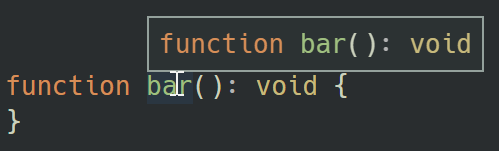

## Rich Code Navigation without Checkout

There are many scenarios where the focus of a developer is on reading and comprehending code and not on authoring new code. Examples are:

- browsing an existing code version in a repository (e.g. on GitHub).
- browsing a pull request without being limited to the changed files.
- browsing dependencies of a project. Projects today have many dependencies and you often need to dive into them to learn about their implementation.

In all of the above cases a developer usually checks out a branch or clones a repository locally onto his machine and opens his preferred development tool to navigate and understand the code. Wouldn't it be cool if a developer could do this without the cloning right from within his tool and still get all the code comprehension features like hover, go to definition and find all references he is used to?

The goal of the Language Server Index Format (LISF, pronounced like "else if") is to add such a capability to software development tools or even to the Web UI as the [Language Server Protocol](https://microsoft.github.io/language-server-protocol/) eased the integration of rich code editing capabilities. Such an integration for pull requests got demoed at [Connect(); 2018](https://news.microsoft.com/connect-2018/) and is powered by an early version of LSIF. The blog post [A first look at rich code navigation](https://code.visualstudio.com/blogs/2018/12/04/rich-navigation) contains a corresponding demo.

Why not simply use a corresponding language servers? Beside code comprehension features the LSP provides rich code authoring features like auto complete or format on type. To provide these features efficiently a language server usually requires all the files being on a local disk and it even reads parts or all of the files into memory. The goal of the Language Server Index Format is to augment the LSP protocol to support rich code navigation features without these requirements. It therefore defines a standard format for language servers or other programming tools to emit their knowledge about a workspace. This dump can later be used to answer LSP requests for the same workspace without running the language server itself.

## The Language Server Index Format

LSIF builds on LSP and it uses the same data types as defined in LSP. At a high level, LSIF models result data typically returned from a corresponding language server requests. Same as LSP, LSIF  doesn't contain any program symbol information nor does the LSIF define any symbol semantics (e.g. what makes the definition of a symbol or when a method overrides another method). The LSIF therefore doesn't define a symbol database, which is consistent with the LSP itself.

Using LSP data types as the base for LSIF has another advantage: it can easily be integrated into tools or servers which already understand LSP.

Let's have a look at a concrete example. We start with a simple TS file named `sample.ts` with the content below:

```typescript
function bar(): void {
}
```

Hovering over `bar()` shows the following hover in VS Code:



This hover information is expressed in LSP using the `Hover` type:

```typescript
export interface Hover {
    /**
     * The hover's content
     */
    contents: MarkupContent | MarkedString | MarkedString[];
    /**
     * An optional range
     */
    range?: Range;
}
```

In the above example the concrete value is:

```typescript
{
  contents: [
    { language: "typescript", value: "function bar(): void" }
  ]
}
```

A client tool would retrieve the hover content from a language server by sending a `textDocument/hover` request for document `file:///Users/dirkb/sample.ts` at position `{line: 0, character: 10}`.

The idea of the LSIF is it to define a format that language servers or standalone tools can emit that describes that the tuple `['textDocument/hover', 'file:///Users/dirkb/sample.ts', {line: 0, character: 10}]` resolves to the above hover. The data can then be taken and persisted into a database.

LSP requests are position based, however results typically only vary for ranges and not for single positions. Looking again at the above hover example the hover result is the same for all positions of the identifier `bar`. E.g. a user gets the same result whether he hovers over `b` in `bar` or over `r` in `bar`. To make the emitted data more compact the LSIF will use ranges instead of positions. For the above example this means that the LSIF tool will emit that the tuple `['textDocument/hover', 'file:///Users/dirkb/sample.ts', { start: { line: 0, character: 9 }, end: { line: 0, character: 12 }]` resolves to the hover.


LSIF uses graphs to actually emit this information, where LSP requests are represented using edges and documents, ranges or request results (e.g the hover) are represented using vertices. We choose this format for the following reasons:

- for a given range there can be multiple results. Looking at the above function `foo` example an interesting code navigation request would also be to find all references. So we need to link that result to the same range.
- it should be possible to emit data as soon as it is available to allow streaming rather than having to store large amounts of data in memory. For example, emitting data for a document should be done for each file as the parsing progresses.
- it should be possible to extend the format with additional request types.

For the concrete Hover example the emitted LSIF data looks as follows:

```typescript
// a vertex representing the document
{ id: 1, type: "vertex", label: "document", uri: "file:///Users/dirkb/sample.ts", languageId: "typescript" }
// a vertex representing the range for the identifier bar
{ id: 4, type: "vertex", label: "range", start: { line: 0, character: 9}, end: { line: 0, character: 12 } }
// an edge saying that the document with id 1 contains the range with id 4
{ id: 5, type: "edge", label: "contains", outV: 1, inV: 4}
// a vertex representing the actual hover result
{ id: 6, type: "vertex", label: "hoverResult",
  result: {
    contents: [
      { language: "typescript", value: "function bar(): void" }
    ]
  }
}
// an edge linking the hover result to the range.
{ id: 7, type: "edge", label: "textDocument/hover", outV: 4, inV: 6 }
```

The corresponding graph looks like this:


The LSP also supports requests that only take a document as a parameter (they are not position based). Some of them are interesting for code comprehension features as well. Examples are to list all document symbols or to compute all folding ranges. These requests are modeled in LSIF in the form `[request, document]` -> result. Lets again look at a concrete example:

```typescript
function bar(): void {
  console.log('Hello World!');
}
```

The folding range result for the document containing above function bar is emitted like this:

```typescript
// a vertex representing the document
{ id: 1, type: "vertex", label: "document", uri: "file:///Users/dirkb/sample.ts", languageId: "typescript" }
// a vertex representing the folding result
{ id: 2, type: "vertex", label: "foldingRangeResult", result: [ { startLine: 0, startCharacter: 20, endLine: 2, endCharacter: 1 } ] }
// an edge connecting the folding result to the document.
{ id: 3, type: "edge", label: "textDocument/foldingRange", outV: 1, inV: 2 }
```


These are only two example for LSP requests supported by the LSIF. Besides these the current version of the [LSIF specification](https://github.com/Microsoft/language-server-protocol/blob/master/indexFormat/specification.md) supports document symbols, document links, go to definition, go to declaration, go to type definition, find all references and go to implementation.


## How to get started

If you want to get started with LSIF you can have a look at the following resources:

- The actual [LSIF specification](https://github.com/Microsoft/language-server-protocol/blob/master/indexFormat/specification.md). The document also describes some additional optimizations that have been done to keep the emitted data compact.
- [Index for TypeScript](https://github.com/Microsoft/lsif-typescript): generates LSIF for TypeScript. The corresponding readme has steps for how to use it.
- [VS Code extension for LSIF](https://github.com/Microsoft/vscode-lsif-extension): an extension for VS Code to provide language comprehension feature from an LSIF JSON dump. When you have implemented an LSIF generator then you can use this extension to validate it with arbitrary source code.

## We need your feedback!

At this point we think we have made enough progress to share the LSIF specification and we wanted to start an open conversation with the community about what we're working on. For feedback please comment on the issue [Language Server Index Format](https://github.com/Microsoft/language-server-protocol/issues/623).