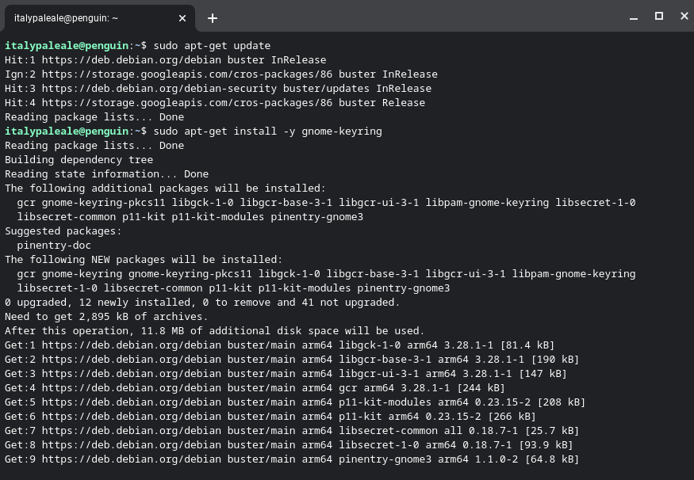
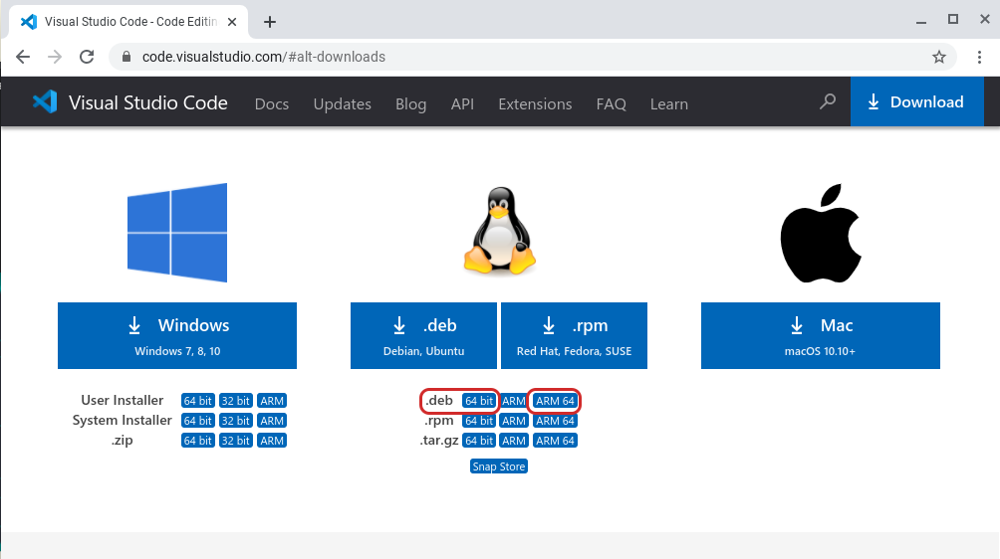
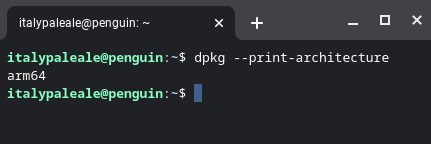
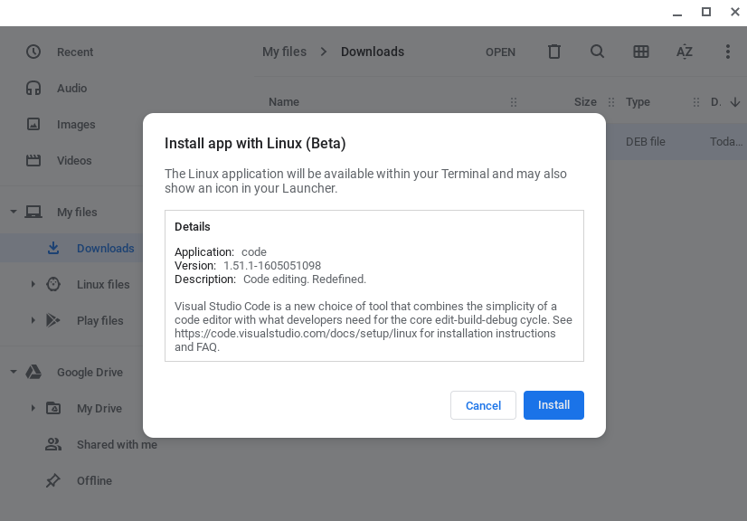
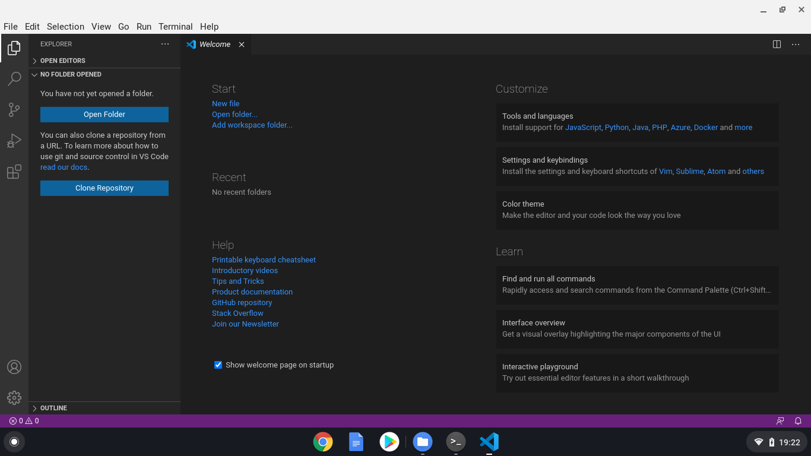
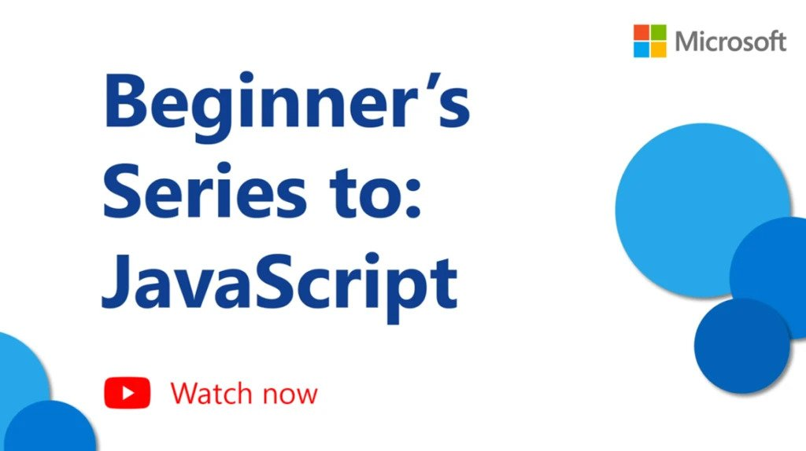

# Coding–and learning to code–with VS Code on Chromebooks

For the last few years, Chromebooks running Google Chrome OS have been providing an alternative to "traditional" laptops. Thanks to lots of choices, from very affordable models to high-end ones, Chromebooks are especially popular among students, who can use them for learning, completing assignments, and attending classes virtually.

While Chromebooks and Chrome OS are normally centered around the web browser, you can enable a Linux environment that allows installing native desktop applications… And that, of course, includes Visual Studio Code!

With VS Code running on your Chromebook, you get the ability to run one of the world's most-loved code editors, enabling you to code, and learning to code, using the most popular programming languages and technologies. This includes languages such as Python, JavaScript and Node.js, Java, and C#, among many more!

In this article, the first of two, we'll look at how to install Visual Studio Code on a Chromebook and how to set up an environment to start coding in Python or JavaScript/Node.js. In a later post, we'll also look at how to leverage the remote development extensions for VS Code to get access to more powerful environments for coding.

## What you'll need

VS Code runs on any recent Chromebook, as long as you are able to enable Linux applications via _[Crostini](https://chromeos.dev/en/linux)_; we'll look at how to do that in just a moment.

Because VS Code is a lightweight editor, you will be able to run it on low-powered Chromebooks too, with a minimum of just 1GB of RAM. Additionally, we've recently made VS Code available for Linux on ARMv7 and ARM64 too, which means that you can run it on Chromebooks powered by an ARM chip as well!

For this article, I'll be using an entry-level Chromebook, with an ARM64 CPU, 4GB of RAM, and a 32GB-disk. VS Code runs just fine on this machine too!

## Enable Linux on your Chromebook

Before we can install VS Code on Chrome OS, we need to enable support for native Linux apps, also called _Crostini_.

First, open your system's Settings, then look for **Linux (Beta)** on the sidebar. From there, turn on Linux support.


Follow the instructions on screen to configure the Linux environment (for most people, accepting the default values should be enough). Your Chromebook will then download the tools to create the Linux environment and configure it for you. Behind the scenes, this is actually creating a container running Debian 10, so you get a full Linux distribution to play with!

Once the Linux environment has been set up, you'll see a terminal window popping up.


Before we can install VS Code, we need to run a couple of commands in the terminal. We need to update the list of Linux packages and to install the optional (but strongly recommended) dependency `gnome-keyring`. In the terminal, type the following two commands (press the Return key at the end of each command to execute them):

```sh
sudo apt-get update
sudo apt-get install -y gnome-keyring
```

The output will be similar to this:



As soon as the second command ends, you can close the terminal.

## Install VS Code

We're now ready to install VS Code!

From this website, go to the [list of downloads](https://code.visualstudio.com/#alt-downloads). From there, you need to pick the right package for your Chromebook:

- For Chromebooks running an Intel or AMD chip, pick the **.deb** in variant **64 bit**
- If your Chromebook is running on an ARM64 chip (like the one I'm testing with) pick the **.deb** package in the variant **ARM64** instead



> If you're unsure what kind of CPU your Chromebook is using, run the command `dpkg --print-architecture` in the terminal to find out. You'll see either `amd64` (for both Intel and AMD chips: pick the **64 bit** variant for VS Code) or `arm64` (pick **ARM64**).
> 

After you've downloaded VS Code, you'll find the package in your **Downloads** folder. Double-click on the package to launch the installer:



Your Chromebook will then install VS Code and all other dependencies.

After the installation is complete, in your list of apps you'll find **Visual Studio Code** inside a folder called **Linux apps**. Launch it to get VS Code running.


You should see VS Code running, and at this point you're ready to start coding!



If you're new to VS Code and want to know how to use the editor, we have some resources for you to explore:

- [VS Code intro videos](https://code.visualstudio.com/docs/getstarted/introvideos): these videos will explain how to use VS Code to open files and folders, install themes and extensions, configure the editor, and more.
- [Learn to code with VS Code](https://code.visualstudio.com/learn/): our "Learn" section contains articles, tutorials, and videos for people who are new to coding and want to get started.

## Code with JavaScript and Node.js

JavaScript is a very flexible programming language, that can be used to build apps running inside a web browser and on web servers with Node.js. Nowadays, you can find JavaScript being used also to build native desktop apps (Electron) and mobile apps (Apache Cordoba, React Native, etc), programming Internet-of-Things (IoT) devices, and much more.

> If you're looking to learn JavaScript, you can take a look at this [free video series](https://aka.ms/learnJS) our colleagues made:
> [](https://aka.ms/learnJS)

Visual Studio Code is the most popular editor for coding with JavaScript and Node.js, and supports JavaScript natively.

However, in order to use Node.js (and JavaScript in general) on your Chromebook, you'll have to install the Node.js interpreter. To do that, we're going to use [nvm](https://github.com/nvm-sh/nvm), a small open source utility that makes it easier to install Node.js and update it.

To install nvm, inside the terminal run the following commands:

```sh
wget -qO- https://raw.githubusercontent.com/nvm-sh/nvm/v0.37.2/install.sh | bash
source .bashrc
```


After you have nvm installed, you can install the latest version of Node.js with this command:

```sh
nvm install node
```


> Did you know that VS Code contains an integrated terminal? You can launch it from the **Terminal** menu and then **New Terminal**

nvm offers quite a few options to set up, update, and manage Node.js. If you're interested, you can read more in the official [documentation for nvm](https://github.com/nvm-sh/nvm).

After Node.js is installed, you can use the `node` command in the terminal, as well as all the built-in features of VS Code, such as the integrated runner and debugger for Node.js and JavaScript. To learn more about using JavaScript and Node.js in VS Code, [check out our docs](https://code.visualstudio.com/docs/languages/javascript)!

## Code with Python

Python is another highly popular programming language, and it's especially great for beginners. With Python, you can build apps for the web, desktop, and command line. Python is one of the best-suited languages for working with data science and Artificial Intelligence (AI), and it's also used to program IoT devices, microcontrollers, and more!

VS Code is an excellent editor for coding Python and learning the language. You can use Python in VS Code both for building apps (of every kind) and for working with notebooks such as those used by data scientists.

> If you're looking at getting started with Python, we have a [free video series](https://aka.ms/LearnPython) for you as well:
> [](https://aka.ms/LearnPython)

While Chrome OS already comes with the Python 3 interpreter pre-installed, for us to be effective at coding in Python we need to install a few more packages, including pip (a dependency manager for Python), venv (for managing Python virtual environments), and some build tools for working with native packages. In the terminal, run:

```sh
sudo apt-get install -y python3-pip python3-dev python3-venv build-essential libssl-dev libffi-dev
```


Within VS Code, from the left sidebar open the extension tab, then search for **Python** and install the extension provided by Microsoft:


At this point, you're ready to start developing with Python in VS Code! To learn more about using Python with VS Code, including running your code, using the integrated debugger, linting, etc, check out our documentation for [Python in VS Code](https://code.visualstudio.com/docs/languages/python).

## Coming next: using remote development

That's all for today! In this article, we looked at how to install VS Code on a Chromebook and how to get started with coding in JavaScript/Node.js and Python.

But, there's more. While Chromebooks can run VS Code just fine, even lower-powered ones like the one I'm testing with, sometimes you need to get access to faster machines for your development, with more memory and/or a faster CPU. Maybe you're using an ARM-powered Chromebook but you need to run your code on a Intel/AMD chip. Or maybe you want to work with Artificial Intelligence and need access to machines with powerful GPUs.

With VS Code and the Remote extensions (SSH and Container), as well as GitHub Codespaces, we can solve all of the problems above–and some more.

Come back next week to learn how VS Code Remote extensions and GitHub Codespaces can help turning your Chromebook into a development powerhouse in the next part of this article!

In the meanwhile, happy coding… and happy learning to code!

Alessandro Segala, VS Code Product Manager [@ItalyPaleAle](https://twitter.com/ItalyPaleAle)
