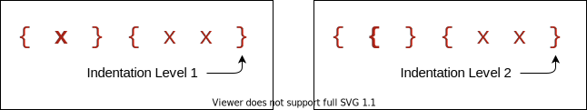
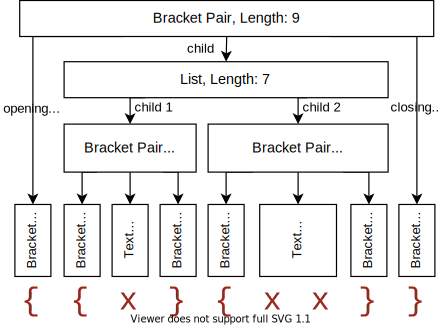
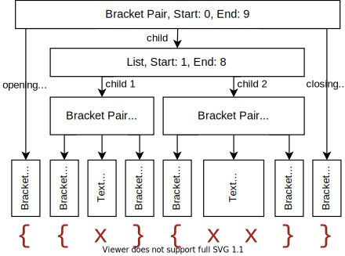
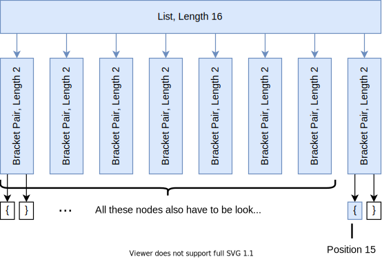
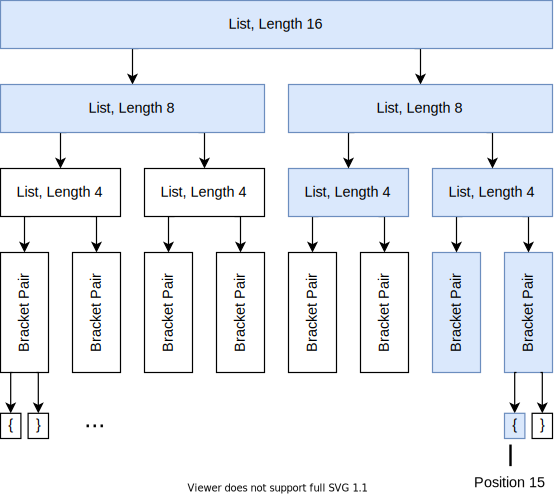
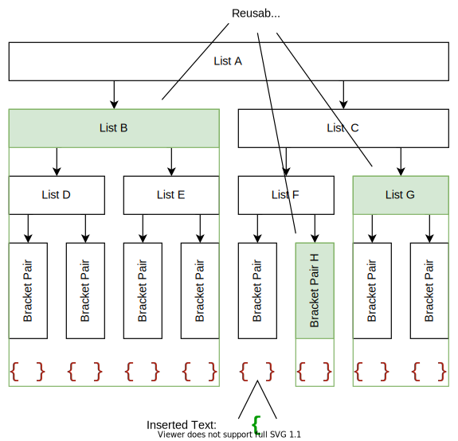
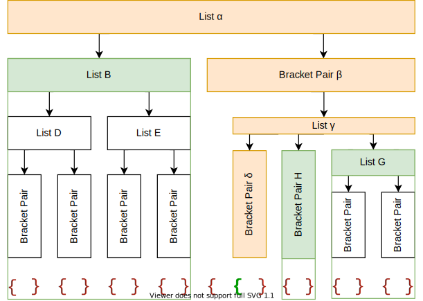
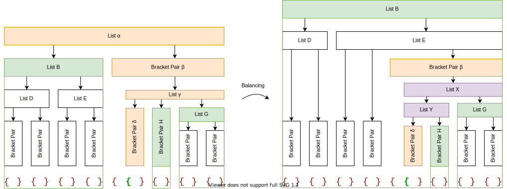

# How We Made Bracket Pair Colorization 10,000x Faster

September 06, 2021 by Henning Dieterichs, [@hediet_dev](https://twitter.com/hediet_dev)

When dealing with deeply nested brackets in VS Code, it can be painful to figure out which brackets match and which do not.

To solve this problem, [ConraadS](https://github.com/CoenraadS) developed the [Bracket Pair Colorizer](https://marketplace.visualstudio.com/items?itemName=CoenraadS.bracket-pair-colorizer) extension and published it in 2016 to the VS Code Marketplace. This extension became very popular and now has over 6 million installs. To address performance and accuracy problems ConraadS followed up with a [Bracket Pair Colorizer 2](https://marketplace.visualstudio.com/items?itemName=CoenraadS.bracket-pair-colorizer-2) which now also has over 3 millions of installs.

The bracket pair colorizer is a good example of the power of VS Code's extensibility and makes heavy use of the VS Code [Decoration API](https://code.visualstudio.com/api/references/vscode-api#TextEditor.setDecorations) to colorize the brackets and to show the scope lines.


We are pleased to see that the VS Code Marketplace offers many more such community-provided extensions, all of which help identify matching bracket pairs in very creative ways (such as [Rainbow Brackets](https://marketplace.visualstudio.com/items?itemName=2gua.rainbow-brackets), [Subtle Match Brackets](https://marketplace.visualstudio.com/items?itemName=rafamel.subtle-brackets), [Bracket Highlighter](https://marketplace.visualstudio.com/items?itemName=Durzn.brackethighlighter), [Blockman](https://marketplace.visualstudio.com/items?itemName=leodevbro.blockman) or [Bracket Lens](https://marketplace.visualstudio.com/items?itemName=wraith13.bracket-lens))!
This variety of extensions shows that there is a real desire by VS Code users to get better support for brackets.

Unfortunately, the original Bracket Pair Colorizer extension has a serious performance problem with large files: When inserting a single bracket at the beginning of the infamous [checker.ts](https://github.com/microsoft/TypeScript/blob/8362a0f929d74ff46828016ec67c05744a8dbb3c/src/compiler/checker.ts) file (which has about 42k lines and a size of 2.5 MB), it takes about 10 seconds until the colors of the bracket pairs update.
During these 10 seconds of processing, the extension host process burns at 100% CPU and all features that are powered by extensions, such as auto-completion or diagnostics, stop functioning. [Thanks to VS Code's architecture however](https://code.visualstudio.com/api/advanced-topics/extension-host#stability-and-performance), the UI remains responsive!

CoenraadS was aware of this and to increase speed and accuracy the version 2 of the extension reused the token and bracket parsing engine from VS Code. However, the performance problem stayed.

Notice how long it takes until the colors reflect the new nesting levels after inserting `{` at the beginning:


While we would have loved to just improve the performance of the existing extension, the asynchronous communication between the renderer and the extension-host severly limits how fast bracket bair colorization can be. In particular, bracket pair colors should not be requested asynchronously as soon as they appear in the viewport, as this would have caused visible flickering. A more detailed analysis of the advantages and disadvantages of each approach can be found [here](https://github.com/microsoft/vscode/issues/128465#issuecomment-879089188).

Instead, we reimplemented the extension in the core of VS Code and brought this time down to less than a millisecond - in this particular example, that is more than 10,000 times faster!

Now, updates are no longer noticeable, even for files with hundreds of thousands of bracket pairs! Notice how the bracket-color in line 42,788 reflects the new nesting level immediately after typing `{` in line 2:


By leveraging (2,3)-trees, recursion-free tree-traversal, bit-arithmetic, incremental parsing and other techniques,
we reduced the extension's update complexity (i.e. the time required to process user-input when a document already has been opened) from $\mathcal{O}(N + E)$ to $\mathcal{O}(\mathrm{log}^3 N + E)$ with $N$ being the document size and $E$ the edit size, assuming the nesting level of bracket pairs is bounded by $\mathcal{O}(\mathrm{log} N)$.
By reusing the existing tokens from the renderer and its incremental token update mechanism, we gain another massive (but constant) speedup.

Another benefit of the new implementation is that bracket pair colorization is now also supported in VS Code for the Web, which you can see in action on [GitHub](https://docs.github.com/en/codespaces/developing-in-codespaces/web-based-editor). The way version 2 of the bracket pair colorizer has reused the VS Code Token engine cannot be supported in VS Code for the Web and it was not possible to migrate the extension to what we now call a ['web extension'](https://code.visualstudio.com/api/extension-guides/web-extensions).
The new implementation does not only work in VS Code for the Web, but also directly in the [monaco editor](https://microsoft.github.io/monaco-editor/)!

## The Challenge Of Bracket Pair Colorization

Bracket pair colorization is all about quickly determining all brackets and their (global) nesting level in the viewport. The viewport can be described as a range in the document in terms of line and column numbers and is usually a tiny fraction of the entire document.

Unfortunately, the nesting level of a bracket depends on *all* characters preceding it: Replacing any character with the opening bracket "`{`" usually increases the nesting level of all following brackets.
Thus, when initially colorizing brackets at the very end of a document, every single character of the entire document has to be processed.



The implementation in the bracket pair colorizer extension addresses this challenge by processing the entire document again whenever a single bracket is inserted or removed. The colors then have to be removed and reapplied using the VS Code [Decoration API](https://code.visualstudio.com/api/references/vscode-api#TextEditor.setDecorations), which sends all color decorations to the renderer.

As demonstrated by the earlier demo, this is slow for large documents with hundreds of thousands of bracket pairs and thus equally many color decorations. Because extensions cannot update decorations incrementally and have to replace them all at once, the bracket pair colorizer extension cannot even do much better. Still, the renderer organizes all these decorations in a very clever way (by using a so called [interval tree](https://github.com/microsoft/vscode/blob/534c529c292a96eb775c74dfcee2d733380ed629/src/vs/editor/common/model/intervalTree.ts)), so rendering is always fast after all (potentially hundreds of thousands of) decorations have been received.

Our goal is not having to reprocess the entire document on each key-stroke. Instead, the time required to process a single text edit should only grow ([poly](https://en.wikipedia.org/wiki/Polylogarithmic_function)) logarithmically with the document length.
However, we still want to be able to query all brackets and their nesting level in the viewport in (poly) logarithmic time, as it would be the case when using VS Code's decoration API!

### Algorithmic Complexities
*Feel free to skip all chapters talking about algorithmic complexity.*
In the following, $N$ refers to the length of the document.
More formally, our goal is to have a time complexity of at most $\mathcal{O}(\mathrm{log}^k N + R)$ for querying all brackets in a given range of size $R$ and a reasonable small $k$ (we aim for $k = 2$). Brackets are queried when rendering the viewport and thus querying them has to be really fast.

However, we allow an initialization time complexity of $\mathcal{O}(N)$ when a document is opened the first time (which is unavoidable due to the lower bound) and an update time of $\mathcal{O}(\mathrm{log}^j N + E)$ when $E$ many characters are modified or inserted, again for a reasonable small $j$ (we aim for $j = 3$). We also assume that the nesting level of a bracket pair is not too deep and at most $\mathcal{O}(\mathrm{log} N)$ and that the number of closing brackets without an opening counterpart is negligible.

### Language Semantics Make Bracket Pair Colorization Hard

What makes bracket pair colorization really difficult is the detection of actual brackets as defined by the document language.
In particular, we don't want to detect opening or closing brackets in comments or strings, as the following C example demonstrates:
```cpp
{ /* } */ char str[] = "}"; }
```
Only the third occurence of "`}`" closes the bracket pair!

This gets even harder for languages where the token language is not regular, such as TypeScript with JSX:


Does the bracket at [1] match the bracket at [2] or at [3]? This depends on the length of the template literal expression, which only a tokenizer with unbounded state (i.e. a non-regular tokenizer) can determine correctly!

### Tokens for the Rescue

Luckily, syntax highlighting has to solve a similar problem: Should the bracket at [2] in the previous code snippet be rendered as string or as plain text?
As it turns out, just ignoring brackets in comments and strings as identified by syntax highlighting works well enough for most bracket pairs! `<` ... `>` is the only problematic pair we found so far, as these brackets are usually both used for comparisons and as pair for generic types, while having the same token type.


VS Code already has an efficient and synchronous mechanism to maintain token information used for syntax highlighting and we can reuse that to identify opening and closing brackets.

This is the another performance culprit of the Bracket Pair Colorization extension: It does not have access to these tokens and has to recompute them on its own. [We thought long](https://github.com/microsoft/vscode/issues/128465#issuecomment-879089188) about how we could efficiently and reliably expose token information to extensions, but came to the conclusion that we cannot do this without a lot of implementation details leaking into the extension API. Because the extension still has to send over a list of all bracket pairs in the document, such an API alone would not even solve the performance problem.

When applying an edit at the beginning of a document that changes all following tokens (such as inserting `/*`), VS Code does not retokenize long documents all at once, but in chunks over time. This ensures that the UI does not freeze.

## The Basic Algorithm

The idea is simple: Use a [recursive decent parser](https://en.wikipedia.org/wiki/Recursive_descent_parser) to build an [abstract syntax tree (AST)](https://en.wikipedia.org/wiki/Abstract_syntax_tree) that describes the structure of all bracket pairs. When a bracket is found, check the token information and skip the bracket if it is in a comment or string. A tokenizer allows the parser to peek and read such bracket or text tokens.

The trick is now to only store the length of each node (and also to have text-nodes for everything that is not a bracket to cover the gaps), instead of storing absolute start/end positions.
With only lengths available, a bracket node at a given position can still be located efficiently in the AST!

The following diagram shows an examplary AST with length annotations:



Compare this with the classical AST representation using absolute start/end positions:



Both ASTs describe the same document, but when traversing the first AST, the absolute positions have to be computed on the fly (which is cheap to do), while they are already precomputed in the second one.
However, when inserting a single character, only the lengths of all parent nodes must be updated. In case of absolute positions, *every* node later in the document must be updated!

Also, by not storing absolute offsets, leaf nodes having the same length can be shared to avoid allocations!

This is how the AST with length annotations could be defined in TypeScript:
```ts
type Length = ...;

type AST = BracketAST | BracketPairAST | ListAST | TextAST;

/** Describes a single bracket, such as `{`, `}` or `begin` */
class BracketAST {
    readonly length: Length;
}

/** Describes a matching bracket pair and the node in between, e.g. `{...}` */
class BracketPairAST {
    openingBacket: BracketAST;
    child: BracketPairAST | ListAST | TextAST;
    closingBracket: BracketAST;

    @cached
    get length() {
        return openingBracket.length + child.length + closingBracket.length;
    }
}

/** Describes a list of bracket pairs or text nodes, e.g. `()...()` */
class ListAST {
    items: Array<BracketPairAST | TextAST>;

    @cached
    get length() { return items.sum(item => item.length); }
}

/** Describes text that has no brackets in it. */
class TextAST {
    readonly length: Length;
}

```

Querying such an AST to list all brackets and their nesting level in the viewport is straightforward:
Do a depth first traversal, compute the absolute position of the current node on the fly (by adding the length of earlier nodes) and skip children of nodes that are entirely before or after the requested range.

This basic algorithm is correct, but has some open questions:
1) How do we make sure that querying all brackets in a given range has the desired logarithmic performance?
2) When typing, how do we avoid constructing a new AST from scratch?
3) How do we handle token chunk updates? When opening a large document, tokens are not available initially, but come in chunk by chunk.

## Ensuring that Query-Time is Logarithmic

What ruins performance when querying brackets in a given range are really long lists: We cannot do a binary search on their children to skip all non-intersecting nodes, as we need to sum each node's length to compute the absolute position on the fly. In the worst-case, we need to iterate over all of them. In the following example we have to look at 10 nodes (in blue) until we find the bracket that contains position 15:



While we could compute and cache these length sums to enable binary search (and end up with absolute offsets again), we would need to recompute all of them every time a single node grows or shrinks, which is also costly for very long lists.
Instead, we allow lists to have other lists as children:

```ts
class ListAST {
    items: Array<ListAST | BracketPairAST | TextAST>;

    @cached
    get length() { return items.sum(item => item.length); }
}
```

If we can ensure that each list only has a bounded amount of children and resembles a balanced tree of logarithmic height, with lists as internal nodes and non-list nodes as leaves, it turns out that this is sufficient to get the desired logarithmic performance for querying brackets!
Note that a bracket pair is a leaf in a balanced tree, but not in the full AST.


### Keeping List Trees Balanced

We use [(2,3)-trees](https://en.wikipedia.org/wiki/2%E2%80%933_tree) to enforce that these lists are balanced: Every list must have at least 2 and at most 3 children and all children of a list must have the same height in the balanced tree.
When constructing the AST from scratch during initialization, we first collect all children and then convert them to such a balanced tree. This is easy to do in linear time!

A possible (2,3)-tree of the example before could look like the following. Note that we only need to look at 8 nodes (in blue) to find the bracket pair at position 15:




### Worst-Case Analysis

// TODO: From here, Alex feedback is not incorporated yet

For now, we assume that every list resembles a balanced tree and has at most 3 children.

To maximize the query-time, we have a look at a document of size $N$ that has $\mathcal{O}(\mathrm{log} N)$ () many nested bracket pairs:


In the worst-case, a document of size $N$ has $\mathcal{O}(\mathrm{log} N)$ many nested bracket pairs that each again contain $\mathcal{O}(\frac{N}{\mathrm{log} N})$ many bracket pairs:

```
{}{}{}{}{}{}{}{}... O(N / log N) many
{
    {}{}{}{}{}{}{}{}... O(N / log N) many
    {
        {}{}{}{}{}{}{}{}... O(N / log N) many
        {
            ... O(log N) many nested bracket pairs
            [1]
            ...
        }
    }
}
```
To find the node at [1], we have to traverse $\mathcal{O}(\mathrm{log} N)$ many balanced trees of height $\mathcal{O}(\mathrm{log} \frac{N}{\mathrm{log} N}) = \mathcal{O}(\mathrm{log} N - \mathrm{log}\;\mathrm{log} N ) \subseteq \mathcal{O}(\mathrm{log} N)$. Once we found the node and want to collect all brackets in a range of size $R$, we have to read at most $\mathcal{O}(R)$ more adjacent leaf nodes connected by at most $\mathcal{O}(R + \mathrm{log}^2 N)$ internal nodes.
Thus, the worst-case time-complexity is $\mathcal{O}(R + \mathrm{log}^2 N)$.

## Incremental Updates

The most interesting question of performant bracket pair colorization remains open:
Given the current (balanced) AST and a text edit that replaces a range of size less than $E$ with up to $E$ many new characters, how do we update the tree to reflect the text edit in time $\mathcal{O}(E + \mathrm{log}^3 N)$?

The idea is to reuse the recursive decent parser used for initialization and add a caching strategy, so that nodes which aren't affected by the text edit can be reused and skipped. When the recursive decent parser parses a list of bracket pairs at position $p$ and the next edit is at position $e$, it first checks if the previous AST has a node with a length of at most $e - p$ at the position where $p$ used to be before the text change. If this is the case, this node does not need to be reparsed and the underlying tokenizer can be advanced by the length of the node. After consuming the node, parsing continues. Note that this node can both be a single bracket pair or an entire list!

The following example shows which nodes can be reused when a single opening bracket is inserted (omitting individual bracket nodes):



After processing the text edit by reparsing the nodes that contain edits and reusing all unchanged nodes, the updated AST looks as follows. Note that 3 nodes could be reused (in green, with a total of 8 children) and only 4 nodes had to be recreated (in orange):



As demonstrated by this example, balanced lists do not only make querying fast, but also help to reuse huge chunks of nodes at once.

We only have to reparse nodes that intersect the edit range (except in the rare case of closing brackets that have no opening counterpart, which we ignore for now). Thus, at most $\mathcal{O}(E + \mathrm{log}^2 N)$ many nodes need to be reparsed (with the same reasoning as for the time-complexity of querying brackets).
Because nodes have at most 3 children, we can construct the new AST from $\mathcal{O}(E + \mathrm{log}^2 N)$ many reparsed nodes and $\mathcal{O}(2 \cdot (E + \mathrm{log}^2 N)) = \mathcal{O}(E + \mathrm{log}^2 N)$ many adjacent reusable nodes.

### How do we rebalance the AST?

Unfortunately, the tree in the last example is not balanced anymore.
When combining a reused list node with a newly parsed node, we have to do some work to maintain the (2,3)-tree property. We know that both reused and newly parsed nodes are already (2,3)-trees, but they might have different heights - so we cannot just create parent nodes, since all children of a (2,3)-tree node have to have same height.

How can we efficiently concatenize all these nodes of mixed heights into a single (2,3)-tree?
This can easily be reduced to the problem of prepending or appending a smaller tree to a larger tree.
If two trees have the same height, it is sufficient to create a list that contains both children.
Otherwise, we insert the smaller tree of height $h_1$ into the larger tree of height $h_2$ and potentially break up nodes if they end up having more than 3 children (similar to how the insert operation of (2,3)-trees works). Because this has runtime $\mathcal{O}(h_2 - h_1)$, we take 3 adjacent nodes ($a$, $b$ and $c$) that we want to concatenize and concatenize either $a$ and $b$ or $b$ and $c$ first (potentially increasing the height of the tree), depending on which pair has the smaller height difference. This is repeated until all nodes are concatenized. As an additional optimization, we look for sequences of nodes that have the same height and create parent lists for them in linear time.

To balance the lists α and γ of the previous example, we perform the concat operation on their children:



Because list B has height 3 and bracket pair β height 0 in the unbalanced tree, we need to append β to B and are finished with list α. The remaining (2,3)-tree is B, thus it becomes the new root and replaces list α. Continuing with γ, its children δ and H have height 0, while G has height 1.
We first concat δ and H and create a new parent node Y of height 1 (because δ and H have the same height). Then we concat Y and G and create a new parent list X (for the same reason). X then becomes the new child of the parent bracket pair, replacing the unbalanced list γ.

We have to concatenize at most $\mathcal{O}(\mathrm{log}^2 N)$ many nodes with a maximum height of $\mathcal{O}(\mathrm{log} N)$ and additional $\mathcal{O}(E)$ many nodes of height 0. Because concatenizing two nodes of different height has time-complexity $\mathcal{O}(\mathrm{log} N)$ and all new nodes in a list are adjacent and have height 0, the time-complexity of the entire update operation is at most $\mathcal{O}(E + \mathrm{log}^3 N)$, given that finding a reusable node can be done fast enough.

### How do we find reusable nodes efficiently?

We have two data structures for this task: The *before edit position mapper* and the *node reader*.

The [position mapper](https://github.com/microsoft/vscode/blob/f8e9f87b6554b527c61ba963d0c96c7687cbaae9/src/vs/editor/common/model/bracketPairColorizer/beforeEditPositionMapper.ts#L17) maps a position in the new document (after applying the edit) to the old document (before applying the edit), if possible. It also tells us the length between the current position and the next edit (or 0, if we are in an edit). This is done in $\mathcal{O}(1)$.
When processing a text edit and parsing a node, this component gives us the position of a node that we can potentially reuse and the maximum length this node can have - clearly, the node we want to reuse must be shorter than the distance to the next edit.

The [node reader](https://github.com/microsoft/vscode/blob/f8e9f87b6554b527c61ba963d0c96c7687cbaae9/src/vs/editor/common/model/bracketPairColorizer/nodeReader.ts#L13) allows to quickly find the longest node that satisfies a given predicate at a given position in an AST. To find a node we can reuse, we use the position mapper to look up its old position and its maximum allowed length and then use the node reader to find this node. If we found such a node, we know that it did not change and can reuse it and skip its length.

Because the node reader is queried with monotonously increasing positions, it does not have to start searching from scratch every time, but can do so from the end of the last reused node. Key to this is a recursion-free tree-traversal algorithm that can dive into nodes, but also skip them or go back to parent nodes. When a reusable node is found, traversal stops and continues with the next request to the node reader.

The complexity of querying the node reader a single time is up to $\mathcal{O}(\mathrm{log}^2 N)$,
but we are very sure the amortized complexity for all requests issued by a single update operation is also $\mathcal{O}(\mathrm{log}^2 N)$.
After all, the node reader is only queried for positions unaffected by the text edit and always takes the shortest path from the last reusable node to the next reusable node. Thus, we think the node reader is efficient enough to not impact the runtime complexity of the update algorithm.

## Token Updates

When inserting `/*` at the beginning of long C-style documents that don't contain the text `*/`, the entire document becomes a single comment and all tokens change.
Because tokens are computed synchronously in the renderer process, retokenization cannot happen at once without freezing the UI.
Instead, tokens are updated in batches over time, so that the JavaScript event loop is not blocked for too long. While this approach does not reduce the total blocking time, it improves the responsiveness of the UI during the update. The same mechanism is also used when initially tokenizing a document.

Fortunately, due to the incremental update mechanism of the bracket pair AST, we can immediately apply such a batched token update by treating the update as a single text edit that replaces the range that got retokenized with itself. Once all token updates came in, the bracket pair AST is guaranteed to be in the same state as if it had been created from scratch - even if the user edits the document while retokenization is in progress!

That way, not only tokenization is performant even if all tokens in the document change, but also bracket pair colorization.

However, when a document contains a lot of unbalanced brackets in comments, the color of brackets at the end of the document might flicker as the bracket pair parsers learns that these brackets should be treated as plain text.
To avoid flickering of bracket pair colors when opening a document and navigating to its end, we maintain two bracket pair ASTs until the initial tokenization process completes.
The first AST is built without token information and does not receive token updates. The second one initially is a clone of the first AST, but receives token updates and diverges more and more as tokenization progresses and token updates are applied. Initially, the first AST is used to query brackets, but the second one takes over once the document is fully tokenized.

Because deep cloning is almost as expensive as reparsing the document, we implemented copy-on-write, enabling cloning in $\mathcal{O}(1)$.

## Encoding Of Lengths

The editor view describes the viewport with line and column numbers.
Color-decorations are also expected to be expressed as line/column based ranges.
To avoid conversions between offset and line/column based positions (which can be done in $\mathcal{O}(\mathrm{log} N)$),
we use line/column based lengths for the AST too.
Note that this approach is significantly different from data structures that are directly indexed by lines (such as using a string array to describe the line contents of a document). In particular, this approach allows to do a single binary search across and within lines.

Adding two such lengths is easy, but requires a case distinction: While the line counts are added directly, the column count of the first length is only included if the second length spans zero lines.

Surprisingly, most of the code does not need to be aware of how lengths are represented. Only the position mapper got significantly more complex, since care had to be taken that a single line can contain multiple text edits.

As an implementation detail, we encode such lengths in a single number to reduce memory pressure. JavaScript supports integers up to $2^{53} - 1$, so we can use up to 26 bits each for the number of lines and columns.
Unfortunately, v8 stores numbers larger than $2^{31}$ [on the heap](https://v8.dev/blog/react-cliff#smi-heapnumber-mutableheapnumber), so this encoding trick did not turn out as effective as we thought.

## Further Difficulties: Unclosed Bracket Pairs

So far, we assumed that all bracket pairs are balanced. However, we also want to support unclosed and unopened bracket pairs.
The beauty of a recursive-decent parser is that we can use anchor sets to improve error recovery.

Consider the following example:
```
( [1]
} [2]
) [3]
```

Clearly `}` at [2] does not close any bracket pair and represents an unopened bracket. The brackets at [1] and [3] match nicely.
However, when inserting `{` at the beginning of the document, the situation changes:
```
{ [0]
( [1]
} [2]
) [3]
```
Now, [0] and [2] should be matched, while [1] is an unclosed bracket and [3] an unopened bracket.

In particular, [1] should be an unclosed bracket terminating before [2] in the following example:
```
{
    ( [1]
} [2]
{}
```

Otherwise, opening a parenthesis could change the nesting-level of unrelated following bracket pairs.

To support this kind of error recovery, anchor sets can be used to track the set of expected tokens the caller can continue with. At position [1] in the previous example, the anchor set would be $\{$ `}` $\}$. Thus, when parsing the bracket pair at [1] finds the unexpected bracket `}` at [2], it does not consume it and returns an unclosed bracket pair.
In the very first example, the anchor set at [2] is $\{$ `)` $\}$, but the unexpected character is `}`. Because it is not part of the anchor set, it is reported as unopened bracked.

This needs to be considered when reusing nodes: The pair `( } )` cannot be reused when prepending it with `{`! We use bit-sets to encode anchor sets and compute the set of containing unopened brackets for every node. If they intersect, we cannot reuse the node. Luckily, there are only a few bracket types, so this does not affect performance too much.

## Outlook

Efficient bracket pair colorization was a fun challenge. With the new data structures, we can also solve other problems related to bracket pairs more efficiently, such as [general bracket matching](https://code.visualstudio.com/docs/editor/editingevolved#_bracket-matching) or [showing colored line scopes](https://github.com/microsoft/vscode/issues/131001).

Even though JavaScript might not be the best language to write high performant code, a lot of speed can be gained by reducing asymptotic algorithmic complexity, especially when dealing with large inputs!


Happy Coding!

Henning Dieterichs, VS Code Team member [@hediet_dev](https://twitter.com/hediet_dev)