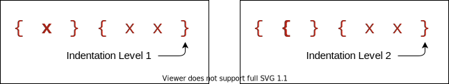
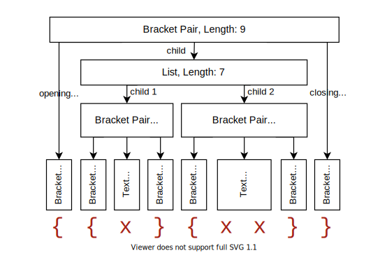
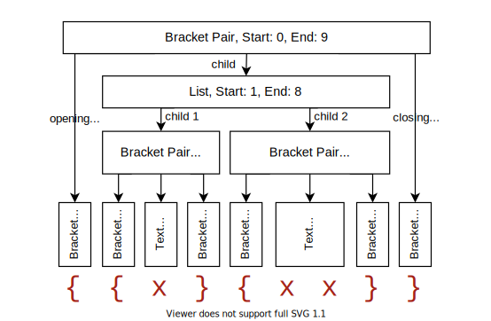
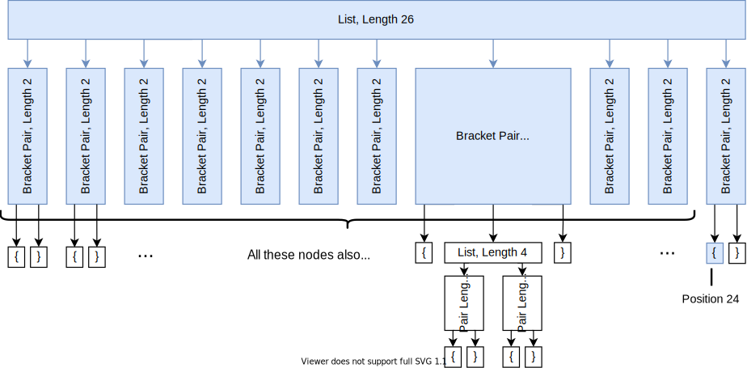
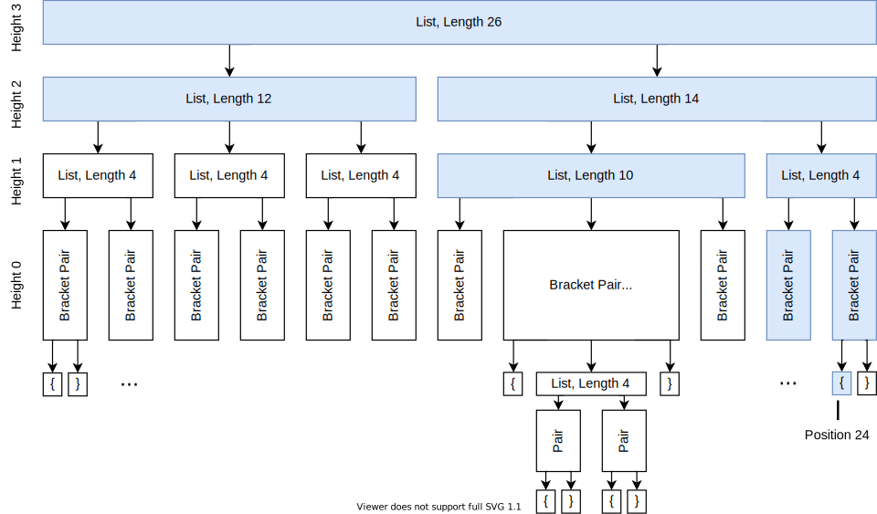
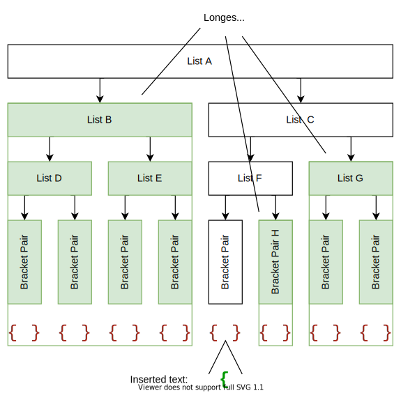
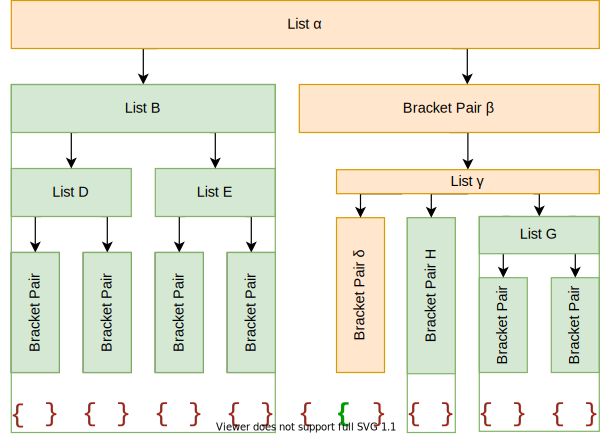
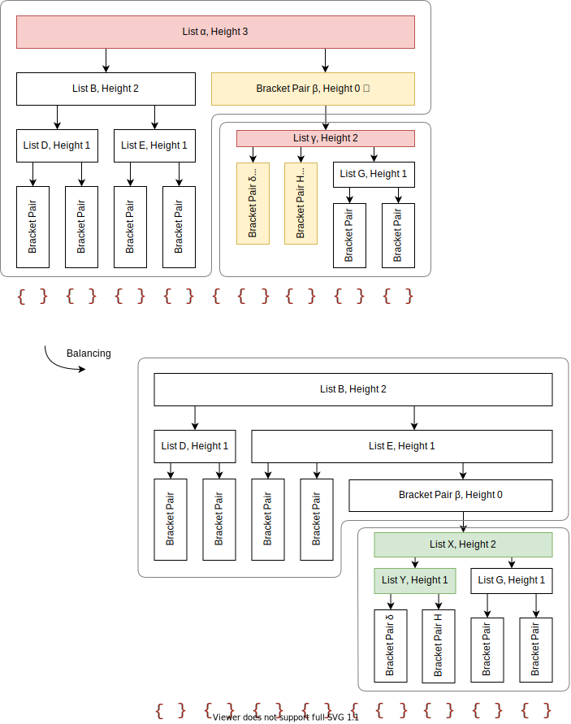

# Bracket pair colorization 10,000x faster

September 29, 2021 by Henning Dieterichs, [@hediet_dev](https://twitter.com/hediet_dev)

When dealing with deeply nested brackets in Visual Studio Code, it can be hard to figure out which brackets match and which do not.

To make this easier, in 2016, a user named CoenraadS developed the awesome [Bracket Pair Colorizer](https://marketplace.visualstudio.com/items?itemName=CoenraadS.bracket-pair-colorizer) extension to colorize matching brackets and published it to the VS Code Marketplace. This extension became very popular and now is one of the 10 most downloaded extensions on the Marketplace, with over 6 million installs.

To address performance and accuracy problems, in 2018, CoenraadS followed up with [Bracket Pair Colorizer 2](https://marketplace.visualstudio.com/items?itemName=CoenraadS.bracket-pair-colorizer-2), which now also has over 3 millions of installs.

The Bracket Pair Colorizer extension is a good example of the power of VS Code's extensibility and makes heavy use of the [Decoration API](https://code.visualstudio.com/api/references/vscode-api#TextEditor.setDecorations) to colorize brackets.


We are pleased to see that the VS Code Marketplace offers many more such community-provided extensions, all of which help identify matching bracket pairs in very creative ways, including: [Rainbow Brackets](https://marketplace.visualstudio.com/items?itemName=2gua.rainbow-brackets), [Subtle Match Brackets](https://marketplace.visualstudio.com/items?itemName=rafamel.subtle-brackets), [Bracket Highlighter](https://marketplace.visualstudio.com/items?itemName=Durzn.brackethighlighter), [Blockman](https://marketplace.visualstudio.com/items?itemName=leodevbro.blockman), and [Bracket Lens](https://marketplace.visualstudio.com/items?itemName=wraith13.bracket-lens).
This variety of extensions shows that there is a real desire by VS Code users to get better support for brackets.

### The performance problem

Unfortunately, the non-incremental nature of the Decoration API and missing access to VS Code's token information causes the Bracket Pair Colorizer extension to be slow on large files: when inserting a single bracket at the beginning of the [checker.ts](https://github.com/microsoft/TypeScript/blob/8362a0f929d74ff46828016ec67c05744a8dbb3c/src/compiler/checker.ts) file of the TypeScript project, which has more than 42k lines of code, it takes about 10 seconds until the colors of all bracket pairs update.
During these 10 seconds of processing, the extension host process burns at 100% CPU and all features that are powered by extensions, such as auto-completion or diagnostics, stop functioning. Luckily, [VS Code's architecture](https://code.visualstudio.com/api/advanced-topics/extension-host#stability-and-performance)
ensures that the UI remains responsive and documents can still be saved to disk.

CoenraadS was aware of this performance issue and spent a great amount of effort on increasing speed and accuracy in version 2 of the extension, by reusing the token and bracket parsing engine from VS Code. However, VS Code's API and extension architecture was not designed to allow for high performance bracket pair colorization when hundreds of thousands of bracket pairs are involved. Thus, even in Bracket Pair Colorizer 2, it takes some time until the colors reflect the new nesting levels after inserting `{` at the beginning of the file:


While we would have loved to just improve the performance of the extension (which certainly would have required introducing more advanced APIs, optimized for high-performance scenarios), the asynchronous communication between the renderer and the extension-host severely limits how fast bracket pair colorization can be when implemented as an extension. This limit cannot be overcome.
In particular, bracket pair colors should not be requested asynchronously as soon as they appear in the viewport, as this would have caused visible flickering when scrolling through large files. A discussion of this can be found in [issue #128465](https://github.com/microsoft/vscode/issues/128465#issuecomment-879089188).

### What we did

Instead, [in the 1.60 update](https://code.visualstudio.com/updates/v1_60#_high-performance-bracket-pair-colorization), we reimplemented the extension in the core of VS Code and brought this time down to less than a millisecond - in this particular example, that is more than 10,000 times faster.

The feature can be enabled by adding the setting `"editor.bracketPairColorization.enabled": true`.

Now, updates are no longer noticeable, even for files with hundreds of thousands of bracket pairs. Notice how the bracket-color in line 42,788 reflects the new nesting level immediately after typing `{` in line 2:


Once we decided we move it into core, we also took the opportunity to look into how to make it as fast as we can. Who wouldn’t love an algorithmic challenge?

Without being limited by public API design, we could use (2,3)-trees, recursion-free tree-traversal, bit-arithmetic, incremental parsing, and other techniques to reduce the extension's worst-case update [time-complexity](https://en.wikipedia.org/wiki/Time_complexity) (that is the time required to process user-input when a document already has been opened) from $\mathcal{O}(N + E)$ to $\mathcal{O}(\mathrm{log}^3 N + E)$ with $N$ being the document size and $E$ the edit size, assuming the nesting level of bracket pairs is bounded by $\mathcal{O}(\mathrm{log} N)$.

Additionally, by reusing the existing tokens from the renderer and its incremental token update mechanism, we gained another massive (but constant) speedup.

### VS Code for the Web

Besides being more performant, the new implementation is also supported in [VS Code for the Web](https://code.visualstudio.com/docs/editor/vscode-web), which you can see in action with [vscode.dev](https://vscode.dev) and  [github.dev](https://docs.github.com/codespaces/the-githubdev-web-based-editor). Due to the way Bracket Pair Colorizer 2 reuses the VS Code token engine, it was not possible to migrate the extension to be what we call a [web extension](https://code.visualstudio.com/api/extension-guides/web-extensions).

Not only does our new implementation work in VS Code for the Web, but also directly in the [Monaco Editor](https://microsoft.github.io/monaco-editor/)!

## The challenge of bracket pair colorization

Bracket pair colorization is all about quickly determining all brackets and their (absolute) nesting level in the viewport. The viewport can be described as a range in the document in terms of line and column numbers and is usually a tiny fraction of the entire document.

Unfortunately, the nesting level of a bracket depends on *all* characters preceding it: replacing any character with the opening bracket "`{`" usually increases the nesting level of all following brackets.

Thus, when initially colorizing brackets at the very end of a document, every single character of the entire document has to be processed.



The implementation in the bracket pair colorizer extension addresses this challenge by processing the entire document again whenever a single bracket is inserted or removed (which is very reasonable to do for small documents). The colors then have to be removed and reapplied using the VS Code [Decoration API](https://code.visualstudio.com/api/references/vscode-api#TextEditor.setDecorations), which sends all color decorations to the renderer.

As demonstrated earlier, this is slow for large documents with hundreds of thousands of bracket pairs and thus equally many color decorations. Because extensions cannot update decorations incrementally and have to replace them all at once, the bracket pair colorizer extension cannot even do much better. Still, the renderer organizes all these decorations in a clever way (by using a so called [interval tree](https://github.com/microsoft/vscode/blob/534c529c292a96eb775c74dfcee2d733380ed629/src/vs/editor/common/model/intervalTree.ts)), so rendering is always fast after (potentially hundreds of thousands of) decorations have been received.

Our goal is not having to reprocess the entire document on each key-stroke. Instead, the time required to process a single text edit should only grow ([poly](https://en.wikipedia.org/wiki/Polylogarithmic_function)) logarithmically with the document length.

However, we still want to be able to query all brackets and their nesting level in the viewport in (poly) logarithmic time, as it would be the case when using VS Code's decoration API (which uses the mentioned interval tree).

### Algorithmic complexities

> Feel free to skip the sections on algorithmic complexities.

In the following, $N$ refers to the length of the document.
More formally, our goal is to have a time complexity of at most $\mathcal{O}(\mathrm{log}^k N + R)$ for querying all brackets in a given range of size $R$ and a reasonable small $k$ (we aim for $k = 2$). Brackets are queried when rendering the viewport and thus querying them has to be really fast.

However, we allow an initialization time complexity of $\mathcal{O}(N)$ when a document is opened the first time (which is unavoidable, as all characters have to be processed when initially colorizing brackets) and an update time of $\mathcal{O}(\mathrm{log}^j N + E)$ when $E$ many characters are modified or inserted, again for a reasonable small $j$ (we aim for $j = 3$). We also assume that the nesting level of a bracket pair is not too deep and at most $\mathcal{O}(\mathrm{log} N)$ and that the number of closing brackets without an opening counterpart is negligible - documents violating these assumptions are atypical and the algorithm we are looking for does not need to be fast on them.

### Language semantics make bracket pair colorization hard

What makes bracket pair colorization really difficult is the detection of actual brackets as defined by the document language. In particular, we don't want to detect opening or closing brackets in comments or strings, as the following C example demonstrates:

```cpp
{ /* } */ char str[] = "}"; }
```

Only the third occurrence of "`}`" closes the bracket pair.

This gets even harder for languages where the token language is not regular, such as TypeScript with JSX:


Does the bracket at [1] match the bracket at [2] or at [3]? This depends on the length of the template literal expression, which only a tokenizer with unbounded state (which is a non-regular tokenizer) can determine correctly.

### Tokens to the rescue

Luckily, syntax highlighting has to solve a similar problem: should the bracket at [2] in the previous code snippet be rendered as string or as plain text?

As it turns out, just ignoring brackets in comments and strings as identified by syntax highlighting works well enough for most bracket pairs.
`<` ... `>` is the only problematic pair we found so far, as these brackets are usually both used for comparisons and as pair for generic types, while having the same token type.

VS Code already has an efficient and synchronous mechanism to maintain token information used for syntax highlighting and we can reuse that to identify opening and closing brackets.

This is another challenge of the Bracket Pair Colorization extension that affects performance negatively: it does not have access to these tokens and has to recompute them on its own. [We thought long](https://github.com/microsoft/vscode/issues/128465#issuecomment-879089188) about how we could efficiently and reliably expose token information to extensions, but came to the conclusion that we cannot do this without a lot of implementation details leaking into the extension API. Because the extension still has to send over a list of color decorations for each bracket in the document, such an API alone would not even solve the performance problem.

As a side note, when applying an edit at the beginning of a document that changes all following tokens (such as inserting `/*` for C-like languages), VS Code does not retokenize long documents all at once, but in chunks over time. This ensures that the UI does not freeze, even though tokenization happens synchronously in the renderer.

## The basic algorithm

The core idea is to use a [recursive descent parser](https://en.wikipedia.org/wiki/Recursive_descent_parser) to build an [abstract syntax tree (AST)](https://en.wikipedia.org/wiki/Abstract_syntax_tree) that describes the structure of all bracket pairs. When a bracket is found, check the token information and skip the bracket if it is in a comment or string. A tokenizer allows the parser to peek and read such bracket or text tokens.

The trick is now to only store the length of each node (and also to have text-nodes for everything that is not a bracket to cover the gaps), instead of storing absolute start/end positions. With only lengths available, a bracket node at a given position can still be located efficiently in the AST.

The following diagram shows an exemplary AST with length annotations:



Compare this with the classical AST representation using absolute start/end positions:



Both ASTs describe the same document, but when traversing the first AST, the absolute positions have to be computed on the fly (which is cheap to do), while they are already precomputed in the second one.

However, when inserting a single character into the first tree, only the lengths of the node itself and all its parent nodes must be updated - all other lengths stay the same.

When absolute positions are stored as in the second tree, the position of *every* node later in the document must be incremented.

Also, by not storing absolute offsets, leaf nodes having the same length can be shared to avoid allocations.

This is how the AST with length annotations could be defined in TypeScript:

```ts
type Length = ...;

type AST = BracketAST | BracketPairAST | ListAST | TextAST;

/** Describes a single bracket, such as `{`, `}` or `begin` */
class BracketAST {
    constructor(public length: Length) {}
}

/** Describes a matching bracket pair and the node in between, e.g. `{...}` */
class BracketPairAST {
    constructor(
        public openingBracket: BracketAST;
        public child: BracketPairAST | ListAST | TextAST;
        public closingBracket: BracketAST;
    ) {}

    length = openingBracket.length + child.length + closingBracket.length;
}

/** Describes a list of bracket pairs or text nodes, e.g. `()...()` */
class ListAST {
    constructor(
        public items: Array<BracketPairAST | TextAST>
    ) {}

    length = items.sum(item => item.length);
}

/** Describes text that has no brackets in it. */
class TextAST {
    constructor(public length: Length) {}
}
```

Querying such an AST to list all brackets and their nesting level in the viewport is relatively simple: do a depth-first traversal, compute the absolute position of the current node on the fly (by adding the length of earlier nodes), and skip children of nodes that are entirely before or after the requested range.

This basic algorithm already works, but has some open questions:

1. How can we make sure that querying all brackets in a given range has the desired logarithmic performance?
2. When typing, how can we avoid constructing a new AST from scratch?
3. How can we handle token chunk updates? When opening a large document, tokens are not available initially, but come in chunk by chunk.

## Ensuring that query-time is logarithmic

What ruins performance when querying brackets in a given range are really long lists: we cannot do a fast binary search on their children to skip all irrelevant non-intersecting nodes, as we need to sum each node's length to compute the absolute position on the fly. In the worst-case, we need to iterate over all of them.

In the following example we have to look at 13 nodes (in blue) until we find the bracket at position 24:



While we could compute and cache length sums to enable binary search, this has the same problem as storing absolute positions: we would need to recompute all of them every time a single node grows or shrinks, which is costly for very long lists.

Instead, we allow lists to have other lists as children:

```ts
class ListAST {
    constructor(
        public items: Array<ListAST | BracketPairAST | TextAST>
    ) {}

    length = items.sum(item => item.length);
}
```

How does that improve the situation?

If we can ensure that each list only has a bounded number of children and resembles a balanced tree of logarithmic height, it turns out that this is sufficient to get the desired logarithmic performance for querying brackets.

### Keeping list trees balanced

We use [(2,3)-trees](https://en.wikipedia.org/wiki/2%E2%80%933_tree) to enforce that these lists are balanced: every list must have at least 2 and at most 3 children, and all children of a list must have the same height in the balanced list tree. Note that a bracket pair is considered a leaf of height 0 in the balanced tree, but it might have children in the AST.

When constructing the AST from scratch during initialization, we first collect all children and then convert them to such a balanced tree. This can be done in linear time.

A possible (2,3)-tree of the example before could look like the following. Note that we now only need to look at 8 nodes (in blue) to find the bracket pair at position 24 and that there is some freedom whether a list has 2 or 3 children:



### Worst-case complexity analysis

> Feel free to skip the sections on algorithmic complexities.

For now, we assume that every list resembles a (2,3)-tree and thus has at most 3 children.

To maximize query-time, we have a look at a document that has $\mathcal{O}(\mathrm{log} N)$ many nested bracket pairs:

```
{
    {
        ... O(log N) many nested bracket pairs
            {
                {} [1]
            }
        ...
    }
}
```

No lists are involved yet, but we already need to traverse $\mathcal{O}(\mathrm{log} N)$ many nodes to find the bracket pair at [1]. Luckily, documents that are nested even deeper are atypical, so we don't consider them in our worst-case analysis.

Now, for the worst-case, we fill up the document until it has size $N$ by inserting additional $\mathcal{O}(\frac{N}{\mathrm{log} N})$ many bracket pairs into every nested bracket pair:

```
{}{}{}{}{}{}{}{}... O(N / log N) many
{
    {}{}{}{}{}{}{}{}... O(N / log N) many
    {
        ... O(log N) many nested bracket pairs
            {
                {}{}{}{}{}{}{}{}... O(N / log N) many
                {} [1]
            }
        ...
    }
}
```

Every list of brackets on the same nesting-level yields a tree of height $\mathcal{O}(\mathrm{log} \frac{N}{\mathrm{log} N}) = \mathcal{O}(\mathrm{log} N - \mathrm{log}\;\mathrm{log} N ) = \mathcal{O}(\mathrm{log} N)$.

Thus, to find the node at [1], we have to traverse $\mathcal{O}(\mathrm{log} N)$ many balanced trees of height $\mathcal{O}(\mathrm{log} N)$. Once we found the node and want to collect all brackets in a range of size $R$, we have to read at most $\mathcal{O}(R)$ more adjacent leaf nodes connected by at most $\mathcal{O}(\mathrm{log}^2 N + R)$ internal nodes.

Thus, the worst-case time-complexity of querying brackets is $\mathcal{O}(\mathrm{log}^2 N + R)$.

Also, this shows that the AST has a maximum height of $\mathcal{O}(\mathrm{log}^2 N)$.

## Incremental updates

The most interesting question of performant bracket pair colorization remains open: given the current (balanced) AST and a text edit that replaces a certain range, how do we efficiently update the tree to reflect the text edit?

The idea is to reuse the recursive descent parser used for initialization and add a caching strategy, so nodes that aren't affected by the text edit can be reused and skipped.

When the recursive descent parser parses a list of bracket pairs at position $p$ and the next edit is at position $e$, it first checks if the previous AST has a node with a length of at most $e - p$ at the position where $p$ used to be before the text change. If this is the case, this node does not need to be reparsed and the underlying tokenizer can just be advanced by the length of the node. After consuming the node, parsing continues. Note that this node can both be a single bracket pair or an entire list. Also, if there are multiple such reusable nodes, the longest one should be taken.

The following example shows which nodes can be reused (in green) when a single opening bracket is inserted (omitting individual bracket nodes):



After processing the text edit by reparsing the nodes that contain edits and reusing all unchanged nodes, the updated AST looks as follows. Note that all 11 reusable nodes can be reused by consuming the 3 nodes B, H and G and only 4 nodes had to be recreated (in orange):



As demonstrated by this example, balanced lists do not only make querying fast, but also help to reuse huge chunks of nodes at once.

### Algorithmic complexity

> Feel free to skip the sections on algorithmic complexities.

Let's assume that the text edit replaces a range of size up to $E$ with up to $E$ many new characters. We also ignore the rare case of closing brackets that have no opening counterpart for now.

We only have to reparse nodes that intersect the edit range. Thus, at most $\mathcal{O}(\mathrm{log}^2 N + E)$ many nodes need to be reparsed (with the same reasoning as for the time-complexity of querying brackets) - all other nodes can be reused.

Clearly, if a node does not intersect with the edit range, then neither does any of its children. Thus, we only need to consider reusing nodes that don't intersect with the edit range, but whose parent nodes do (this will implicitly reuse all nodes where both the node and its parent do not intersect with the edit range). Also, such parent nodes cannot be fully covered by the edit range, otherwise all of their children will intersect the edit range. However, every level in the AST only has at most two nodes that partially intersect the edit range. Since an AST has at most $\mathcal{O}(\mathrm{log}^2 N)$ many levels (limited by the height of the AST), and every node has at most 3 children, all reusable nodes can be covered by consuming at most $\mathcal{O}(2 \cdot 3 \cdot \mathrm{log}^2 N) = \mathcal{O}(\mathrm{log}^2 N)$ nodes.

Thus, to construct the updated tree, we need to reparse at most $\mathcal{O}(\mathrm{log}^2 N + E)$ many nodes and can reuse $\mathcal{O}(\mathrm{log}^2 N)$ many nodes.

This would also determine the time complexity of the update operation, but there is a caveat.

### How do we rebalance the AST?

Unfortunately, the tree in the last example is not balanced anymore.

When combining a reused list node with a newly parsed node, we have to do some work to maintain the (2,3)-tree property. We know that both reused and newly parsed nodes are already (2,3)-trees, but they might have different heights - so we cannot just create parent nodes, since all children of a (2,3)-tree node have to have same height.

How can we efficiently concatenate all these nodes of mixed heights into a single (2,3)-tree?

This can easily be reduced to the problem of prepending or appending a smaller tree to a larger tree: if two trees have the same height, it is sufficient to create a list that contains both children. Otherwise, we insert the smaller tree of height $h_1$ into the larger tree of height $h_2$ and potentially break up nodes if they end up having more than 3 children (similar to how the insert operation of (2,3)-trees works).

Because this has runtime $\mathcal{O}(h_2 - h_1)$, we take 3 adjacent nodes ($a$, $b$, and $c$) that we want to concatenate and concatenate either $a$ and $b$ or $b$ and $c$ first (potentially increasing the height of the tree), depending on which pair has the smaller height difference. This is repeated until all nodes are concatenated. As an additional optimization, we look for sequences of nodes that have the same height and create parent lists for them in linear time.

To balance the lists α and γ of the previous example, we perform the concat operation on their children (lists in red violate the (2,3)-tree property, nodes in orange have unexpected height and nodes in green are recreated while rebalancing):



Because list B has height 2 and bracket pair β height 0 in the unbalanced tree, we need to append β to B and are finished with list α. The remaining (2,3)-tree is B, thus it becomes the new root and replaces list α. Continuing with γ, its children δ and H have height 0, while G has height 1.

We first concat δ and H and create a new parent node Y of height 1 (because δ and H have the same height). Then we concat Y and G and create a new parent list X (for the same reason). X then becomes the new child of the parent bracket pair, replacing the unbalanced list γ.

In the example, the balancing operation effectively reduced the height of the top-most list from 3 to 2. However, the total height of the AST got increased from 4 to 5, which negatively impacts the worst-case query time. This is caused by the bracket pair β, which acts as leaf in the balanced list tree, but actually contains another list of height 2.

Considering the internal AST height of β when balancing the parent list could improve the worst-case, but would leave the theory of (2,3)-trees.

### Algorithmic Complexity

> Feel free to skip the sections on algorithmic complexities.

We have to concatenate at most $\mathcal{O}(\mathrm{log}^2 N)$ many nodes with a maximum list-height of $\mathcal{O}(\mathrm{log} N)$ (those we reused) and additional $\mathcal{O}(\mathrm{log}^2 N + E)$ many nodes of list-height 0 (those we reparsed).

Because concatenating two nodes of different height has time-complexity $\mathcal{O}(\mathrm{log} N)$ and all reparsed nodes in a list are adjacent and have list-height 0, the time-complexity of the entire update operation is at most $\mathcal{O}(\mathrm{log}^3 N + E)$, given that finding a reusable node can be done fast enough.

### How do we find reusable nodes efficiently?

We have two data structures for this task: the *before edit position mapper* and the *node reader*.

The [position mapper](https://github.com/microsoft/vscode/blob/f8e9f87b6554b527c61ba963d0c96c7687cbaae9/src/vs/editor/common/model/bracketPairColorizer/beforeEditPositionMapper.ts#L17) maps a position in the new document (after applying the edit) to the old document (before applying the edit), if possible. It also tells us the length between the current position and the next edit (or 0, if we are in an edit). This is done in $\mathcal{O}(1)$.

When processing a text edit and parsing a node, this component gives us the position of a node that we can potentially reuse and the maximum length this node can have - clearly, the node we want to reuse must be shorter than the distance to the next edit.

The [node reader](https://github.com/microsoft/vscode/blob/f8e9f87b6554b527c61ba963d0c96c7687cbaae9/src/vs/editor/common/model/bracketPairColorizer/nodeReader.ts#L13) can quickly find the longest node that satisfies a given predicate at a given position in an AST. To find a node we can reuse, we use the position mapper to look up its old position and its maximum allowed length and then use the node reader to find this node. If we found such a node, we know that it did not change and can reuse it and skip its length.

Because the node reader is queried with monotonously increasing positions, it does not have to start searching from scratch every time, but can do so from the end of the last reused node. Key to this is a recursion-free tree-traversal algorithm that can dive into nodes, but also skip them or go back to parent nodes. When a reusable node is found, traversal stops and continues with the next request to the node reader.

The complexity of querying the node reader a single time is up to $\mathcal{O}(\mathrm{log}^2 N)$, but we are very sure the amortized complexity for all requests issued by a single update operation is also $\mathcal{O}(\mathrm{log}^2 N)$. After all, the node reader is only queried for positions unaffected by the text edit and always takes the shortest path from the last reusable node to the next reusable node. Thus, we think the node reader is efficient enough to not impact the runtime complexity of the update algorithm.

## Token updates

When inserting `/*` at the beginning of long C-style documents that don't contain the text `*/`, the entire document becomes a single comment and all tokens change.

Because tokens are computed synchronously in the renderer process, retokenization cannot happen at once without freezing the UI.

Instead, tokens are updated in batches over time, so that the JavaScript event loop is not blocked for too long. While this approach does not reduce the total blocking time, it improves the responsiveness of the UI during the update. The same mechanism is also used when initially tokenizing a document.

Fortunately, due to the incremental update mechanism of the bracket pair AST, we can immediately apply such a batched token update by treating the update as a single text edit that replaces the range that got retokenized with itself. Once all token updates came in, the bracket pair AST is guaranteed to be in the same state as if it had been created from scratch - even if the user edits the document while retokenization is in progress.

That way, not only tokenization is performant even if all tokens in the document change, but also bracket pair colorization.

However, when a document contains a lot of unbalanced brackets in comments, the color of brackets at the end of the document might flicker as the bracket pair parser learns that these brackets should be ignored.

To avoid flickering of bracket pair colors when opening a document and navigating to its end, we maintain two bracket pair ASTs until the initial tokenization process completes.
The first AST is built without token information and does not receive token updates. The second one initially is a clone of the first AST, but receives token updates and diverges more and more as tokenization progresses and token updates are applied. Initially, the first AST is used to query brackets, but the second one takes over once the document is fully tokenized.

Because deep cloning is almost as expensive as reparsing the document, we implemented copy-on-write, enabling cloning in $\mathcal{O}(1)$.

## Encoding of lengths

The editor view describes the viewport with line and column numbers. Color-decorations are also expected to be expressed as line/column based ranges.

To avoid conversions between offset and line/column based positions (which can be done in $\mathcal{O}(\mathrm{log} N)$),
we use line/column based lengths for the AST too.

Note that this approach is significantly different from data structures that are directly indexed by lines (such as using a string array to describe the line contents of a document). In particular, this approach can do a single binary search across and within lines.

Adding two such lengths is easy, but requires a case distinction: while the line counts are added directly, the column count of the first length is only included if the second length spans zero lines.

Surprisingly, most of the code does not need to be aware of how lengths are represented. Only the position mapper got significantly more complex, since care had to be taken that a single line can contain multiple text edits.

As an implementation detail, we encode such lengths in a single number to reduce memory pressure. JavaScript supports integers up to $2^{53} - 1$, so we can use up to 26 bits each for the number of lines and columns. Unfortunately, v8 stores numbers larger than $2^{31}$ [in the heap](https://v8.dev/blog/react-cliff#smi-heapnumber-mutableheapnumber), so this encoding trick did not turn out as effective as we thought.

## Further difficulties: Unclosed bracket pairs

So far, we assumed that all bracket pairs are balanced. However, we also want to support unclosed and unopened bracket pairs.
The beauty of a recursive descent parser is that we can use anchor sets to improve error recovery.

Consider the following example:

```
( [1]
} [2]
) [3]
```

Clearly `}` at [2] does not close any bracket pair and represents an unopened bracket. The brackets at [1] and [3] match nicely.
However, when inserting `{` at the beginning of the document, the situation changes:

```
{ [0]
( [1]
} [2]
) [3]
```

Now, [0] and [2] should be matched, while [1] is an unclosed bracket and [3] an unopened bracket.

In particular, [1] should be an unclosed bracket terminating before [2] in the following example:

```
{
    ( [1]
} [2]
{}
```

Otherwise, opening a parenthesis could change the nesting-level of unrelated following bracket pairs.

To support this kind of error recovery, anchor sets can be used to track the set of expected tokens the caller can continue with. At position [1] in the previous example, the anchor set would be $\{$ `}` $\}$. Thus, when parsing the bracket pair at [1] finds the unexpected bracket `}` at [2], it does not consume it and returns an unclosed bracket pair.

In the first example, the anchor set at [2] is $\{$ `)` $\}$, but the unexpected character is `}`. Because it is not part of the anchor set, it is reported as an unopened bracket.

This needs to be considered when reusing nodes: the pair `( } )` cannot be reused when prepending it with `{`. We use bit-sets to encode anchor sets and compute the set of containing unopened brackets for every node. If they intersect, we cannot reuse the node. Luckily, there are only a few bracket types, so this does not affect performance too much.

## Going forward

Efficient bracket pair colorization was a fun challenge. With the new data structures, we can also solve other problems related to bracket pairs more efficiently, such as [general bracket matching](https://code.visualstudio.com/docs/editor/editingevolved#_bracket-matching) or [showing colored line scopes](https://github.com/microsoft/vscode/issues/131001).

Even though JavaScript might not be the best language to write high performance code, a lot of speed can be gained by reducing asymptotic algorithmic complexity, especially when dealing with large inputs.

Happy Coding!

Henning Dieterichs, VS Code Team member [@hediet_dev](https://twitter.com/hediet_dev)
