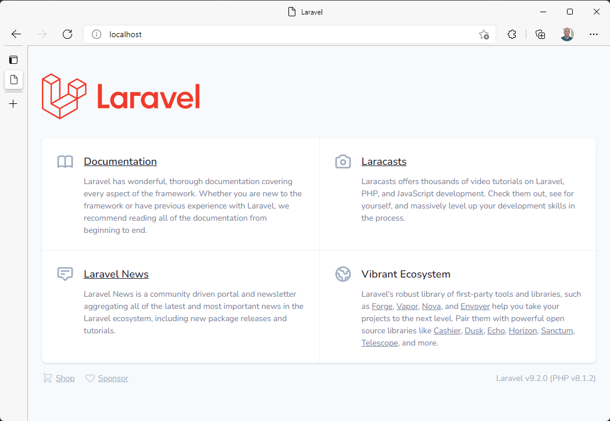
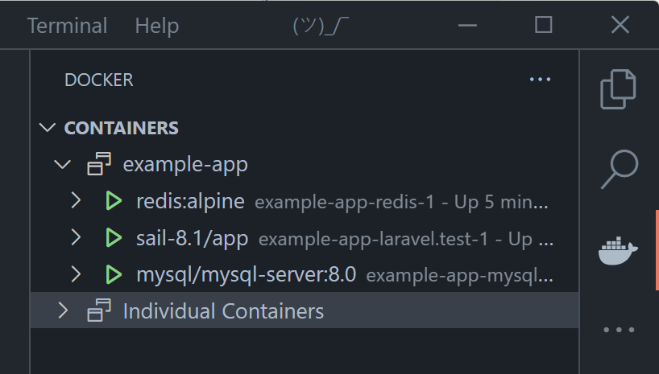
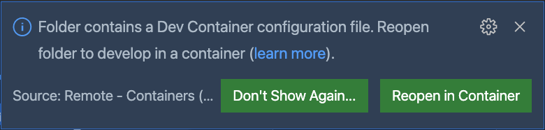
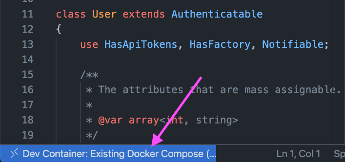
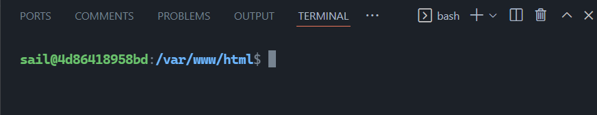
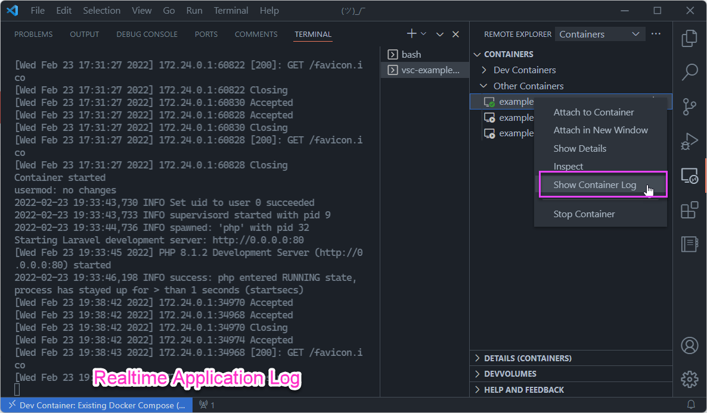

# The problem with tutorials

March 8, 2022 by Burke Holland, [@burkeholland](https://twitter.com/burkeholland)

Writing a great tutorial isn't easy. I should know - I've written a lot of them, and not every one was a smashing success.

As it turns out making a great tutorial isn't about **what** you write, it's about whether developers can be successful without having to read every word. In this article, we'll look how development containers can reduce the errors a user might encounter, and how the [Laravel PHP project](https://laravel.com/) elegantly implements this in their own tutorials to great effect.

## Nobody reads

Our very own tutorial on [how to use Dev Containers in Visual Studio Code](https://learn.microsoft.com/training/modules/use-docker-container-dev-env-vs-code/) has long had low completion rates - about 4 - 6%.


To figure out where people were giving up, we conducted user studies and watched as people tried to complete our tutorial. It was...painful.

It was immediately clear why people couldn't complete the tutorial: **Nobody was reading it**. People skipped right over the instructions and went directly to the action steps. Inevitably, they would get stuck because they made an error that they wouldn't have made if they had read the instructions.

Penn State Professor [John M. Carroll](https://jcarroll.ist.psu.edu/) talks about this in his seminal book, [The Nurnberg Funnel - Designing Minimalist Instruction for Practical Computer Skill](https://mitpress.mit.edu/books/nurnberg-funnel). He writes, "[Learners] are too busy learning to make much use of the instruction. This is the paradox of sense making."

I can relate to this, and you probably can too. When I'm going through a tutorial, my eyes are scanning for blocks of code because I'm trying to learn by doing. I'm literally too busy learning to read the instructions.

**People aren't going to read your tutorial.** Or at least not as much as you wish they would. The best that you can do is remove as many places as possible where the reader might make an error in the learning process. One way to do that is to completely remove any environment setup steps using preconfigured container environments.

## Containerized development environments

A significant chunk of any tutorial is usually dedicated to a laundry list of pre-requisites and environment setup. I distinctly recall trying to learn Ruby on Rails and spending most of the time trying to get Ruby installed correctly on Windows - wondering what in the world a "gem" was and why they were all somehow missing.

The idea behind containerized dev environments is that you develop inside of a [Docker](https://www.docker.com) container. This makes it possible to have a completely portable, fully configured development environment that you can stand up or knock down at will. You could then give that environment to someone as nothing more than a set of configuration files.

But how do you develop **inside** of a container? It's not like containers have a UI where you can just launch VS Code.

The [Dev Containers](https://marketplace.visualstudio.com/items?itemName=ms-vscode-remote.remote-containers) extension for VS Code does exactly this. It contains both the mechanism for configuring a Docker container as a dev environment, as well as allowing you to connect to that environment from VS Code. It does this by installing a small server component within the container that your local VS Code talks to. You then develop just like you would if you were local, but VS Code is attached to the container environment instead of your local environment.


In order to create a containerized dev environment, you would ordinarily have to know a thing or two about Docker. A lot of people do, but a lot of people **don't** (you can't see me, but my hand is in the air), so the extension tries to abstract the container setup process away as much as possible. I set up a new Python container. A wizard walks you through selecting the base image and Python version. It then gives you the opportunity to add additional software to the image via a picker list. In this case, I add the Azure CLI, Dotnet CLI and PowerShell…


This process adds a `.devcontainer` folder to this project with the necessary `Dockerfile` included. It also adds a `devcontainer.json` file, which is a standard for defining aspects of a dev container, like which extensions should be installed, which setup commands should be run after container build, etc. Since you have complete control over the environment and its setup, you can automate pretty much everything - including dependency installs, library versions, etc.

In this way, it's possible to quite literally hand someone a complete, ready-to-use environment that requires no additional setup steps or triggering of existential crisis over Ruby gems.

Some folks are already using a dev container-based approach to get their users up and running quickly with what are otherwise very complex environments. A great example of this is the Laravel framework for PHP.

## The Laravel solution

[Laravel](https://laravel.com/) is an open-source MVC framework for PHP. It's comprehensive in the sense that it also includes things like an Object Relational Mapper (ORM), direct database access, a packaging system, and more. Laravel can do a lot. And in order to experience it, you really need to have at least a database when you're getting started. Normally this would require the user to install not just PHP, but a database as well - usually MySQL. That's a significant ask when a user is simply trying your framework on for size.

Laravel addresses this with containerized dev environments and a tool called [Sail](https://github.com/laravel/sail). To get started from scratch with Laravel, a MySQL Server, and a Redis Cache, you only have to run a single command...

```bash
    curl -s "https://laravel.build/example-app?with=mysql,redis" | bash
```

This creates a new project with a `docker-compose` file. This file sets up three containers - an application container, a MySQL container, and a Redis container. You don't have to know anything about containers or any of those three services. Sail abstracts all of this away for you. You then execute the Sail command to spin up the environment...

```bash
    ./vendor/bin/sail up
```

The sample application just runs. No installing PHP. No Laravel. No dependency resolutions steps. Just immediate success.



I specified that our project has a MySQL Server and a Redis Cache, so we actually get three containers when the project spins up. We can see that using the [Docker extension](https://marketplace.visualstudio.com/items?itemName=ms-azuretools.vscode-docker) for VS Code.



These containers are networked together so that we can call the MySQL or Redis cache containers from the app container.

If you connect an interactive terminal to the `sail-8.1/app container`, you'll see your project in the `/var/www/html` folder. Docker "mounts" the project from your machine into the container, so any changes you make while developing are reflected in the application when you refresh.


## Adding Dev Containers

Support has also been added for the [Dev Containers](https://marketplace.visualstudio.com/items?itemName=ms-vscode-remote.remote-containers) extension. To add the proper dev container configuration to this project, you can scaffold the same project and add the `&devcontainer` flag.

```bash
    curl -s "https://laravel.build/example-app?with=mysql,redis&devcontainer" | bash
```

> Note that if you want to add a devcontainer to an existing Sail/Laravel project, you can do that by running `php artisan sail:install --devcontainer`.

This creates the same project configuration, but will include a `.devcontainer` folder. VS Code will automatically detect that folder and prompt you to reopen the project in a container thereby skipping the required `sail up` step.



VS Code attaches to the container, so you are developing **within** the container environment as opposed to your local one. You'll know that because the Remote Indicator in the lower left-hand corner of VS Code tells you so...



Developing in the container as opposed to outside of it has some distinct benefits.

### Development context mirrors app context

When connected to the container, the context you are developing in is the same as the one where the application is running. So your terminal becomes the terminal of the container...



The Dev Containers extension also gives you a more complete view of what's going on, such as which ports are forwarded - just in case you forget where your application is running.


The Laravel application starts automatically, and the application logs are piped to the container logs. Since you probably want to see what's going on in the application, the Dev Containers extension provides a new view in VS Code, where you can see all running containers, as well as connect to stream container logs.



### Automate the dev environment setup

The best possible developer experience is going to include customizations for the editor. This includes settings for the editor itself, and any extensions or other support that needs to be added to the out-of-the-box experience.

For VS Code and Laravel, extensions are suggested in the `devcontainer.json`, but commented out so that they are not installed automatically. This allows the user to pick from a set of already identified extensions instead of having to go hunt for the right way to configure their editor.

```json
    ...
    "extensions": [
        // "mikestead.dotenv",
        // "amiralizadeh9480.laravel-extra-intellisense",
        // "ryannaddy.laravel-artisan",
        // "onecentlin.laravel5-snippets",
        // "onecentlin.laravel-blade"
    ],
```

## Read less, do more

People don't read. And that should be OK. Laravel's tutorials aren't necessarily shorter than any others, but the important thing is that if you skip to the code and just run the commands, it works. Dev containers make that possible. Now if only we could figure out how to make a dev container for our own [Use a Docker container as a development environment with Visual Studio Code](https://learn.microsoft.com/training/modules/use-docker-container-dev-env-vs-code/) tutorial...

Happy Coding!

Burke Holland ([@burkeholland](https://twitter.com/burkeholland))
