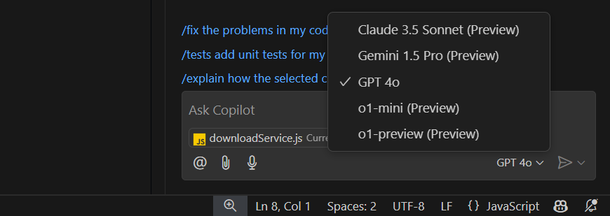
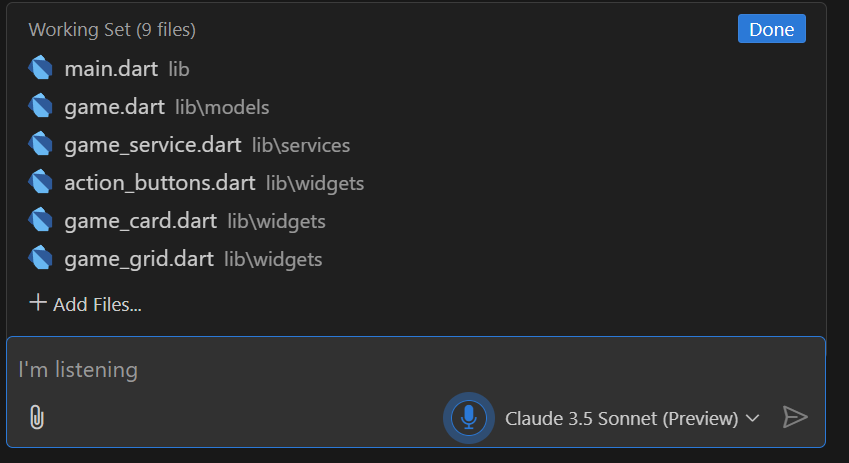

---
DONT FORGET TO UPDATE THE AKA BEFORE GO LIVE - AKA.MS/COPILOT-FREE
---

# Announcing a free GitHub Copilot for VS Code

We're excited to announce an all new **free tier for GitHub Copilot**, available for everyone today in VS Code. All you need is a GitHub account. No trial. No subscription. No credit card required.

[Enable GitHub Copilot Free (opens VS Code)](vscode://GitHub.copilot-chat?referrer=blog
 )

<video src="github-copilot-free-blog-video.mp4" title="Copilot Edits video"></video>

With the GitHub Copilot free tier, you get **access to both GPT-4o and Claude Sonnet models**.

You get **2000 code completions/month**. That's about 80 per day - which a lot.

You also get **50 chat requests/month** and a **64k context window**, with **128k coming soon**.

If you hit these limits, ideally it's because Copilot is doing its job well, which is to help you do yours! If you find you need more Copilot, the individual plan is unlimited, provides access to additional models like o1 and Gemini (coming end of January), and is still only **10$ per month**.

The VS Code and GitHub teams have been hard at work, as always, improving the GitHub Copilot experience with brand new features and capabilities. This is your editor. Redefined with AI.

### Work with multiple files using GitHub Copilot Edits

[GitHub Copilot Edits](https://code.visualstudio.com/docs/copilot/copilot-edits) is a multi-file editing experience that you can toggle into from the top of the chat sidebar. Given a prompt, Edits will propose changes across files including creating new files when needed. This gives you the conversational flow of chat combined with the power of Copilot's code generation capabilities. The result is something you have to try to believe.

<video src="../../11/12/blog-video-demo.mp4" title="Copilot Edits video" autoplay muted controls></video>

**Try this:** build a native mobile app using Flutter. I [built a game last weekend](https://youtu.be/Vj13SdN6OxU?si=sUvbBw0KSQ5q6iWh) and I've never used Flutter in my life.

### Multiple models, your choice

Whether you're using [Chat](https://code.visualstudio.com/docs/copilot/copilot-chat), [Inline Chat](https://code.visualstudio.com/docs/copilot/getting-started-chat#_stay-in-the-flow-with-inline-chat) or [GitHub Copilot Edits](https://code.visualstudio.com/docs/copilot/copilot-edits), you get to decide who your pair programmer is - now with Claude 3.5 Sonnet.



**Try this:** use 4o or o1 to generate an implementation plan for a new feature and then feed that prompt to Claude in GitHub Copilot Edits to build it.

### Custom Instructions

Tell GitHub Copilot exactly how you want things done with [Custom Instructions](https://code.visualstudio.com/docs/copilot/copilot-customization). These instructions are passed to the model with every request, allowing you to specify your specific preferences and the details that the model needs to know to write code the way you want it.

You can specify these at the editor or project level. We'll even pick them up automatically if you include a `.github/copilot-instructions.md` file in your project. These instructions can easily be shared with your team, so everyone can be on the same page - including GitHub Copilot.

For example...

```markdown
## React 18
* Use functional components
* Use hooks for state management
* Use TypeScript for type safety

## SvelteKit 4
* Use SSR for dynamic content rendering
* Use static site generation (SSG) for pre-rendered static pages.

## Tailwind 3
* Support dark and light mode
* Modern look with rounded corners and subtle shadows
```

**Try this:** Ask Copilot to generate the command to dump your database schema to a file and then set that file as one of your custom instructions.

### Full Project Awareness

GitHub Copilot has AI powered domain experts that you can mention with the `@` syntax. We call these, "participants". The `@workspace` participant is a domain expert in the area of your entire codebase. GitHub Copilot will also do intent detection (as seen in the video) for you and include the `@workspace` automatically if it sees you asking a question that requires full project context.

<video src="workspace-v2.mp4" title="Copilot Edits video" autoplay muted controls></video>

GitHub Copilot will also do intent detection (as seen in the video) for you and include the `@workspace` automatically if it see's you are asking a question that requires full project context.

**Try this:** The `@workspace` participant can set up testing for your project. From scratch. Just look for the `@workspace /setupTests` command.

### Naming things and other hard problems

GitHub Copilot can suggest names for your variables, functions and classes. Just press `F2` to rename something and then wait just a moment for GitHub Copilot to give you some suggestions.

<video src="copilot-rename.mp4" title="Copilot Edits video" autoplay muted controls></video>

**Try this:** If you don't know what to call something, don't overthink it. Just call it `foo` and implement it. Then hit `F2` and let GitHub Copilot suggest a name for you.

### Speak your mind

Click the microphone icon to start a voice chat. This is powered by the free, cross-platform [VS Code Speech extension](https://marketplace.visualstudio.com/items?itemName=ms-vscode.vscode-speech) that runs on local models. GitHUb Copilot will even read the chat response back to you - which is often critical for accessibility.



**Try this:** Use Speech with GitHub Copilot Edits to prototype your next app. You can literally talk your way to a working demo.

### Be a terminal expert

With terminal chat, you can do just about anything in your terminal. Press <kbd>Cmd</kbd>/<kbd>Ctrl</kbd> + <kbd>Shift</kbd> + <kbd>i</kbd> and tell GitHub Copilot what you want to do.

For instance, I know that I can use the [ffmpeg library](https://ffmpeg.org/) to extract frames from videos, but I don't know the syntax and flags. No problem!


**Try this:** You are now officially a git expert. No need to remember the exact syntax for `git rebase` or `git cherry-pick` or whatever. Just ask GitHub Copilot.

### No fear of commitment

No more commits that say "changes". GitHub Copilot will suggest a commit message for you based on the changes you've made and your last several commit messages. You can use custom instructionsf for commit generation to format the messages _exactly_ the way you want.

<video src="ccdt-commit-msgs.mp4" title="Copilot Edits video" autoplay muted controls></video>

**Try this:** Go beyond commits. Install the [GitHub Pull Requests and Issues extension](https://marketplace.visualstudio.com/items?itemName=GitHub.vscode-pull-request-github) and you can generate pull request descriptions, get summaries of pull requests and even get suggested fixes for issues. All without leaving VS Code.

### Extensions are all you need

Every VS Code extension can tie directly into the GitHub Copilot API's and offer a customized AI experience. Check out MongoDB with [their extension](https://marketplace.visualstudio.com/items?itemName=mongodb.mongodb-vscode) that can write impressively complex queries, use fuzzy search and a lot more...

<iframe width="560" height="315" src="https://www.youtube.com/embed/MLWlWrRAb4w?si=FzYwY_lOLUlfOmQ7" title="YouTube video player" frameborder="0" allow="accelerometer; autoplay; clipboard-write; encrypted-media; gyroscope; picture-in-picture; web-share" referrerpolicy="strict-origin-when-cross-origin" allowfullscreen></iframe>

**Try this:** In the extensions marketplace view in VS Code, use "@tag:chat-participant" to see all of the extensions that offer an AI experience with GitHub Copilot.

### A vision for the future

This last one is a preview of something we're adding to GitHub Copilot soon, but it's way too cool not to show you right now.

Install the [Vision Copilot Preview extension](https://marketplace.visualstudio.com/items?itemName=ms-vscode.vscode-copilot-vision) and ask GitHub Copilot to generate an interface based on a screenshot or markup.

<video src="copilot-vision-generate-ui.mp4" title="Copilot Edits video" autoplay muted controls></video>

Or use it to generate alt text for an image.

<video src="copilot-vision-markdown.mp4" title="Copilot Edits video" autoplay muted controls></video>

**Try This:** Mock up a UI using Figma or Sketch (or PowerPoint - it's ok if you do that. I do it too.). Then use `@vision` to generate the UI. You can even tell it which CSS framework to use.

_Note:_ Vision is in preview today and requires you to have your own OpenAI, Anthropic or Gemini API key. The key will not be required when we release it as part of GitHub Copilot. Coming Soon!

### Keeping up with GitHub Copilot

There's so much more GitHub Copilot we want to show you, but nothing can replace the experience of trying it for yourself.

[Enable GitHub Copilot Free](vscode://GitHub.copilot-chat?referrer=blog
 )

We ship updates and new features for GitHub Copilot every month. The best way to keep up with the latest and greatest in AI coding is to follow us on [X](https://twitter.com/code), [Bluesky](https://bskyp.app/@vscode.dev), [LinkedIn](https://www.linkedin.com/showcase/vs-code/) and even [TikTok](https://www.tiktok.com/@vscode). We'll give you the updates as they drop - short and sweet - right in your feed.

## GitHub Copilot in other places

As part of the free tier, you will also be able to use GitHub Copilot on GitHub.com.

While we work with GitHub to build the Visual Studio Code experience, Copilot itself is not exclusive to VS Code. You may be wondering about editors like Visual Studio. Will those users get a free Copilot offering as well?

Yes. Absolutely. Check out this blog post from the VS team on what works today and what’s coming shortly.

## The AI code editor for everyone

2025 is going to be a huge year for GitHub Copilot, now a core part of the overall VS Code experience. We hope that you’ll join as on the journey to redefine the code editor. Again.

[Enable GitHub Copilot Free](vscode://GitHub.copilot-chat?referrer=blog
 )


