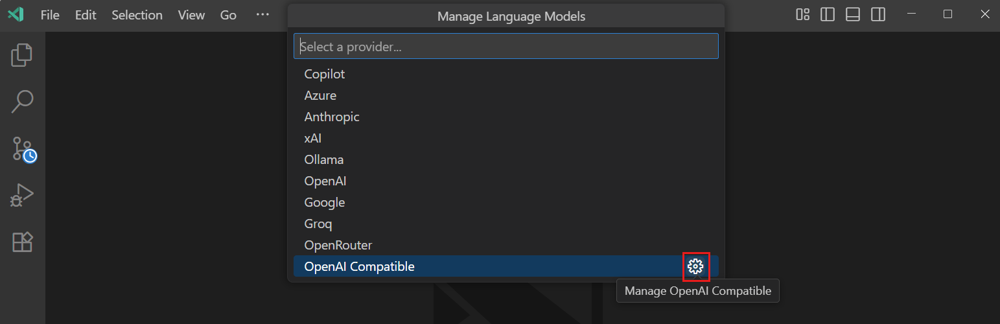

# Expanding Model Choice in VS Code with Bring Your Own Key

October 22, 2025 by [Olivia Guzzardo McVicker](https://github.com/olguzzar), [Pierce Boggan](https://github.com/pierceboggan)

We know that model choice is important to you. Our team has been hard at work making the latest models like [Claude Haiku 4.5](https://github.blog/changelog/2025-10-15-anthropics-claude-haiku-4-5-is-in-public-preview-for-github-copilot/) and [GPT 5 available](https://github.blog/changelog/2025-08-07-openai-gpt-5-is-now-in-public-preview-for-github-copilot/) to you on the same day they were announced. But we've also heard your feedback that you want support for even more models—be it locally or in the cloud—in VS Code.

In March, we introduced the [bring your own key (BYOK)](https://code.visualstudio.com/docs/copilot/customization/language-models#_bring-your-own-language-model-key) functionality to let you pick from hundreds of models from supported providers like OpenRouter, Ollama, Google, OpenAI, and more to power chat experiences in VS Code.

Now, we're taking BYOK to the next level. We've introduced the [Language Model Chat Provider API](https://code.visualstudio.com/api/extension-guides/ai/language-model-chat-provider) that enables model providers to contribute their models directly through VS Code extensions. This shift transforms BYOK from a centralized system to an open, extensible ecosystem where any provider can offer their models with a simple extension install.

<iframe width="560" height="315" src="https://www.youtube-nocookie.com//embed/xXFTlPZJJoo?si=UrgdYjNbOzVbSysl" title="BYOK in VS Code" frameborder="0" allow="accelerometer; autoplay; clipboard-write; encrypted-media; gyroscope; picture-in-picture" allowfullscreen></iframe>

## What is Bring Your Own Key (BYOK)?

BYOK lets you use any model from a supported provider by bringing your own API key for that provider. This means you can access a vast ecosystem of models beyond those built into VS Code, giving you the flexibility to choose the model that best fits your specific needs and preferences. Whether you want to use a specialized model for code generation, a different model for general chat, or experiment with local models through providers like Ollama, BYOK makes it possible with just your API key. You can configure this through the **Chat: Manage Language Models** command.

<video src="manage-language-models-command.mp4" title="Video demonstrating the Chat: Manage Language Models command in VS Code." autoplay muted controls></video>

But managing an ever-growing list of supported providers presented challenges for both users and our team. That's why we've released the Language Model Chat Provider API, allowing model providers to contribute their models directly through VS Code extensions.

## The Language Model Chat Provider API

The [Language Model Chat Provider API](https://code.visualstudio.com/api/extension-guides/ai/language-model-chat-provider) gives more flexibility in how models are made available in VS Code. We now have an extensible ecosystem where any provider can create an extension to offer their models. We will still support a subset of built-in providers like OpenAI and Anthropic, but this extensible ecosystem will allow us to scale out our model choice to meet developers' needs.

The API follows a one-provider-to-many-models relationship, where each extension can offer multiple language models. Providers are responsible for discovering available models, handling chat requests, and providing token counting functionality. This architecture ensures that model providers have full control over the user experience while maintaining consistency within VS Code's chat interface.

> **Note**: Models provided through the Language Model Chat Provider API are currently available to users on individual GitHub Copilot plans (Free, Pro, and Pro+).

Here are some of our favorite extensions you can install right now to get access to more models in VS Code:

* [The AI Toolkit for Visual Studio Code extension](https://marketplace.visualstudio.com/items?itemName=ms-windows-ai-studio.windows-ai-studio&ssr=false#overview) gives you access to its provided models directly in VS Code, whether it's a custom model you've tuned in Azure AI Foundry, a local model via Foundry Local, or any of the models in GitHub Models.

* [Cerebras Inference](https://marketplace.visualstudio.com/items?itemName=cerebras.cerebras-chat) powers the world's top coding models, making code generation pretty much instant—great for rapid iteration. It runs Qwen3 Coder at 2,000 tokens/s—that’s 20x faster than most inference APIs.

* [The Hugging Face Provider for GitHub Copilot Chat extension](https://marketplace.visualstudio.com/items?itemName=HuggingFace.huggingface-vscode-chat) enables you to use frontier open LLMs like Kimi K2, DeepSeek V3.1, GLM 4.5 directly in VS Code. Hugging Face’s Inference Providers give developers access to hundreds of LLMs, powered by world-class inference providers built for high availability and low latency.

## Enhanced BYOK Experience

We're continuously improving the BYOK experience to make custom models feel native to VS Code. [Recent enhancements](https://code.visualstudio.com/updates/v1_105#_improved-edit-tools-for-custom-models) include improved edit tools for better integration with VS Code's built-in tools, enhanced default tools, and a "learning" mechanism that automatically selects the optimal tool set for your chosen models.

For developers using OpenAI-compatible models, you can use the custom OpenAI Compatible provider for any OpenAI-compatible API endpoint and configure the models for use in chat.

Additionally, you can explicitly configure the list of edit tools through the `github.copilot.chat.customOAIModels` setting, giving you fine-grained control over which capabilities are available for your custom models.

This enhanced tooling ensures that whether you're using a specialized coding model or a general-purpose language model, you get the best possible editing experience tailored to that model's strengths, seamlessly integrated with VS Code's ecosystem.

## What's Next?

The Language Model Chat Provider API is just the beginning of bringing more model choice to you. As this model ecosystem grows, we expect to see:

* More specialized models for specific programming languages and domains
* Enhanced local model support with better performance optimization
* Streamlined workflows for switching between different models based on context

We're excited to see what models you use with VS Code, and we'd love to hear your feedback on our [GitHub repository](https://github.com/microsoft/vscode). For extension developers interested in contributing their own model providers, check out our [Language Model Chat Provider API documentation](https://code.visualstudio.com/api/extension-guides/ai/language-model-chat-provider) and [sample extension](https://github.com/microsoft/vscode-extension-samples/tree/main/chat-model-provider-sample) to get started building today.

Happy coding!