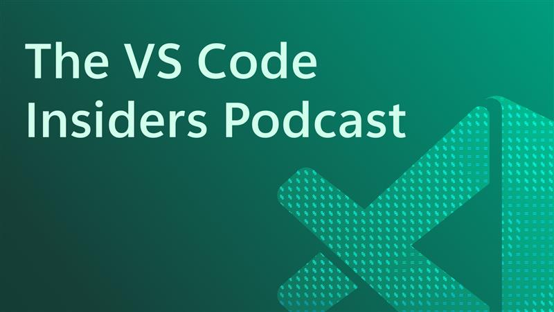

# Introducing the VS Code Insiders Podcast

December 1, 2025 by James Montemagno, [@code](https://x.com/jamesmontemagno).

Ever wonder what goes on behind the scenes at the world's most popular code editor? The **[VS Code Insiders Podcast](https://www.vscodepodcast.com)** is here to pull back the curtain and give you an insider's look at the features, decisions, and people shaping the future of Visual Studio Code.

## What's the podcast all about?

The official podcast from the Visual Studio Code team goes beyond the release notes. Each episode features conversations with the developers, product managers, and community contributors who are actively building VS Code's next generation of features.

From deep dives into experimental tooling and new extensions to candid discussions about where coding is headed with AI, this podcast is your backstage pass to the evolution of modern development. Whether you're a seasoned developer, a curious tinkerer, or just obsessed with clean commits and clever workflows, there's something here for you.

## Recent episode highlights

Here are a few recent episodes that showcase some of the exciting topics covered:

| Episode | Guest | Highlight |
|---|---|---|
| [Designing for Everyone: Accessibility in VS Code](https://www.vscodepodcast.com/14) | [Megan Rogge](https://www.linkedin.com/in/megan-rogge-287a28147/) | Megan discusses how accessibility is integrated into VS Code's design and engineering. She covers screen reader support, auditory signals, and contrast themes that empower diverse developers. |
| [Behind the Scenes of VS Code's Planning Agent](https://www.vscodepodcast.com/12) | [Bhavya U](https://github.com/bhavyaus) | Bhavya explains the Planning Agent feature and how it helps plan and execute complex coding tasks. Learn how AI assists developers in breaking down and completing workflows. |
| [Building & Scaling Open Source Communities](https://www.vscodepodcast.com/11) | [Steve Francia](https://x.com/spf13) | Steve shares practical strategies for building and scaling open source communities. He discusses governance, contributor experience, and sustaining long-term growth. |
| [Beyond the Keynote: VS Code at GitHub Universe 2025](https://www.vscodepodcast.com/13) | [Pierce Boggan](https://x.com/pierceboggan) | Pierce walks through what it means for VS Code to be AI-native and how agents run across environments. He explains key announcements from the GitHub Universe keynote and what they enable for developers. |

## Subscribe today!

Visit the **[VS Code Insiders Podcast home page](https://www.vscodepodcast.com)** to browse past episodes and subscribe on your favorite podcast app today! 

Download and install **[VS Code Insiders](https://code.visualstudio.com/insiders)** to try the newest features as soon as they ship.

Stay up to date with the latest changes in the **[continuously updating Insiders release notes](https://code.visualstudio.com/updates)**.

Happy coding.
 
