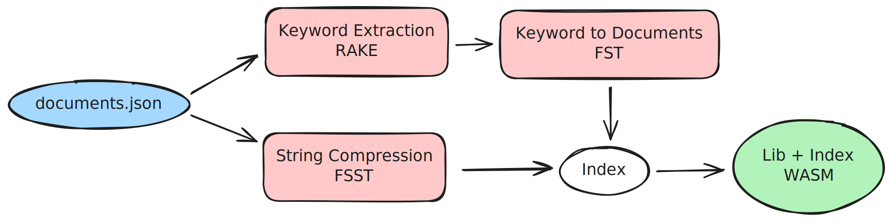
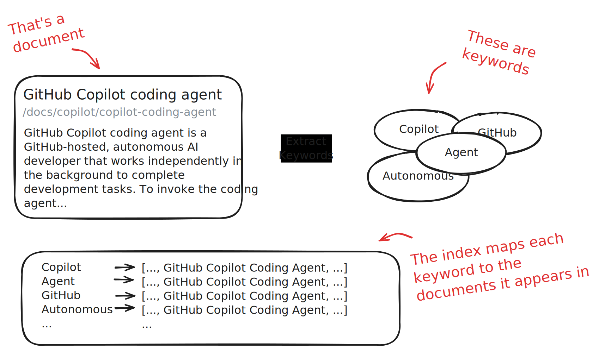

# Building docfind: Fast Client-Side Search with Rust and WebAssembly

January 15, 2026 by [João Moreno](https://github.com/joaomoreno)

If you've visited the [VS Code website](https://code.visualstudio.com/) recently, you might have noticed something new: a fast, responsive search experience that feels almost instant.

<video src="docfind.mp4" title="Video showing how to run the Calculator command in VS Code for the Web." autoplay loop controls muted></video>

Behind that experience is [docfind](https://github.com/microsoft/docfind), a search engine we built that runs entirely in your browser using [WebAssembly](https://en.wikipedia.org/wiki/WebAssembly). In this post, I want to share the story of how docfind came to be: a journey that took me from a decade-old blog post about automata theory to patching WebAssembly binaries.

## The problem

I'm currently a Software Engineering Manager on the VS Code team, so these days I don't get much time to write code. When I do, it's rarely in unfamiliar territory. But some problems just nag at you until you do something about them.

Until recently, our website still had that basic search experience: you'd type a query, and it would redirect you to search results powered by a traditional search engine. Not quite what developers are used to today. I wanted those search results to appear instantly as you type, similar to many other websites out there. It should be something as snappy as VS Code's Quick Open (`Ctrl+P`).

Together with my colleague [Nick Trogh](https://github.com/nicktrog), we researched the alternatives. The landscape looked something like this:

- **[Algolia](https://www.algolia.com/)**: State of the art search-as-a-service. But I wanted a pure client-side solution.
- **[TypeSense](https://typesense.org/)**: Powerful open-source search, but requires server-side code, just like Algolia. Plus, it'd be another service to maintain and monitor.
- **[Lunr.js](https://lunrjs.com/)**: Client-side search in JavaScript, which sounded promising. We tried it with our docs (~3 MB of markdown), but it produced index files around 10 MB. Too large.
- **[Stork Search](https://stork-search.net/)**: WebAssembly-powered client-side search with a nice demo. But when we tested it, the indexes were still quite large, and the project appeared to be unmaintained.

None of these options hit the sweet spot: fast, client-side, compact, and easy to host and operate. I started to wonder if we could build something ourselves.

## The inspiration

Thinking about client-side search reminded me of a blog post I'd read years ago. It was written by [Andrew Gallant](https://github.com/BurntSushi) (burntsushi), the creator of ripgrep, and it's titled [Index 1,600,000,000 Keys with Automata and Rust](https://burntsushi.net/transducers/). Published nearly a decade ago, it explains how to use **Finite State Transducers (FSTs)** to index massive amounts of string data in a compact binary format that supports fast lookups, including regex and fuzzy matching.

The key insight is that FSTs can store sorted string keys in a state machine that's both memory-efficient and fast to query. Better yet, Andrew had published a Rust library called [fst](https://docs.rs/fst/latest/fst/) that implements exactly this.

What if we could use FSTs to index keywords extracted from our documentation? The user types a query, we match it against keywords using the FST, and we get back a list of relevant documents, all in the browser, with no server round-trip.

But how could we get these document keywords? And wouldn't this just create a very large index file, given all the strings would need to be in memory? Could we use compression to create the smallest possible index? This led me to two more pieces of the puzzle:

- **[RAKE](https://docs.rs/rake/latest/rake/)** (Rapid Automatic Keyword Extraction): An algorithm for extracting meaningful keywords and phrases from text. Feed it a document, and it returns keywords ranked by importance.
- **[FSST](https://docs.rs/fsst-rs/latest/fsst/index.html)** (Fast Static Symbol Table): A compression algorithm optimized for short strings. Since we'd need to store document titles, categories, and snippets in memory, compression would help keep the index small.

With FST for fast keyword lookup, RAKE for keyword extraction, and FSST for string compression, I had the technical foundations. Now I just needed to build it in Rust, a language I'm not particularly experienced with, during the limited time I could carve out from my day job.

## The solution

I ended up creating a single CLI tool, docfind, meant to create an index file from our website documents whenever we build the website itself. Users of this CLI tool shouldn't need any external dependencies other than docfind itself in order to create index files. That index file ended up being a single WebAssembly module, easily served to visitors via HTTP. When visitors come to our website, their browser downloads the WebAssembly module in the background and is used to empower the search functionality.

### Building the index

Here's a diagram of how docfind transforms a collection of documents (`documents.json`) into the respective index file (`docfind_bg.wasm`):



Docfind first reads a JSON file containing information about your documents (title, category, URL, body text). For each document, it extracts keywords using RAKE, assigns relevance scores, and builds an FST that maps keywords to document indices. All the document strings are compressed using FSST. Both the FST and the compressed strings are then packed into a binary blob, representing the actual index.




The data structure representing the index is surprisingly simple:

```rust
pub struct Index {
    /// FST mapping keywords to document indices
    fst: Vec<u8>,

    /// FSST-compressed document strings (title, category, href, body)
    document_strings: FsstStrVec,

    /// For each keyword index, a list of (document_index, score) pairs
    keyword_to_documents: Vec<Vec<(usize, u8)>>,
}
```

The index stores keywords and maps them to indices into `keyword_to_documents`. Each entry there points to the relevant documents with their relevance scores. Document strings are stored compressed and decompressed only when needed for display.

Now, we could dump that index data structure to a binary file, serve it up to our website visitors and have some WebAssembly module on the site which would parse it and use the FST library to perform the search operations. But here's where things get interesting. Rather than shipping the index as a separate binary file, docfind embeds it directly into the search library WebAssembly module, allowing visitors to fetch a single HTTP resource whenever they intend to search on the website.

### Searching the index

So what happens client-side? When the user types a query, the WebAssembly module is loaded in memory (code and document index) to execute that query as a search operation by going through the FST data structure. We've found it useful to use a [Levenshtein automaton](https://en.wikipedia.org/wiki/Levenshtein_automaton) (for typo tolerance) and prefix matching, to get more relevant matches. Finally, search results are produced by combining scores from multiple matching keywords, decompressing the relevant document strings on demand, and returning ranked results as JavaScript objects.


## The challenge

The trickiest part of this project wasn't the search algorithm or the keyword extraction, it was embedding the index into the WebAssembly binary.

The naive approach would be to use Rust's `include_bytes!` macro to bake the index into the WebAssembly module at compile-time. But that would mean recompiling the WebAssembly module every time the documentation changes. Instead, I wanted a pre-compiled WASM "template" that the CLI tool could patch with an updated index.

This meant I needed to statically create a WebAssembly module template, with an empty index, and embed that in docfind. Then, docfind could:

1. Parse the embedded WebAssembly module to understand its structure
2. Find the memory section and calculate how much additional space the index needs
3. Add the index as a new data segment, updating the data count section accordingly
4. Locate placeholder global variables and patch them with the actual index location
5. Write out a valid WebAssembly module

The WebAssembly module template declares two placeholder globals with a distinctive marker value:

```rust
#[unsafe(no_mangle)]
pub static mut INDEX_BASE: u32 = 0xdead_beef;

#[unsafe(no_mangle)]
pub static mut INDEX_LEN: u32 = 0xdead_beef;
```

At run-time, the search function uses these to locate the embedded index and parse it from the raw bytes:

```rust
static INDEX: OnceLock<Index> = OnceLock::new();

pub fn search(query: &str, max_results: Option<usize>) -> Result<JsValue, JsValue> {
    let index = INDEX.get_or_init(|| {
        let raw_index = unsafe {
            std::slice::from_raw_parts(INDEX_BASE as *const u8, INDEX_LEN as usize)
        };
        Index::from_bytes(raw_index).expect("Failed to deserialize index")
    });
    // ... perform search
}
```

The CLI tool scans the WASM template's export section to find these globals, reads the global section to get their memory addresses, then patches the data segment that contains those `0xdead_beef` values with the actual index base address and length:

```rust
// Patch the data if it contains the INDEX_BASE or INDEX_LEN addresses
if index_base_global_address >= &start && index_base_global_address < &end {
    data[base_relative_offset..base_relative_offset + 4]
        .copy_from_slice(&(index_base as i32).to_le_bytes());
    data[length_relative_offset..length_relative_offset + 4]
        .copy_from_slice(&(raw_index.len() as i32).to_le_bytes());
}

// Add index as new data segment
data_section.active(
    0,
    &ConstExpr::i32_const(index_base as i32),
    raw_index.iter().copied(),
);
```

This was, to put it mildly, not straightforward. Understanding the WASM binary format, figuring out how globals are stored and referenced, calculating memory offsets. These are the kinds of problems that can easily derail a side project.

## The breakthrough

I have to be honest, it's unlikely that I would have finished this project without using [GitHub Copilot agents](https://code.visualstudio.com/docs/copilot/agents/overview). As a manager who doesn't code daily anymore, tackling a project in Rust, a language known for its steep learning curve, was ambitious. I'm not a Rust expert. I don't have the muscle memory for the borrow checker. And I certainly didn't have deep knowledge of the WebAssembly binary format. But I did have a general sense of direction of where I wanted to go with all of this. Copilot helped me fill in the blanks and tackle the hard problems.

**Research and exploration.** When I was evaluating FST, RAKE, and FSST, I used Copilot to understand how these libraries worked, ask clarifying questions, and bounce ideas around. It was like having a knowledgeable colleague available at any hour.

**Efficient Rust development.** This was perhaps the biggest win. Copilot's [Next Edit Suggestions](/docs/copilot/ai-powered-suggestions#_next-edit-suggestions) turned me into a productive Rust programmer. I no longer spent mental energy fighting the borrow checker or looking up syntax. Copilot handled the mechanical parts, letting me focus on the logic.

**Scaffolding the WASM target.** When I asked Copilot to add a WebAssembly output target to the project, it didn't just add the configuration, it inferred that I wanted a search function exported and scaffolded the entire `lib.rs` with the right `wasm-bindgen` annotations. It even told me which command to run to build it.

**The [docfind library](https://github.com/microsoft/docfind).** [Copilot helped me scaffold the repository for docfind](https://github.com/microsoft/docfind/pulls?q=is%3Apr+author%3A%40copilot+is%3Aclosed), including creating a working demo page, with performance vanity numbers.

**Getting past the hard parts.** The WASM binary manipulation was the technical crux of this project. Understanding how to locate globals, patch data segments, and update memory sections required diving into details I'd never encountered before. Copilot helped me understand the WASM binary format, suggested the right `wasmparser` and `wasm-encoder` APIs, and helped debug issues when my patched binaries weren't valid.

I'm confident this project would have taken me considerably longer without Copilot, and that's assuming I wouldn't have given up somewhere along the way. When you're time-constrained and working outside your expertise, I've found that having an AI assistant that can fill knowledge gaps and handle boilerplate isn't just convenient, it's the difference between shipping and abandoning.

## The results

Today, docfind powers the search experience on the VS Code documentation website. You can see the current performance metrics in the [docfind README](https://github.com/microsoft/docfind#live-demo), which includes an [interactive demo](https://microsoft.github.io/docfind) searching through 50,000 news articles entirely in your browser.

For the VS Code website (~3 MB of markdown, ~3,700 documents partitioned by heading):

- **Index size**: ~5.9 MB uncompressed, ~2.7 MB with Brotli compression
- **Search speed**: ~0.4ms per query, on my M2 MacBook Air
- **Network**: Single WebAssembly module, downloaded only when the user shows intention to search

No servers to maintain. No API keys to manage. No ongoing costs. Just a self-contained WebAssembly module that runs entirely in the browser, created at build time.

## Try it yourself

We've open-sourced docfind, and you can use it for your own static sites today. Installation is straightforward:

```sh
curl -fsSL https://microsoft.github.io/docfind/install.sh | sh
```

Or, if you're on Windows:

```psh
irm https://microsoft.github.io/docfind/install.ps1 | iex
```

Prepare a [JSON file](https://github.com/microsoft/docfind?tab=readme-ov-file#creating-a-search-index) with your documents, run `docfind documents.json output`, and you'll get a `docfind.js` and `docfind_bg.wasm` ready to use in your site. You need to bring your own client-side UI to show the search results (you can always create one using GitHub Copilot 😉).

Building docfind was a reminder of why I became an engineer in the first place: the joy of solving a real problem with elegant technology. And it was a testament to how AI tools like Copilot are changing what's possible, letting us tackle projects that would have been out of reach given our constraints of time and expertise. Finally, a quick shout-out to the [rust-analyzer](https://marketplace.visualstudio.com/items?itemName=rust-lang.rust-analyzer) VS Code extension, a must-have if you're working with Rust in VS Code.

If you have questions or feedback, feel free to open an issue on the [docfind repository](https://github.com/microsoft/docfind/issues). We'd love to hear how you're using it.

Happy coding! 💙